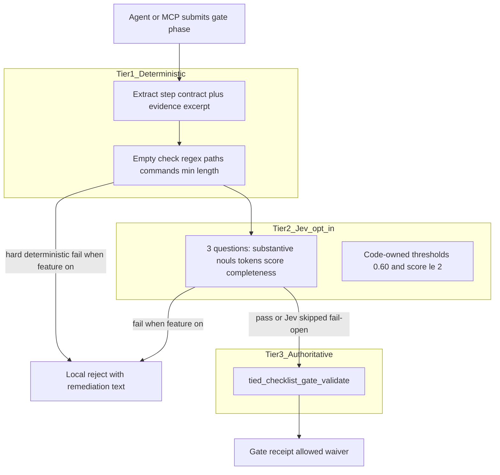
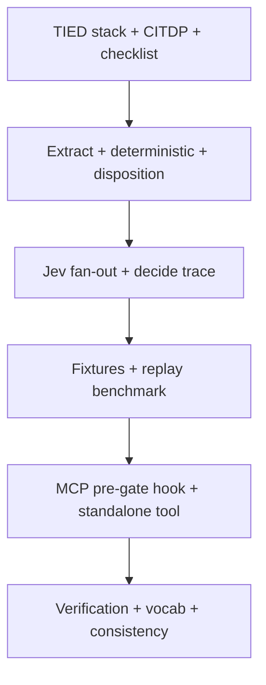

# Blueprint C: Checklist Gate Evidence Sufficiency Verification

| Field | Value |
| --- | --- |
| **Source** | [system-one-jev-taxonomy-and-opportunities.md](docs/comparisons/system-one-jev-taxonomy-and-opportunities.md) § Blueprint C (Pattern 11 & 5); mapping table row “Checklist Step Evidence Sufficiency” |
| **Patterns** | **Pattern 11** (verification — claim vs supplied evidence) + **Pattern 5** (evidence gate — factual evidence before phase advance) |
| **Parent program** | [REQ-TIED_JEV_DECISION_COPROCESSOR](tied/requirements/REQ-TIED_JEV_DECISION_COPROCESSOR.yaml) (**closed**); this is a **follow-on child**, not a silent expansion of the closed program |
| **Sibling** | Blueprint A — [REQ-TIED_JEV_CONTEXT_LOG_PRUNING](tied/requirements/REQ-TIED_JEV_CONTEXT_LOG_PRUNING.yaml) (structure / opt-in / fail-open precedent) |
| **Gate authority** | [REQ-TIED_CHECKLIST_GATE_ENFORCEMENT](tied/requirements/REQ-TIED_CHECKLIST_GATE_ENFORCEMENT.yaml) — `tied_checklist_gate_validate` remains sole authoritative gate |
| **Operator guide** | [jev-for-tied-improvement.md](docs/comparisons/jev-for-tied-improvement.md) — compose-don’t-fork; Jev never sets gate `allowed` |
| **Working folder** | `working/REQ-TIED_JEV_CHECKLIST_EVIDENCE_SUFFICIENCY/` |
| **Feature plan** | This file (`PLAN.md`) — normative spec + acceptance map post-W5 |
| **Close-out plan** | [PLAN-CLOSE-OUT.md](PLAN-CLOSE-OUT.md) — machine close-out CO0–CO5 (envelope + commit) |
| **Last refined** | 2026-09-30 (refine-plan **pass 3** — post-W5 as-built sync; see [evidence/refine-plan-pass3-2026-09-30.md](evidence/refine-plan-pass3-2026-09-30.md)) |



**Hard rule:** Blueprint C is a **pre-admission decision coprocessor**. When opt-in is on it may **block calling** (or short-circuit before completing) the gate validator with insufficient evidence; it must **never** emit `allowed: true`, forge a gate receipt, or substitute for `tied_checklist_gate_validate`.

---

## Refine (sponsor terms and defaults)

**Resolved intent:** Ship Blueprint C as an **opt-in local pre-gate** that rejects **superficial** checklist `execution_evidence` / step tracking evidence **before** (or at the front of) authoritative `tied_checklist_gate_validate`, using Tier-1 deterministic checks plus a single **speculative fan-out** `jevDecide` when credentials exist. Success is measured on a **labeled fixture corpus** and benchmark arms; taxonomy marketing copy is not a CI threshold.

**Canonical vocabulary** ([decision-copilot.md](tied/vocab/decision-copilot.md), [quality-assurance.md](tied/vocab/quality-assurance.md), [fidelity-research.md](tied/vocab/fidelity-research.md), [prompt-composer.md](tied/vocab/prompt-composer.md)):

| Preferred term | Meaning in this change |
| --- | --- |
| **evidence sufficiency pre-gate** | Opt-in filter that may reject gate submission; not a gate receipt |
| **decision coprocessor** | Jev advises; code owns thresholds and disposition |
| **noul gate** | Calibrated 0–1; thresholds code-owned (`0.60`) |
| **speculative fan-out** | Three typed questions in one `/v1/decide` |
| **compose-don’t-fork** | Hook inside existing gate MCP path; do not fork a second authority |
| **Blueprint C** / **Pattern 5** / **Pattern 11** | Taxonomy names for this slice |

**Sponsor default-proceed (reversible defaults):**

| Decision | Default | Revisit only if |
| --- | --- | --- |
| Child REQ token | `REQ-TIED_JEV_CHECKLIST_EVIDENCE_SUFFICIENCY` | Sponsor wants a different suffix |
| ARCH / IMPL | `ARCH-TIED_JEV_CHECKLIST_EVIDENCE_SUFFICIENCY`, `IMPL-TIED_JEV_CHECKLIST_EVIDENCE_SUFFICIENCY` | Naming collision |
| Feature default | **Opt-in / default-off** via env **or** manifest (see **Configuration contract** below); env wins when set | Product asks default-on |
| Operating mode | **Local block** when thresholds fail (reject with remediation); do not silently proceed | Sponsor wants shadow-only first |
| Substantive threshold | `noul_evidence_substantive < 0.60` → reject | Calibration corpus fails precision/recall |
| Completeness threshold | `score_evidence_completeness <= 2` → reject | Score scale or criteria change |
| Score scale | **1–5** (Blueprint C body); **ignore** mapping-table “1–10” drift | Vendor score schema forces otherwise |
| Token noul | Apply `noul_tokens_present < 0.60` **only when** step contract lists required tokens; else omit question or treat as N/A | Contracts always list tokens |
| Jev unavailable / no key / state too large / HTTP error | **Fail-open** to authoritative gate path (same skip semantics as [`jevDecide`](mcp-server/src/jev/client.ts)); optional deterministic-only reject still applies when feature on | Sponsor wants fail-closed for this feature |
| `depth_tier` | **`integrated`** — external API; blocks real gate progression when enabled | Documented waiver with owner/expiry |
| `gate_policy` | **`mixed`** — Jev advisory layer; deterministic gate unchanged | N/A |
| System One I/O trace | **`JEV_DECIDE_TRACE=1`** (+ path / stderr) on `mcpServers.tied-yaml.env` in [`.cursor/mcp.json`](.cursor/mcp.json); default **off** | Privacy policy forbids local JSONL |
| Integration seam | Prefer **inside** `tied_checklist_gate_validate` when feature on (single operator call) + standalone MCP tool for diagnostics | Agentstream-only composition preferred |

**Problem (taxonomy):** Agents mark checklist steps complete with vacuous `execution_evidence` (narrative claims without commands, logs, paths, or token citations), causing late verification / envelope failures.

**Non-goals (v1):**

- Replace or soft-fork `tied_checklist_gate_validate`
- Mutate TIED YAML via Jev; set gate `allowed: true`
- Authoritative PRELOAD override
- Generative “rewrite my evidence”
- Default-on blocking without sponsor sign-off
- Enforce sufficiency on every step disposition update (only **gate-call** path)
- Replace envelope `thin_ledger` / dual-write structural hygiene in [process-adherence-gaps.ts](mcp-server/src/request-evidence-envelope/process-adherence-gaps.ts)

**Distinction from envelope gaps:** Wave-5 `thin_ledger` detects **structural** tracker hygiene; Blueprint C judges **semantic substance** of prose evidence. Complementary, not duplicate.

**Taxonomy hygiene:** Do not copy the Blueprint C typo “thruee typed questions” into REQ/IMPL text; use **three**.

**Ambiguity accepted this refine:** Mapping table score “1–10” vs Blueprint body “1–5” → **1–5** pinned. Score criteria array length in IMPL must match (five ordered criteria strings).

**Pass 3 (2026-09-30):** PLAN synced to **as-built** W0–W5; feature SC-* met per [evidence/w5-build-plan-handoff.md](evidence/w5-build-plan-handoff.md). **Machine close-out** and envelope remediation remain in [PLAN-CLOSE-OUT.md](PLAN-CLOSE-OUT.md).

### Completion signals (post-W5; pass 3)

| Signal | Status | Pointer |
| --- | --- | --- |
| Feature SC-* | **pass** | [w5-build-plan-handoff.md § SC-*](evidence/w5-build-plan-handoff.md) |
| Machine close-out | **pass** | [closeout-run-close-out-gates.json](evidence/closeout-run-close-out-gates.json) — 0 blocking gaps |
| Process / adherence | **pass** | Reconcile band B; typed refs + manifest — [plan-close-out-handoff.md](plan-close-out-handoff.md) |

### Configuration contract (env + manifest)

Mirror [plan-skills-config.ts](mcp-server/src/jev/plan-skills-config.ts) / Blueprint A pruner opt-in semantics:

| Source | Key | Enabled when |
| --- | --- | --- |
| Env | `TIED_JEV_CHECKLIST_EVIDENCE_SUFFICIENCY` | `"1"` or `"true"` |
| Repo manifest | `.tied-yaml.yaml` → `jev.checklist_evidence_sufficiency: true` | boolean `true` only (invalid values → diagnostic `invalid_checklist_evidence_sufficiency_flag`, treat as off) |
| Precedence | Env set (including explicit `"0"`/`"false"`) | **Overrides** manifest; unset env → read manifest |

Implement in `RESOLVE_CHECKLIST_EVIDENCE_SUFFICIENCY_CONFIG` (W1). **Independent** of `JEV_DECIDE_TRACE` (trace may be on while pre-gate is off, and vice versa).

### Pre-gate evidence scope (which text is judged)

Pre-gate runs **only on the gate-call path** immediately before `validateChecklistGate` inside `tied_checklist_gate_validate` / `tied_gate_check` (W4).

1. Compute **target step slugs** the same way the authoritative gate does for this call:
   - `derivePhaseAwareSlugs(depth_tier, phase)` from CITDP adversarial section + `required_step_slugs` from MCP args (see [`validateChecklistGate`](mcp-server/src/checklist-validator.ts) union at `requiredSlugs`).
2. For each target slug with disposition in `{ completed, waived }` (skip `not_applicable` / pending unless sponsor extends later), collect:
   - Step `evidence` / `evidence_refs` / `tracking.evidence` (reuse checklist-validator list helpers — **import, do not fork**).
   - Plus tracker-level `execution_evidence` fields only when the step contract or gate phase expects them (e.g. close-out slugs referencing envelope paths).
3. **One Jev fan-out per slug** (or batched state with explicit `step_slug` in `context_meta` if latency acceptable on v1 — default **per slug** for clearer trace education).
4. **Reject policy:** If **any** targeted slug fails Tier-1 or Jev thresholds → **short-circuit**; do **not** invoke `validateChecklistGate` or persist a gate receipt for that call.

**v1 non-goal:** Scanning every tracker step on every agent edit; only slugs in the gate’s required set for that `phase`.

### MCP / CLI response contracts

**Pre-gate reject** (feature on, insufficient evidence) — return JSON **without** calling authoritative validate:

```json
{
  "ok": false,
  "pre_gate": "jev_evidence_sufficiency",
  "allowed": false,
  "blocking": true,
  "phase": "verification",
  "failed_step_slugs": ["traceable-commit"],
  "reasons": ["noul_evidence_substantive below threshold for step traceable-commit"],
  "remediation_hints": ["command_output", "token_citations", "file_paths"],
  "user_message": "Gate evidence appears superficial. Provide exact terminal output and token citations.",
  "jev_observation": { },
  "diagnostics": ["pre_gate:jev_evidence_sufficiency"]
}
```

**Must not include:** `gate_receipt`, receipt hash, or fields that imply `tied_checklist_gate_validate` completed successfully.

**Pre-gate pass or feature off / Jev fail-open:** Fall through to existing gate JSON shape unchanged (`allowed`, `blocking`, `diagnostics`, optional `gate_receipt`).

**Standalone diagnostic tool** `tied_jev_checklist_evidence_sufficiency` (W4):

| | |
| --- | --- |
| **INPUT** | `project_root?`, `tracker_path` or inline `tracker`, `phase`, optional `required_step_slugs[]`, optional `citdp` (for depth + slug derivation) |
| **OUTPUT** | Per-slug `{ slug, disposition, pre_gate_ok, reasons[], jev_observation?, skipped? }` + aggregate `ok`; **never** `gate_receipt` |
| **Authority** | Read-only; does not mutate tracker or set gate `allowed` for workflow progression |

### Decide-trace ownership (LEAP note)

- **Implementation home:** shared writer in [`jevDecide`](mcp-server/src/jev/client.ts) (W2) — benefits all Jev call sites.
- **Traceability home:** child REQ **SC-DECIDE-TRACE** proves Blueprint C emits correct `context_meta`; optional **see_also** LEAP to parent `REQ-TIED_JEV_DECISION_COPROCESSOR` if satisfaction criteria for program-wide trace are added later (not required for v1 close-out).

### Coordinator doc (optional W0 doc-only)

Add a **follow-on row** to [working/REQ-TIED_JEV_DECISION_COPROCESSOR/PLAN.md](working/REQ-TIED_JEV_DECISION_COPROCESSOR/PLAN.md) delivery table: Blueprint C → `REQ-TIED_JEV_CHECKLIST_EVIDENCE_SUFFICIENCY` (opt-in pre-gate). Defer if sponsor wants zero coordinator churn until child W5.

---

## Plan (CITDP)

### Traceability stack (minted W0)

| Layer | Token | Detail |
| --- | --- | --- |
| REQ | `REQ-TIED_JEV_CHECKLIST_EVIDENCE_SUFFICIENCY` | [tied/requirements/REQ-TIED_JEV_CHECKLIST_EVIDENCE_SUFFICIENCY.yaml](tied/requirements/REQ-TIED_JEV_CHECKLIST_EVIDENCE_SUFFICIENCY.yaml) |
| ARCH | `ARCH-TIED_JEV_CHECKLIST_EVIDENCE_SUFFICIENCY` | [tied/architecture-decisions/ARCH-TIED_JEV_CHECKLIST_EVIDENCE_SUFFICIENCY.yaml](tied/architecture-decisions/ARCH-TIED_JEV_CHECKLIST_EVIDENCE_SUFFICIENCY.yaml) |
| IMPL | `IMPL-TIED_JEV_CHECKLIST_EVIDENCE_SUFFICIENCY` | [tied/implementation-decisions/IMPL-TIED_JEV_CHECKLIST_EVIDENCE_SUFFICIENCY.yaml](tied/implementation-decisions/IMPL-TIED_JEV_CHECKLIST_EVIDENCE_SUFFICIENCY.yaml) + [pseudocode sidecar](tied/implementation-decisions/IMPL-TIED_JEV_CHECKLIST_EVIDENCE_SUFFICIENCY-pseudocode.md) |

**Cross-references / see_also:** `REQ-TIED_JEV_DECISION_COPROCESSOR`, `REQ-TIED_CHECKLIST_GATE_ENFORCEMENT`, `REQ-REQUEST_EVIDENCE_ENVELOPE` (complementary only).

**CITDP / Tracker (persisted):**

- CITDP: [tied/citdp/CITDP-REQ-TIED_JEV_CHECKLIST_EVIDENCE_SUFFICIENCY.yaml](tied/citdp/CITDP-REQ-TIED_JEV_CHECKLIST_EVIDENCE_SUFFICIENCY.yaml) (`depth_tier: integrated`, `gate_policy: mixed`)
- Tracker: [agent-req-implementation-checklist.yaml](agent-req-implementation-checklist.yaml)

### Change definition (outline for CITDP W0)

| Field | Intent |
| --- | --- |
| Change | Add opt-in evidence-sufficiency pre-gate + standalone check tool + shared decide-trace |
| Actors | MCP `tied_checklist_gate_validate` callers; agents using tied-cli; operators enabling env/manifest |
| Invariants | Fail-open without credentials; default-off; Jev never writes `allowed`; redaction before wire/trace |
| Out of scope | See Non-goals |

### Impact discovery (outline)

| Surface | Impact |
| --- | --- |
| `mcp-server/src/jev/` | New module + tests; optional `jevDecide` `contextMeta` / trace writer |
| `mcp-server/src/tools/index.ts` | Pre-gate hook + new tool registration |
| `mcp-server/src/checklist-validator.ts` | Read-only reuse of evidence extraction helpers (prefer import over fork) |
| Fixtures / scripts | New JSONL corpus + replay script |
| `.cursor/mcp.json` docs / runbook | Document `JEV_DECIDE_TRACE*` (operator-local; file often gitignored) |
| Agentstream | Document composition vs deferral (DAE preflight is separate opt-in) |

### Risk assessment

| Risk | Mitigation |
| --- | --- |
| False reject on valid terse evidence | Borderline fixtures; remediation message; human fixes evidence (not Jev waiver of gate) |
| False accept / fail-open abuse | Feature default-off; Tier-1 empty evidence still rejects when on; benchmark `jev_off` / unavailable arms |
| Secrets in evidence / traces | Reuse [`redact-state.ts`](mcp-server/src/jev/redact-state.ts); canary fixtures; gitignore trace dir |
| Authority leak | Composition tests: pre-gate response ≠ gate receipt; cannot set `allowed: true` |
| Overlap with LLM self-check | Pre-gate is cheap Jev + deterministic; not a second frontier pass |

- **Profiles:** `baseline-functional`, `ai-enabled`, `security-privacy` (evidence text may contain secrets — redaction tests mandatory)
- **Adversarial inquiry:** `depth_tier: integrated` at `risk-assessment`; four artifacts under `working/REQ-TIED_JEV_CHECKLIST_EVIDENCE_SUFFICIENCY/adversarial-inquiry/` when activated per AGENTS.md §3.3.1
- **Proof boundaries:** Benchmark proves **agreement on labeled fixtures**; does **not** prove production agent quality. Gate authority remains deterministic MCP only.

### Quality evidence matrix (outline)

| Attribute | Applicability | Evidence |
| --- | --- | --- |
| Correctness | applicable | Unit tests on disposition math + deterministic token/empty checks |
| AI boundary | applicable | Tests proving Jev path cannot set `allowed` on gate result |
| Calibration | applicable | `checklist-evidence-sufficiency-benchmark.v1.json` — agreement on labeled fixtures |
| Privacy | applicable | Redaction + no secrets in committed fixtures; trace canary tests |
| Regression | applicable | Default-off; existing checklist gate regression fixtures green |

### Test strategy (Implement gate entry)

| Layer | Focus | Path (as-built) |
| --- | --- | --- |
| Unit | Threshold edges (`0.599`/`0.600`, score `2`/`3`), skip/no key, state too large, empty evidence, token-contract on/off | `mcp-server/src/jev/checklist-evidence-sufficiency.test.ts` |
| Unit | Extract evidence from tracker shapes used by gate validate | Align with [checklist-validator.ts](mcp-server/src/checklist-validator.ts) helpers |
| Unit | `JEV_DECIDE_TRACE=1` → JSONL record shape; skip path logs `skipped_reason`; canary secret absent | Extend client or dedicated trace test |
| Contract | Report schema `checklist-evidence-sufficiency-benchmark.v1`; fixture JSONL; decide-trace `system-one-decide-trace.v1` | schema/snapshot tests |
| Composition | Opt-in flag wraps gate validate in MCP tool chain; mocked Jev reject then allow | [checklist-evidence-sufficiency-mcp.test.ts](mcp-server/src/tools/checklist-evidence-sufficiency-mcp.test.ts) |
| Evaluation | Replay script (pattern [replay-jev-vocab-shadow.ts](mcp-server/scripts/replay-jev-vocab-shadow.ts), [adversarial-triage-pilot.ts](mcp-server/src/jev/adversarial-triage-pilot.ts)) | `mcp-server/scripts/replay-jev-checklist-evidence-sufficiency.ts` |
| Regression | [checklist-pseudocode-gate.test.ts](mcp-server/src/checklist-pseudocode-gate.test.ts), gate enforcement fixtures | No behavior change when flag off |

### Proposed IMPL pseudo-code blocks (W0 sidecar outline)

| UPPER_SNAKE | Role |
| --- | --- |
| `RESOLVE_CHECKLIST_EVIDENCE_SUFFICIENCY_CONFIG` | Env + manifest → enabled |
| `EXTRACT_GATE_EVIDENCE_STATE` | phase + step contract + capped evidence excerpt |
| `RUN_DETERMINISTIC_EVIDENCE_PRECHECKS` | empty / required token regex / cheap path heuristics |
| `RUN_JEV_EVIDENCE_SUFFICIENCY_FANOUT` | three questions; fail-open on skip/error |
| `APPLY_SUFFICIENCY_THRESHOLDS` | code-owned 0.60 / score≤2 / optional token noul |
| `EMIT_PRE_GATE_DISPOSITION` | `{ ok, pre_gate, reasons[], jev_observation }` — never a gate receipt |
| `HOOK_CHECKLIST_GATE_VALIDATE` | when enabled, run pre-gate before authoritative validate |
| `DERIVE_PRE_GATE_TARGET_SLUGS` | same slug set as gate (`derivePhaseAwareSlugs` + required_step_slugs) |
| `APPEND_SYSTEM_ONE_DECIDE_TRACE` | shared writer; Blueprint C `context_meta` per slug |

---

## Target behavior (Blueprint C algorithm)

**INPUT:** `gate_phase`, tracker YAML (or step slug + evidence blob), checklist step definition (required evidence contract from [agent-req-implementation-checklist.yaml](tied/docs/agent-req-implementation-checklist.yaml) step metadata).

1. **Resolve config:** if feature off → call `tied_checklist_gate_validate` unchanged (no Jev).
2. **Extract compact state:** criterion text + agent `execution_evidence` / step `tracking.evidence` excerpt (redacted, size-capped via existing Jev client limits).
3. **Tier-1 deterministic pre-checks (always cheap when feature on):**
   - Empty / whitespace-only evidence → reject (no Jev call)
   - Required `[REQ-*]` / `[IMPL-*]` (etc.) from step contract → regex presence; fail deterministically when missing
   - Optional cheap signals: command-like tokens, path-like tokens, min length — documented in IMPL; must not replace Jev for semantic cases
4. **Single `jevDecide` fan-out** (when Tier-1 passes):
   - `noul_evidence_substantive` — concrete execution outputs vs generic claims
   - `noul_tokens_present` — required semantic tokens cited (**when** contract lists tokens)
   - `score_evidence_completeness` — 1–5 vs gate criteria (criteria array length **5**)
5. **Disposition (feature on):**
   - Reject if `noul_evidence_substantive < 0.60` **OR** `score_evidence_completeness <= 2` **OR** (when required) `noul_tokens_present < 0.60`
   - User-facing message: *"Gate evidence appears superficial. Provide exact terminal output and token citations."*
   - Structured body per **MCP response contracts** (`failed_step_slugs`, `remediation_hints`, `user_message`) — **not** a gate receipt
6. **Else (pass or Jev skipped / fail-open):** proceed to existing `validateChecklistGate` unchanged
7. **Decide trace (independent opt-in):** when `JEV_DECIDE_TRACE=1`, append one JSONL record per decide (including skips) with Blueprint C `context_meta`

---

## System One decide trace (educational / monitoring)

**Intent:** When enabled, every `/v1/decide` routed through [`jevDecide`](mcp-server/src/jev/client.ts) emits a **structured, redaction-safe** record of inputs, outputs, and caller-supplied context — including Blueprint C pre-gate — without reading vendor traffic captures.

**Operator switch** (MCP server process env on **tied-yaml** entry in [`.cursor/mcp.json`](.cursor/mcp.json)). Restart MCP after change.

```json
{
  "mcpServers": {
    "tied-yaml": {
      "type": "stdio",
      "command": "node",
      "args": ["…/mcp-server/dist/index.js"],
      "env": {
        "TIED_BASE_PATH": "${workspaceFolder}/tied",
        "JEV_API_KEY": "…",
        "JEV_DECIDE_TRACE": "1",
        "JEV_DECIDE_TRACE_PATH": "${workspaceFolder}/working/jev-decide-trace/system-one-decide.v1.jsonl",
        "JEV_DECIDE_TRACE_STDERR": "1"
      }
    }
  }
}
```

| Variable | Default | Role |
| --- | --- | --- |
| `JEV_DECIDE_TRACE` | unset / `0` | **`1`** enables append-only trace records (including skipped: no key, state too large) |
| `JEV_DECIDE_TRACE_PATH` | `working/jev-decide-trace/system-one-decide.v1.jsonl` under repo root (relative paths resolve from `TIED_BASE_PATH` parent) | JSONL sink; create parent dirs best-effort |
| `JEV_DECIDE_TRACE_STDERR` | unset | Optional **`1`**: one-line `DEBUG: jev-decide-trace …` summary (no full state on stderr) |

**Implementation (build-plan W2 — shared client, not Blueprint-C-only):**

- Optional `contextMeta?: Record<string, unknown>` (or `JevDecideTraceContext`) on `jevDecide` so features pass educational context without bloating vendor `state`
- Central writer **after** [`redactState`](mcp-server/src/jev/redact-state.ts); never log raw pre-redaction secrets or `JEV_API_KEY`
- Blueprint C passes `context_meta`: `feature: checklist_evidence_sufficiency`, `gate_phase`, `step_slug`, `evidence_contract_summary`, `deterministic_precheck`, `thresholds_applied`, `pre_gate_disposition` (post-decode)

**Record schema (`system-one-decide-trace.v1`, one JSON object per line):**

| Field | Content |
| --- | --- |
| `schema` | `"system-one-decide-trace.v1"` |
| `ts` | ISO timestamp |
| `call_site` | Stable id e.g. `checklist_evidence_sufficiency`, `context_log_pruner`, `vocab_shadow` |
| `model` | Resolved `JEV_MODEL` |
| `request` | `{ state: redactedState, questions }` — wire-shaped input |
| `context_meta` | Caller context (document keys per feature in [decision-copilot.md](tied/vocab/decision-copilot.md) at RECORD) |
| `state_metrics` | `{ pre_redaction_chars, post_redaction_chars, skipped_reason? }` |
| `response` | Vendor JSON on success; `{ skipped, reason }` or `{ error, status }` on failure |
| `latency_ms` | Client-measured round-trip |
| `usage` | Vendor usage when present (else null) |

**Privacy / repo hygiene:**

- Trace files are **local operator artifacts** — add `working/jev-decide-trace/` to `.gitignore` (or document “do not commit”); never commit live traces in evidence PRs
- Redaction tests: trace must not contain canary secrets when `JEV_DECIDE_TRACE=1`
- Tracing does **not** change decide outcomes, thresholds, or gate authority

**Docs (W2):** Blueprint C PLAN (this), short pointer in [jev-for-tied-improvement.md](docs/comparisons/jev-for-tied-improvement.md), MCP env table in [tied/docs/yaml-update-mcp-runbook.md](tied/docs/yaml-update-mcp-runbook.md)

---

## Calibration experiment (mandatory)

### Labeled fixture corpus (≥20 snippets)

JSONL under `mcp-server/test/fixtures/checklist-evidence-sufficiency/`:

| Label | Spec (examples) |
| --- | --- |
| `substantive` | Test stdout with pass/fail counts; absolute/repo-relative paths; command lines (`bun test …`); MCP tool names; explicit `[REQ-*]` / `[IMPL-*]` citations |
| `superficial` | “all tests pass”; “done”; circular “evidence is that the step is complete”; copy-paste of checklist criterion text with no artifacts |
| `borderline` | Minimal but valid one-liner with a real command; waived / `not_applicable` with rationale; short log excerpt without tokens when tokens not required |
| Optional fields | `required_tokens[]`, `gate_phase`, `step_slug`, `expected_disposition` (`pass` \| `reject_deterministic` \| `reject_jev` \| `fail_open_to_gate`) |

### Benchmark arms (same fixtures, same order)

| Arm ID | Jev | Behavior | Purpose |
| --- | --- | --- | --- |
| `deterministic_only` | off | Tier-1 heuristics only | Isolates regex/empty checks |
| `jev_on` | on (mocked or `--live`) | Full Blueprint C thresholds | Primary agreement arm |
| `jev_off` | forced skip | Feature path with skip → fail-open | Fail-open + latency baseline |
| `shadow_compare` | on | Log would-block vs eventual gate outcome | Shipped in W3 benchmark module ([checklist-evidence-sufficiency-benchmark.ts](mcp-server/src/jev/checklist-evidence-sufficiency-benchmark.ts)) |

**CI default:** mocked Jev (deterministic canned nouls/scores). **`--live`:** requires `JEV_API_KEY`; evidence under `working/REQ-TIED_JEV_CHECKLIST_EVIDENCE_SUFFICIENCY/evidence/` only; no secrets in committed JSON.

### Metrics (`checklist-evidence-sufficiency-benchmark.v1`)

Per fixture × arm, then aggregate:

- **Disposition:** predicted reject/pass; confusion vs label (`substantive`/`superficial`/`borderline`)
- **Agreement:** precision/recall for superficial→reject and substantive→pass on `jev_on` (target ≥**85%** on clear substantive vs superficial; document borderline disagreements)
- **Latency:** end-to-end ms; Jev request ms (p50/p95)
- **Jev:** call count, skips, errors; `usage` when present
- **Authority:** assert no arm emits gate `allowed: true`
- **Meta:** `fixture_hash`, `git_rev`, `JEV_MODEL`, thresholds, `mocked|live`, timestamp

---

## Implementation status (as-built)



| Wave | Deliverable | Exit | Status |
| --- | --- | --- | --- |
| **W0** | Mirror PLAN.md; mint REQ/ARCH/IMPL + sidecar; CITDP; tracker copy; `semantic-tokens.yaml` | `pre_implementation` gate `allowed: true` | **done** — [evidence/w0-build-plan-handoff.md](evidence/w0-build-plan-handoff.md) |
| **W1** | `checklist-evidence-sufficiency.ts` — extract, deterministic checks, disposition struct | Unit tests green | **done** — [evidence/w1-build-plan-handoff.md](evidence/w1-build-plan-handoff.md) |
| **W2** | Jev question map + `jevDecide` integration; **shared** `JEV_DECIDE_TRACE` JSONL writer + Blueprint C `context_meta` | Mocked Jev tests + **SC-DECIDE-TRACE** unit test | **done** — [evidence/w2-build-plan-handoff.md](evidence/w2-build-plan-handoff.md) |
| **W3** | Fixtures (≥20) + `replay-jev-checklist-evidence-sufficiency.ts` + benchmark report | Report in `working/.../evidence/` | **done** — 24 fixtures; [evidence/w3-build-plan-handoff.md](evidence/w3-build-plan-handoff.md), [checklist-evidence-sufficiency-benchmark.v1.json](evidence/checklist-evidence-sufficiency-benchmark.v1.json) |
| **W4** | MCP tool `tied_jev_checklist_evidence_sufficiency` + opt-in hook **before** authoritative logic in [`tied_checklist_gate_validate`](mcp-server/src/tools/index.ts) | Composition test; agentstream deferral documented | **done** — [evidence/w4-build-plan-handoff.md](evidence/w4-build-plan-handoff.md) |
| **W5** | Full suite; vocab RECORD; `tied_validate_consistency`; verification / close_out gates | SC-* met; machine close-out **pending** | **done** (feature) — [evidence/w5-build-plan-handoff.md](evidence/w5-build-plan-handoff.md) |

**Key files (as-built):**

- [mcp-server/src/jev/checklist-evidence-sufficiency.ts](mcp-server/src/jev/checklist-evidence-sufficiency.ts)
- [mcp-server/src/jev/checklist-evidence-sufficiency.test.ts](mcp-server/src/jev/checklist-evidence-sufficiency.test.ts)
- [mcp-server/src/jev/checklist-evidence-sufficiency-benchmark.ts](mcp-server/src/jev/checklist-evidence-sufficiency-benchmark.ts) + [benchmark.test.ts](mcp-server/src/jev/checklist-evidence-sufficiency-benchmark.test.ts)
- [mcp-server/scripts/replay-jev-checklist-evidence-sufficiency.ts](mcp-server/scripts/replay-jev-checklist-evidence-sufficiency.ts)
- [mcp-server/test/fixtures/checklist-evidence-sufficiency/labeled-corpus.v1.jsonl](mcp-server/test/fixtures/checklist-evidence-sufficiency/labeled-corpus.v1.jsonl)
- [mcp-server/src/jev/decide-trace.ts](mcp-server/src/jev/decide-trace.ts) + [client.ts](mcp-server/src/jev/client.ts) (`contextMeta`, trace writer)
- [mcp-server/src/tools/checklist-evidence-sufficiency-mcp.ts](mcp-server/src/tools/checklist-evidence-sufficiency-mcp.ts) + [mcp test](mcp-server/src/tools/checklist-evidence-sufficiency-mcp.test.ts)
- [mcp-server/src/tools/index.ts](mcp-server/src/tools/index.ts) (pre-gate hook)
- Reuse: [redact-state.ts](mcp-server/src/jev/redact-state.ts), checklist evidence readers

**Integration seam (W4):** Gate validate accepts tracker + CITDP in MCP. Pre-gate runs **inside** that tool path when env/manifest enabled (single operator call). Agentstream [dae-gate-preflight.ts](mcp-server/packages/agentstream/src/dae-gate-preflight.ts) remains **deferred** (MCP-only in v1). Replay script not yet wired into default CI `bun test` (W5 follow-up).

---

## Implementation complete (W0–W5)

All implement-gate steps below **completed** during build-plan W0–W5. **Next:** `/plan-close-out` per [PLAN-CLOSE-OUT.md](PLAN-CLOSE-OUT.md) (envelope blockers — not feature code).

1. Checklist copied to [agent-req-implementation-checklist.yaml](agent-req-implementation-checklist.yaml).
2. CITDP persisted (`integrated` / `mixed`); `pre_implementation` gate passed — [evidence/w1-pre-implementation-gate.json](evidence/w1-pre-implementation-gate.json).
3. IMPL sidecar + pseudocode validation — W0/W1 evidence.
4. Unit → composition → replay benchmark — green (33+ feature tests at W5).
5. Jev remains **coprocessor**; checklist gates and YAML MCP authoritative.
6. Verification gate **allowed**; unified close-out runner **blocking** — see completion signals above.

**Still deferred (non-blocking for feature SC-*):** Agentstream DAE composition; CI default inclusion of replay script.

---

## Acceptance criteria (plan-level)

- [x] **SC-DEFAULT-OFF:** With feature unset, existing checklist gate fixtures and MCP composition tests behave identically to pre-change.
- [x] **SC-OPT-IN-BLOCK:** With `TIED_JEV_CHECKLIST_EVIDENCE_SUFFICIENCY=1` (or `jev.checklist_evidence_sufficiency: true`), superficial labeled fixtures produce pre-gate reject (`pre_gate: "jev_evidence_sufficiency"`, no `gate_receipt` field) and do **not** invoke authoritative gate success.
- [x] **SC-SLUG-SCOPE:** Pre-gate evaluates only slugs in the same required set as the gate call for that `phase` (+ `required_step_slugs`); composition test proves an out-of-scope step is not judged.
- [x] **SC-REMEDIATION:** Reject payload includes `remediation_hints` derived from which threshold failed (substantive / completeness / tokens).
- [x] **SC-THRESHOLDS:** Disposition uses code pins `noul_evidence_substantive < 0.60` OR `score_evidence_completeness <= 2` OR (when required) `noul_tokens_present < 0.60`.
- [x] **SC-FAIL-OPEN:** No credentials / skip / HTTP error → proceed to `tied_checklist_gate_validate` (Tier-1 empty evidence may still reject when feature on).
- [x] **SC-AUTHORITY:** No code path sets checklist gate `allowed: true` from Jev; composition test locks this invariant.
- [x] **SC-BENCH-ARMS:** Evidence report lists `deterministic_only`, `jev_on`, `jev_off`, and `shadow_compare` on identical `fixture_hash`.
- [x] **SC-AGREEMENT:** On clear substantive vs superficial labels, `jev_on` agreement ≥**85%** (mocked: **100%** on 17 clear rows).
- [x] **SC-FIXTURES:** ≥20 labeled snippets (24 in corpus) covering substantive / superficial / borderline (+ canary secret row).
- [x] **SC-DECIDE-TRACE:** With `JEV_DECIDE_TRACE=1`, a Blueprint C fixture run appends ≥1 JSONL record containing `request.state`, `request.questions`, `response`, and `context_meta.gate_phase`.
- [x] **SC-PRIVACY:** Trace and fixtures contain no canary secrets; `working/jev-decide-trace/` gitignored or documented non-commit.
- [x] **SC-TRACE:** Token audit + `tied_validate_consistency` ok after TIED persist.
- [x] **SC-VOCAB:** RECORD **evidence sufficiency pre-gate**, **Blueprint C**, **Pattern 5 evidence gate**, **Pattern 11 verification**, and decide-trace terms in [decision-copilot.md](tied/vocab/decision-copilot.md); VALIDATE before commit.

| Criterion | Evidence |
| --- | --- |
| SC-DEFAULT-OFF, SC-OPT-IN-BLOCK, SC-SLUG-SCOPE, SC-AUTHORITY | [checklist-evidence-sufficiency-mcp.test.ts](mcp-server/src/tools/checklist-evidence-sufficiency-mcp.test.ts) |
| SC-REMEDIATION, SC-THRESHOLDS, SC-FAIL-OPEN | [checklist-evidence-sufficiency.test.ts](mcp-server/src/jev/checklist-evidence-sufficiency.test.ts) |
| SC-BENCH-ARMS, SC-AGREEMENT, SC-FIXTURES | [checklist-evidence-sufficiency-benchmark.v1.json](evidence/checklist-evidence-sufficiency-benchmark.v1.json) |
| SC-DECIDE-TRACE, SC-PRIVACY | client / decide-trace unit tests (W2) |
| SC-TRACE, SC-VOCAB | [tied-validate-consistency-w5-summary.json](evidence/tied-validate-consistency-w5-summary.json); [decision-copilot.md](tied/vocab/decision-copilot.md) § Blueprint C |

---

## Forbidden (anti-patterns)

| Do not | Because |
| --- | --- |
| Emit gate `allowed: true` from Jev / pre-gate | Taxonomy §6 — calibrated belief ≠ gate receipt |
| Mutate TIED YAML from Jev | YAML MCP / tied-cli only |
| Default-on blocking in v1 | Sponsor opt-in only |
| Treat mapping-table 1–10 score as authoritative | Blueprint body pins 1–5 |
| Replace `thin_ledger` envelope logic | Structural vs semantic concerns differ |
| Commit live decide traces or API keys | Privacy / security |
| Copy taxonomy typo “thruee” into REQ/IMPL | Professional requirements prose |

---

## Vocabulary PRELOAD / RECORD

- PRELOAD: [decision-copilot.md](tied/vocab/decision-copilot.md), [quality-assurance.md](tied/vocab/quality-assurance.md), [fidelity-research.md](tied/vocab/fidelity-research.md)
- RECORD **done** at W5 — terms in **SC-VOCAB**; VALIDATE before sponsor commit (close-out track)

---

## Risks and open items

- **Machine close-out / envelope (primary):** Seven blocking gaps at W5 — missing `evidence_chain_profile`, six mixed-policy inquiry `finding_unresolved` / `warn_not_success` (close_out inquiry used narrow scope + synthetic paths → UNRELIABLE). Remediation: [PLAN-CLOSE-OUT.md](PLAN-CLOSE-OUT.md); inquiry run: [evidence/w5-close-out-inquiry-run.json](evidence/w5-close-out-inquiry-run.json).
- **False reject** on valid terse evidence → borderline fixtures; remediation text; human improves evidence
- **Overlap with LLM agent** self-checking — pre-gate is deterministic + cheap Jev, not second frontier pass
- **Threshold pins** (0.60, score ≤2) are **code-owned**; benchmark calibrates, not taxonomy headlines
- **Agentstream composition** deferred (MCP-only v1)
- **CI replay script** not in default test script (optional follow-on)
- **Taxonomy Related Docs link** — cancelled (no Blueprint C anchor in taxonomy doc)

---

## Out of scope for v1

- Rewriting or auto-fixing evidence text (generative)
- Enforcing sufficiency on every checklist step disposition update (only gate-call path)
- Default-on blocking without sponsor sign-off
- Replacing envelope `thin_ledger` logic
- Making decide-trace the authority for audits (educational/monitoring only)

---

## Refine-plan handoff

| Item | Status |
| --- | --- |
| Linked plan | **Updated** — pass **3** (2026-09-30): as-built W0–W5 sync, SC-* checked, completion signals |
| Working PLAN.md | **Current** (this file) |
| Tracker / CITDP / TIED YAML | **On disk** — links in Plan (CITDP) section |
| Vocab RECORD | **Done** (W5) |
| `tied_checklist_gate_validate` | **Historical** — pre_implementation [w1-pre-implementation-gate.json](evidence/w1-pre-implementation-gate.json); verification W5 passed; **not re-run** for plan-doc-only pass 3 |
| Build-plan pass 3 | **Executed** — PLAN.md only; no code/YAML changes |
| Next step | **`/plan-close-out`** → [PLAN-CLOSE-OUT.md](PLAN-CLOSE-OUT.md) (CO0–CO5 envelope + commit) |
