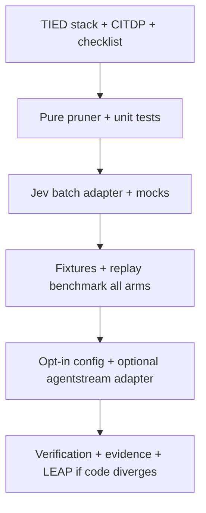

# Blueprint A: Context Semantic Garbage Collection & Log Pruning

| Field | Value |
| --- | --- |
| **Source** | [system-one-jev-taxonomy-and-opportunities.md](file:///Users/fareed/Documents/dev/chatgpt/stdd/docs/comparisons/system-one-jev-taxonomy-and-opportunities.md) § Blueprint A (Pattern 9) |
| **Parent program** | [REQ-TIED_JEV_DECISION_COPROCESSOR](file:///Users/fareed/Documents/dev/chatgpt/stdd/tied/requirements/REQ-TIED_JEV_DECISION_COPROCESSOR.yaml) (closed); this is a **follow-on child** change, not a silent expansion of the closed program |
| **Operator guide** | [jev-for-tied-improvement.md](file:///Users/fareed/Documents/dev/chatgpt/stdd/docs/comparisons/jev-for-tied-improvement.md) — Article latency/cost claims stay **Article** until reproduced locally |
| **Working folder (default)** | `working/REQ-TIED_JEV_CONTEXT_LOG_PRUNING/` (create on build-plan) |
| **Plan mirror** | Copy this file to `working/REQ-TIED_JEV_CONTEXT_LOG_PRUNING/PLAN.md` when execution starts |
| **Last refined** | 2026-09-29 (`refine-plan`; plan-only — no code, no TIED YAML writes this pass) |

---

## Refine (sponsor terms and defaults)

**Resolved intent:** Ship Blueprint A’s **terminal/tool-output pruning pipeline** and a **reproducible benchmark** that compares performance **before vs after** semantic GC and **with Jev enabled vs disabled** on the same fixture corpus. Success is measured locally; do not gate on the taxonomy doc’s 80–95% reduction headline.

**Canonical vocabulary** ([decision-copilot.md](file:///Users/fareed/Documents/dev/chatgpt/stdd/tied/vocab/decision-copilot.md)): **semantic garbage collection**, **bounded semantic decision engine**, **speculative fan-out**, **noul gate**, **decision coprocessor** (advise only; code commits disposition).

**Sponsor default-proceed (reversible defaults):**

| Decision | Default | Revisit only if |
| --- | --- | --- |
| Child REQ token | `REQ-TIED_JEV_CONTEXT_LOG_PRUNING` | Sponsor wants a different suffix |
| Scope of pruned artifact | Sanitized **terminal / tool-result text blocks** only | Need full thread history pruning |
| Pass-through threshold | **30 lines** verbatim (Blueprint A step 2) | Benchmark shows poor boundary behavior |
| Chunk size | **10 lines** per block (step 3) | Latency/cost trade study |
| Jev questions per chunk | Two **nouls** in one fan-out (fatal/diagnostic vs boilerplate) | Pilot shows need for extra axes |
| Retention rule | Keep block if `fatal_noul > 0.40` **and** `boilerplate_noul < 0.60`; add **±2** surrounding lines when a block is kept (steps 5–6) | Safety corpus fails recall |
| Feature default | **Opt-in** (`TIED_JEV_CONTEXT_LOG_PRUNING` or harness-adjacent flag); no behavior change when off | Product asks default-on |
| Runtime slice 1 | **Library + replay benchmark**; agentstream adapter **after** seam proof | Seam found early and safe |
| `depth_tier` (CITDP) | **`integrated`** — external API, context loss, privacy | Sponsor waives with documented residual risk |
| `gate_policy` | **`mixed`** — Jev advisory; deterministic gates unchanged | N/A |
| Token estimator | Report **bytes/chars exactly**; tokens via documented heuristic (e.g. chars/4) unless downstream tokenizer is wired | Real tokenizer available |

**Non-goals:** Replace `tied_checklist_gate_validate`; mutate TIED YAML from Jev; prune conversation turns in v1; use Jev to **summarize** (prose generation); treat W2/W4 agreement rates as pruning acceptance.

**Current repo gap (evidence):** [`context-filter-advisory.ts`](file:///Users/fareed/Documents/dev/chatgpt/stdd/mcp-server/src/jev/context-filter-advisory.ts) evaluates a **single item** (`drop_item` / `truncate_item`); agentstream uses it only in **preflight sample** ([`jev-harness-preflight.ts`](file:///Users/fareed/Documents/dev/chatgpt/stdd/mcp-server/packages/agentstream/src/jev-harness-preflight.ts)). No chunk pruner, labeled corpus, or latency/token benchmark exists.

---

## Plan (CITDP)

### Proposed traceability stack (mint at `author-requirement` / build-plan)

| Layer | Proposed token | Role |
| --- | --- | --- |
| REQ | `REQ-TIED_JEV_CONTEXT_LOG_PRUNING` | Opt-in semantic GC for voluminous command/tool output; mandatory benchmark arms; safety invariants |
| ARCH | `ARCH-TIED_JEV_CONTEXT_LOG_PRUNING` | Pure pruner module + Jev adapter boundary; opt-in composition; evidence schema |
| IMPL | `IMPL-TIED_JEV_CONTEXT_LOG_PRUNING` | Chunking, fan-out, disposition, metrics, fallback, replay CLI |

Cross-link parent: `REQ-TIED_JEV_DECISION_COPROCESSOR` in `cross_references` / `related_decisions.see_also`.

### Assurance and inquiry

- **Profiles:** `baseline-functional`, `performance-scale-cost`, `ai-enabled` (external Jev calls; context discard).
- **Proof boundaries:** Benchmark proves **reduction/latency/cost on fixtures**; does **not** prove agent quality improvement in production. Pruner safety proved on **labeled** corpus only.
- **Adversarial inquiry:** `depth_tier: integrated` at `risk-assessment`; run `sub-adversarial-inquiry-pass` at structural + pre-RED if MCP available; four artifacts under `working/REQ-TIED_JEV_CONTEXT_LOG_PRUNING/adversarial-inquiry/` when activated.

### Quality evidence matrix (outline)

| Attribute | Applicability | Evidence |
| --- | --- | --- |
| Performance / cost | applicable | `context-pruning-benchmark.v1.json` all arms; optional `--live` appendix |
| Safety / data integrity | applicable | Labeled recall/false-drop tests; conservative fallback tests |
| Privacy | applicable | Redaction tests + evidence scan (no secrets in fixtures/reports) |
| AI-enabled boundary | applicable | Doc + tests that Jev never sets gate `allowed` or writes YAML |

### Test strategy (Implement gate entry)

| Layer | Focus | Primary paths |
| --- | --- | --- |
| Unit | Chunk boundaries (29/30/31 lines), empty/Unicode lines, disposition math, surrounding lines, dedupe, metrics | `mcp-server/src/jev/context-log-pruner.test.ts` |
| Unit | Jev batch adapter: mock fan-out, malformed answers, skip/no key, state too large | extend `mcp-server/src/jev/` tests |
| Contract | Benchmark report schema v1; fixture JSONL shape | schema test or snapshot |
| Composition | Opt-in flag → pruner invoked on synthetic stream chunk (no UI) | agentstream adapter test when seam exists |
| Evaluation | Replay script: all arms on same fixtures | `mcp-server/scripts/replay-jev-context-pruning.ts` |
| Regression | Existing Jev W5 + client tests green | `bun test mcp-server/src/jev/` |

---

## Target behavior (Blueprint A algorithm)

For input text `log` (stdout/stderr or tool-result body):

1. If `lineCount(log) <= 30` → return `log` unchanged (**no Jev**).
2. Else split into contiguous **10-line chunks** (last chunk may be shorter).
3. For each chunk, one `jevDecide` with speculative fan-out:
   - `fatal_or_diagnostic` (**noul**): block contains fatal error, failed test assertion, or compiler diagnostic?
   - `pure_boilerplate` (**noul**): block is purely progress/boilerplate?
4. **Keep** chunk if `fatal_or_diagnostic >= 0.40` and `pure_boilerplate < 0.60`; else drop chunk content (unless fallback — see below).
5. When keeping, also retain up to **2 lines** immediately before and after the chunk in the original line array (merge overlaps deterministically).
6. Emit **pruned text** plus **metrics** (bytes/lines before/after, chunk stats, Jev latencies, usage).

**Fallback (fail-safe):** harness disabled, no key, `state_too_large`, HTTP error, malformed answer → **keep original chunk** (or full log for catastrophic parser failure). Never empty the log on uncertainty.

**Distinction from W5 advisory:** [`adviseContextFilter`](file:///Users/fareed/Documents/dev/chatgpt/stdd/mcp-server/src/jev/context-filter-advisory.ts) remains for single-item keep/truncate/drop hints; pruner is the **batch log pipeline** for multi-line command output.

---

## Performance experiment (mandatory)

### Comparison arms (same fixtures, same order)

| Arm ID | Jev | Pruner logic | Purpose |
| --- | --- | --- | --- |
| `raw_before` | off | none | **Before Blueprint A** — full output (baseline for reduction %) |
| `deterministic_only` | off | chunk + **keep-all-chunks** (or regex fatal-line keep) | Isolates chunking overhead vs semantic value |
| `pruner_jev_off` | off | chunk + disposition uses **deterministic** fatal/boilerplate heuristics only | Feature path without vendor |
| `pruner_jev_on` | on | chunk + Blueprint A noul thresholds | **After Blueprint A** (primary) |
| `pruner_jev_unavailable` | unavailable | same as `pruner_jev_on` code path but forced skip/error injection | Fallback safety + latency |

**Primary sponsor ask:**

- **Before vs after:** `raw_before` vs `pruner_jev_on` (bytes, tokens, lines, p95 latency).
- **Jev on vs off:** `pruner_jev_on` vs `pruner_jev_off` (and vs `deterministic_only` when isolating Jev marginal value).

### Metrics (`context-pruning-benchmark.v1`)

Per fixture × arm, then aggregate:

- **Latency:** end-to-end prune ms; Jev request ms (p50, p95, p99).
- **Size:** input/output lines, bytes, chars; estimated tokens (heuristic + label).
- **Reduction:** `1 - output_bytes/input_bytes`, same for tokens/lines.
- **Jev:** chunk count, call count, retries (502), skips, errors; `usage.input_tokens`, `usage.cost_usd` (**null** if absent).
- **Safety (labeled fixtures only):** fatal-line **recall**, actionable-line **false-drop** count.
- **Meta:** `fixture_hash`, `git_rev`, `JEV_MODEL`, thresholds, `mocked|live`, timestamp, repetition index.

**CI default:** mocked Jev (deterministic canned nouls). **`--live`:** requires `JEV_API_KEY`; evidence under `working/.../evidence/` only; no secrets in committed JSON.

### Fixture corpus (synthetic / redacted)

Minimum **20** labeled blocks in JSONL (`fixtures/context-pruning/*.jsonl`):

- passing test spam + single failure tail;
- `tsc`/Rust-style diagnostic block;
- warnings adjacent to errors;
- repeated “✓” lines;
- JSON/NDJSON tool output;
- secret canaries (must not appear in Jev state in tests);
- 29/30/31 line boundary file;
- fatal on first/last line of chunk.

Labels: `fatal_diagnostic`, `actionable_warning`, `informational_progress`, `boilerplate`, `context_required`.

---

## Implementation sequence (build-plan waves)

| Wave | Deliverable | Exit |
| --- | --- | --- |
| **W0** | REQ/ARCH/IMPL YAML + sidecar; `semantic-tokens.yaml`; CITDP; tracker copy | `pre_implementation` gate |
| **W1** | `context-log-pruner.ts` — pass-through, chunk, surround, metrics, deterministic arm | Unit tests green |
| **W2** | Jev fan-out per chunk; telemetry wrapper; preserve W5 advisory | Jev tests green |
| **W3** | `replay-jev-context-pruning.ts`; `context-pruning-benchmark.v1.json` for all arms | Report checked into `working/.../evidence/` |
| **W4** | Env/manifest opt-in; document `tool_result` seam; adapter if proven | Composition test or documented deferral |
| **W5** | Full suite, token audit, `tied_validate_consistency`, vocab VALIDATE | `verification` / `close_out` |

**Key files (planned):**

- [`mcp-server/src/jev/context-log-pruner.ts`](file:///Users/fareed/Documents/dev/chatgpt/stdd/mcp-server/src/jev/context-log-pruner.ts) (new)
- [`mcp-server/src/jev/context-log-pruner.test.ts`](file:///Users/fareed/Documents/dev/chatgpt/stdd/mcp-server/src/jev/context-log-pruner.test.ts) (new)
- [`mcp-server/scripts/replay-jev-context-pruning.ts`](file:///Users/fareed/Documents/dev/chatgpt/stdd/mcp-server/scripts/replay-jev-context-pruning.ts) (new)
- [`mcp-server/src/jev/client.ts`](file:///Users/fareed/Documents/dev/chatgpt/stdd/mcp-server/src/jev/client.ts) (reuse; optional thin timing wrapper)
- [`mcp-server/scripts/replay-jev-vocab-shadow.ts`](file:///Users/fareed/Documents/dev/chatgpt/stdd/mcp-server/scripts/replay-jev-vocab-shadow.ts) (pattern for `--live` + JSONL)

**Agentstream seam (investigate in W4):** [`executor-run.ts`](file:///Users/fareed/Documents/dev/chatgpt/stdd/mcp-server/packages/agentstream/src/executor-run.ts) today parses assistant/thinking + tool gate proposals — **not** tool results. Document where shell output enters agent context before enabling per-turn pruning.

---

## Implement gate (do not start until plan accepted)

1. Copy checklist to `working/REQ-TIED_JEV_CONTEXT_LOG_PRUNING/agent-req-implementation-checklist.yaml`.
2. Complete IMPL `essence_pseudocode` with block token comments → `gate-pseudocode-validation` → persist IMPL.
3. RED unit tests per block → GREEN → composition → benchmark script last.
4. Run benchmark: require report with all five arm IDs before marking REQ satisfied.
5. Jev remains **coprocessor**; checklist gates and YAML MCP stay authoritative.

---

## Acceptance criteria (plan-level)

- [ ] **SC-BENCH-ARMS:** Evidence file lists `raw_before`, `deterministic_only`, `pruner_jev_off`, `pruner_jev_on`, `pruner_jev_unavailable` on identical fixture hash.
- [ ] **SC-BEFORE-AFTER:** Report includes paired reduction and p95 latency for `raw_before` vs `pruner_jev_on`.
- [ ] **SC-JEV-TOGGLE:** Report includes paired metrics for `pruner_jev_on` vs `pruner_jev_off`.
- [ ] **SC-SAFETY:** Labeled corpus ≥99% fatal recall; 0 false drops on `context_required` rows (or documented waiver).
- [ ] **SC-PASS-THROUGH:** ≤30 lines unchanged byte-for-byte.
- [ ] **SC-FALLBACK:** Unavailable Jev arms do not reduce line count vs input on acceptance fixtures.
- [ ] **SC-NO-REGRESSION:** Default-off config; existing Jev harness tests pass.
- [ ] **SC-TRACE:** Token audit + `tied_validate_consistency` ok after TIED persist.

---

## Forbidden (anti-patterns)

| Do not | Because |
| --- | --- |
| Use article 80–95% as CI threshold | Unverified; local benchmark only |
| Delegate gate `allowed` to Jev | [system-one-jev-taxonomy-and-opportunities.md](file:///Users/fareed/Documents/dev/chatgpt/stdd/docs/comparisons/system-one-jev-taxonomy-and-opportunities.md) §6 |
| Commit live logs or API keys | Privacy / security |
| Merge pruner into `adviseContextFilter` only | Loses module boundaries and benchmark clarity |

---

## Refine-plan handoff

| Item | Status |
| --- | --- |
| Linked plan | **Updated** (this file) |
| Tracker / CITDP / TIED YAML | **Deferred** to build-plan after plan acceptance |
| `tied_checklist_gate_validate` | **Not run** (no Tracker/CITDP on disk for this REQ yet) |
| Next step | User accepts plan → **`/build-plan`** with remainder `Wave W0` or full stack |
