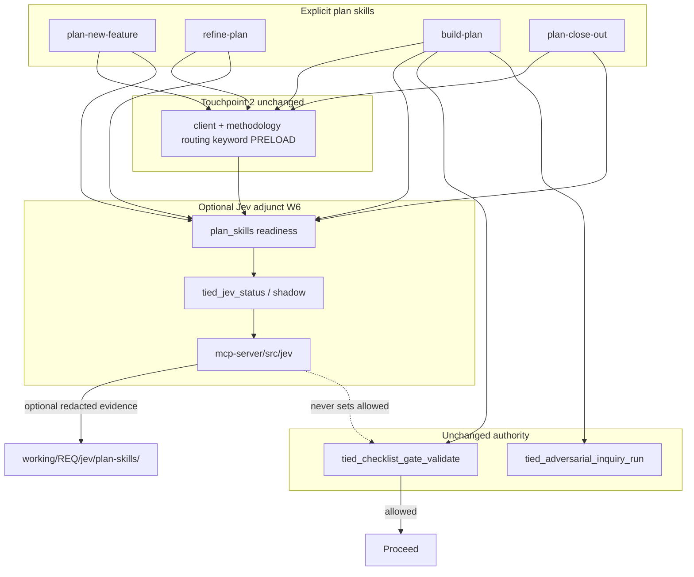

# Plan W6 — Jev wiring for main plan skills (Cursor)

**Status:** Refined proposal (plan-only; W6 code is not implemented) — refine-plan pass 2026-09-27  
**Parent program:** [REQ-TIED_JEV_DECISION_COPROCESSOR](../../tied/requirements/REQ-TIED_JEV_DECISION_COPROCESSOR.yaml) · [PLAN.md](./PLAN.md)  
**Traceability:** [ARCH-TIED_JEV_DECISION_COPROCESSOR](../../tied/architecture-decisions/ARCH-TIED_JEV_DECISION_COPROCESSOR.yaml) · [IMPL-TIED_JEV_DECISION_COPROCESSOR](../../tied/implementation-decisions/IMPL-TIED_JEV_DECISION_COPROCESSOR.yaml) · [REQ-PROMPT_TYPE_GLOBAL_SKILLS](../../tied/requirements/REQ-PROMPT_TYPE_GLOBAL_SKILLS.yaml)  
**Vocabulary:** [decision-copilot.md](../../tied/vocab/decision-copilot.md) · [prompt-composer.md](../../tied/vocab/prompt-composer.md) · [routing.md](../../tied/vocab/routing.md) row **5g**  
**Audience:** Operators and agents using `plan-new-feature`, `refine-plan`, `build-plan`, `plan-close-out` in Cursor (not `@tied/agentstream` alone)
**Per-request Tracker:** [w6-plan-skills-wiring-tracker.yaml](./w6-plan-skills-wiring-tracker.yaml)  
**CITDP:** W6 behavior-changing CITDP is deferred until implementation per [citdp-policy.md](../../tied/docs/citdp-policy.md); this plan records the required depth, profiles, risks, and test strategy. Plan-level CITDP input for gate checks uses the fields in § Risk register / depth.

---

## Goal

When an operator explicitly invokes one of the four full-TIED plan skills, and the project has explicitly enabled `jev.plan_skills`, allow that skill to call existing **`mcp-server/src/jev/`** adjuncts only when a trimmed `JEV_API_KEY` is present and the current Jev decision request succeeds. A successful request is the only W6 definition of **service reachable**; key presence alone is not readiness.

W6 is advisory/shadow wiring. It must not replace keyword PRELOAD, checklist gates, YAML MCP writes, or integrated adversarial inquiry activation.

**Compose, do not fork** (unchanged from [PLAN.md](./PLAN.md) layering §148–154):

- Authority: Tracker + `tied_checklist_gate_validate` + envelope v1 + git/process contracts.
- Jev: advisory/shadow for W6; W5 **fail-closed tool block** remains **agentstream harness** unless a separate IDE middleware slice is approved.

---

## Change definition (CITDP analysis — plan-level)

| Dimension | Statement |
| --- | --- |
| **Current** | W1–W5 Jev modules exist under `mcp-server/src/jev/`. Cursor plan skills (`plan-new-feature`, `refine-plan`, `build-plan`, `plan-close-out`) never call them. Parent REQ status is Implemented for W0–W5; no `jev.plan_skills` flag, no plan-skill MCP tools, no shared adjunct Markdown. |
| **Desired** | Opt-in **plan-skills adjunct**: after keyword PRELOAD, the four explicit skills may call `tied_jev_status` / `tied_jev_vocab_shadow` (CLI parity via `tied-cli.sh`) when configured + keyed; shadow compares merged routing baseline vs Jev without mutating PRELOAD or gates. Optional W6d advisory-primary display and observation-only triage remain sponsor-gated. |
| **Unchanged** | Keyword PRELOAD algorithm (aside from adding a merged-row loader used by both keyword and shadow); `tied_checklist_gate_validate` / envelope / inquiry four-artifact authority; W5 agentstream harness semantics; Prompt Composer leaf set and explicit-invocation boundary; `.cursor/agents/*` install policy (source-only); `copy_files.sh` MCP create-only behavior. |
| **Non-goals** | Cursor IDE Shell fail-closed middleware; auto-invoking skills from W3; Jev-driven close-out waivers; new `tied jev` umbrella subcommand; behavior-changing PRELOAD file selection; Claude-specific runtime; changing parent REQ status without LEAP implement pass. |
| **Success criteria** | (1) All readiness-state cases in § Readiness states leave the deterministic skill path unchanged except emitting advisory fields when `ready`. (2) Merged keyword baseline equals skill PRELOAD baseline for the same prompt+tables. (3) Evidence writes only under validated `working/{REQ\|PLAN-TOKEN}/jev/plan-skills/{run_id}/` when opted in. (4) Four canonical skills link one shared adjunct; other leaves unwired. (5) W5 harness tests unchanged. (6) After implement LEAP, `tied_validate_consistency` ok and new SC criteria on parent REQ. |

---

## Refine resolution

| Sponsor term | Resolved meaning |
| --- | --- |
| **configured** | Effective `jev.plan_skills` is explicitly `true` in `.tied-yaml.yaml`, or the explicit environment override `TIED_JEV_PLAN_SKILLS=1/true` is received by the MCP/CLI process. Missing or invalid configuration is off. |
| **key present** | `JEV_API_KEY.trim().length > 0`; the key is process environment only and is never stored in `.tied-yaml.yaml`, skill text, prompts, or evidence. |
| **service reachable** | The current `/v1/decide` call returns HTTP 2xx with a schema-valid response body containing `answers`. No separate health probe is used. Adapter timeout, thrown transport errors, non-2xx after the W1 502-once retry, malformed JSON, or answers that fail the shadow parser mean unavailable for that invocation. |
| **service readiness** | Per-call enum in § Readiness states (`disabled` … `locally_skipped`). Distinct from **key present** and from `tied_jev_status`'s `readiness: not_probed`. |
| **explicit skill** | Direct invocation of exactly `plan-new-feature`, `refine-plan`, `build-plan`, or `plan-close-out`. A Jev suggestion never invokes a skill, changes a `prompt-type`, or changes `prompt-type-router` order. |
| **keyword PRELOAD authoritative** | The two-layer routing procedure and keyword match determine which glossaries are loaded. Jev receives a bounded copy for shadow comparison; its suggestions cannot remove, replace, or silently add a PRELOAD file. |
| **merged routing baseline** | Ordered union of client `tied/vocab/routing.md` rows (if present) then methodology `tied/methodology/vocab/routing.md` rows, de-duplicated by glossary file basename; first-seen row wins keywords/priority. |
| **agrees** | Existing `vocabShadowAgrees(keyword, jev)`: true when Jev set is empty, equal to keyword set, or a subset of keyword set; false when Jev names a glossary not in the keyword baseline. |
| **plan-skills adjunct** | One shared `prompt-shared` instruction block plus MCP/CLI adapters reused by the four skills; it is not a new Prompt Composer leaf and is not installed as a Task wrapper. |
| **plan-skill evidence** | Supplemental redacted JSON under `working/{token}/jev/plan-skills/{run_id}/`; never gate proof, never inquiry activation. |

### Decisions and remaining sponsor choices

| Topic | Disposition |
| --- | --- |
| W6 core mode | **Resolved:** `advisory` shadow only. Behavior-changing PRELOAD tie-break is not approved. |
| W6d `tiebreak` | **Follow-on (sponsor A):** separate REQ/plan after W6 commit—not in this delivery. Advisory-primary *display* only when keyword matches are ambiguous (≥2) and model-pinned confidence ≥ `0.90`. Must not change the loaded set. |
| Evidence persistence | **Resolved:** require `isValidWorkingRequestToken` (`^(?:REQ\|PLAN)-[A-Z0-9][A-Z0-9_-]*$`) **and** `record_evidence: true`. Otherwise return redacted transient result; never invent a token. |
| Close-out | **Resolved:** no Jev noul may waive, satisfy, or alter close-out / `allowed`. Semantic waiver questions remain out of scope. |
| Depth / gate policy | **Resolved for implement planning:** `depth_tier: integrated`, `profile_depth: integrated`, `gate_policy: advisory`. Deterministic inquiry + four artifacts stay separate from Jev. |
| Timeout ownership | **Resolved:** W6a adapter wraps `jevDecide` with `AbortSignal` / race using `JEV_PLAN_SKILLS_TIMEOUT_MS` (default `3000`). W1 client keeps 502-once retry (~50 ms delay); adapter must not add further retries. |
| Ambiguity accepted | Parent REQ remains Implemented until implement LEAP adds W6 satisfaction criteria; this refine pass does not mutate project REQ/ARCH/IMPL YAML. |

## Current state (gap)

| Layer | Today | Plan skills |
| --- | --- | --- |
| **PRELOAD** | `tied/vocab/routing.md` → methodology routing → keyword match | Same (`tied-refine.md`, `guiding-vocab.md`) |
| **Jev code** | W1 client, W2 shadow vocab, W3 prompt-type advisory, W4 triage pilot, W5 agentstream harness | **Not invoked** from bundled skills or `.cursor/agents/*` |
| **Config** | `jev.agentstream_harness: true` or `AGENTSTREAM_JEV_HARNESS=1` | No `jev.plan_skills` flag for Cursor plan workflows |
| **Operator surface** | Replay scripts + dist-loaded harness | No plan-skill-specific TIED MCP tools; `tied-cli.sh` already mirrors MCP tools |

---

## Routing index updates

Row **5g** in [routing.md](../../tied/vocab/routing.md) already routes to **decision-copilot**. W6 implementation documentation and keyword rows should include:

- Explicit skill names: `plan-new-feature`, `refine-plan`, `build-plan`, `plan-close-out`
- Checklist slugs: `session-bootstrap`, `impact-discovery`, `gate-pseudocode-validation`, `traceable-commit`
- Terms: `jev shadow`, `decision coprocessor`, `plan_skills`

**Cross-topic note** (add to `domain-references.md` when implementing W6c):

- **Prompt Composer** = explicit skill invocation (caller names the type).
- **Jev W3** = suggestion only — useful for a separately requested advisory or `prompt-type-router`, **not** to override an explicit `@build-plan`.

**Merged routing loader (W6a — `LOAD_MERGED_ROUTING_BASELINE`):**

1. Resolve project root from `TIED_BASE_PATH` / tool `project_root`.
2. Read client `tied/vocab/routing.md` if present (missing → empty client rows; valid).
3. Read methodology `tied/methodology/vocab/routing.md` (missing → diagnostic `methodology_routing_missing`; do not invent PRELOAD files).
4. Parse each with existing `parseRoutingTableMarkdown`.
5. Merge: client rows then methodology rows; de-duplicate by `glossaryIdFromFile(row.file)`; **first-seen wins** keywords/priority.
6. Pass the same merged `RoutingRow[]` into `matchKeywordGlossaries` and `shadowVocabPreloadFromRows`.

**Activation map (W6c):** Add **§2.9 Jev plan-skills (optional)** to [fresh-client-prompt-activation-map.md](../../tied/docs/fresh-client-prompt-activation-map.md) after §2.8 — triggers (`jev.plan_skills` / `TIED_JEV_PLAN_SKILLS`), four skill names, evidence under `working/{token}/jev/plan-skills/`, default **off**; Jev artifacts never satisfy §2.5 inquiry activation.

---

## Configuration and readiness contract

The feature flag, credential, and live service result are three independent signals. The MCP/CLI adapter owns this state machine; skill prose must not infer readiness from a key or a built file.

### Effective configuration

```yaml
# .tied-yaml.yaml — absent means disabled; copy_files.sh does not add or enable this.
jev:
  plan_skills: true
```

Resolution order (`RESOLVE_PLAN_SKILLS_CONFIG`):

1. If `TIED_JEV_PLAN_SKILLS` is set (non-empty): case-insensitive `1`/`true` → on; `0`/`false` → off; any other value → off + diagnostic `invalid_env_override`.
2. Else if `.tied-yaml.yaml` has strict boolean `jev.plan_skills: true` → on.
3. Else (absent, null, string `"true"`, number, other) → off; malformed values emit `invalid_plan_skills_flag`.

`jev.plan_skills` is independent from `jev.agentstream_harness`. `JEV_API_BASE` / `JEV_MODEL` retain W1 defaults. `JEV_PLAN_SKILLS_TIMEOUT_MS`: optional positive integer; default `3000`; `≤0`, non-numeric, or `>60000` → default + diagnostic. No key or prompt body in configuration.

### Readiness states

| State | Condition | Vendor call? | Skill behavior |
| --- | --- | ---: | --- |
| `disabled` | Effective flag false or invalid | No | Continue silently or with diagnostic. |
| `configured_no_credentials` | Flag true and trimmed key empty (adapter short-circuit; do not call `jevDecide`) | No | Deterministic path unchanged. |
| `configured_unreachable` | Flag + key present, but timeout, thrown transport, `{ok:false,skipped:false}`, non-2xx after W1 502-once retry, JSON parse failure, or answers unusable by `jevAnswersToGlossaryIds` | Attempted | Continue deterministic path. |
| `ready` | Flag + key and `{ok:true}` with parseable `answers` within timeout | Yes | Emit advisory/shadow; never mutate authority. |
| `locally_skipped` | Flag + key but `{ok:false,skipped:true,reason:"state_too_large"}` (or equivalent local preflight) | No | Continue; include `skip_reason` if evidence opted in. |

**`JevDecideResult` → readiness (after timeout wrapper):** not called/flag off → `disabled`; not called/no key or skipped `no_credentials` → `configured_no_credentials`; skipped `state_too_large` → `locally_skipped`; `{ok:false,skipped:false}` / timeout / throw → `configured_unreachable`; `{ok:true}` → `ready`.

`tied_jev_status` never probes (`readiness: not_probed` when enabled; never `service_reachable: true`). `tied_jev_vocab_shadow` performs the one decision call. Missing dist / MCP/CLI is **operator-unavailable** (`tool_unavailable` on the skill side), not vendor readiness.

**Failure policy:** catch timeout, transport throws, non-2xx, malformed JSON, and answer errors at the adjunct boundary; redact with `redactString` (≤500 char excerpt); return structured tool results — **never throw** into skill prose; no retries beyond W1's single 502 retry (~50 ms). Fallback = pre-W6 behavior. W5 harness fail-closed semantics unchanged.

### Input bounds (code-owned)

| Input | Bound | On exceed |
| --- | --- | --- |
| Shadow `prompt` | Slice **4000** chars (W2 parity) | Truncate; `prompt_truncated: true` |
| `plan_excerpt` | Max **8000** chars | Truncate; `plan_excerpt_truncated: true` |
| Combined Jev `state` JSON | `DEFAULT_JEV_MAX_STATE_CHARS` (**120_000**) | `locally_skipped` / `state_too_large` |
| `skill` | Enum of the four plan skills | Tool error `invalid_skill` (no vendor call) |
| `request_token` | `isValidWorkingRequestToken` (`^(?:REQ\|PLAN)-[A-Z0-9][A-Z0-9_-]*$`) | `invalid_request_token`; never write |
| `run_id` | Default `ps-<utcCompact>-<8 hex>`; if supplied `^[A-Za-z0-9][A-Za-z0-9._-]{0,63}$` | Reject / regenerate |
| Evidence path | Contained under `working/{token}/jev/plan-skills/{run_id}/` (`path.resolve` check; reject `..`) | `unsafe_evidence_path` |

---

## Schema contracts (v1)

### `jev-plan-skills-status.v1`

Required: `schema`, `enabled`, `enabled_source` (`env` \| `tied_yaml` \| `default_off`), `key_present`, `model`, `api_base_redacted`, `timeout_ms`, `readiness` (`disabled` \| `not_probed`), `proof_boundary`. Forbidden: key material, full env, prompts, file writes.

### `jev-plan-skills-vocab-shadow.v1`

Required: `schema`, `skill`, `phase`, `enabled`, `key_present`, `readiness`, `service_reachable`, `keyword_glossaries`, `jev_glossaries`, `agrees` (`vocabShadowAgrees`), `confidence`, `model`, `prompt_truncated`, `plan_excerpt_truncated`, `proof_boundary`. When `record_evidence: true` + valid token: also `request_token`, `run_id`, `artifact_relpath`. Optional: `usage`/`cost` numbers, `skip_reason`, `failure_class` (`timeout` \| `transport` \| `http_status` \| `malformed_response` \| `invalid_answers` \| `tool_unavailable`), `failure_excerpt_redacted`. Persist as `vocab-shadow.v1.json` only; never project TIED YAML.

### W6d triage artifact

Reuse `adversarial-triage-pilot.v1` from `runAdversarialTriagePilot`; persist `adversarial-triage-pilot.v1.json` under the same evidence tree when explicitly requested. Observation-only.

---

## Per-skill wiring

The four skills are **explicitly invoked**. The shared adjunct runs only after the skill has performed its normal routing/keyword PRELOAD step. W3 `advisePromptTypes` is not called by these skills because explicit skill names already define the invocation boundary.

| Skill | Hook (existing procedure) | Jev procedure (W6 core) | Effect |
| --- | --- | --- | --- |
| **plan-new-feature** | Refine step 1 — [tied-refine.md](../../tools/bundled-prompt-type-skills/prompt-shared/tied-refine.md) | `RUN_PLAN_SKILLS_SHADOW` / `SHADOW_VOCAB_PRELOAD` on invocation remainder (+ REQ title once known); `phase: refine`; **no** evidence write until a token exists | Log keyword vs Jev; no token guess; no PRELOAD change |
| **refine-plan** | Same Refine + bounded linked-plan excerpt (≤8000) | Shadow on remainder + excerpt; `phase: refine`; evidence only if caller supplies valid token + `record_evidence` | Surface `agrees: false` before CITDP/plan edits; no plan mutation |
| **build-plan** | [guiding-vocab.md](../../tools/bundled-prompt-type-skills/prompt-shared/guiding-vocab.md) before Plan | Shadow after guiding vocab (`phase: guiding-vocab`). **W6d only:** optional `ADVERSARIAL_TRIAGE_PILOT` **after** `tied_checklist_gate_validate phase: pre_implementation` returns and **before** RED | Observation only; never replaces `sub-adversarial-inquiry-pass` / four artifacts |
| **plan-close-out** | After `sub-close-out-evidence-sync`, **before** `tied_checklist_gate_validate phase: close_out` | Shadow on bounded change summary when explicitly requested (`phase: close-out`); warn-only | Never flips `allowed`, creates waiver, or edits proposed commit message |

**Adjunct call sequence (all four):** (1) normal RESOLVE/PRELOAD → (2) optional `tied_jev_status` (diagnostics) → (3) optional `tied_jev_vocab_shadow` → (4) continue skill authority path. Missing tool → no-op + diagnostic; never block.

### Shadow modes

- **`advisory` (W6 core default):** Keyword PRELOAD unchanged; return diagnostic and optionally persist `vocab-shadow.v1.json`.
- **`tiebreak` (W6d candidate only):** If keyword matches are ambiguous (≥2 distinct glossary ids) **and** Jev `confidence ≥ 0.90`, return `advisory_primary` / ordered recommendation fields only. Never remove, replace, or add a loaded glossary. Behavior-changing selection needs a new sponsor-approved scope.

### Out of scope for W6 core

- **W5 live Shell/bash gate in Cursor IDE** — separate slice (PLAN residual: Cursor middleware / MCP exposing `evaluateHarnessToolCall`).
- **Auto-invoking** prompt-type skills from Jev W3.
- **Integrated adversarial activation** via Jev alone.
- Any change to `mcp-server/packages/agentstream/` or `AGENTSTREAM_JEV_HARNESS`.
- Any direct change to `.cursor/agents/*` wrappers beyond static contract coverage; wrappers remain TIED-source-only and delegate the canonical skills.
- Any close-out semantic waiver or Jev contribution to `tied_checklist_gate_validate`.

---

## MCP and CLI operator surface

W6 core adds thin MCP adapters around the existing Jev modules. Business logic belongs under `mcp-server/src/jev/`; `mcp-server/src/tools/index.ts` only registers the adapter. All tools are read-only with respect to project TIED YAML.

| Tool | Inputs (Zod) | Output / mutation boundary |
| --- | --- | --- |
| **`tied_jev_status`** | Optional `project_root` | `jev-plan-skills-status.v1`; never vendor call; never writes |
| **`tied_jev_vocab_shadow`** | `prompt` (required), `skill` (enum), optional `plan_excerpt`, `phase`, `request_token`, `run_id`, `record_evidence` (default false), optional `project_root` | `jev-plan-skills-vocab-shadow.v1`; writes `vocab-shadow.v1.json` only when `record_evidence` + valid token; path under `working/{token}/jev/plan-skills/{run_id}/` |
| **`tied_jev_adversarial_triage_pilot`** (W6d only) | Existing labeled-case input + valid `request_token` + `phase` + optional `run_id` | `adversarial-triage-pilot.v1`; same evidence tree; never inquiry activation |

**MCP registration:** adapters in `mcp-server/src/jev/` (or thin `tools/` wrappers); register in `allTools` / `mcp-server/src/tools/index.ts`. Tools are read-only w.r.t. project TIED YAML. Zod must reject unknown `skill` values before any network I/O.

`tied_jev_prompt_type_advise` is not part of the four-skill adjunct. Existing W3 advisory remains a separately requested operator surface and must not be called to decide which explicit skill runs.

The same MCP tools are the CLI fallback:

```text
.cursor/skills/tied-yaml/scripts/tied-cli.sh tied_jev_status '{}'
.cursor/skills/tied-yaml/scripts/tied-cli.sh tied_jev_vocab_shadow @/path/to/jev-shadow-args.json
```

W6 does **not** add a second Jev algorithm to the umbrella `tied` CLI and does not add a `tied jev` subcommand. `tied-cli.sh` already uses the same built `mcp-server/dist/index.js`, so MCP and CLI results share readiness and redaction semantics.

**Shared skill block:** Add [prompt-shared/jev-plan-skills-adjunct.md](../../tools/bundled-prompt-type-skills/prompt-shared/jev-plan-skills-adjunct.md) and link it directly from the four canonical `SKILL.md` files:

1. Complete normal RESOLVE/PRELOAD first, including the client handoff and methodology routing tables.
2. Use the shared adjunct only when the current skill is one of the four named skills.
3. Call status/shadow through MCP, or the same `tied-cli.sh` surface when MCP is unavailable; a missing optional surface is a no-op.
4. Treat `keyword_glossaries` as the authoritative loaded set; Jev fields are advisory evidence only.
5. Never skip `tied_config_get_base_path`, checklist gates, envelope validation, or the explicit-skill boundary.

Task wrappers under `.cursor/agents/` delegate these canonical skills and are not installed into clients; they do not receive a second Jev implementation.

---

## Client installation and operator prerequisites

- `copy_files.sh` refreshes the four managed Cursor skill directories and the shared `prompt-shared/` directory. Adding the adjunct requires no new install root, but the prompt-type bundle contract test must add the shared filename to its expected inventory.
- The source-only `tied/vocab/prompt-composer.md` remains excluded from client bootstrap. Client skills carry the necessary workflow contract; the canonical Prompt Composer glossary remains in this TIED source repository.
- `.cursor/mcp.json` is create-only for Cursor clients. Existing client MCP configurations remain byte-for-byte unchanged, so operators must rebuild/repoint the TIED source `mcp-server/dist/index.js` and restart the MCP process when W6 tools are installed. The new skill text must treat a missing tool as an optional no-op.
- The installed `.cursor/skills/tied-yaml/scripts/tied-cli.sh` points at the TIED source build baked by `copy_files.sh`; clients do not receive a copy of `mcp-server/src/jev`. `tied-cli.sh` and the Cursor MCP server therefore share one implementation and one `TIED_BASE_PATH`.
- `JEV_API_KEY` and optional readiness environment variables belong to the MCP/CLI process environment. They must not be added to `.cursor/mcp.json` in a committed client, `.tied-yaml.yaml`, skill text, or Tracker evidence. `jev.plan_skills` is opt-in and absent by default; bootstrap must not enable it.
- This W6 target is Cursor plan-skill wiring. Claude skill copies may receive the shared Markdown through the existing bootstrap machinery, but no Claude-specific runtime or agentstream behavior is added or claimed by W6.

---

## Evidence and gate ordering

| Trigger | Output |
| --- | --- |
| Explicit four-skill run + `record_evidence: true` + valid working token (`REQ-*` or `PLAN-*`) | `working/{token}/jev/plan-skills/{run_id}/vocab-shadow.v1.json` |
| `build-plan` + explicit W6d triage option + after pre-implementation gate context | `working/{token}/jev/plan-skills/{run_id}/adversarial-triage-pilot.v1.json` |
| `agrees: false` or Jev-only glossary ids | Redacted advisory artifact/diagnostic; human review only; never automatic LEAP |
| No / invalid request token (typical early `plan-new-feature` refine) | Transient result only; never invent a parent or fixture token |

Persisted fields follow § Schema contracts. Optional bounded prompt hash (e.g. sha256 of truncated prompt) may be stored; never store the key, full repository state, or raw error text. Artifacts are supplemental — not envelope gate proof and not inquiry activation.

Gate ordering is fixed:

1. `session-bootstrap` / `guiding-vocab` performs vocabulary RESOLVE and keyword PRELOAD.
2. The optional shadow runs after that baseline and before the skill edits its plan/CITDP prose.
3. `build-plan` runs the pre-implementation checklist gate before any W4 triage and before RED tests. A Jev triage report cannot satisfy `sub-adversarial-inquiry-pass`.
4. `plan-close-out` runs `sub-close-out-evidence-sync`, then the optional warn-only shadow, then `tied_checklist_gate_validate phase: close_out` and envelope validation.
5. Jev never sets `allowed`, updates Tracker dispositions, changes REQ/ARCH/IMPL status, or supplies integrated activation evidence.

For W6 implementation, the CITDP/Tracker records `depth_tier: integrated`, `profile_depth: integrated`, and `gate_policy: advisory` before any depth-dependent inquiry. The implementation must run deterministic `sub-adversarial-inquiry-pass` / `tied_adversarial_inquiry_run` at the required phases and pair the four bounded artifacts; Jev shadow/triage remains separate.

---

## Risk register (plan-level CITDP input)

| ID | Risk | Sev | Likelihood | Mitigation | Residual |
| --- | --- | --- | --- | --- | --- |
| R1 | Skill prose treats key presence as readiness | M | M | Adapter-owned readiness enum; adjunct forbids inferring from key/dist | Low if tests assert no-fetch when disabled/unkeyed |
| R2 | Shadow diverges from skill PRELOAD (single-file parser) | H | M | `LOAD_MERGED_ROUTING_BASELINE` shared by keyword + shadow; parity tests | Low |
| R3 | Evidence path traversal / wrong REQ folder | H | L | `isValidWorkingRequestToken` + resolve containment; RED for `..` / absolute | Low |
| R4 | Network/timeout throws abort plan skill | H | M | Catch at adjunct; never throw; timeout wrapper default 3s | Low |
| R5 | Jev output mistaken for inquiry/gate proof | H | M | Separate evidence tree + proof_boundary strings; gate-ordering tests | Medium until operator docs land (W6c) |
| R6 | W5 harness semantics drift while adding tools | M | L | No edits under `agentstream` package; keep harness tests green | Low |
| R7 | Secret leakage in diagnostics/evidence | H | L | Reuse `redactString`; status/shadow forbid key fields; composition asserts | Low |
| R8 | Scope creep into behavior-changing tie-break | M | M | W6d gated; core ships `advisory` only | Accepted until sponsor opens W6d |

**Depth (implement planning):** `depth_tier: integrated` (external network + AI-enabled + persistence of optional evidence). `profile_depth: integrated`. `gate_policy: advisory`. `research_profile` / assurance remain separate from Jev. No `integrated_waiver`.

**BBCE note:** Optional adjunct modules are shared mechanism across four skills — at implement impact-discovery, record shared-code justification if BBCE advisory is enforced; advisory only.

---

## Architecture



---

## Implementation waves

| Wave | Deliverable |
| --- | --- |
| **W6a** | Config/readiness module, bounded timeout/error normalization, merged client+methodology routing helper, `tied_jev_status`, and `tied_jev_vocab_shadow` |
| **W6b** | `prompt-shared/jev-plan-skills-adjunct.md` plus links in the four canonical bundled skills; no duplicate logic in Task wrappers |
| **W6c** | Client-install/static contract coverage, activation-map and routing/domain-reference documentation, and `tied-cli.sh` parity smoke |
| **W6d** | Optional sponsor-approved advisory-primary threshold and `tied_jev_adversarial_triage_pilot`; no close-out semantic waiver in this wave |

### Module boundaries

1. **Configuration/readiness module** — pure resolution of `.tied-yaml.yaml`, environment precedence, redacted status, and timeout policy.
2. **Routing/shadow module** — merged routing rows, deterministic keyword baseline, existing `SHADOW_VOCAB_PRELOAD`, and bounded evidence projection.
3. **MCP adapter** — Zod input/output and bounded `working/{REQ-TOKEN}/jev/plan-skills/` artifact writes; no TIED YAML writes.
4. **Prompt Composer composition** — Markdown adjunct and four canonical skill links; no service logic in skill prose beyond the shared call contract.

**LEAP (when executing):** Extend satisfaction criteria on [REQ-TIED_JEV_DECISION_COPROCESSOR](../../tied/requirements/REQ-TIED_JEV_DECISION_COPROCESSOR.yaml) and the W6 IMPL pseudo-code through the TIED YAML tools before tests/code. Preserve [REQ-PROMPT_TYPE_GLOBAL_SKILLS](../../tied/requirements/REQ-PROMPT_TYPE_GLOBAL_SKILLS.yaml)' explicit-invocation boundary. If implementation discovers new behavior, update IMPL → ARCH → REQ before proceeding.

**Tests:** Unit-test each module with mocked `fetchImpl`; add MCP composition tests for readiness, merged routing, redaction, bounded evidence, and gate non-interference; add static Prompt Composer and bootstrap-install tests; add CLI parity smoke through `tied-cli.sh`. No Cursor UI E2E is justified: skill composition is inspectable through Markdown contracts and MCP/CLI composition. Live Jev replay remains optional evidence, never CI authority.

### Required test/composition matrix

| Case ID | Boundary | Assertion |
| --- | --- | --- |
| T-CFG-01..08 | Configuration/readiness | Absent/false/invalid flag → `disabled` + no fetch; env `1`/`true`/`0`/`false` precedence; whitespace-only key → `configured_no_credentials`; timeout → `configured_unreachable`; 502 then 200 uses W1 single retry; hard non-2xx / malformed JSON / bad answers → unreachable; `state_too_large` → `locally_skipped` |
| T-RT-01..05 | Merged routing | Client+methodology merge; missing client OK; missing methodology diagnostic; duplicate glossary id first-wins; keyword list identical for same prompt vs direct `matchKeywordGlossaries` on merged rows |
| T-SH-01..06 | Shadow/evidence | `keyword_glossaries` immutable vs Jev; Jev-only ids not loaded; `agrees` matches `vocabShadowAgrees`; invalid token / `../` path rejected; truncate flags; `record_evidence:false` writes zero files |
| T-MCP-01..04 | MCP composition | Tools registered in `allTools`; status no-probe/no-secret; shadow shapes per schema; no mutation under `tied/*.yaml` |
| T-SK-01..04 | Skill composition | Four canonical `SKILL.md` link adjunct; router/debug/non-TIED unwired; close-out still names gate/envelope steps after optional shadow |
| T-INST-01..03 | Client installation | Bootstrap copies adjunct + four edits; preserves unrelated skills + existing `.cursor/mcp.json`; excludes Prompt Composer glossary and `.cursor/agents/*`; W5 fixtures unchanged |
| T-CLI-01 | Operator parity | `tied-cli.sh` same readiness/redaction shapes; no `tied jev` subcommand |
| T-GATE-01..02 | Gate ordering | Triage helper refuses / no-ops before pre-implementation context; Jev artifacts never accepted as inquiry activation or `allowed` source |

**Testability:** All cases unit or composition (mocked `fetchImpl`); e2e_only = none. Live Jev replay optional under `working/.../evidence/`, never CI authority.

---

## Verification checklist (W6 complete)

- [ ] Missing/invalid flag, explicit false, missing key, whitespace key, missing dist, timeout, network failure, non-2xx, and malformed response all leave the deterministic skill path unchanged.
- [ ] Flag + trimmed key + schema-valid 2xx yields `ready`; the result includes no secret and no unbounded prompt/repository state.
- [ ] The merged client+methodology keyword baseline is identical to the skill PRELOAD baseline; advisory Jev fields cannot alter loaded files.
- [ ] Explicit skill names remain authoritative; no prompt type is auto-invoked and no wrapper is installed into clients.
- [ ] `tied_jev_status` does not probe or leak; `tied_jev_vocab_shadow` writes only explicit, request-scoped evidence paths.
- [ ] W4 triage is observation-only and never supplies `sub-adversarial-inquiry-pass` or its four activation artifacts.
- [ ] `tied_checklist_gate_validate` receipts and envelope results are unchanged; Jev never sets `allowed: true` when the deterministic gate says false.
- [ ] W5 agentstream harness tests and `AGENTSTREAM_JEV_HARNESS` semantics remain unchanged.
- [ ] `tied_validate_consistency` is `ok` after any TIED YAML touch in the implementation change set.

### Plan-only gate boundary

This refine-plan pass **improves the plan + Tracker only**. It does not implement W6 code, run RED/GREEN/composition tests, persist a canonical W6 CITDP under `tied/citdp/`, or mutate project REQ/ARCH/IMPL YAML (parent REQ stays Implemented for W0–W5 until implement LEAP).

`tied_checklist_gate_validate` with `phase: pre_implementation` (2026-09-27 refine-plan re-check) against this Tracker + plan-level CITDP returned `allowed: false` with diagnostics: `tracker_sparse`, `missing_required_step:sub-adversarial-inquiry-pass`, `integrated_depth_requires_pairing`, `activation_pairing_incomplete`. That is the plan-only boundary, not a W6 runtime defect. **No gate receipt was persisted.**

**Next (build-plan / implement):** LEAP-extend parent REQ/ARCH/IMPL + W6 pseudo-code blocks (`RESOLVE_PLAN_SKILLS_CONFIG`, `ASSESS_JEV_SERVICE_READINESS`, `LOAD_MERGED_ROUTING_BASELINE`, `RUN_PLAN_SKILLS_SHADOW`); run integrated inquiry pairing; clear `pre_implementation` with identity-bound activation; execute W6a→W6c (W6d sponsor-gated); then verification/close-out.

---

## References

- [PLAN.md](./PLAN.md) — program close-out, integration touchpoints §342–375
- [IMPL pseudo-code](../../tied/implementation-decisions/IMPL-TIED_JEV_DECISION_COPROCESSOR-pseudocode.md) — `SHADOW_VOCAB_PRELOAD`, `ADVISE_PROMPT_TYPES`, `ADVERSARIAL_TRIAGE_PILOT` (extend with W6 blocks at implement)
- `mcp-server/src/working-request-token.ts` — `isValidWorkingRequestToken`
- Replay scripts: `mcp-server/scripts/replay-jev-vocab-shadow.ts`, `replay-jev-prompt-type-advisory.ts`, `replay-jev-adversarial-triage-pilot.ts`
- Client installation: [bundled prompt skills README](../../tools/bundled-prompt-type-skills/README.md), [bootstrap manifest](../../tools/bootstrap/manifest.json), and [bootstrap skills installer](../../tools/bootstrap/lib/skills.mjs)

**Last updated:** 2026-09-27 (refine-plan: change definition, schemas, readiness mapping, risks, test case IDs — plan/tracker only)
