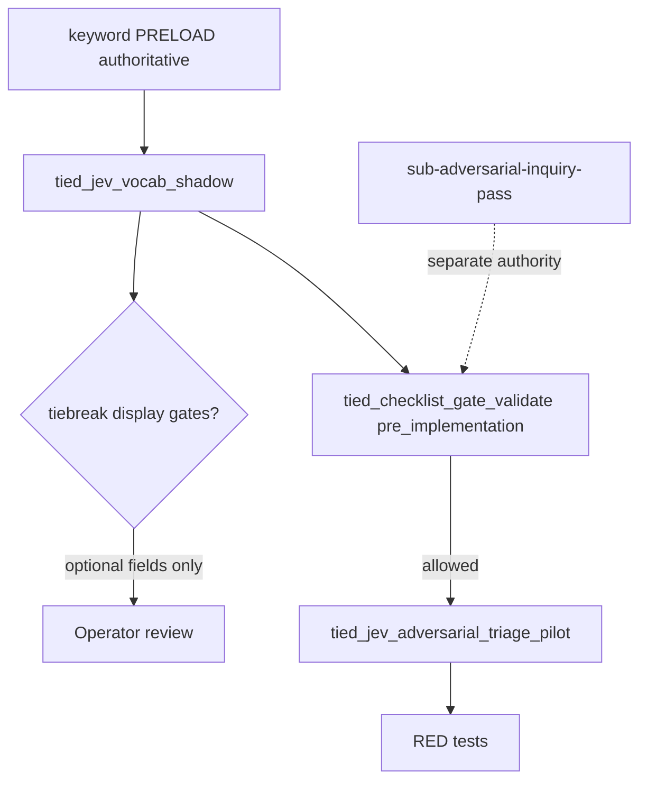

# Plan W6d — Advisory tie-break display + adversarial triage pilot (Cursor plan skills)

**Status:** Refined executable plan (plan-only refine; no W6d code in this pass) — refine-plan 2026-09-27  
**Parent program:** [REQ-TIED_JEV_DECISION_COPROCESSOR](../../tied/requirements/REQ-TIED_JEV_DECISION_COPROCESSOR.yaml) · [PLAN.md](./PLAN.md)  
**Prior art:** W6 core (commit `b151a84`) — `tied_jev_status`, `tied_jev_vocab_shadow`, merged routing baseline, [jev-plan-skills-adjunct.md](../../tools/bundled-prompt-type-skills/prompt-shared/jev-plan-skills-adjunct.md) in four skills. **Explicitly not in W6 core:** `tied_jev_adversarial_triage_pilot` ([T-GATE-01](../../mcp-server/src/jev/plan-skills.test.ts)).  
**Seed:** [PLAN-W6-PLAN-SKILLS-WIRING.md](./PLAN-W6-PLAN-SKILLS-WIRING.md) § W6d, Shadow modes, MCP table, build-plan row, R8  
**Traceability:** [ARCH-TIED_JEV_DECISION_COPROCESSOR](../../tied/architecture-decisions/ARCH-TIED_JEV_DECISION_COPROCESSOR.yaml) · [IMPL-TIED_JEV_DECISION_COPROCESSOR](../../tied/implementation-decisions/IMPL-TIED_JEV_DECISION_COPROCESSOR.yaml) · [REQ-PROMPT_TYPE_GLOBAL_SKILLS](../../tied/requirements/REQ-PROMPT_TYPE_GLOBAL_SKILLS.yaml)  
**Vocabulary:** [decision-copilot.md](../../tied/vocab/decision-copilot.md) · [prompt-composer.md](../../tied/vocab/prompt-composer.md)  
**Per-request Tracker:** [w6d-plan-skills-tiebreak-tracker.yaml](./w6d-plan-skills-tiebreak-tracker.yaml)  
**CITDP (draft):** [CITDP-REQ-TIED_JEV_DECISION_COPROCESSOR-W6d-PLAN-SKILLS.yaml](../../tied/citdp/CITDP-REQ-TIED_JEV_DECISION_COPROCESSOR-W6d-PLAN-SKILLS.yaml)

---

## Goal

Deliver sponsor-gated **W6d** as a LEAP extension of the same parent REQ (separate plan + CITDP slice, **no new REQ token** unless implement CITDP discovers a scope split):

1. **`tiebreak` shadow mode (display only)** — when keyword matches are ambiguous (≥2 distinct glossary ids) **and** Jev model-pinned `confidence ≥ 0.90`, emit `advisory_primary` and ordered recommendation fields without changing the keyword PRELOAD loaded set.
2. **`tied_jev_adversarial_triage_pilot` MCP adapter** — thin registration around existing [`runAdversarialTriagePilot`](../../mcp-server/src/jev/adversarial-triage-pilot.ts) (`adversarial-triage-pilot.v1`).
3. **`build-plan` hook only (initial)** — optional `ADVERSARIAL_TRIAGE_PILOT` **after** `tied_checklist_gate_validate phase: pre_implementation` returns and **before** RED; observation only.

Authority unchanged: keyword PRELOAD, checklist gates, envelope v1, deterministic `sub-adversarial-inquiry-pass` + four artifacts.

---

## Refine (Touchpoint 1 — RESOLVE)

### Sponsor term resolution

| Sponsor term | Resolved meaning |
| --- | --- |
| **W6d** | Follow-on slice after W6 close-out; extends plan-skills adjunct only; does not reopen W6a–W6c semantics except where tiebreak/triage adds fields or tools. |
| **tiebreak shadow mode** | Optional **display** path on `tied_jev_vocab_shadow` when caller opts in (`shadow_mode: tiebreak`). Default remains W6 **`advisory`**. Never mutates which glossaries PRELOAD loads. |
| **ambiguous keyword matches** | `keyword_glossaries` contains **≥2 distinct** glossary ids after merged-routing `matchKeywordGlossaries` (same baseline as W6). |
| **advisory_primary** | Single glossary id Jev ranks first for operator attention when tiebreak conditions hold; informational only. |
| **ordered recommendation** | Optional array of glossary ids (Jev ordering) for display; subset must not imply PRELOAD adds. |
| **confidence ≥ 0.90** | Uses parsed shadow `confidence` from `jevAnswersToGlossaryIds`; threshold is code-owned constant `TIEBREAK_CONFIDENCE_MIN` (0.90) aligned with [decision-copilot.md](../../tied/vocab/decision-copilot.md) **confidence threshold policy**. |
| **tied_jev_adversarial_triage_pilot** | New MCP tool name; wraps W4 module; read-only w.r.t. TIED YAML; never writes finding-ledger. |
| **ADVERSARIAL_TRIAGE_PILOT (build-plan hook)** | Procedural CALL documented in [build-plan/SKILL.md](../../tools/bundled-prompt-type-skills/build-plan/SKILL.md) + adjunct; runs triage MCP only when operator passes explicit labeled cases + valid token + `record_evidence`. |
| **explicit W6d triage option** | Caller supplies triage cases (or path) + `request_token` + optional `run_id`; not automatic on every build-plan. |

### Decisions and sponsor choices

| Topic | Disposition |
| --- | --- |
| New REQ vs LEAP extend | **Resolved:** extend [REQ-TIED_JEV_DECISION_COPROCESSOR](../../tied/requirements/REQ-TIED_JEV_DECISION_COPROCESSOR.yaml) satisfaction criteria + IMPL blocks; separate CITDP file `…-W6d-PLAN-SKILLS.yaml`. |
| Tiebreak activation | **Resolved:** per-call `shadow_mode: tiebreak` on `tied_jev_vocab_shadow` (default `advisory`). No behavior change unless opt-in **and** ambiguity + confidence gates pass. |
| Tiebreak when gates fail | **Resolved:** omit `advisory_primary` / recommendations; return standard advisory payload (same as W6). |
| Triage before pre_implementation gate | **Resolved:** forbidden; adapter returns structured refusal / no-op; composition test T-GATE-03. |
| Depth / gate policy | **Resolved:** `depth_tier: integrated`, `profile_depth: integrated`, `gate_policy: advisory`. Deterministic inquiry remains separate from Jev triage. |
| Config flag for tiebreak | **Resolved (sponsor 2026-09-27):** **tool param only** — `shadow_mode: tiebreak` per call; no fleet env on/off for W6d. |
| Labeled triage case source in build-plan | **Resolved (sponsor 2026-09-27):** MCP accepts **inline JSON or file path**; adjunct + build-plan document path pattern under `working/{token}/…`; Zod shape mirrors W4 `AdversarialTriageCase[]`. |
| Tiebreak skill surface | **Resolved (sponsor 2026-09-27):** **all four** plan skills may pass tiebreak mode when vocabulary shadow runs; triage hook remains **build-plan only**. |

### Non-goals (reaffirmed)

- Behavior-changing PRELOAD selection or automatic glossary load changes.
- Gate proof, close-out waiver, or `allowed` mutation via Jev.
- `@tied/agentstream` / W5 harness changes.
- Auto-invoking prompt-type skills or plan skills from Jev.
- Replacing `sub-adversarial-inquiry-pass` or the four adversarial-inquiry activation artifacts.

---

## Jev plan-skills adjunct delta (W6 core → W6d)

| Artifact | W6 core (shipped) | W6d change |
| --- | --- | --- |
| [jev-plan-skills-adjunct.md](../../tools/bundled-prompt-type-skills/prompt-shared/jev-plan-skills-adjunct.md) | status + shadow; keyword authoritative | Document optional `shadow_mode: tiebreak`; document triage tool + evidence path; restate tiebreak never changes PRELOAD |
| Four plan `SKILL.md` | link adjunct | **No change** unless adjunct path text changes (copy_files refresh) |
| [build-plan/SKILL.md](../../tools/bundled-prompt-type-skills/build-plan/SKILL.md) | shadow after guiding-vocab | Add **W6d-only** subsection: optional triage **after** pre_implementation gate, **before** RED |
| `refine-plan` / `plan-new-feature` / `plan-close-out` | shadow only | **No triage hook** in W6d initial delivery |
| MCP tools | `tied_jev_status`, `tied_jev_vocab_shadow` | Add `tied_jev_adversarial_triage_pilot`; extend shadow schema for tiebreak fields |
| CLI | tied-cli parity for status/shadow | Add triage tool parity |

---

## Plan (CITDP — change definition)

| Dimension | Statement |
| --- | --- |
| **Current** | W6 advisory shadow only; no `advisory_primary`; triage pilot exists as library + replay script only; T-GATE-01 asserts triage MCP absent. |
| **Desired** | Opt-in tiebreak **display** on shadow; registered triage MCP with bounded evidence write; build-plan procedural hook ordering enforced by tests + docs. |
| **Unchanged** | Merged routing baseline; readiness state machine; W5 harness; explicit skill boundary; inquiry activation path. |
| **Success criteria** | (1) With `shadow_mode: advisory` or failed tiebreak gates, output matches W6 parity. (2) With `tiebreak` + ambiguity + confidence, `advisory_primary` present and `keyword_glossaries` identical to advisory run on same input. (3) Triage tool registered; evidence at `working/{token}/jev/plan-skills/{run_id}/adversarial-triage-pilot.v1.json` when opted in. (4) T-GATE ordering: triage cannot satisfy pre_implementation. (5) After LEAP, `tied_validate_consistency` ok. |

### Risk register

| ID | Risk | Sev | Likelihood | Mitigation | Residual |
| --- | --- | --- | --- | --- | --- |
| R8-W6d-1 | Operators treat tiebreak as PRELOAD override | H | M | `proof_boundary` + immutable `keyword_glossaries` tests; vocab RECORD | Medium until activation map §2.9 note |
| R8-W6d-2 | Triage mistaken for inquiry activation | H | M | Separate artifact schema; gate-order tests; adjunct prose | Low with T-GATE-03 |
| R8-W6d-3 | Scope creep into auto tiebreak | M | M | Opt-in `shadow_mode` only | Accepted |
| R8-W6d-4 | Vendor cost on large triage batches | M | L | Case count Zod max; timeout reuse W6 | Low |

**Depth:** `depth_tier: integrated` (external network + optional evidence persistence). **No** `integrated_waiver`.

---

## Schema contracts (W6d extensions)

### `jev-plan-skills-vocab-shadow.v1` (tiebreak)

When `shadow_mode: tiebreak` and tiebreak gates pass (`readiness: ready`, ≥2 keyword ids, `confidence ≥ 0.90`):

- **Required additions:** `shadow_mode: tiebreak`, `advisory_primary` (string glossary id), `tiebreak_active: true`
- **Optional:** `recommended_glossary_order: string[]` (display order)
- **Invariant:** `keyword_glossaries` MUST equal the same run with `shadow_mode: advisory` on identical inputs
- When gates fail: omit tiebreak fields or set `tiebreak_active: false`; do not error the skill path

### `adversarial-triage-pilot.v1`

Unchanged from W4 [`AdversarialTriagePilotReport`](../../mcp-server/src/jev/adversarial-triage-pilot.ts). Persist as `adversarial-triage-pilot.v1.json` under plan-skills evidence tree only.

---

## Gate ordering (fixed)

```text
1. session-bootstrap / guiding-vocab → keyword PRELOAD (unchanged)
2. Optional tied_jev_vocab_shadow (advisory or tiebreak display)
3. build-plan: CITDP + Tracker → tied_checklist_gate_validate phase: pre_implementation
4. [W6d] Optional ADVERSARIAL_TRIAGE_PILOT / tied_jev_adversarial_triage_pilot (observation)
5. RED tests → implement → verification gate → close_out
```

Jev artifacts never set `allowed`, never substitute four inquiry artifacts, never run triage **before** step 3.

---

## Evidence paths

| Trigger | Output |
| --- | --- |
| Shadow + `record_evidence` + valid token | `working/{token}/jev/plan-skills/{run_id}/vocab-shadow.v1.json` (may include tiebreak fields) |
| build-plan + explicit triage option + post pre_implementation context | `working/{token}/jev/plan-skills/{run_id}/adversarial-triage-pilot.v1.json` |

---

## Architecture



---

## Implement (waves + TDD)

**Gate checkpoint (this refine pass):** `pre_implementation` validation deferred until **build-plan** — requires LEAP pseudo-code updates, `sub-adversarial-inquiry-pass` at `pre_implementation`, and identity-bound activation collect. See § Plan-only gate boundary below.

### LEAP targets (before RED)

Update [IMPL-TIED_JEV_DECISION_COPROCESSOR-pseudocode.md](../../tied/implementation-decisions/IMPL-TIED_JEV_DECISION_COPROCESSOR-pseudocode.md):

| Block | W6d action |
| --- | --- |
| `RUN_PLAN_SKILLS_SHADOW` | Add INPUT `shadow_mode`; POST tiebreak display sub-path calling **APPLY_TIEBREAK_ADVISORY_DISPLAY** |
| **APPLY_TIEBREAK_ADVISORY_DISPLAY** (new) | PRE: ambiguity + confidence; OUTPUT `advisory_primary`, optional order; POST: keyword_glossaries unchanged |
| `ADVERSARIAL_TRIAGE_PILOT` | Cross-ref MCP adapter + evidence path; FAILURE_MODES: no gate authority |
| **RUN_PLAN_SKILLS_TRIAGE_MCP** (new) | Zod in/out, token/path containment, CALL `ADVERSARIAL_TRIAGE_PILOT`, write JSON artifact |

Parent REQ satisfaction criteria: add **SC-JEV-W6d-TIEBREAK-TRIAGE** (wording at implement LEAP).

### Wave table

| Wave | Deliverable |
| --- | --- |
| **W6d-a** | Tiebreak display in shadow module + schema tests (T-TB-*); Zod `shadow_mode` on MCP/CLI |
| **W6d-b** | `tied_jev_adversarial_triage_pilot` adapter + evidence writer + T-TR-* tests; register in `allTools` (retire T-GATE-01 absence; add T-GATE-03 ordering) |
| **W6d-c** | Adjunct + build-plan SKILL hook prose; activation-map note; `tied-cli.sh` smoke; optional env doc for fleet tiebreak off |

### Test strategy (RED before code)

| Case ID | Boundary | Assertion |
| --- | --- | --- |
| T-TB-01 | Tiebreak off / advisory mode | No `advisory_primary`; W6 parity |
| T-TB-02 | tiebreak + 1 keyword id | `tiebreak_active: false` |
| T-TB-03 | tiebreak + ≥2 ids + low confidence | No primary |
| T-TB-04 | tiebreak + ≥2 ids + conf ≥ 0.90 | `advisory_primary` set; `keyword_glossaries` unchanged vs advisory |
| T-TR-01..03 | Triage MCP | Schema v1; skip without key; max cases |
| T-EV-01 | Evidence | Triage JSON only under contained plan-skills path |
| T-GATE-01 | Registration | `tied_jev_adversarial_triage_pilot` present (update from W6 test) |
| T-GATE-03 | Ordering | Triage helper refuses pre-gate context flag |

**Testability:** unit + composition (mocked `fetchImpl`); no Cursor UI E2E.

### Implement checklist (build-plan Tracker)

Follow [w6d-plan-skills-tiebreak-tracker.yaml](./w6d-plan-skills-tiebreak-tracker.yaml) from `gate-pseudocode-validation` through `traceable-commit` after pseudo-code validation passes.

---

## Plan-only gate boundary

`refine-plan` (2026-09-27) ran `tied_checklist_gate_validate` with `phase: pre_implementation` against [w6d-plan-skills-tiebreak-tracker.yaml](./w6d-plan-skills-tiebreak-tracker.yaml) + W6d CITDP draft. Result: **`allowed: false`** (expected for plan-only). Diagnostics: `tracker_sparse`, `pending_required_step:risk-assessment`, `pending_required_step:gate-pseudocode-validation`, `missing_required_step:sub-adversarial-inquiry-pass`, `integrated_depth_requires_pairing`, `activation_pairing_incomplete`. **No gate receipt persisted.** Not a W6d runtime defect.

**Pre-RED pairing steps (build-plan):**

1. LEAP pseudo-code blocks above + `pseudocode_validate`
2. `sub-adversarial-inquiry-pass` at `pre_implementation` → four artifacts under `working/REQ-TIED_JEV_DECISION_COPROCESSOR/adversarial-inquiry/phase-pre_implementation/`
3. `tied_checklist_activation_collect` + gate `allowed: true`
4. Execute W6d-a → W6d-c TDD

---

## Verification checklist (W6d complete)

- [ ] Tiebreak display never alters PRELOAD-loaded glossaries (T-TB-04).
- [ ] Triage MCP registered; W4 replay script still works.
- [ ] build-plan docs place triage after pre_implementation gate only.
- [ ] No agentstream / W5 harness diffs.
- [ ] `tied_validate_consistency` ok after any project YAML LEAP.
- [ ] Close-out: `pre_implementation`, `verification`, `close_out` gates with activation.

---

## References

- [PLAN-W6-PLAN-SKILLS-WIRING.md](./PLAN-W6-PLAN-SKILLS-WIRING.md)
- [CITDP-W6 template](../../tied/citdp/CITDP-REQ-TIED_JEV_DECISION_COPROCESSOR-W6-PLAN-SKILLS.yaml)
- Replay: `mcp-server/scripts/replay-jev-adversarial-triage-pilot.ts`

**Last updated:** 2026-09-27 (refine-plan W6d standalone)
