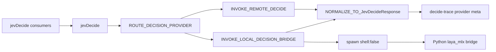

# Local JEV decision provider (refined)

Refinement source: [refine-plan subagent](ae53c12e-09ee-4a4e-9a94-88ee39acef5e) against [local_jev_provider_912cc32d.plan.md](/Users/fareed/.cursor/plans/local_jev_provider_912cc32d.plan.md) and sibling pattern [working/REQ-TIED_JEV_TOOL_SAFETY_GATING/PLAN.md](working/REQ-TIED_JEV_TOOL_SAFETY_GATING/PLAN.md).

**Parent (closed — do not reopen):** [REQ-TIED_JEV_DECISION_COPROCESSOR](tied/requirements/REQ-TIED_JEV_DECISION_COPROCESSOR.yaml) · [working/REQ-TIED_JEV_DECISION_COPROCESSOR/PLAN.md](working/REQ-TIED_JEV_DECISION_COPROCESSOR/PLAN.md)

**Child tokens (mint W0):** `REQ-TIED_JEV_LOCAL_DECISION_PROVIDER`, `ARCH-TIED_JEV_LOCAL_DECISION_PROVIDER`, `IMPL-TIED_JEV_LOCAL_DECISION_PROVIDER`

**Working folder:** `working/REQ-TIED_JEV_LOCAL_DECISION_PROVIDER/` (mirror plan at `PLAN.md` during build-plan W0)

**CITDP:** `tied/citdp/CITDP-REQ-TIED_JEV_LOCAL_DECISION_PROVIDER.yaml`

| Policy field | Value |
| --- | --- |
| `depth_tier` | **integrated** (subprocess, egress on `auto`+remote, harness interaction) |
| `profile_depth` | **integrated** |
| `gate_policy` | **mixed** |
| Adversarial inquiry | **Yes** — structural (argv/shell/path), pre-RED (env matrix), verification (fallback egress observability); artifacts under `working/REQ-TIED_JEV_LOCAL_DECISION_PROVIDER/adversarial-inquiry/` |

**Sponsor decisions (2026-09-30):**

- **`TIED_JEV_LOCAL_BRIDGE`:** **absolute path only** — reject relative paths; no repo-default resolver.
- **`auto` + `TIED_JEV_LOCAL_FALLBACK=remote`:** **env-only** — no second opt-in flag; **must** log egress in decide trace and agentstream preflight.

---

## Current-state gaps (verified in code)

```111:122:mcp-server/src/jev/client.ts
  if (!resolved.apiKey) {
    const result: JevDecideResult = { ok: false, skipped: true, reason: "no_credentials" };
    // ...
    return result;
  }
```

- **`jevDecide`** gates on API key before any HTTP call → **`local` / `auto` cannot work** until provider routing runs **before** this gate.
- **`resolveJevHarnessConfig`** sets `hasApiKey` from `JEV_API_KEY` only → local-only harness incorrectly treated as unavailable.

```20:26:mcp-server/src/jev/harness-config.ts
  const apiKey = env.JEV_API_KEY?.trim() ?? "";
  return {
    enabled,
    hasApiKey: apiKey.length > 0,
    blockWhenUnavailable: true,
```

**Fix:** introduce **`decisionBackendReady`** (remote key **or** validated local executable + absolute bridge + model id) and gate harness fail-closed on that signal while keeping `hasApiKey` for backward-compatible diagnostics.

All existing consumers stay on **`jevDecide`** ([harness-tool-guard.ts](mcp-server/src/jev/harness-tool-guard.ts), Blueprint C/D modules) — routing is centralized, not duplicated.

---

## Architecture



**Authority unchanged:** local/remote output is coprocessor input only; thresholds, checklist gates, TIED writes, and harness block/allow remain code-owned.

---

## Environment contract

| Variable | Default | Notes |
| --- | --- | --- |
| `TIED_JEV_DECISION_PROVIDER` | **`remote`** | `remote` \| `local` \| `auto`; invalid → `remote` + diagnostic |
| `TIED_JEV_LOCAL_EXECUTABLE` | **`python3`** | argv[0] only; **no shell** |
| `TIED_JEV_LOCAL_BRIDGE` | unset | **Required** for local attempt; **absolute path only** |
| `TIED_JEV_LOCAL_MODEL` | **`aac6fef/laya-mlx`** | passed in bridge request |
| `TIED_JEV_LOCAL_TIMEOUT_MS` | **`120000`** | cap in resolver (e.g. max 600000) |
| `TIED_JEV_LOCAL_MAX_OUTPUT_CHARS` | **`524288`** | stdout read cap |
| `TIED_JEV_LOCAL_FALLBACK` | **`skip`** | `remote` \| `skip` \| `error`; **`auto` only** |
| `JEV_LOCAL_MLX_SMOKE` | off | opt-in real MLX smoke (not CI) |

Remote vars unchanged: `JEV_API_KEY`, `JEV_API_BASE`, `JEV_MODEL`, trace/harness env.

| Provider | Remote HTTP | Local subprocess | On local failure |
| --- | --- | --- | --- |
| `remote` | if key | no | N/A |
| `local` | **never** | yes | typed skip/error |
| `auto` | only if fallback=`remote` | try first | apply fallback |

Extend skip/failure taxonomy (e.g. `decision_backend_unavailable`, `provider_misconfigured`, `local_timeout`); keep `no_credentials` for **remote** credential miss.

---

## Bridge JSON contract (v1)

- **Script:** [mcp-server/scripts/jev-local-laya-mlx-bridge.py](mcp-server/scripts/jev-local-laya-mlx-bridge.py) (new)
- **Fixtures:** `mcp-server/test/fixtures/jev-local-bridge/` (choice/score/noul; no domain hard-coding like `refund` in TS core)
- Stdin: `jev-local-bridge-request.v1` with `model`, `state`, `questions` mirroring [types.ts](mcp-server/src/jev/types.ts)
- Stdout: `jev-local-bridge-response.v1` with `ok` + `response` or structured `error_code`
- TS **`NORMALIZE_LOCAL_RESPONSE`:** validate schema + probabilities in \[0,1\]; unsupported question types → **typed failure**, not zero-fill nouls

**Security:** `shell: false`; argv `[executable, bridgePath]` only; state via existing **`redactState`**; timeout kill; bounded stdout/stderr in errors.

---

## IMPL sidecar blocks (before code)

`RESOLVE_LOCAL_PROVIDER_CONFIG`, `ASSESS_DECISION_BACKEND_READINESS`, `ROUTE_DECISION_PROVIDER`, `INVOKE_REMOTE_DECIDE` (extract from [client.ts](mcp-server/src/jev/client.ts)), `INVOKE_LOCAL_DECISION_BRIDGE`, `NORMALIZE_LOCAL_RESPONSE`, `HANDLE_LOCAL_FAILURE`, `EXTEND_HARNESS_BACKEND_SIGNAL`, `EXTEND_DECIDE_TRACE_PROVIDER_META` — all with [PROC-IMPL_PSEUDOCODE_TOKENS] comments linking child + parent tokens.

Vocab: RECORD **Local decision provider** section in [tied/vocab/decision-copilot.md](tied/vocab/decision-copilot.md) at W0.

---

## CITDP waves (build-plan executable)

### W0 — TIED-first

Mint child REQ/ARCH/IMPL + [semantic-tokens.yaml](tied/semantic-tokens.yaml); sidecar + **`pseudocode_validate`**; copy [agent-req-implementation-checklist.yaml](tied/docs/agent-req-implementation-checklist.yaml) to working tracker; **`tied_checklist_gate_validate`** `pre_implementation` with `depth_tier: integrated`.

### W1 — Provider router (TDD)

- **New:** [mcp-server/src/jev/decision-provider.ts](mcp-server/src/jev/decision-provider.ts)
- Refactor **`jevDecide`** provider-first; extend [types.ts](mcp-server/src/jev/types.ts); remote success shape stable
- **New:** `decision-provider.test.ts`; keep [jev.test.ts](mcp-server/src/jev/jev.test.ts) green

### W2 — Local subprocess (TDD)

- **New:** [mcp-server/src/jev/local-client.ts](mcp-server/src/jev/local-client.ts) with injected **`LocalProcessRunner`**
- **New:** `local-client.test.ts` — timeout, exit failure, stdout cap, malformed JSON, bad probabilities, fake Python contract

### W3 — Bridge + fixtures

Python bridge; golden fixtures; operator doc in IMPL (Python 3.11+, `laya_mlx`, Apple Silicon); smoke gated on `JEV_LOCAL_MLX_SMOKE=1` only

### W4 — Harness and agentstream

- [harness-config.ts](mcp-server/src/jev/harness-config.ts), [harness-tool-guard.ts](mcp-server/src/jev/harness-tool-guard.ts) → **`decisionBackendReady`**
- [jev-harness-preflight.ts](mcp-server/packages/agentstream/src/jev-harness-preflight.ts) — provider, bridge basename, fallback, backend ready; egress visible when fallback=remote
- [plan-skills-status.ts](mcp-server/src/jev/plan-skills-status.ts) / [plan-skills-readiness.ts](mcp-server/src/jev/plan-skills-readiness.ts) — `decision_provider`, `decision_backend_ready`
- [decide-trace.ts](mcp-server/src/jev/decide-trace.ts) — additive `context_meta`: `decision_provider`, `fallback_applied`
- Rebuild **mcp-server/dist** for dist gate consumers

### W5 — Verification and close-out

Regress harness, preflight, Blueprint C fail-open, remote mocks; `bun run lint:ts` / `tsc -b`; **`tied_validate_consistency`**; verification gate; optional `local-provider-benchmark.v1.json`; integrated adversarial inquiry; section in [docs/comparisons/jev-for-tied-improvement.md](docs/comparisons/jev-for-tied-improvement.md)

**Proposed satisfaction criteria (mint at W0):** SC-REMOTE-DEFAULT, SC-LOCAL-NO-EGRESS (no `fetch`), SC-AUTO-FALLBACK matrix, SC-BRIDGE-CONTRACT, SC-HARNESS-LOCAL, SC-C-FAIL-OPEN, SC-TRACE-META, SC-NO-CI-PYTHON, SC-TIED

---

## Remaining open question (non-blocking for W0–W2)

**laya_mlx Python API** (function name, probability dict shape) — implement bridge against IMPL contract + golden fixtures first; confirm real API in W3 smoke / sponsor doc.

---

## LEAP risks

| Risk | Mitigation |
| --- | --- |
| Central `jevDecide` behavior | Full consumer regression + TDD waves |
| Harness semantics drift | SC-HARNESS-LOCAL + existing D fail-closed matrix |
| Trace consumers | Additive `context_meta` only |
| Unknown laya_mlx shape | Fixture-first bridge; smoke optional |

---

## After approval

1. Replace [/Users/fareed/.cursor/plans/local_jev_provider_912cc32d.plan.md](/Users/fareed/.cursor/plans/local_jev_provider_912cc32d.plan.md) frontmatter todos (W0–W5) and body with this refined content.
2. Run **`build-plan`** on the updated plan to execute W0+.
