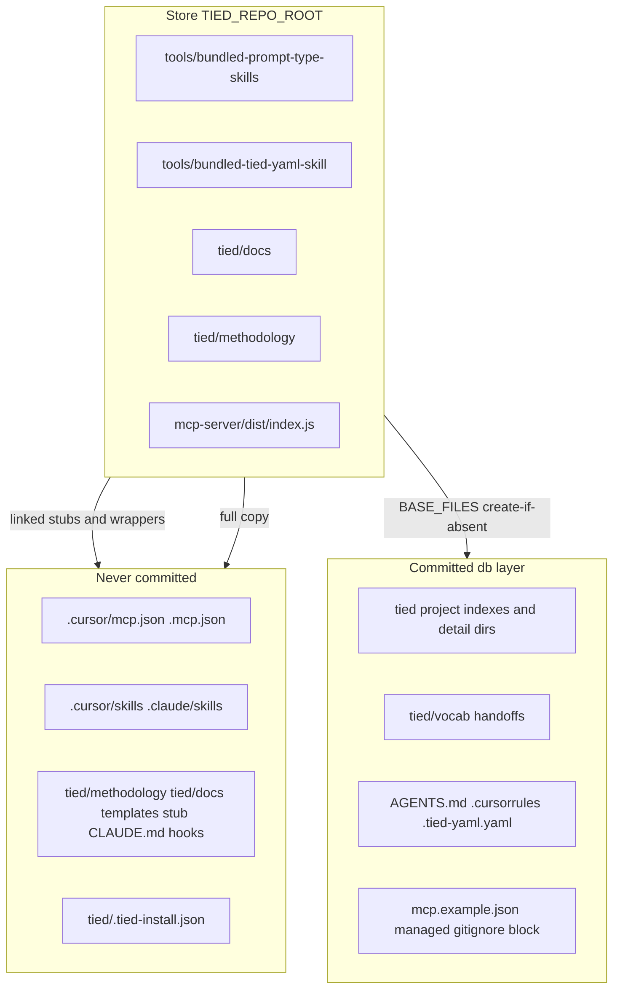
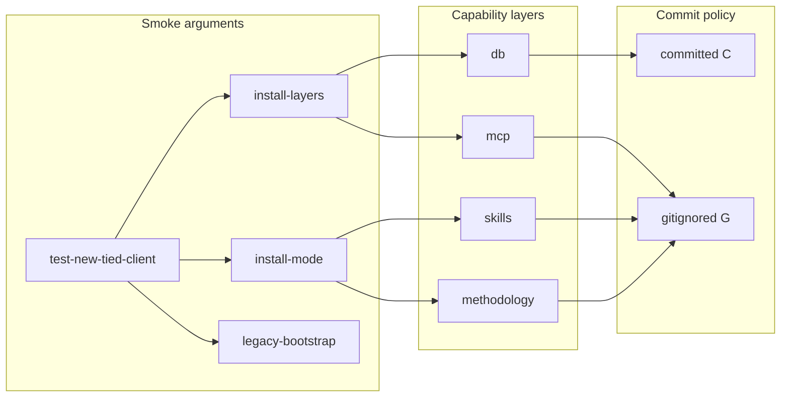

# Layered TIED Client Installer (refined)

**Refine pass:** 2026-10-02 · Source: [layered_tied_client_installer_9dbd1faa.plan.md](/Users/fareed/.cursor/plans/layered_tied_client_installer_9dbd1faa.plan.md)

## Refine outcomes (RESOLVE locked)

| Term | Meaning |
|------|---------|
| **Capability layer** | Independently invokable install slice: `db`, `mcp`, `skills`, `methodology`. |
| **Install mode** | `linked` (default): gitignored stubs + exec wrappers + bundle env. `full`: gitignored copies (offline). |
| **Legacy profile** | [`copy_files.sh`](copy_files.sh) → unchanged `bootstrapTied` behavior (materialize + commit-oriented layout). |
| **Store** | `TIED_REPO_ROOT` (installer repo or `--store`); baked into stubs/wrappers via existing [`patchTiedRepoRoot`](tools/bootstrap/lib/skills.mjs). |
| **No-MCP skill surface** | Local `SKILL.md` + file-resolvable docs + client `tied-cli.sh` over stdio ([`using-tied-without-mcp.md`](tied/docs/using-tied-without-mcp.md)). |

**Sponsor choice (this pass):** Disposable / [`new-tied-client.mjs`](tools/bootstrap/new-tied-client.mjs) factory uses **`tied-install` linked by default** in v1 (not legacy `copy_files.sh`). Escape hatch: `--legacy-bootstrap` or env `TIED_BOOTSTRAP_LEGACY=1` calling `copy_files.sh` for parity smoke and migration.

**Adversarial depth (plan-only):** CITDP draft uses `depth_tier: minimal` for refine/pre_implementation. **build-plan must re-evaluate** §7 triggers (filesystem install, MCP env mutation, git policy, subprocess store checks) — default **`integrated`** unless sponsor records waiver in CITDP.

**Related tokens (inherit / extend):** [REQ-TIED_SETUP], [REQ-TIED_METHODOLOGY_CLIENT_BOUNDARY], [REQ-TIED_CLIENT_REFRESH_PARITY], [REQ-TIED_NEW_CLIENT_ADHERENCE], [REQ-TIED_CLAUDE_HARNESS], [REQ-TIED_CLAUDE_SKILLS_REROOT], [ARCH-TIED_METHODOLOGY_CLIENT_BOUNDARY].

---

## Governing constraint (unchanged)

Skill surface must work when IDE MCP is absent or broken: harness-local `SKILL.md`, primary locator = **existing store file path**, `tied-cli.sh` wrappers at [AGENTS.md](AGENTS.md)-referenced paths, committed loader paths (`AGENTS.md`, `.cursorrules`) remain valid.

---

## Codebase gaps this plan closes

1. **Bootstrap MCP never sets `TIED_METHODOLOGY_BUNDLE_PATH`** — only [`yaml-loader.ts`](mcp-server/src/yaml-loader.ts) reads it at runtime ([`tools/bootstrap/lib/mcp-config.mjs`](tools/bootstrap/lib/mcp-config.mjs) has no bundle env today). **mcp layer must add it for `linked`.**
2. **[`verify.mjs`](tools/bootstrap/lib/verify.mjs) assumes local `tied/methodology/` and `tied/docs/`** — linked clients need [`verify-store.mjs`](tools/bootstrap/lib/verify-store.mjs) (bundle + store root + stub target stat).
3. **[`runClientRefreshParityGate`](tools/bootstrap/lib/client-refresh-parity.mjs) compares local methodology tree to store** — linked install must emit report entry `parity: not_applicable_linked` and skip exit 1 (explicit in REQ acceptance).
4. **G4 audit uses store `tied-cli.sh`, not client wrapper** ([`tied-new-client-audit.mjs`](scripts/lib/tied-new-client-audit.mjs) L92–94) — factory switch requires audit to resolve **`clientRoot/.cursor/skills/tied-yaml/scripts/tied-cli.sh`** and MCP JSON with bundle env.

---

## Layer / commit matrix

### Managed `.gitignore` block (db layer — enumerate in IMPL)

Marker-delimited idempotent block covering at minimum:

- `.cursor/mcp.json`, `.mcp.json`
- `.cursor/skills/`, `.claude/skills/`
- `tied/methodology/`, `tied/docs/`
- `templates/impl-essence-pseudocode-template.md`
- `CLAUDE.md`, `.cursor/hooks.json`, `.claude/hooks/`, `.claude/settings.json` (merge artifact — document “may contain local merges”)
- `tied/.tied-install.json`

Committed baseline remains: project `tied/*.yaml` indexes (create-if-absent), `tied/vocab/`, `tied/requirements|architecture-decisions|implementation-decisions/`, loaders, constitution example.

---

## CLI surface

| Entry | Role |
|-------|------|
| [`tied-install.sh`](tied-install.sh) (new) | Bash wrapper → built CLI or [`install-layers.mjs`](tools/bootstrap/install-layers.mjs) |
| `node mcp-server/packages/cli/dist/index.js install …` (new subcommand) | Same as [`bootstrap`](mcp-server/packages/cli/src/index.ts) dispatch pattern |
| [`copy_files.sh`](copy_files.sh) | **Unchanged** legacy profile |

**Flags (preserve parity with existing bootstrap where applicable):**

- Core: `--layers`, `--harness`, `--mode linked|full`, `--store`, `--methodology-bundle live|pinned`, `--refresh`, `--doctor`
- Reuse: [`parseParityCliFlags`](tools/bootstrap/lib/parity-cli-options.mjs), [`parseBootstrapToolFlags`](tools/bootstrap/lib/client-tool-use-bootstrap.mjs) (`--full-tools`, Jev/DAE/BBCE)
- Legacy bootstrap passthrough on install CLI: `--merge-vocab`, `--methodology-readonly`, `--install-methodology-hook` (map to methodology/db layers; `linked` applies hook/readonly only when `full` materializes `tied/methodology/` **or** document Unix readonly no-op for linked)
- Factory escape: `--legacy-bootstrap` → `copy_files.sh`

**Install manifest** — `tied/.tied-install.json` schema `tied-install.v1`: store, layers, mode, harness, bundle choice, TIED version, tool profile, timestamp.

---

## Operator smoke: [`scripts/build-commands.sh`](scripts/build-commands.sh) and `test-new-tied-client`

**Goal:** Make **`test-new-tied-client`** the primary way to exercise **combinations** of layered-install parameters (not only the default linked factory path).

### Current behavior

- [`make_new_tied_client`](scripts/build-commands.sh) → `new-tied-client.mjs --disposable` with `"$@"` passthrough.
- Factory bootstrap is **`tied-install` linked** unless `--legacy-bootstrap` / `TIED_BOOTSTRAP_LEGACY=1`.

### Planned `build-commands.sh` changes

| Change | Detail |
|--------|--------|
| **Passthrough install flags** | Extend [`parseNewTiedClientArgs`](tools/bootstrap/new-tied-client.mjs) to accept install-layer flags and forward them to the pipeline bootstrap argv (today pipeline hard-codes `--mode linked --harness cursor\|claude --store`). Proposed CLI names: `--install-mode`, `--install-layers`, `--install-harness`, `--methodology-bundle`, `--doctor-after` (run `tied-install --doctor` after pipeline success). |
| **Env mirrors** | Document and honor: `TIED_INSTALL_MODE`, `TIED_INSTALL_LAYERS`, `TIED_INSTALL_HARNESS`, `TIED_METHODOLOGY_BUNDLE` (override defaults when flags absent). Keep existing `TIED_BOOTSTRAP_LEGACY`, `TIED_REPO_ROOT`, `TIED_TEST_ROOT`, `TIED_SKIP_NEW_CLIENT_AUDIT`. |
| **Optional convenience aliases** | `test-new-tied-client-legacy` → `make_new_tied_client --legacy-bootstrap`; `test-new-tied-client-full` → `make_new_tied_client --install-mode full` (names TBD; avoid proliferating without sponsor OK). |
| **`how smoke` section** | Update [`_how_smoke`](scripts/build-commands.sh) text: default = linked `tied-install`; list new flags; point to resource matrix doc. |
| **`how install-matrix`** | New helper: print or open [`install-resource-matrix.md`](working/REQ-TIED_LAYERED_CLIENT_INSTALL/install-resource-matrix.md); later optionally regenerate table rows from `manifest.json` + `GITIGNORE_MANAGED_PATHS`. |
| **Windows parity** | [`scripts/test-new-tied-client.cmd`](scripts/test-new-tied-client.cmd) forwards the same flags to `new-tied-client.mjs`. |

### Resource visualization (table)

Canonical operator table: **[`working/REQ-TIED_LAYERED_CLIENT_INSTALL/install-resource-matrix.md`](install-resource-matrix.md)** — maps each **resource type** (committed vs gitignored), **capability layer**, and effect of **`test-new-tied-client` / `tied-install` arguments** (default linked, `--install-mode full`, `--legacy-bootstrap`, `--layers` subsets, factory skip flags).

**Acceptance (this slice):** Sponsor can run `source scripts/build-commands.sh && test-new-tied-client --install-mode full` and `test-new-tied-client --legacy-bootstrap` and predict which paths are **C** vs **G** using the matrix without reading implementation source.

---

## Implementation shape

### Refactor contract (avoid double maintenance)

1. Extract pure functions to [`tools/bootstrap/lib/layers/`](tools/bootstrap/lib/layers/): `db.mjs`, `mcp.mjs`, `skills.mjs`, `methodology.mjs`, `install-manifest.mjs`, `verify-store.mjs`.
2. [`install-layers.mjs`](tools/bootstrap/install-layers.mjs) orchestrates layer dispatch + manifest + verify/doctor.
3. **Do not rewrite [`bootstrapTied`](tools/bootstrap/lib/bootstrap.mjs) behavior in v1** — keep it as the legacy “all layers, committed materialization” path. Optional follow-on: thin `bootstrapTied` → internal `{ mode: 'legacy_committed' }` once layer functions are proven by tests.

### Layer behaviors (concise)

- **db.mjs** — [`manifest.json`](tools/bootstrap/manifest.json) `BASE_FILES`, project index create-if-absent, detail dir mkdir, [`writeClientVocabHandoffs`](tools/bootstrap/lib/vocab.mjs), constitution example, managed gitignore, `.cursor/mcp.example.json` / `.mcp.example.json` with placeholders.
- **mcp.mjs** — [`refreshTiedMcpJson`](tools/bootstrap/lib/mcp-config.mjs) per harness; **`linked` adds** `TIED_METHODOLOGY_BUNDLE_PATH` (live vs pinned corpus per [methodology-bundle README](mcp-server/methodology-bundle/README.md)) and **`TIED_STORE_ROOT`** (inert until optional store-resources slice).
- **skills.mjs** — `linked`: [`WRITE_SKILL_STUB`](tools/bootstrap/lib/layers/skills.mjs) (front-matter parity from [`PROMPT_TYPE_SKILL_DIRS`](tools/bootstrap/manifest.json)); always [`WRITE_CLI_WRAPPERS`](tools/bootstrap/lib/skills.mjs) for tied-yaml scripts; `full`: existing [`installTiedYamlSkill`](tools/bootstrap/lib/skills.mjs) / prompt-type / Claude installers.
- **methodology.mjs** — `linked`: redirect stubs for every [`DOCS_TO_COPY`](tools/bootstrap/manifest.json) entry + methodology vocab + sidecar template; `full`: current copy/overwrite paths from bootstrap (without re-running full bootstrap).
- **verify-store.mjs** — linked resolution table:

| Check | Linked resolution |
|-------|-------------------|
| `verifyInheritedDetailFiles` / fidelity / adversarial / feature-orchestration / pseudocode token refs | Methodology paths under **`bundlePath`**; doc paths via **stub → store stat** |
| Store reachability | Fail install if store missing skill bundles, docs, templates, `mcp-server/dist/index.js` |
| Parity gate | `not_applicable_linked` (no exit 1) |
| `--doctor` | No IDE MCP; wrappers run `yaml_index_list_tokens`; all stub primaries exist |

### Factory integration (v1 — sponsor selected)

Update [`new-tied-client-pipeline.mjs`](tools/bootstrap/lib/new-tied-client-pipeline.mjs):

- Default bootstrap entry: `tied-install.sh` (or CLI `install`) with `--mode linked --harness …` and `--store` = source root.
- [`run-tied-new-client-audit.mjs`](scripts/run-tied-new-client-audit.mjs) `--disposable` path uses same installer.
- Extend onboarding audit report with `install_profile: linked|legacy` and fix consistency CLI path to **client** wrapper.
- Document Windows: add `tied-install.cmd` mirroring [`copy_files.cmd`](copy_files.cmd) pattern.

---

## Tests (RED first)

Existing anchors to extend:

- [`bundled-methodology-read.test.ts`](mcp-server/src/bundled-methodology-read.test.ts)
- [`tied-cli-bundled-methodology-pilot.test.cjs`](mcp-server/test/tied-cli-bundled-methodology-pilot.test.cjs)
- [`client-refresh-parity.test.mjs`](tools/bootstrap/lib/client-refresh-parity.test.mjs)

**New gating cases:**

- No-MCP skill surface: remove/ break IDE MCP config; stubs + doc redirects readable; client `tied-cli.sh` read + project YAML write via stdio.
- Factory: disposable client created via **linked** install passes updated G4 audit + `--doctor`.
- `git status --porcelain --ignored` committed vs gitignored split ([`install-layers.test.ts`](mcp-server/src/e2e/install-layers.test.ts) e2e).
- Legacy escape: `--legacy-bootstrap` still matches current copy_files smoke expectations.
- **build-commands matrix:** composition test or shell spec that `test-new-tied-client --help` (or `how install-matrix`) documents flags listed in [`install-resource-matrix.md`](install-resource-matrix.md).

---

## TIED artifacts (first implementation slice)

| Artifact | Path |
|----------|------|
| REQ/ARCH/IMPL | `REQ-TIED_LAYERED_CLIENT_INSTALL` (+ pseudocode sidecar) via tied-yaml MCP |
| CITDP | [`tied/citdp/CITDP-REQ-TIED_LAYERED_CLIENT_INSTALL.yaml`](tied/citdp/CITDP-REQ-TIED_LAYERED_CLIENT_INSTALL.yaml) |
| Tracker | Copy header from [`agent-req-implementation-checklist.yaml`](tied/docs/agent-req-implementation-checklist.yaml) → [`working/REQ-TIED_LAYERED_CLIENT_INSTALL/agent-req-implementation-checklist.yaml`](working/REQ-TIED_LAYERED_CLIENT_INSTALL/agent-req-implementation-checklist.yaml) |
| Working plan | [`working/REQ-TIED_LAYERED_CLIENT_INSTALL/PLAN.md`](working/REQ-TIED_LAYERED_CLIENT_INSTALL/PLAN.md) sync on build-plan approval |
| Vocab RECORD | [`tied/vocab/tied-methodology.md`](tied/vocab/tied-methodology.md) + routing row |

**Acceptance criteria additions (REQ):**

- Factory default linked install with `--legacy-bootstrap` documented.
- G4 audit passes on linked disposable client without local committed methodology tree.
- MCP config from install includes `TIED_METHODOLOGY_BUNDLE_PATH` when `linked`.

**Optional deferred slice:** [REQ-TIED_MCP_STORE_RESOURCES] — read-only `tied://` store resources; stubs mention only as tertiary alternate.

---

## Docs close-out

- [`tools/bootstrap/README.md`](tools/bootstrap/README.md) — layer matrix, modes, factory default, legacy profile.
- [`tied/docs/client-development-index.md`](tied/docs/client-development-index.md), [`prompt-type-skills.md`](tied/docs/prompt-type-skills.md), [`using-tied-without-mcp.md`](tied/docs/using-tied-without-mcp.md), [`methodology-client-boundary-offline-runbook.md`](tied/docs/methodology-client-boundary-offline-runbook.md) (offline → `--mode full`).
- [AGENTS.md](AGENTS.md) §2 — modes; paths unchanged; MCP optional accelerator.

---

## Risks / costly choices

| Choice | Ladder | Mitigation |
|--------|--------|------------|
| Factory default **linked** | **Costly** — changes disposable smoke, G4 proof boundary, onboarding docs | `--legacy-bootstrap`; migration note for fleets expecting committed methodology |
| Default `--mode linked` for manual install | Reversible | `--mode full`, `--doctor` |
| Hand-edited MCP without bundle env | Costly at verify | Manifest + doctor + explicit MCP error text |
| Per-harness stub triggering | Costly UX | One live operator check per harness (evidence in working folder) |

---

## Execution handoff

On approval: run **`plan-new-feature`** (or **`build-plan`** if TIED records already exist) with this plan as invocation remainder — Refine → CITDP → RED tests → implement layers → `lint_yaml` on changed YAML → `tied_verify` → `tied_validate_consistency` → `tied_checklist_gate_validate` at `pre_implementation` before first code.

**Non-interactive assumptions:** Store = this repo checkout; optional MCP store-resources slice deferred; `TIED_BASE_PATH` confirmed via MCP before YAML writes.
