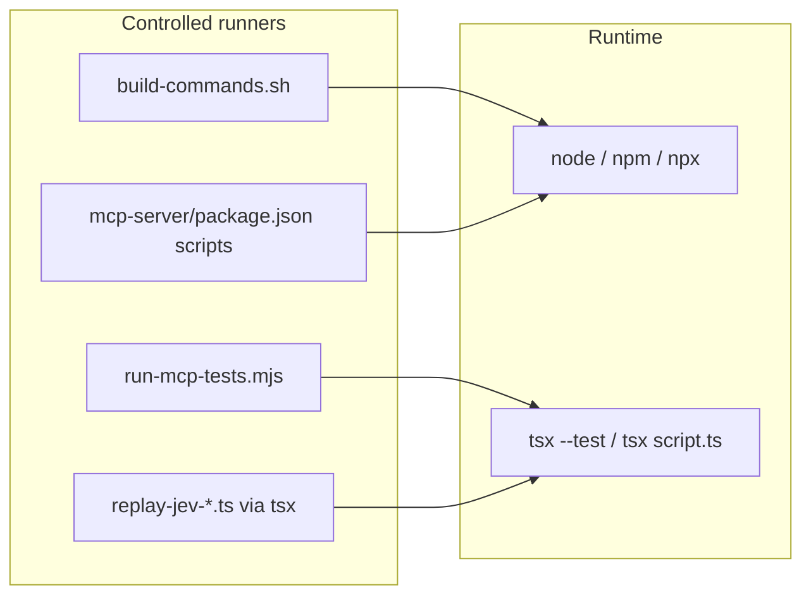

# Node-only TIED toolchain (refined plan)

**Traceability anchor:** [REQ-TIED_UNIFIED_TOOLCHAIN](/Users/fareed/Documents/dev/chatgpt/stdd/tied-project/requirements/REQ-TIED_UNIFIED_TOOLCHAIN.yaml) (Node canonical; Bun CI-optional is superseded for **process** entrypoints by this work). **New tokens (proposed):** `REQ-TIED_NODE_TOOLCHAIN_DEFAULT`, `ARCH-TIED_NODE_TOOLCHAIN_DEFAULT`, `IMPL-TIED_NODE_TOOLCHAIN_DEFAULT`.

**Linked plan iteration:** Sponsor refinement 2026-10-03 — *any use of `bun` in processes must convert to the safer Node default*; drop prior `TIED_TOOLCHAIN_RUNTIME=bun` opt-in design.

---

## Refine

### Sponsor terms resolved

| Topic | Decision |
| --- | --- |
| Runtime for **controlled runners** | **Node only** — `npm`, `node`, `npx` (and repo-local `tsx` via `npx tsx` where scripts today assume Bun to execute `.ts`) |
| Bun opt-in env var | **Rejected** — no `TIED_TOOLCHAIN_RUNTIME` or equivalent; local preference is satisfied by using Node/npm like CI and README |
| MCP stdio | Unchanged: **`node`** … `mcp-server/dist/index.js` ([`.cursor/mcp.json`](/Users/fareed/Documents/dev/chatgpt/stdd/.cursor/mcp.json)) |
| `plan-new-feature` skill | No runtime logic in [plan-new-feature/SKILL.md](/Users/fareed/Documents/dev/chatgpt/stdd/tools/bundled-prompt-type-skills/plan-new-feature/SKILL.md); drift is in **toolchain wrappers** and **process docs** |
| Historical evidence | **Frozen** — do not rewrite committed CITDP evidence blobs, quality-manifest stderr captures, or `.cursor/test-all-build-plan.log` that record past `bun` commands |
| Active templates & metrics | **Update** — REQ satisfaction metrics, checklist examples, and methodology process text that still tell agents to run `bun test` / `bunx tsc` |

### Non-goals

- Removing `bun.lock` or blocking developers from installing Bun personally (only **repository-defined processes** must not invoke it).
- Rewriting tool-safety **training corpus** strings that mention `bun test` as *example adversarial/benign shell text* unless a dedicated hygiene pass is scoped (optional follow-up; not required for build/test green).
- Changing Rust client projects’ `bun run lint:rust` where that is the client’s chosen runner (this repo’s **TypeScript** toolchain and TIED operator scripts are in scope).

### Consequence ladder

| Choice | Reversibility | Note |
| --- | --- | --- |
| Node-only `package.json` build | Reversible | Aligns with [mcp-server/README.md](/Users/fareed/Documents/dev/chatgpt/stdd/mcp-server/README.md) canonical `npm test` |
| `build-commands.sh` switch to npm | Reversible | Restores parity with README / CITDP evidence commands |
| Methodology doc edits in `tied-bundle/docs/` | Costly for clients | Source-repo change; clients refresh via `tied-install.sh` — document in CITDP blast radius |

**profile_depth:** `minimal` (tooling hygiene, no behavior change to MCP/agentstream semantics). **gate_policy:** `advisory` unless sponsor promotes to `integrated`.

---

## Plan (CITDP)

### Change definition

- **Current:** [mcp-server/package.json](/Users/fareed/Documents/dev/chatgpt/stdd/mcp-server/package.json) `build` uses `bun run --workspaces --if-present build`; [scripts/build-commands.sh](/Users/fareed/Documents/dev/chatgpt/stdd/scripts/build-commands.sh) uses `bun install` / `bun run` for `build-mcp`, `test-mcp`, `test-agentstream`, `verify-agentstream-parity`; [mcp-server/scripts/run-mcp-tests.mjs](/Users/fareed/Documents/dev/chatgpt/stdd/mcp-server/scripts/run-mcp-tests.mjs) spawns `bun run scripts/replay-jev-context-pruning.ts`; six `mcp-server/scripts/replay-jev-*.ts` files use `#!/usr/bin/env bun` and Bun-isms (`import.meta.dir`).
- **Desired:** Every **controlled** install/build/test/replay path uses Node/npm/npx/tsx only; docs and AGENTS checklists cite the same commands; static guard prevents reintroduction in canonical files.
- **Unchanged:** MCP protocol, `TIED_BASE_PATH`, `@tied/*` package boundaries, full test graph (still via `npm test` → `run-mcp-tests.mjs` + tsx).

### Executable inventory (must convert)

| Location | Current Bun usage | Target |
| --- | --- | --- |
| [mcp-server/package.json](/Users/fareed/Documents/dev/chatgpt/stdd/mcp-server/package.json) | `bun run --workspaces --if-present build` | `npm run build --workspaces --if-present` (after `tsc`) |
| [scripts/build-commands.sh](/Users/fareed/Documents/dev/chatgpt/stdd/scripts/build-commands.sh) | `bun install`, `bun run build/test`, filter builds | `npm install`, `npm run build`, `npm run test`, `npm run build --workspace=…` |
| [mcp-server/scripts/run-mcp-tests.mjs](/Users/fareed/Documents/dev/chatgpt/stdd/mcp-server/scripts/run-mcp-tests.mjs) | `run("bun", ["run", "scripts/replay-…"])` | `node` + `tsx` or small `.mjs` wrapper per replay script |
| [mcp-server/scripts/replay-jev-context-pruning.ts](/Users/fareed/Documents/dev/chatgpt/stdd/mcp-server/scripts/replay-jev-context-pruning.ts) (+ 5 siblings) | Bun shebang, `import.meta.dir` | Node shebang or invoked only via `npx tsx`; `fileURLToPath(import.meta.url)` for paths |
| [AGENTS.md](/Users/fareed/Documents/dev/chatgpt/stdd/AGENTS.md) | `bunx tsc`, `bun run lint:ts` | `npx tsc -b`, `npm run lint:ts` (or project-standard npm script) |
| [tied-bundle/docs/processes.md](/Users/fareed/Documents/dev/chatgpt/stdd/tied-bundle/docs/processes.md), [ai-principles.md](/Users/fareed/Documents/dev/chatgpt/stdd/tied-bundle/docs/ai-principles.md), [agent-req-implementation-checklist.md](/Users/fareed/Documents/dev/chatgpt/stdd/tied-bundle/docs/agent-req-implementation-checklist.md) | Bun in PROC-TIED_DEV_CYCLE lint examples | Node/npm equivalents |
| Active [tied-project/requirements/REQ-TIED_JEV_*.yaml](/Users/fareed/Documents/dev/chatgpt/stdd/tied-project/requirements/) metrics citing `bun test` | Prescriptive verification | LEAP metrics to `npm test` / `npx tsx --test <path>` patterns |

### Out of scope (explicit)

- Mass-editing archived `tied-project/citdp/*.yaml` verification notes that record historical `bunx tsc` passes.
- [CHANGELOG.md](/Users/fareed/Documents/dev/chatgpt/stdd/CHANGELOG.md) historical bullets mentioning Bun (add new entry when feature lands).
- Fixture JSONL lines that embed `bun test` as **literal evidence strings** for Jev/tool-safety tests (behavioral tests; optional later).

### Architecture / implementation sketch

**IMPL pseudo-code blocks (to author):** `NODE_ONLY_WORKSPACE_BUILD`, `NODE_ONLY_MCP_TEST_RUNNER`, `NODE_ONLY_SHELL_ALIASES`, `REPLAY_SCRIPT_NODE_ENTRY`.

### Test strategy

1. **RED:** Contract test (e.g. under `mcp-server/src/` or `scripts/`) fails if `bun install`, `bun run`, `bun test`, or `#!/usr/bin/env bun` appear in: `mcp-server/package.json`, `scripts/build-commands.sh`, `mcp-server/scripts/run-mcp-tests.mjs`, `mcp-server/scripts/replay-jev-*.ts`.
2. **GREEN:** Conversions above; replays runnable with `npx tsx`.
3. **Integration:** `cd mcp-server && npm install && npm run build && npm test` with Bun not required on `PATH` (verify with `command -v bun` failing in subshell or `PATH` strip in CI doc).
4. **Typecheck:** `cd mcp-server && npx tsc -b` ([PROC-TS_CHECK]).
5. **TIED:** `lint_yaml` on changed project YAML; `tied_validate_consistency`; token audit.

### Risks

| ID | Risk | Mitigation |
| --- | --- | --- |
| R1 | `npm run build --workspaces` behavior differs from Bun on Windows | Run Windows smoke path from [tools/bootstrap/README.md](/Users/fareed/Documents/dev/chatgpt/stdd/tools/bootstrap/README.md) if available |
| R2 | Replay scripts break after shedding Bun APIs | Single shared `scriptDir` helper; one integration test invoking shortest replay with `--help` or dry flag |
| R3 | Agents still read stale `bun test` in old REQ metrics | Update **active** REQ detail metrics in same work item; leave archived CITDP notes |

### Working artifacts (on implement)

- Copy checklist tracker to `tied-project/working/REQ-TIED_NODE_TOOLCHAIN_DEFAULT/` (or chosen token folder).
- CITDP: `tied-project/citdp/CITDP-REQ-TIED_NODE_TOOLCHAIN_DEFAULT.yaml`.
- PLAN.md symlink or copy from this file into working folder per [working-artifact-placement](/Users/fareed/Documents/dev/chatgpt/stdd/tied-bundle/docs/working-artifact-placement.md).

---

## Implement (outline — no code in refine-plan)

**Order:** TIED stack (REQ/ARCH/IMPL + pseudo-code validate) → RED contract test → GREEN conversions → doc/REQ metric LEAP → verification gate.

1. Create tokens + sidecar pseudo-code; register in [tied-project/semantic-tokens.yaml](/Users/fareed/Documents/dev/chatgpt/stdd/tied-project/semantic-tokens.yaml).
2. Change [mcp-server/package.json](/Users/fareed/Documents/dev/chatgpt/stdd/mcp-server/package.json) build script; confirm workspace packages still expose `build`/`test` via npm.
3. Refactor [scripts/build-commands.sh](/Users/fareed/Documents/dev/chatgpt/stdd/scripts/build-commands.sh) and `_how_*` help text (remove Bun from prerequisites line ~538).
4. Refactor [mcp-server/scripts/run-mcp-tests.mjs](/Users/fareed/Documents/dev/chatgpt/stdd/mcp-server/scripts/run-mcp-tests.mjs) and all [mcp-server/scripts/replay-jev-*.ts](/Users/fareed/Documents/dev/chatgpt/stdd/mcp-server/scripts/) for Node/tsx.
5. Update [AGENTS.md](/Users/fareed/Documents/dev/chatgpt/stdd/AGENTS.md) and methodology docs under [tied-bundle/docs/](/Users/fareed/Documents/dev/chatgpt/stdd/tied-bundle/docs/) for TypeScript lint commands.
6. LEAP active Jev REQ metrics from `bun test` to npm/tsx phrasing (index + detail under `tied-project/requirements/`).
7. Add contract test; run full `npm test`; `npx tsc -b`; validate TIED YAML; close-out.

**Forbidden during implement:** Introducing new Bun invocations; adding Bun opt-in env vars; editing frozen evidence under `tied-project/working/*/evidence/quality-manifest/` for cosmetic Bun removal.

---

## Gate validation (refine-plan)

| Phase | Action |
| --- | --- |
| `pre_implementation` | After TIED drafts + this refined PLAN committed to working folder; advisory gate with Tracker + CITDP when implement starts |
| `verification` | Evidence: `npm test --prefix mcp-server` exit 0; contract test pass; optional manifest row in request evidence envelope |
| Adversarial inquiry | **not_applicable** at `minimal` depth unless sponsor upgrades depth |

---

## Vocabulary (RECORD on implement)

| Preferred | Avoid |
| --- | --- |
| **Node-only controlled runner** | Bun as default install/test |
| **canonical full suite** | `bun test` for mcp-server |
| TypeScript check via **`npx tsc -b`** | **`bunx tsc`** in new process docs |

PRELOAD target: [tied-project/vocab/tied-methodology.md](/Users/fareed/Documents/dev/chatgpt/stdd/tied-project/vocab/tied-methodology.md) (extend unified toolchain row).

---

## Success criteria

1. Zero `bun` / `bunx` invocations in: `mcp-server/package.json` scripts, `scripts/build-commands.sh`, `mcp-server/scripts/run-mcp-tests.mjs`, `mcp-server/scripts/replay-jev-*.ts` shebangs and spawn paths.
2. `cd mcp-server && npm test` passes on a machine where Bun is not used to run those steps.
3. AGENTS.md and tied-bundle process docs tell agents **Node/npm/npx** for TypeScript lint in this repo.
4. New REQ/ARCH/IMPL chain validated with `tied_validate_consistency`.

**Next prompt type after plan accept:** `build-plan` with remainder pointing at this PLAN and working folder `REQ-TIED_NODE_TOOLCHAIN_DEFAULT`.
