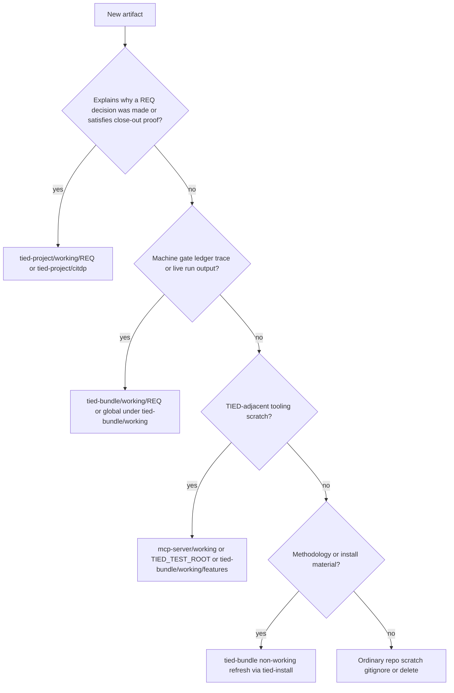

# PLAN — Working artifact placement guide (`tied-project/working/` vs `tied-bundle/working/`)

**Prompt type:** refine-plan (2026-10-03) → **Implement via `/build-plan`**; close-out via `plan-close-out`.
**Proposed tokens:** [REQ-TIED_WORKING_ARTIFACT_PLACEMENT] · [ARCH-TIED_WORKING_ARTIFACT_PLACEMENT]
**Related / amends (docs only):** [REQ-TIED_TWO_FOLDER_LAYOUT] · [ARCH-TIED_TWO_FOLDER_LAYOUT] · [IMPL-TIED_TWO_FOLDER_LAYOUT] (normative classifier reference; no code change)
**Date:** 2026-10-03. **Status:** Refined — documentation-only; ready for sponsor-approved `build-plan`.
**Costly choices (§8):** none new — inherits two-folder **committed vs local working split** from [REQ-TIED_TWO_FOLDER_LAYOUT](tied-project/working/REQ-TIED_TWO_FOLDER_LAYOUT/PLAN.md) §2(a); this REQ closes the **human-readable policy** gap only.

---

## 1. Problem

After [REQ-TIED_TWO_FOLDER_LAYOUT](tied-project/requirements/REQ-TIED_TWO_FOLDER_LAYOUT.yaml), agents and sponsors lack a **single readable policy** for:

- **Ephemeral** artifacts (disposable; not worth archiving)
- **Process evidence** (preserve development rationale in git)
- How that maps to **`tied-project/`** (committed) vs **`tied-bundle/`** (local methodology materialization)
- **TIED-adjacent tooling** scratch (MCP cwd, factory disposable clients, live benchmarks)

The **mechanism already exists** in [`mcp-server/src/working-root.ts`](mcp-server/src/working-root.ts) (`classifyWorkingRelativePath`, `resolveWorkingPath`); the gap is **normative documentation, vocabulary, and cross-doc path examples**—not new routing logic.

---

## 2. Refine — RESOLVE / RECORD

PRELOAD: [tied-project/vocab/tied-methodology.md](tied-project/vocab/tied-methodology.md) (layout rows), [tied-project/working/REQ-TIED_TWO_FOLDER_LAYOUT/PLAN.md](tied-project/working/REQ-TIED_TWO_FOLDER_LAYOUT/PLAN.md) §3.1 committed/local lists.

**Sponsor terms → canonical terms**

| Sponsor term | Canonical term | Storage |
|--------------|----------------|---------|
| temporary / not worth archiving | **ephemeral artifact** or **disposable run output** | Local working, tooling scratch, or OS temp; never commit |
| evidence for TIED processes | **process evidence facet** (workflow/proof facet in the traceability graph) | Committed under **`tied-project/working/{REQ}/`** or promoted **`tied-project/citdp/`** |
| working files | Split: **committed working root** vs **local working root** | `tied-project/working/` vs `tied-bundle/working/` |
| tied-project vs tied-bundle | **TIED project root** vs **TIED bundle root** | [REQ-TIED_TWO_FOLDER_LAYOUT] two-folder invariant |

**Terms to RECORD in `tied-project/vocab/tied-methodology.md` (Preferred terms + naming bridge):**

- **committed working root** — `tied-project/working/`; nothing under `tied-project/` gitignored
- **local working root** — `tied-bundle/working/`; gitignored in clients via whole `tied-bundle/` line
- **ephemeral artifact** — safe to delete; no audit value if lost
- **process evidence facet** — committed working artifacts that explain *why* (PLAN, envelope, slug evidence md, handoffs)
- **tooling scratch root** — paths outside per-REQ working but owned by TIED tooling (table §4)

**Residual ambiguity — agent defaults (sponsor may override in build):**

| # | Ambiguity | Resolution |
|---|-----------|------------|
| (a) | Large JSON under `tied-project/working/` (qualification reports, claims-review runs) | **Committed** when the file is an agreed regression fixture or published pilot artifact referenced by envelope/CITDP; **local** when one-off tool output reproducible from tests |
| (b) | `tied-project/working/evaluation/`, cross-REQ corpora | **Committed** when charter/corpus defines reusable evaluation policy; not a substitute for per-REQ envelope |
| (c) | `evidence/quality-manifest/*.stdout.txt` | Default **ephemeral**; commit only if envelope lists path as blocking proof (prefer summary md + manifest json) |
| (d) | Store repo legacy `.gitignore` `!working/...` committed gate trees | **Legacy debt** — guide states *new* artifacts follow classifier; **no bulk migration** in this REQ (out of scope) |
| (e) | Doc examples still say `working/{REQ}/` without `tied-project/` | **In scope:** fix [request-evidence-envelope.md](tied-bundle/docs/request-evidence-envelope.md) + new guide; **out of scope:** repo-wide mechanical rewrite of all 48+ historical doc references |

VALIDATE status: pending at `traceable-commit`.

---

## 3. Design — retention tiers and folder contracts

### 3.1 Four retention tiers

| Tier | Intent | Typical location | Git (client) |
|------|--------|------------------|--------------|
| **Canonical traceability** | Source of truth for obligations | `tied-project/requirements.yaml`, detail dirs, `tied-project/citdp/CITDP-*.yaml` after close-out | Always commit |
| **Committed process evidence** | Human-auditable rationale and close-out facets | `tied-project/working/{REQ-TOKEN}/` | Commit |
| **Local working evidence** | Regenerable machine proof; high volume | `tied-bundle/working/{REQ-TOKEN}/`, globals under `tied-bundle/working/` | Ignored |
| **Ephemeral / disposable** | Throwaway runs | Tooling roots (§3.4); `*-CLIENT-*`; live `*-live.v1.json` | Never commit |

**Rule of thumb:** If a future reviewer must answer *why we accepted this gate, scope, or costly choice* without re-running tools → **committed process evidence** or **citdp**.

### 3.2 Committed per-REQ contract (`tied-project/working/{REQ-TOKEN}/`)

Align with [REQ-TIED_TWO_FOLDER_LAYOUT PLAN](tied-project/working/REQ-TIED_TWO_FOLDER_LAYOUT/PLAN.md) §3.1:

- **Planning / tracking:** `PLAN.md`, `checklist-tracker.yaml`, draft `CITDP-*.yaml` (promote to `tied-project/citdp/` at `persist-citdp-record`)
- **Evidence index:** `evidence/request-evidence-envelope.v1.json`
- **Checklist slug summaries:** `evidence/*-evidence.md`
- **Handoffs:** `handoffs/{phase}.yaml` (additive; does not replace envelope)
- **Close-out manifests** when they document verification rationale (`evidence/verification-evidence-manifest.v1.json`, curated quality-manifest entries)

**Envelope path rule:** Paths inside the envelope are **relative to repository project root** and should match layout resolution (`workingPathRelativeToProject` / committed prefix `tied-project/working/...` in two-folder clients).

### 3.3 Local per-REQ contract (`tied-bundle/working/{REQ-TOKEN}/`)

Normative classifier — keep guide table **identical** to code:

| Rule | Patterns |
|------|----------|
| Prefixes | `gates/`, `gate-`, `adversarial-inquiry/`, `adherence/`, `jev/`, `pseudocode-analysis/` |
| Ledger | `*-ledger.jsonl`, `**/ledger.jsonl` |
| Disposable clients | `*-CLIENT-*` anywhere under relative path |
| Team extension | `working.local_patterns` in `tied-project/config.yaml` (defaults remain in code) |

Reference: [`LOCAL_WORKING_PREFIXES`](mcp-server/src/working-root.ts) and [`classifyWorkingRelativePath`](mcp-server/src/working-root.ts).

### 3.4 TIED-adjacent tooling scratch

| Path / convention | Role |
|-------------------|------|
| `mcp-server/working/` | MCP server CWD gate scratch; regenerate per run |
| `TIED_TEST_ROOT/<unix-seconds>/` | Disposable TIED client (factory smoke) |
| `tied-bundle/working/*-CLIENT-*/` | Cohort / mini-project trees during development |
| `tied-bundle/working/features/` | FEAT dev scratch (TIED source store) |
| `tied-bundle/working/**/context-pruning-benchmark-live.v1.json` | Live benchmark output |
| Repo-root `working/` | Undivided layout fallback only — migrate with `tied-install --migrate-layout` |

**Close-out:** [PROC-GITIGNORE_CLOSE_OUT](tied-bundle/docs/processes.md) classifies strays (ignore / track / delete); not a placement policy.

### 3.5 Store (TIED source repo) exception

- **`tied-bundle/`** committed as methodology corpus; only **`tied-bundle/working/`** and **`tied-bundle/install.json`** stay ignored.
- Process evidence rules unchanged: **`tied-project/working/`** for committed rationale.

### 3.6 What not to do

- Do not commit client **`tied-bundle/`** methodology copies ([PROC-TIED_METHODOLOGY_READONLY](tied-bundle/docs/processes.md)).
- Do not park high-volume gate JSON under **`tied-project/working/`** to satisfy CI (violates reviewability invariant).
- Do not copy another REQ’s checklist **execution_evidence** as proof ([checklist template hygiene](tied-bundle/docs/agent-req-implementation-checklist.yaml)).

---

## 4. TIED tracking

### 4.1 REQ satisfaction criteria (draft)

| ID | Criterion |
|----|-----------|
| SC-WAP-GUIDE | `tied-bundle/docs/working-artifact-placement.md` exists and covers tiers, both working roots, tooling scratch, gray zones §2(a–c) |
| SC-WAP-PROC | `[PROC-WORKING_ARTIFACT_PLACEMENT]` registered in `processes.md` with when/procedure/cross-refs |
| SC-WAP-VOCAB | committed/local working root + ephemeral + process evidence facet recorded in `tied-project/vocab/tied-methodology.md` |
| SC-WAP-CLASSIFIER | Guide local patterns match `LOCAL_WORKING_PREFIXES` in `working-root.ts` (no second competing table) |
| SC-WAP-INDEX | Linked from `client-development-index.md` (Quick reads or Scenario row) and `tied-project/vocab/routing.md` keywords |
| SC-WAP-ENVELOPE-DOC | `request-evidence-envelope.md` examples use `tied-project/working/{REQ}/...` (layout-aware) |

**ARCH** `ARCH-TIED_WORKING_ARTIFACT_PLACEMENT`: single canonical guide + PROC; defers behavior to [ARCH-TIED_TWO_FOLDER_LAYOUT](tied-project/architecture-decisions/ARCH-TIED_TWO_FOLDER_LAYOUT.yaml) / `IMPL-TIED_TWO_FOLDER_LAYOUT`.

**IMPL:** Omit new IMPL token; trace implementation obligation to existing **`RESOLVE_WORKING_ROOT`** / **`classifyWorkingRelativePath`** blocks in `IMPL-TIED_TWO_FOLDER_LAYOUT` pseudo-code sidecar.

### 4.2 Working folder for this REQ

- `tied-project/working/REQ-TIED_WORKING_ARTIFACT_PLACEMENT/PLAN.md` (this document, copied at build start)
- `tied-project/working/REQ-TIED_WORKING_ARTIFACT_PLACEMENT/checklist-tracker.yaml`
- `tied-project/working/REQ-TIED_WORKING_ARTIFACT_PLACEMENT/evidence/` (slug summaries + envelope during build)

---

## 5. CITDP analysis

- **Change class:** documentation / operator guidance
- **Size:** **S** (no runtime behavior)
- **profile_depth / depth_tier:** **`minimal`** — no persistence or auth behavior change; external input limited to edited markdown/YAML. **No integrated adversarial inquiry** unless sponsor elevates (not recommended).
- **gate_policy:** advisory at `pre_implementation`; standard checklist at `verification-gate` / `traceable-commit` for doc deliverables
- **Impact map:** `tied-bundle/docs/working-artifact-placement.md` (new), `processes.md`, `request-evidence-envelope.md`, `client-development-index.md`, `agent-req-implementation-checklist.md` (short pointer), `tied-project/vocab/tied-methodology.md`, `tied-project/vocab/routing.md`, `AGENTS.md` (one paragraph), `semantic-tokens.yaml`, REQ/ARCH detail YAML, CITDP persist at close-out
- **Risks and mitigations:**
  - R1 Guide diverges from classifier → SC-WAP-CLASSIFIER + cite code constants in guide
  - R2 Agents keep using legacy `working/` paths → envelope doc fix + routing keywords + AGENTS pointer
  - R3 Store legacy committed gates confuse readers → gray-zone §2(d) + explicit “new artifacts only”
  - R4 Methodology doc edit in store vs client → edit store `tied-bundle/docs/`; clients refresh via `tied-install`
- **Consequence ladder:**
  - **Reversible:** PROC name spelling; index placement (Quick reads vs Core seven adjacency); whether AGENTS gets a full subsection vs one paragraph
  - **Costly:** none (does not change classifier or gitignore policy)

**Test strategy** ([PROC-TEST_STRATEGY]) — documentation-only waiver (cf. [CITDP-REQ-TIED_SETUP-METHODOLOGY_MIGRATION](tied-project/citdp/CITDP-REQ-TIED_SETUP-METHODOLOGY_MIGRATION.yaml)):

- **Manual / review:** Sponsor read-through of guide decision flow
- **Automated (light):** `tied_validate_consistency` after token YAML; `lint_yaml` on touched YAML; optional grep test that new guide contains `tied-project/working` and `LOCAL_WORKING_PREFIXES` or equivalent table
- **No RED unit tests** unless a contract test is added later (out of scope)

---

## 6. Deliverables (files)

1. [tied-bundle/docs/working-artifact-placement.md](tied-bundle/docs/working-artifact-placement.md) — canonical guide
2. [tied-bundle/docs/processes.md](tied-bundle/docs/processes.md) — `[PROC-WORKING_ARTIFACT_PLACEMENT]`
3. [tied-project/vocab/tied-methodology.md](tied-project/vocab/tied-methodology.md) — terms + fix stale `tied/` paths in naming bridge (e.g. TIED project root rows)
4. [tied-bundle/docs/request-evidence-envelope.md](tied-bundle/docs/request-evidence-envelope.md) — layout-aware examples
5. [tied-bundle/docs/client-development-index.md](tied-bundle/docs/client-development-index.md) — link
6. [tied-project/vocab/routing.md](tied-project/vocab/routing.md) — keyword row
7. [AGENTS.md](AGENTS.md) — pointer (adversarial-inquiry / working split paragraph)
8. `tied-project/requirements/REQ-TIED_WORKING_ARTIFACT_PLACEMENT.yaml`, `tied-project/architecture-decisions/ARCH-TIED_WORKING_ARTIFACT_PLACEMENT.yaml`, indexes + `semantic-tokens.yaml`

**Explicitly out of scope:** enforcement lint for mis-placed files; gitignore collapse; migrating historical store `!working/` exceptions; repo-wide stale `working/` string replace in all docs.

---

## 7. Implement outline (`build-plan`)

Documentation-only checklist path — skip RED/unit/composition/E2E slugs; complete:

| Phase | Steps |
|-------|--------|
| 0 | `tied_config_get_base_path`; copy tracker template; CITDP draft under working |
| 1 | MCP: REQ/ARCH detail + index rows + semantic tokens |
| 2 | Write guide + PROC + vocab + routing + index links |
| 3 | Patch envelope doc examples; AGENTS pointer |
| 4 | `lint_yaml`; `tied_validate_consistency`; envelope for this REQ; `verification-gate` / `traceable-commit` evidence md slugs |
| 5 | Persist `tied-project/citdp/CITDP-REQ-TIED_WORKING_ARTIFACT_PLACEMENT.yaml`; `plan-close-out` |

**Gate note:** In plan mode, `pre_implementation` gate not run here; **`build-plan`** must refresh tracker + CITDP and call `tied_checklist_gate_validate` before edits.

---

## 8. Success criteria (close-out)

- Sponsor can read **one doc** and decide commit vs ignore vs delete for a new artifact class.
- PRELOAD via **routing** hits the guide for working / evidence / ephemeral tasks.
- Terminology matches **`working-root.ts`** classifier (no competing tables).
- Two-folder invariant preserved: **rationale in `tied-project/`**, **regenerable bulk in `tied-bundle/working/`**.
