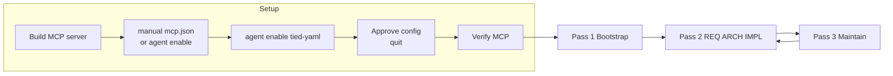

# Adding the TIED MCP to a Project and Invoking It in Several Passes

This document describes the **MCP-first** process to establish and maintain REQ (requirements), ARCH (architecture decisions), and IMPL (implementation decisions) in a project using the TIED YAML Index MCP server. It is intended for developers and AI agents who are setting up TIED in a project and want to use the MCP server across multiple, ordered passes.

**Related**: [PROC-YAML_DB_OPERATIONS], [ARCH-TIED_STRUCTURE]

---

## 1. Purpose and audience

This guide explains how to add the TIED MCP server to a development project and how to invoke it in **several passes** so that requirements, architecture, and implementation decisions are created and maintained with full traceability. The workflow is MCP-first: the primary way to create and query REQ/ARCH/IMPL is via MCP tools and resources, with optional use of scripts (e.g. `copy_files.sh`) for bootstrap.

**Audience**: Developers or AI agents configuring TIED in a project and using the MCP server to establish and maintain the REQ → ARCH → IMPL chain.

---

## 2. Prerequisites

- **Node.js 18+** (required to run the MCP server).
- **Target project** with a chosen workspace root (the project that will have a `tied/` directory).
- **Cursor** (or another MCP client) for the configuration examples that use `.cursor/mcp.json`.

---

## 3. Adding the TIED MCP to a project (one-time)

### 3.1 Build the server

Build the MCP server **in the central TIED repository** (single shared server path):

```bash
cd /path/to/tied-repository/mcp-server
npm install
npm run build
```

The server binary lives at `/path/to/tied-repository/mcp-server/dist/index.js` and is referenced via MCP configuration.

### 3.2 Configure MCP in the project

In your **development project** (the project that has or will have a `tied/` directory), add or edit the MCP config. For Cursor, this is typically `.cursor/mcp.json` in the project root (or Cursor Settings → MCP with the project as workspace).

- **command**: `"node"`
- **args**: Absolute path to the built server in your TIED clone, e.g. `"/path/to/tied-repository/mcp-server/dist/index.js"`
- **env.TIED_BASE_PATH**: Your project’s `tied/` directory — use an absolute path (e.g. `/path/to/your/project/tied`) or a path relative to the workspace root (e.g. `tied` or `./tied`)

Example:

```json
{
  "mcpServers": {
    "tied-yaml": {
      "type": "stdio",
      "disabled": false,
      "command": "node",
      "args": ["/path/to/tied-repository/mcp-server/dist/index.js"],
      "env": {
        "TIED_BASE_PATH": "/path/to/your/project/tied"
      }
    }
  }
}
```

Path resolution: Path parameters on MCP tools are resolved by the Node process. Absolute paths are used as-is; relative paths are resolved relative to the process current working directory (usually the workspace root). `TIED_BASE_PATH` is also cwd-relative unless you set it to an absolute path. See [mcp-server/README.md](../../mcp-server/README.md) for details.

**`copy_files.sh` does not create or modify `.cursor/mcp.json`.** It installs `tied/` and `.cursor/skills/tied-yaml/` (including `tied-cli.sh`), from the TIED repo’s `.cursor/skills/tied-yaml` when present, otherwise from **`tools/bundled-tied-yaml-skill/`** in the TIED source tree. You must add or edit the **`tied-yaml`** MCP entry yourself (this section’s JSON example), or use **`agent enable tied-yaml`** after creating `.cursor/mcp.json`. For **terminal-only** automation, set **`TIED_MCP_BIN`** to the built server’s **`dist/index.js`**, **`TIED_BASE_PATH`** to your project’s **`tied/`**, and run **`tied-cli.sh`** from the installed skill (see **`.cursor/skills/tied-yaml/SKILL.md`**); the env var alone is not a substitute for **`tied-cli.sh`** and Node.

**Safety note (multi-repo risk):** If you have multiple TIED-enabled repos on disk, it is easy to accidentally point `env.TIED_BASE_PATH` at the *wrong* repo’s `tied/` directory. Before any write, call `tied_config_get_base_path` and confirm the reported base path is **under the current workspace root** and is the `tied/` you intend to mutate. If it is not, **STOP** and fix **`.cursor/mcp.json`**: set `env.TIED_BASE_PATH` to an absolute path to **this** workspace’s **`tied/`**, and ensure **`args`** points at your built **`mcp-server/dist/index.js`** (typically in your TIED clone). Re-running **`copy_files.sh`** does **not** repair MCP config.

### 3.3 Enable the server in Cursor (Cursor Agent CLI)

After **`copy_files.sh`** (or manual edits), `.cursor/mcp.json` may already list `tied-yaml` with paths to the built server and your project’s `tied/`. To **enable** that server in Cursor for the client workspace:

1. `cd` to your **development project** root (the directory that contains `tied/` and `.cursor/mcp.json`).
2. Run: `agent enable tied-yaml`
3. When Cursor prompts you to apply the **project MCP configuration**, **approve** the update.
4. Type **`quit`** to exit the interactive `agent` session.

You can add or edit `.cursor/mcp.json` by hand; **`copy_files.sh` does not merge or refresh MCP entries** — keep **`tied-yaml`** `args` and `env.TIED_BASE_PATH` accurate when you clone configs between repos or move projects.

### 3.4 Verify

- List MCP tools (e.g. `yaml_index_read`, `tied_import_summary`) to confirm the server is loaded.
- Call **`tied_config_get_base_path`** to see the effective TIED base path (and raw `TIED_BASE_PATH` env value) the server is using.
- Read a resource such as `tied://requirements` (or attempt a read) to confirm the server sees your project’s `tied/` — you may get empty or missing-file behavior before bootstrap, which is expected.

---

## 4. Pass 1: Bootstrap (get a `tied/` layout)

Before the MCP server can manage REQ/ARCH/IMPL, the project must have a `tied/` directory with YAML indexes (and optionally detail files). Choose one of the following.

### Option A — From templates (greenfield)

Run from your project root (or from wherever `copy_files.sh` is located, targeting your project path):

```bash
./copy_files.sh /path/to/your/project
```

This copies template YAML indexes and guide docs into the project’s `tied/` directory. After this, MCP tools operate on that `tied/` (with `TIED_BASE_PATH` pointing to it).

---

## 5. Pass 2: Establish REQ → ARCH → IMPL (documentation-first, no code yet)

This pass aligns with **TIED Phase 1: Requirements → Pseudo-Code** and the documentation-first rule in [ai-principles.md](./ai-principles.md). No code changes; only YAML indexes and detail files.

### Pass 2a — Create a new requirement

- Use **`yaml_index_insert`** with `index: "requirements"`, `token` (e.g. `REQ-MY_FEATURE`), and `record` (JSON string with name, category, priority, status, rationale, satisfaction_criteria, validation_criteria, traceability, detail_file, metadata, etc.), **or**
- Use **`tied_token_create_with_detail`** to create the requirement token with both an index record and a detail YAML file in one call.

Record satisfaction criteria, validation criteria, and rationale so the requirement is fully specified before architecture and implementation.

### Pass 2b — Create architecture linked to REQ

- Use **`yaml_index_insert`** with `index: "architecture"` and a record that includes traceability to the `[REQ-*]` token(s), **or**
- Use **`tied_token_create_with_detail`** for the architecture token.

Optionally read existing requirements first via **`yaml_index_read`** (index `requirements`) or the resource **`tied://requirements`** to keep cross-references consistent.

### Pass 2c — Create implementation linked to ARCH and REQ

- Use **`yaml_index_insert`** with `index: "implementation"` and a record that references the relevant `[ARCH-*]` and `[REQ-*]` tokens, **or**
- Use **`tied_token_create_with_detail`** for the implementation token.

Optionally call **`get_decisions_for_requirement`** with the requirement token to see existing ARCH/IMPL before adding a new implementation decision.

### Pass 2d — Register tokens

Ensure every new REQ/ARCH/IMPL token is present in **`semantic-tokens.yaml`**. Use **`yaml_index_insert`** or **`yaml_index_update`** on the index **`semantic-tokens`** to add or update entries (e.g. type, status, source_index).

**Summary:** This pass produces only documentation (YAML indexes and detail files). It satisfies “expand requirements into pseudo-code and decisions before implementation.”

---

## 6. Pass 3: Maintain and query (ongoing)

Use the MCP server to keep REQ/ARCH/IMPL consistent and to drive planning or implementation.

### Traceability

- **`get_decisions_for_requirement`** — Given a requirement token (e.g. `REQ-TIED_SETUP`), returns all ARCH and IMPL that reference it.
- **`get_requirements_for_decision`** — Given a decision token (ARCH-* or IMPL-*), returns all REQ it references (with full requirement records).

Use these to check consistency and to see the impact of a requirement or decision.

### Bulk read

- **Resources**: `tied://requirements`, `tied://architecture-decisions`, `tied://implementation-decisions`, `tied://semantic-tokens`.
- **Details by type**: `tied://details/requirements`, `tied://details/architecture`, `tied://details/implementation`.

Use these to load full context for the LLM or tooling.

### Single record and detail

- **Tools**: **`yaml_detail_read`**, **`yaml_detail_read_many`** (by token(s) or by type).
- **Resources**: `tied://requirement/{token}`, `tied://decision/{token}`, `tied://requirement/{token}/detail`, `tied://decision/{token}/detail`.

### Updates

- **`yaml_index_update`** and **`yaml_detail_update`** — Refine existing records or detail files.
- **`yaml_index_validate`** — Validate YAML syntax of all index files under `TIED_BASE_PATH`.
- **`tied_validate_consistency`** — Validate TIED index and detail consistency: token existence, REQ→ARCH→IMPL traceability, detail file content, and IMPL `essence_pseudocode` token refs. Non-empty `essence_pseudocode` without any [REQ-]/[ARCH-]/[IMPL-] token comments is reported as `pseudocode[token].missing_token_comments` and fails the report ([PROC-IMPL_PSEUDOCODE_TOKENS]). Returns a structured report (`index`, `index_tokens`, `token_references`, `traceability`, `detail_files`, `pseudocode`, `ok`). Run this (and any project-specific token validation script, e.g. `./scripts/validate_tokens.sh`) before considering the pass complete.
- **`tied_config_get_base_path`** — Report the effective TIED base path and raw `TIED_BASE_PATH` env value; use to confirm configuration or debug path issues.

### Other validation (CI, pre-commit, report)

- **CI**: Run `tied_validate_consistency` (or a CLI that uses the same logic) in CI; fail the build when the report has errors so REQ/ARCH/IMPL consistency is enforced.
- **Pre-commit**: Optional hook that runs the validator (e.g. via the MCP server or an exported Node script) and blocks commit when there are consistency errors.
- **Report**: Use `get_decisions_for_requirement` and `get_requirements_for_decision` to generate a traceability matrix; embed the result of `tied_validate_consistency` in the report so missing links are visible.
- **Script**: If the project has or adds `./scripts/validate_tokens.sh`, have it call the same validation logic (e.g. export a small Node script from the MCP server that runs the consistency validator) so one implementation serves both MCP and CLI.

### Token audit

Follow [ai-principles.md](./ai-principles.md) and [AGENTS.md](../../AGENTS.md): confirm that code and tests carry the correct `[REQ-*]`, `[ARCH-*]`, and `[IMPL-*]` tokens and that the registry matches usage. Run the project’s token validation script when available.

---

## 7. Example flow diagram



- **Setup**: Build the MCP server in the TIED repo; add **`tied-yaml`** to **`.cursor/mcp.json`** (JSON in §3.2) or use **`tied-cli.sh`** with **`TIED_MCP_BIN`** / **`TIED_BASE_PATH`** for terminal-only use. Then run **`agent enable tied-yaml`** from the client project when using editor MCP, **approve** the Cursor config update, and type **`quit`** to exit the Agent CLI; verify tools/resources load.
- **Pass 1**: Bootstrap `tied/` via `copy_files.sh` (greenfield; overlaps the `copy_files.sh` step in Setup when you use that path) or conversion tools (single or three-pass).
- **Pass 2**: Establish REQ → ARCH → IMPL with index/detail tools and register tokens (no code).
- **Pass 3**: Maintain via traceability queries, bulk/single reads, updates, and token audit; iterate back to Pass 2 when adding new requirements or decisions.

---

## 8. References

| Document | Description |
|----------|-------------|
| [mcp-server/README.md](../../mcp-server/README.md) | Full tool and resource list, Cursor config example, path resolution, conversion options |
| [README.md](../../README.md) | Getting Started, Step 2 (MCP), TIED YAML MCP Server section, value of MCP, data flow |
| [using-tied-without-mcp.md](using-tied-without-mcp.md) | Workflow when not using MCP (bootstrap and manual YAML management) |
| [ai-principles.md](./ai-principles.md) | TIED phases, documentation-first rule, token discipline, priority order |
| [AGENTS.md](../../AGENTS.md) | Canonical AI agent operating guide and checklists |
