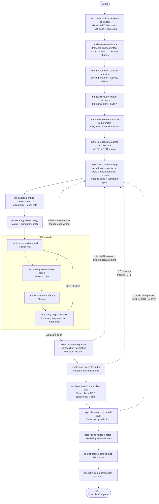

# Agent Requirement Implementation Checklist

**Audience**: AI agents. Process token: `[PROC-AGENT_REQ_CHECKLIST]`.

**Purpose**: This document is the primary procedural template an AI agent follows for every new requirement or change to the tested system. It unifies and sequences the controlling processes into a single executable checklist with explicit branching and looping. The agent executes this checklist from start to finish; skipping steps is not permitted unless a branch directive says otherwise.

**Trackable form**: The executable checklist YAML (with `id`, `slug`, completion comments, and loop-back clearance) is [`agent-req-implementation-checklist.yaml`](agent-req-implementation-checklist.yaml) (version in-file; canonical in this directory in the TIED repository). `copy_files.sh` installs it into a client’s `tied/docs/` when missing. Copy to a unique per-request file in a working folder (see the YAML header) and use it to record step completion and loop-backs.

**Processes unified here**: `[PROC-CITDP]`, `[PROC-TIED_DEV_CYCLE]`, `[PROC-IMPL_CODE_TEST_SYNC]`, `[PROC-LEAP]`, `[PROC-YAML_EDIT_LOOP]`, `[PROC-IMPL_PSEUDOCODE_TOKENS]`, `[PROC-PSEUDOCODE_VALIDATION]`, `[PROC-TOKEN_AUDIT]`, `[PROC-TOKEN_VALIDATION]`, `[PROC-TEST_STRATEGY]`, `[PROC-COMMIT_MESSAGES]`, `[PROC-VOCABULARY_INDEX]`.

**Mandatory order**: IMPL pseudo-code (every block token-commented) → RED tests (with token comments) → code (with token comments). No code before RED; no RED before complete IMPL pseudo-code.

**Domain vocabulary discipline** (`[PROC-VOCABULARY_INDEX]`): three mandatory **touchpoints** govern when agents use `tied/vocab/*.md` (plain Markdown; filenames have **no** `-vocabulary` suffix). Inline during work: **RESOLVE** before naming/writing; **RECORD** as concepts are generated and after artifacts change. **CALL sub-vocabulary-sync** at each touchpoint and naming point. This is **distinct** from the IMPL pseudo-code grammar "preferred vocabulary" (INPUT/OUTPUT/DATA/PRE/POST/EFFECTS keywords). Standards: [vocabulary-index-analysis-and-standards.md](vocabulary-index-analysis-and-standards.md).

## Three vocabulary touchpoints

| Touchpoint | When | Mode | Primary steps | Done when |
|---|---|---|---|---|
| **1 — Prompt intake** | Sponsor or user text names concepts before formal TIED work | **RESOLVE** (+ RECORD for new concepts) | `translate-sponsor-intent`, `change-definition` | Plan and change definition use canonical terms; new concepts flagged or recorded |
| **2 — Pre-read** | Before reading TIED indexes, detail files, source, or tests | **PRELOAD** | `session-bootstrap`, `impact-discovery` | Term map loaded from `routing.md` and only matched glossaries |
| **3 — Pre-commit** | Before staging and `git commit` | **VALIDATE** | `traceable-commit` | All changed artifact names resolve to one preferred term; commit blocked on mismatch |

**Touchpoint 1 example:** Sponsor says "config file loader" but the vocab canonicalizes **config discovery** — reword the sponsor plan and change definition before choosing `[REQ-*]` tokens.

**Touchpoint 2 example:** Before grep-reading `code_locations` or IMPL detail in `impact-discovery`, PRELOAD glossaries for the affected subsystem so you interpret existing symbols with canonical names.

**Touchpoint 3 example:** Before commit, VALIDATE that the REQ token suffix, UPPER_SNAKE block name, test `describe` label, and naming-bridge row in `tied/vocab/*.md` all refer to the same preferred term.

`verification-gate` and `sync-tied-stack` **RECORD** reconcile vocab during close-out; the hard **VALIDATE** gate is at `traceable-commit`.

**Step `id` and `slug`**: Each YAML step has a stable **`id`** (used in GOTO, loop-back clearance, and tooling) and a kebab-case **`slug`** (for stable references in docs and code). Titles match the executable YAML (`version` / `last_updated` in that file).

| id | slug | Title |
|---|---|---|
| session-bootstrap | session-bootstrap | Governed TIED context and skill-routed YAML path |
| translate-sponsor-intent | translate-sponsor-intent | Map sponsor wording to checklist phases (planning only) |
| change-definition | change-definition | Bound problem, non-goals, and measurable success |
| impact-discovery | impact-discovery | Blast radius, tied_context, IMPL inventory (Phase A) |
| author-requirement | author-requirement | REQ index/detail and token registration |
| author-architecture | author-architecture | ARCH decisions linked to REQ |
| catalog-pseudocode-contracts | catalog-pseudocode-contracts | Read essence_pseudocode; extract contracts (Phase B) |
| flag-insufficient-specs | flag-insufficient-specs | Blockers before tests or code |
| flag-contradictory-specs | flag-contradictory-specs | Cross-IMPL conflicts |
| resolve-pseudocode | resolve-pseudocode | Fix contracts; revisit REQ/ARCH if scope shifts |
| apply-token-comments | apply-token-comments | Block-level IMPL/ARCH/REQ comments (Phase C) |
| gate-pseudocode-validation | gate-pseudocode-validation | sub-pseudocode-validation-pass and gating before persist |
| persist-implementation-records | persist-implementation-records | IMPL index/detail via tied-cli.sh; sub-yaml-edit-loop |
| risk-assessment | risk-assessment | Risks, mitigations, token references |
| test-strategy | test-strategy | Test matrix, classification, mandatory order |
| unit-test-red | unit-test-red | One failing test per pseudo-code block (Phase D) |
| unit-test-green | unit-test-green | Minimal code to pass (Phase E) |
| unit-refactor | unit-refactor | Optional behavior-preserving cleanup |
| three-way-alignment-unit | three-way-alignment-unit | Align pseudo-code, tests, code; token audit (Phase F) |
| composition-integration | composition-integration | Bindings without UI; test-first wiring (Phase G) |
| end-to-end-ui | end-to-end-ui | UI-only behavior with platform justification (Phase H) |
| verification-gate | verification-gate | Full suite, lint, token validation, audit, metadata (Phase I) |
| sync-tied-stack | sync-tied-stack | TIED docs match implementation; consistency via tied-cli.sh |
| user-facing-release-notes | user-facing-release-notes | README and CHANGELOG |
| persist-citdp-record | persist-citdp-record | CITDP YAML under client tied/citdp |
| traceable-commit | traceable-commit | Commit per PROC-COMMIT_MESSAGES; no push unless asked |
| sub-yaml-edit-loop | sub-yaml-edit-loop | tied-cli.sh mutations, lint_yaml, tied_validate_consistency |
| sub-pseudocode-validation-pass | sub-pseudocode-validation-pass | Checklist-ordered passes until gating satisfied |
| sub-leap-micro-cycle | leap-micro-cycle | Fix IMPL first during GREEN; revisit REQ/ARCH if scope shifts |
| sub-vocabulary-sync | sub-vocabulary-sync | Resolve, preload, record, validate domain vocab |

---

## Entry Points

| Scenario | Start at | Notes |
|---|---|---|
| New requirement | session-bootstrap | Full checklist applies |
| Change to existing system | session-bootstrap | CITDP analysis applies at change-definition-impact-discovery; existing tokens loaded at impact-discovery |
| TIED prepared; tests/code not updated | session-bootstrap | author-requirement–S06 verify-only; use updated REQ/ARCH/IMPL as source of truth; follow [PROC-TIED_FIRST_IMPLEMENTATION](tied-first-implementation-procedure.md) |
| Bug fix | session-bootstrap | At change-definition, determine if a REQ is missing; if so, create REQ at author-requirement before defining the fix |

### Variant: TIED prepared, implementation pending

When REQ/ARCH/IMPL have already been updated and the remaining work is to align tests and code: use the checklist from session-bootstrap. change-definition–impact-discovery define the change and impact from the **updated** TIED (desired behavior = new design; current behavior = prior tests/code). author-requirement–S06 are **verify-only** (confirm REQ/ARCH/IMPL completeness and block token comments; fix gaps before proceeding). risk-assessment–traceable-commit are unchanged. Full procedure: [tied-first-implementation-procedure.md](tied-first-implementation-procedure.md) (`[PROC-TIED_FIRST_IMPLEMENTATION]`).

## Suggested session handoffs (non-normative)

This section is **optional guidance** only. Checklist order and gating are unchanged. Use these boundaries when the **repository** and **per-request checklist copy** (per the YAML header) already record enough work that a **new** session can re-bootstrap with a small prompt, avoid carrying long prior turns, and focus on the next phase.

**CITDP vs the CITDP file:** In `tied/docs/processes.md`, `[PROC-CITDP]` ties `change-definition`, `impact-discovery`, `risk-assessment`, and `test-strategy` to change analysis, and the **`persist-citdp-record`** step (slug `persist-citdp-record`) stores the final `CITDP-*.yaml` under `tied/citdp/`. A typical “analysis done, start test/code” handoff is after IMPL is persisted and the **implementation freeze** lifts: **`persist-implementation-records`**, then `risk-assessment` / `test-strategy`, then TDD. That is **not** the same as writing the final CITDP YAML file, which runs **after** implementation.

### High-value new-session boundaries (efficiency)

| After step (slug) | Durable state | When a new session helps |
|---|---|---|
| `persist-implementation-records` | IMPL index/detail, indexes, and tokens on disk; `gate-pseudocode-validation` and this step satisfied. Implementation freeze (see `session-bootstrap`) lifted for the IMPL set in scope. | Strongest split before RED/GREEN. Dropped context: long catalog/flag/resolve/validation reasoning. New session: continue `risk-assessment` or `test-strategy` then TDD. Aligns with the **TIED prepared; tests/code not updated** entry point. |
| `test-strategy` | Test matrix and TDD order as step outcomes. | **Implementation-only** context: from `unit-test-red` with harness and IMPL details as source of truth. |
| `risk-assessment` | Risks and mitigations documented; IMPL on disk. | Weaker than after `test-strategy`; use when the risk pass was long or branchy. |
| `three-way-alignment-unit` → `unit-test-red` (per iteration) | Tests and code for prior blocks; IMPL may have been updated via `sub-leap-micro-cycle` / LEAP. | Very large REQs/IMPLs: a **narrow** session per block or per RED/green/align loop without earlier failure-transcript context. |
| `three-way-alignment-unit` → `composition-integration` (when all required unit blocks are done) | Unit-level TDD and alignment are stable. | **Composition** and wiring are a different kind of work than unit TDD. |
| `end-to-end-ui` | E2E and lower layers addressed per scope. | A dedicated **`verification-gate`**: full suite, post-test pseudo-code validation, token validation, audit. |
| `verification-gate` | Suite, lint, and post-test validation green for the pass. | **Close-out** without debug narrative: `sync-tied-stack`, `user-facing-release-notes` (if in scope), `persist-citdp-record`, `traceable-commit`. |
| `persist-citdp-record` | `CITDP-*.yaml` on disk. | Short **commit** session: `traceable-commit` (see the `traceable-commit` and `session-bootstrap` notes on `CALL` / `RETURN` for driver-appended sub-procedure turns). |

**Agentstream (`--lead-checklist-yaml` in the consumer repo’s `tools/agentstream` and `tools/agent-stream`):** The executable YAML sets `agentstream_new_session: true` on the main steps that begin a handoff in the table (for example `risk-assessment` through to `sync-tied-stack` per the canonical `tied/docs/agent-req-implementation-checklist.yaml` in the TIED repository). The driver then issues that turn without `--resume` (a new Cursor agent session). Missing or `false` keeps chaining from the previous turn. This key is a **driver hint**; the procedural checklist and gating do not depend on it, and other clients may ignore it. Mid-run new sessions are independent of a prior turn’s `session_id`; `--session-id` (when supported) still applies to **turn 1** of the run only.

**Go `agentstream` only — dynamic checklist control:** On **live** runs, the driver may read a **machine-readable** fenced JSON trailer **`agentstream_control`** (not natural-language `GOTO` in prose) and apply **`action: goto`** to replace the **remaining** scheduled checklist turns from a validated step **`target`**, optionally clearing `loop_back_clearance` completion markers on the on-disk lead checklist. Schema and behavior: [tools/agentstream/README.md](../tools/agentstream/README.md) (“Dynamic checklist control”).

**Session preload file:** When a workspace has **`tied/agent-preload-contract.yaml`** (optional; used by agentstream and batch scripts when present), the checklist’s **`author-architecture`** and **`persist-implementation-records`** steps require creating or updating it (see the bundled [`agent-preload-contract-template.yaml`](agent-preload-contract-template.yaml). A filled preload is not a substitute for REQ+ARCH-bounded system definition; refresh after **ARCH-locked** constants, then after **IMPL-locked** `code_locations` and paths. **`sync-tied-stack`** re-checks the file if REQ/IMPL status or `traceability.tests` changed. See the executable YAML in `tied/docs/agent-req-implementation-checklist.yaml` for exact task text.

**Weaker handoffs (use only for very large work):** After `change-definition` or `impact-discovery`, REQ/ARCH/IMPL may not be complete on disk—treat the new session as **resume and verify**, not “TIED is done.” After `author-architecture`, a new session at `catalog-pseudocode-contracts` can work if ARCH/REQ files were actually written and indexed.

**Avoid starting a new session in the middle of:** `loop_back_clearance` / GOTO flow from `resolve-pseudocode` to `author-requirement` or `author-architecture` (scope and cleared slugs are coupled; see the executable YAML’s `loop_back_clearance`); and **`sub-leap-micro-cycle`** during **`unit-test-green`** unless IMPL, test, and code are left in a self-explanatory, aligned state and the per-request checklist slugs are explicit.

**Minimal restart prompt:** Point to the per-request checklist file and next **slug**; name REQ/ARCH/IMPL token(s) and the relevant `tied/implementation-decisions/IMPL-*.yaml` (and indexes) as source of truth. If `persist-implementation-records` and gating are already completed for this change on disk, do not re-derive the pseudo-code sequence from scratch; continue from the completed steps.

## Flow Control Notation

| Symbol | Meaning |
|---|---|
| `GOTO Sxx` | Jump to step Sxx; resume from there |
| `IF condition THEN action` | Conditional branch |
| `LOOP ... UNTIL condition` | Repeat enclosed steps until condition is met |
| `CALL SUB-xxx` | Invoke sub-procedure; return to the calling step when done |
| `RETURN` | Return from a sub-procedure to the caller |
| `EXIT` | Checklist complete |

---

## session-bootstrap (session-bootstrap): Governed TIED context and skill-routed YAML path

**Goals**: Confirm access to all governing TIED documents; understand current project state and priorities.

**Tasks**:
1. Preface the response with `"Observing AI principles!"`.
2. Read `tied/docs/ai-principles.md` completely.
3. Review `tied/semantic-tokens.yaml` (token registry) and `tied/docs/semantic-tokens.md` (token guide).
4. Review `tied/architecture-decisions.yaml` and `tied/implementation-decisions.yaml` (YAML indexes).
5. Review `tied/docs/implementation-decisions.md` (IMPL schema, pseudo-code rules, block token rules per `[PROC-IMPL_PSEUDOCODE_TOKENS]`).
5a. **Domain vocabulary index** (`[PROC-VOCABULARY_INDEX]`): scan `tied/vocab/*.md` (preferred terms; filenames have no `-vocabulary` suffix) and the standards in [vocabulary-index-analysis-and-standards.md](vocabulary-index-analysis-and-standards.md) so concept names stay consistent this session. If `tied/vocab/` is absent, note it (immature client) and apply the discipline when concepts arise. Distinct from the IMPL grammar "preferred vocabulary" (INPUT/OUTPUT/DATA/PRE/POST/EFFECTS).
5b. **Touchpoint 2 (pre-read):** **CALL sub-vocabulary-sync** (**PRELOAD**) — read `tied/vocab/routing.md`, match task keywords to the routing table, open only matched glossaries, skim preferred-term and naming-bridge tables; produce a brief term map for this session. For cross-cutting concerns, search `tied/vocab/domain-references.md` on demand.
6. **Tied-yaml skill (required)**: Read [.cursor/skills/tied-yaml/SKILL.md](../../.cursor/skills/tied-yaml/SKILL.md). For a single page linking the skill, MCP runbook, detail schema, and payload patterns, read [tied-yaml-agent-index.md](tied-yaml-agent-index.md). For **creating, updating, or deleting** project-owned YAML under the TIED base path (indexes, `requirements/` / `architecture-decisions/` / `implementation-decisions/` details, `semantic-tokens.yaml`, `feedback.yaml`, etc.), invoke tools only through `.cursor/skills/tied-yaml/scripts/tied-cli.sh <tool_name> '<args_json>'` (full catalog in [.cursor/skills/tied-yaml/reference.md](../../.cursor/skills/tied-yaml/reference.md)). Set **`TIED_BASE_PATH`** and **`TIED_MCP_CMD` / `TIED_MCP_BIN` / `tied-yaml` on `PATH`** as in the skill **Environment overrides** (Cursor: **`"command": "tied-yaml"`** in **`.cursor/mcp.json`**; shell: `tied-cli.sh` uses the same `tied-yaml` CLI or a built **`dist/index.js`**). `copy_files.sh` copies the skill into `.cursor/skills/tied-yaml/` (from the TIED repo’s `.cursor/skills/tied-yaml` if present, else from `tools/bundled-tied-yaml-skill/` in the TIED source tree). If `SKILL.md` is still missing, re-run `copy_files.sh` from a full TIED checkout, or `cp -R <TIED_repo>/tools/bundled-tied-yaml-skill .cursor/skills/tied-yaml`. Note: the **`tied-yaml` server** is separate from the **`tied-cli.sh` + Node** stdio client; both are required for terminal use—see SKILL.md. Do not use `apply_patch` or `Write` on those paths when a `tied-cli.sh` tool covers the operation (document a one-line exception only when no tool covers the operation), and do not use **`TIED_YAML_BYPASS`** for routine project TIED work when the supported path is to fix the missing skill bundle.
7. **Mandatory global sequence** (before any RED test or production code): token-commented IMPL `essence_pseudocode` → `gate-pseudocode-validation` → `persist-implementation-records` when authoring new IMPL — then RED tests → GREEN code.
8. **Within TDD** after pseudo-code is authoritative: failing test before production code. When weighing non-implementation trade-offs: Tests > Basic Functions > Developer Experience > Infrastructure > Security — never start RED or production code before IMPL pseudo-code is complete per the mandatory sequence above.
9. **Implementation freeze** until `gate-pseudocode-validation` and `persist-implementation-records` are satisfied for this REQ/changed IMPL set: do not add or modify production implementation files (application source, deliverable scripts, etc.) or automated test files. Exception only for TIED YAML and docs required by completed checklist steps (TIED paths routed per [.cursor/skills/tied-yaml/SKILL.md](../../.cursor/skills/tied-yaml/SKILL.md)).

**Outcomes**: Agent has read all governing documents. Session context is established.

**Reference**: `AGENTS.md` § 1-2; `tied/docs/ai-principles.md` § Mandatory Acknowledgment, § Checklist for AI Agents; [vocabulary-index-analysis-and-standards.md](vocabulary-index-analysis-and-standards.md).

**CALL**: sub-vocabulary-sync (**PRELOAD** — review and load the domain vocabulary index).

---

## translate-sponsor-intent (translate-sponsor-intent): Map sponsor wording to checklist phases (planning only)

**Goals**: Interpret driver-supplied placeholders (`{{CHANGE_TITLE}}`, `{{FEATURE_GOAL}}`, `{{FEATURE_BEHAVIOR_SUMMARY}}` when expanded by agentstream) as *sponsor context*, not as permission to skip checklist phases or implement code or tests immediately. Produce a concise written mapping from that intent onto the checklist’s ordered phases.

**Tasks**:
1. List the sponsor lines from the rendered checklist step (expanded from checklist vars when the driver passes `--checklist-var`). Treat them as informal intent, not executable orders.
2. Restate that sponsor text does not authorize writing production code, deliverable scripts, automated tests, or TIED YAML except what later steps assign.
3. Produce a numbered plan mapping sponsor intent onto checklist phases through `traceable-commit` (adjusting for branches in this workspace), including where pseudo-code gates and RED precede GREEN.
4. Do not create or modify implementation artifacts in this step—output is the translation/plan only. The next step (`change-definition`) refines this into the formal change definition.
5. **Touchpoint 1 (prompt intake):** **Reword fuzzy sponsor wording that names concepts** (`[PROC-VOCABULARY_INDEX]`): **CALL sub-vocabulary-sync** (**RESOLVE**) to map synonyms/ambiguous sponsor terms onto the preferred domain terms in `tied/vocab/*.md` before mapping intent to phases; **CALL sub-vocabulary-sync** (**RECORD**) for any genuinely new concept the sponsor introduces so it is captured immediately.

**Outcomes**: Sponsor wording translated into an explicit checklist-phase plan using canonical domain terms; agent primed to follow slug order rather than imperative goal phrasing alone.

**Reference**: Entry points and flow in this document; `tied/docs/processes.md` § `[PROC-AGENT_REQ_CHECKLIST]`; [vocabulary-index-analysis-and-standards.md](vocabulary-index-analysis-and-standards.md).

---

## change-definition (change-definition): Bound problem, non-goals, and measurable success

**Goals**: Articulate what is changing or being added, why, what stays the same, and measurable success criteria.

**Tasks**:
1. State **current behavior** (or "none" for a new requirement).
2. State **desired behavior**.
3. State **unchanged behavior** (explicit boundaries of what is not affected).
4. State **non-goals** (what this work intentionally does not address).
5. State **success criteria** (measurable outcomes that determine when the work is done).
6. Deliverable production code and automated tests are **out of scope** for this step; output is the written change definition (current, desired, unchanged, non-goals, success criteria) only.
7. **Touchpoint 1 (prompt intake):** **Express the change definition using canonical domain terms** (`[PROC-VOCABULARY_INDEX]`): **CALL sub-vocabulary-sync** (**RESOLVE**) to reword fuzzy/synonym wording in current/desired/success-criteria to the preferred terms in `tied/vocab/*.md`; **CALL sub-vocabulary-sync** (**RECORD**) for any new concept named here.

**Outcomes**: A clear change definition exists, worded with canonical domain terms. For CITDP records, this populates the `change_definition` section.

**Branch**: IF this is a bug fix AND no REQ exists for the expected behavior THEN create the missing REQ at author-requirement first, then return here to define the fix.

**Reference**: `tied/docs/processes.md` § `[PROC-CITDP]` step 1; `tied/docs/ai-principles.md` § Bugs vs requirements; [vocabulary-index-analysis-and-standards.md](vocabulary-index-analysis-and-standards.md).

---

## impact-discovery (impact-discovery): Blast radius, tied_context, IMPL inventory (Phase A)

**Goals**: Identify all affected modules, tokens, code, and tests; build an IMPL inventory table that serves as the working context for the rest of the checklist.

**Tasks**:
1. **Touchpoint 2 (pre-read):** **CALL sub-vocabulary-sync** (**PRELOAD**) scoped to modules and concepts from change-definition — load glossaries under `tied/vocab/` for affected subsystems so subsequent IMPL/code reads interpret symbols and paths with canonical names.
2. Identify affected modules and functions with their tied tokens.
3. Identify module boundaries the change touches or crosses.
4. **Risk-first quality applicability (before design)**:
   - Select `baseline-functional` and any triggered assurance profiles from `tied/vocab/quality-assurance.md`.
   - Record a quality evidence matrix row for each considered attribute: applicability, rationale, risk, evidence method, exact command/test, threshold, result placeholder, owner, limitation, and waiver/expiry when applicable.
   - Generate bounded scenarios from IMPL branches, PRE/POST boundaries, failure modes, mutable-state transitions, and meaningful empty/minimal/maximal/malformed/duplicate cases. Add abuse-case rows for applicable input, authorization, resource, replay, sensitive-data, and untrusted-content boundaries.
   - Keep specialized profiles conditional. A low-risk or irrelevant attribute receives an explicit N/A rationale rather than an invented test or universal ceremony.
5. Build `tied_context`:
   - `tied_tokens_affected` — existing REQ/ARCH/IMPL tokens touched by the change.
   - `tied_tokens_new` — tokens to be created.
5. **IMPL Discovery** (`[PROC-IMPL_CODE_TEST_SYNC]` Phase A):
   - **A1.** Load each affected IMPL detail file. Record `cross_references`, `related_decisions` (`depends_on`, `composed_with`, `see_also`), and `traceability` fields.
   - **A2.** Discover related IMPLs via four paths:
     - (a) Follow `composed_with` and `depends_on` links in `related_decisions`.
     - (b) Query shared REQ/ARCH tokens (`.cursor/skills/tied-yaml/scripts/tied-cli.sh get_decisions_for_requirement '<json>'` or index grep).
     - (c) Compare `code_locations` across IMPLs for file/function overlaps.
     - (d) Search managed source and tests for `[IMPL-*]` token references.
   - **A3.** Build an **IMPL inventory table**:

     | IMPL token | Pseudo-code loaded | Code files | Test files | Testability |
     |---|---|---|---|---|
     | *(populated per IMPL)* | | | | |

     Code files and Test files list **existing** artifacts for discovery only — not permission to create new files. Do not add or modify production source or automated tests in this step; new or changed implementation artifacts begin at `unit-test-red` (tests) and `unit-test-green` (production code) after pseudo-code is validated and persisted.

6. **Stop expanding** when no new IMPLs share code paths, REQ/ARCH tokens, or `composed_with` links with the current set.

**Outcomes**: Complete impact map; vocabulary term map loaded (PRELOAD) for affected subsystems; risk/profile selection and an initial quality evidence matrix exist before REQ/ARCH/IMPL design; bounded scenarios and applicable abuse cases are recorded; IMPL inventory table ready; all affected and related tokens identified.

**Branch**: IF the IMPL set is large (signal of high coupling) THEN consider whether IMPLs need decomposition before proceeding.

**Reference**: `tied/docs/processes.md` § `[PROC-CITDP]` step 2; `tied/docs/processes.md` § `[PROC-IMPL_CODE_TEST_SYNC]` Phase A (A1-A3); `tied/docs/pseudocode-writing-and-validation.md` § Phase A — Discovery (`#phase-a--discovery`); [vocabulary-index-analysis-and-standards.md](vocabulary-index-analysis-and-standards.md).

**CALL**: sub-vocabulary-sync (**PRELOAD**).

---

## author-requirement (author-requirement): REQ index/detail and token registration

**Goals**: Create or update the requirement record so the change has a formal `[REQ-*]` token with full traceability fields.

**Tasks**:
1. Create or update the entry in `requirements.yaml` with all required fields: `name`, `category`, `priority`, `status`, `rationale` (`why`, `problems_solved`, `benefits`), `satisfaction_criteria`, `validation_criteria`, `traceability` (`architecture`, `implementation`, `tests`, `code_annotations`), `related_requirements`, `detail_file`, `metadata`.
2. Create or update the REQ detail file in `requirements/REQ-{TOKEN}.yaml` per `tied/docs/detail-files-schema.md` § REQ.
3. Register the REQ token in `semantic-tokens.yaml`.
4. **Name this TIED resource from canonical vocabulary** (`[PROC-VOCABULARY_INDEX]`): **CALL sub-vocabulary-sync** (RESOLVE) before choosing the REQ token suffix and the record `name` so they reflect the preferred domain term in `tied/vocab/*.md`; **CALL sub-vocabulary-sync** (RECORD) to add the concept ↔ REQ-token naming-bridge entry.
5. **CALL sub-yaml-edit-loop** for each changed YAML file.

**Outcomes**: REQ record exists in both the index and the detail file; token name reflects the canonical domain term and is recorded in the vocabulary naming bridge; token is registered in `semantic-tokens.yaml`; all YAML validated.

**Reference**: `tied/docs/processes.md` § `[PROC-YAML_DB_OPERATIONS]` § Appending a New Record; `tied/docs/detail-files-schema.md` § 1; `tied/docs/semantic-tokens.md` § Token Creation Requirements; [vocabulary-index-analysis-and-standards.md](vocabulary-index-analysis-and-standards.md).

---

## author-architecture (author-architecture): ARCH decisions linked to REQ

**Goals**: Create or update architecture decision(s) that fulfill the REQ, with cross-references.

**Tasks**:
1. Identify architectural decisions needed (or update existing ones).
2. Create or update the entry in `architecture-decisions.yaml` with `cross_references` to the REQ token(s), `decision`, `rationale`, `alternatives_considered`, `traceability`, `related_decisions`, `metadata`.
3. Create or update the ARCH detail file in `architecture-decisions/ARCH-{TOKEN}.yaml` per `tied/docs/detail-files-schema.md` § ARCH.
4. Register each new ARCH token in `semantic-tokens.yaml`.
5. **Refer to vocab before writing design and naming TIED/storage resources** (`[PROC-VOCABULARY_INDEX]`): **CALL sub-vocabulary-sync** (RESOLVE) so the ARCH token name, record `name`, design prose, and any layout/path/schema names this decision fixes use preferred terms in `tied/vocab/*.md`. **Update vocab after writing design**: **CALL sub-vocabulary-sync** (RECORD) to capture new design/architecture terms and concept ↔ ARCH-token (and concept ↔ storage-name) naming-bridge rows.
6. **CALL sub-yaml-edit-loop** for each changed YAML file.
7. **Agent preload (ARCH-locked)**: When ARCH and REQ have bounded the system in a material way, create or update **`tied/agent-preload-contract.yaml`** (see the executable checklist YAML for full conditions). Use the template at [`agent-preload-contract-template.yaml`](agent-preload-contract-template.yaml). Fill `session_bootstrap_docs` paths, `tied_paths.TIED_BASE_PATH`, and `implementation_contract` fields the ARCH decision fixes. If the pass only nicked cross-references, record that the preload was not refreshed.

**Outcomes**: ARCH records exist with REQ cross-references; design prose and ARCH/storage names resolved from canonical vocabulary and new design terms recorded; tokens registered; YAML validated; `tied/agent-preload-contract.yaml` created or updated when meaningful ARCH constants were introduced (or the step output records an explicit skip).

**Reference**: `tied/docs/processes.md` § `[PROC-YAML_DB_OPERATIONS]`; `tied/docs/detail-files-schema.md` § 2; `tied/docs/ai-principles.md` § Phase 1; `tied/docs/agent-preload-contract-template.yaml` (TIED source); [vocabulary-index-analysis-and-standards.md](vocabulary-index-analysis-and-standards.md).

---

## S06: Author/Update IMPL with Pseudo-Code (catalog-pseudocode-contracts–persist-implementation-records)

**Goals**: Create or update IMPL decisions with complete `essence_pseudocode` and block-level token comments. Resolve all logical and flow issues in pseudo-code before any tests or code. Pseudo-code is the **source of consistent logic**.

**Tasks**:

### catalog-pseudocode-contracts (catalog-pseudocode-contracts): Read essence_pseudocode; extract contracts (Phase B)

1. Read each IMPL's `essence_pseudocode` sequentially. For each, note:
   - INPUT/OUTPUT/DATA declarations (and CONTROL when present).
   - PRE/POST/EFFECTS; FAILURE_MODES when errors are possible; DATA_TRANSITION when DATA is mutated or EFFECTS includes State; TERMINATION when recursion/WHILE/open wait (prefer `total` otherwise).
   - Procedure names (UPPER_SNAKE or camelCase).
   - Key branches (IF/ELSE), loops (FOR ... IN), error paths (ON error, RETURN error) and whether names appear in FAILURE_MODES.
   - Async boundaries (AWAIT, Promise) and whether EFFECTS includes `Async`.
   - **Name logical units from canonical vocabulary** (`[PROC-VOCABULARY_INDEX]`): **CALL sub-vocabulary-sync** (RESOLVE) so procedure names and UPPER_SNAKE block names map to the preferred domain term in `tied/vocab/*.md` (the preferred term **is** the block name); **CALL sub-vocabulary-sync** (RECORD) for any new block-name/procedure term.

### flag-insufficient-specs (flag-insufficient-specs): Blockers before tests or code

2. Flag any of the following as incomplete (resolution required before tests or code):
   - Missing INPUT or OUTPUT declarations.
   - Missing PRE, POST, or EFFECTS on a new or **changed** Active procedure block (Template stubs exempt; untouched legacy Active blocks may defer with N/A `pre-contract-grammar` until next edit).
   - Missing FAILURE_MODES when OUTPUT includes error or steps use ON error / fallible returns.
   - Missing DATA_TRANSITION when DATA is mutated or EFFECTS includes State.
   - Missing TERMINATION when recursion / WHILE / open-ended wait is present.
   - Procedures referenced but not defined (called by name but body absent).
   - Branches without error handling on a fallible path.
   - Stub or template pseudo-code on an IMPL with `status: Active`.
   - Blocks with no token comment (violates `[PROC-IMPL_PSEUDOCODE_TOKENS]`).

### flag-contradictory-specs (flag-contradictory-specs): Cross-IMPL conflicts

3. Compare across IMPLs in the inventory table:
   - **Shared DATA conflict** — two IMPLs read/write the same DATA key with different assumptions, or incompatible DATA_TRANSITION / PRE/POST.
   - **EFFECTS conflict** — composed IMPLs claim incompatible effect rows on the same path.
   - **Ordering conflict** — IMPL-A expects to run before IMPL-B, but IMPL-B has no ordering constraint or assumes the reverse.
   - **Incompatible OUTPUT types** — IMPL-A produces `{ result }` but IMPL-B expects `{ result, metadata }` from the same procedure; or FAILURE_MODES disagree.
   - **Duplicate logic** — the same step appears in two IMPLs with different parameters or behavior.

**Branch**: IF two IMPLs have irreconcilable assumptions THEN refactor (split or restructure) one IMPL before proceeding. Do not paper over contradictions.

### resolve-pseudocode (resolve-pseudocode): Fix contracts; revisit REQ/ARCH if scope shifts

4. For each issue found in flag-insufficient-specs-flag-contradictory-specs:
   - Update the affected IMPL's `essence_pseudocode` so contracts are compatible, ordering is explicit, and every block is complete.
   - IF resolution changes the scope of an ARCH THEN **GOTO author-architecture** to update ARCH, then return here.
   - IF resolution changes the scope of a REQ THEN **GOTO author-requirement** to update REQ, then return here.
   - **When resolving introduces or renames logical units or data** (`[PROC-VOCABULARY_INDEX]`): **CALL sub-vocabulary-sync** (RESOLVE) so new names use preferred domain terms in `tied/vocab/*.md`, and **CALL sub-vocabulary-sync** (RECORD) to capture them immediately.

### apply-token-comments (apply-token-comments): Block-level IMPL/ARCH/REQ comments (Phase C)

5. Apply `[PROC-IMPL_PSEUDOCODE_TOKENS]` to every IMPL in the set:
   - **Top-level comment**: `# [IMPL-X] [ARCH-Y] [REQ-Z]` followed by a one-line summary.
   - **Sub-blocks (same token set)**: comment only the *how* (no token list repetition).
   - **Sub-blocks (different token set)**: open with `# [IMPL-...] [ARCH-...] [REQ-...]` naming that set and stating how the sub-block implements them.
6. **Cross-IMPL dependency comments**: when a procedure in IMPL-A calls or depends on IMPL-B, the calling block in IMPL-A names IMPL-B (and its ARCH/REQ) so the dependency is visible.
7. **Collision and composition notes**: for each `composed_with` pair or code-path overlap, document:
   - **Ordering**: which IMPL's procedure runs first and why.
   - **Shared data**: which DATA keys are read/written by both; expected state at each boundary.
   - **Pre/post conditions**: what each IMPL expects before it runs and guarantees after.
7a. **Confirm block names match the canonical vocabulary** (`[PROC-VOCABULARY_INDEX]`): **CALL sub-vocabulary-sync** (RESOLVE) so UPPER_SNAKE block names in comments are the preferred domain terms in `tied/vocab/*.md`; **CALL sub-vocabulary-sync** (RECORD) for any block-name term not yet indexed.

### gate-pseudocode-validation (gate-pseudocode-validation): sub-pseudocode-validation-pass and gating before persist

**CALL sub-pseudocode-validation-pass.** Run pseudo-code validation per `[PROC-PSEUDOCODE_VALIDATION]` using `tied/docs/pseudocode-validation-checklist.yaml` (or `docs/pseudocode-validation-checklist.yaml` at repo root). **Pre-RED context** (before executable tests): Layer A (`tied_validate_consistency`) plus structural Layer B (parsing, schema including SHAPE-003..006, symbol resolution, contract validation, dependency graph, reporting). Mark **behavioral_coverage** and **traceability** rows that require test artifacts as **N/A** with rationale ("no tests yet")—not ad-hoc waivers. Precision-contract rows: N/A only for Template stubs, applicability skips, or unchanged legacy Active blocks with rationale `pre-contract-grammar`; new/changed Active blocks must satisfy PRE/POST/EFFECTS and applicable FAILURE_MODES/DATA_TRANSITION/TERMINATION. Run validation passes in the recommended order; record findings with severity and source location. Do not proceed to persist-implementation-records until pre-RED structural gating is satisfied. If the project has no parser or tool yet, perform a **manual pass** over the applicable checklist categories and document results.

### persist-implementation-records (persist-implementation-records): IMPL index/detail via tied-cli.sh; sub-yaml-edit-loop

8. Create or update `implementation-decisions.yaml` index entries with all required fields.
9. Create or update IMPL detail files in `implementation-decisions/IMPL-{TOKEN}.yaml` per `tied/docs/detail-files-schema.md` § IMPL. Include complete `essence_pseudocode`.
10. Register each new IMPL token in `semantic-tokens.yaml`.
11. **Name storage items from canonical vocabulary** (`[PROC-VOCABULARY_INDEX]`): **CALL sub-vocabulary-sync** (RESOLVE) so the IMPL token name and any `code_locations` file/folder/schema names derive from preferred domain terms in `tied/vocab/*.md`; **CALL sub-vocabulary-sync** (RECORD) to add concept ↔ IMPL-token and concept ↔ storage-name naming-bridge rows.
12. **CALL sub-yaml-edit-loop** for each changed YAML file.
13. **Agent preload (IMPL-locked)**: Refresh **`tied/agent-preload-contract.yaml`** using IMPL-anchored data: e.g. `code_locations` → `implementation_contract.target_source_paths`, test or harness paths from IMPL detail, `citdp_artifact_paths` per CITDP policy, language/test stack when known. Reconcile when this step is verify-only for IMPL if path lists may be stale. Keep the preload narrow (see template comments); avoid whole-repo rediscovery.

**Outcomes**: All IMPL pseudo-code is complete, authoritative, and token-commented. Procedure/block names, IMPL token names, and storage names are drawn from and recorded in the canonical vocabulary. No contradictions or gaps remain. All YAML validated. `tied/agent-preload-contract.yaml` matches IMPL-locked paths and constants (or is explicitly left unchanged with reason).

**Reference**: `tied/docs/processes.md` § `[PROC-IMPL_CODE_TEST_SYNC]` Phases B-C; `tied/docs/implementation-decisions.md` § Mandatory essence_pseudocode, § Preferred vocabulary, § Expressing sequence and structure; `tied/docs/pseudocode-writing-and-validation.md` (Phases B–C and three-way alignment); `tied/docs/pseudocode-validation-checklist.yaml` for pseudo-code validation; `tied/docs/agent-preload-contract-template.yaml`; [vocabulary-index-analysis-and-standards.md](vocabulary-index-analysis-and-standards.md) (`[PROC-VOCABULARY_INDEX]`).

---

## risk-assessment (risk-assessment): Risks, mitigations, token references

**Goals**: Confirm the pre-design risk/profile decision and document residual risks, mitigations, and evidence ownership associated with the change.

**Tasks**:
1. Confirm that `impact-discovery` selected `baseline-functional` and any triggered assurance profiles before REQ/ARCH/IMPL design; if missing, return to `impact-discovery`.
2. List risks with severity, likelihood, quality attribute, and selected profile.
3. Where applicable, attach `tied_token_references` to each risk (which REQ/ARCH/IMPL the risk affects).
4. Document mitigation strategies, evidence owner, limitation, and failure action.
5. Record accepted residual risk only with an accountable owner and expiry; record N/A rows with rationale instead of silently omitting them.

**Outcomes**: Risks documented with token references. Mitigations identified.

**Reference**: `tied/docs/processes.md` § `[PROC-CITDP]` step 4.

---

## test-strategy (test-strategy): Test matrix, classification, mandatory order

**Goals**: Classify testability for each IMPL block; connect the selected quality evidence matrix to executable checks; produce a test matrix; plan the TDD sequence.

**Tasks**:
1. For each IMPL block/procedure, classify as: `unit`, `integration`, or `e2e_only`.
2. IF `e2e_only` THEN document `e2e_only_reason` naming the specific platform constraint in the IMPL detail. "Complex UI flow" is not a sufficient reason; a named platform constraint is required (e.g., "native OS file dialog cannot be triggered programmatically in the test environment").
3. Build a **test matrix**:

   | Test name | IMPL block ref | REQ token | Token comments | Testability |
   |---|---|---|---|---|
   | *(populated per test)* | | | | |

4. Plan the TDD sequence per mandatory implementation order:
   - (1) Unit tests first (conform to IMPL pseudo-code, before production code).
   - (2) Unit code via TDD (code satisfies tests; entire IMPL via TDD).
   - (3) Composition tests first (for every binding between units).
   - (4) Composition code via TDD (binding code satisfies composition tests).
   - (5) E2E (only for behavior requiring UI invocation).
   - (6) Validate and sync.
5. Identify module boundaries and validation criteria per `[REQ-MODULE_VALIDATION]`.
6. For selected profiles only, plan the applicable adequacy checks: mutation/property/metamorphic testing, fuzzing or deterministic replay, flaky-test detection, harness self-tests, complexity/dead-code review, dependency review, maintainability/coupling thresholds, and external-call cost controls. Record repeat count, seed, retry classification, quarantine owner/expiry, timeout, retry budget, caching/batching, and resource-exhaustion behavior when relevant.

**Outcomes**: Test matrix complete; every IMPL block has a testability classification; TDD sequence planned; module boundaries documented.

**Reference**: `tied/docs/processes.md` § `[PROC-TEST_STRATEGY]`; `tied/docs/processes.md` § `[PROC-CITDP]` step 5; `tied/docs/ai-principles.md` § Thin Entry Points and Testability Classification; `tied/docs/implementation-order.md`.

---

## S09 (unit-tdd): Unit TDD (Phases D–E–F)

**Goals**: Implement all unit-testable IMPL blocks via strict TDD while maintaining three-way alignment (pseudo-code / tests / code).

```
LOOP FOR each IMPL block classified as unit or integration in test-strategy:
```

### unit-test-red (unit-test-red): One failing test per pseudo-code block (Phase D)

**Goals**: Map pseudo-code to a failing test.

**Tasks**:
1. Map the pseudo-code block/procedure to one test group (`describe`/`it` or test function). One block maps to approximately one test group.
2. Name the test group after the procedure and include the REQ token (e.g., `describe("SAVE_WORKFLOW REQ_DATA_SAVE", ...)`).
2a. **Refer to vocab before writing the test** (`[PROC-VOCABULARY_INDEX]`): **CALL sub-vocabulary-sync** (RESOLVE) so test group names, identifiers, and fixture names use the preferred domain terms in `tied/vocab/*.md` and match the IMPL block name (the block-lead literal-copy rule still governs the comment text).
3. **Literal copy (mandatory):** As the first comment(s) in the test locus, place the **block lead** from `essence_pseudocode` for this block **verbatim** (same text; only wrap in the host language’s line or block comments; no paraphrase). See [pseudocode-writing-and-validation.md § Block lead and literal copy](pseudocode-writing-and-validation.md#block-lead-and-literal-copy-in-tests-and-code). Example shape (language may vary; content must match IMPL):
   ```
   // [IMPL-X] [ARCH-Y] [REQ-Z] — validates that PROCEDURE returns { ok }
   //   when input is valid and DEPENDENCY succeeds.
   ```
4. Write the failing test. Run the test suite. Confirm the test fails for the expected reason. No production code is written in this step.
5. Verify the assertion corresponds to the OUTPUT, POST predicates, and named FAILURE_MODES in the pseudo-code block (not only a coarse success/error shape). Test setup must satisfy PRE (CONTRACT-001).
6. IF no programmatic assertion can be written for the block THEN mark it `testability: e2e_only` in the IMPL detail with `e2e_only_reason`; skip to the next block.

**Outcomes**: Failing test exists that matches pseudo-code; no production code written.

### unit-test-green (unit-test-green): Minimal code to pass (Phase E)

**Goals**: Write the minimum code to pass the failing test.

**Tasks**:
1. Write only enough production code to make the failing test pass.
1a. **Refer to vocab before writing code** (`[PROC-VOCABULARY_INDEX]`): **CALL sub-vocabulary-sync** (RESOLVE) so new symbols, identifiers, and any file/folder/schema names introduced by the code use the preferred domain terms in `tied/vocab/*.md` and match the IMPL block name; **CALL sub-vocabulary-sync** (RECORD) for any new code-level term/storage name.
2. **Literal copy (mandatory):** The first comment(s) in the production locus for this block must be the same **block lead** text as in the IMPL and test (verbatim; host comment syntax only). [pseudocode-writing-and-validation.md § Block lead and literal copy](pseudocode-writing-and-validation.md#block-lead-and-literal-copy-in-tests-and-code). Example shape (language may vary; content must match the mapped pseudocode block lead):
   ```
   // [IMPL-X] [ARCH-Y] [REQ-Z] — PROCEDURE: validates input, delegates
   //   to DEPENDENCY, returns { ok }.
   ```
   Nested blocks follow the same rules: same token set comments only *how*; different token set names that set.
3. Run tests. IF tests fail THEN iterate on production code only (do not add new tests in GREEN).
4. **IF the focused RED test now passes but other existing tests still fail** THEN stop iterating production code in this turn; emit a **final** fenced JSON **`agentstream_control`** with **`action: goto`**, **`target: flag-contradictory-specs`**, and evidence, so the Go **`agentstream`** driver can re-queue the remaining checklist to resolve cross-IMPL or contradictory specs before more GREEN work (see executable checklist YAML and [tools/agentstream/README.md](../tools/agentstream/README.md)).
5. Run language-specific lint: Rust → `bun run lint:rust`; TypeScript → `bunx tsc -b` or `bun run lint:ts`; Swift → `swift build && swift test`; YAML → run `lint_yaml` on changed files per [PROC-YAML_EDIT_LOOP] (`processes.md`). IF lint fails THEN fix before proceeding.

**Branch**: IF the focused test is green but unrelated tests break THEN **GOTO** **`flag-contradictory-specs`** via machine-readable **`agentstream_control`** (Go `agentstream` only). IF GREEN reveals the pseudo-code is incomplete, wrong, or requires a new dependency THEN **CALL sub-leap-micro-cycle**. Do not silently diverge.

**Outcomes**: Test passes; lint clean; code carries correct token comments; or controlled loop-back to **`flag-contradictory-specs`** when focused GREEN succeeds but the suite is inconsistent.

### unit-refactor (unit-refactor): Optional behavior-preserving cleanup

**Goals**: Improve code quality without changing behavior.

**Tasks**:
1. Clean up test or production code (extract functions, rename, simplify).
2. Re-run tests + lint. Confirm no regressions.

**Outcomes**: Code is cleaner; all tests still pass; lint still clean.

### three-way-alignment-unit (three-way-alignment-unit): Align pseudo-code, tests, code; token audit (Phase F)

**Goals**: Verify that pseudo-code, tests, and code carry identical token sets with corresponding descriptions.

**Tasks**:
1. For every block in this iteration, verify the three artifacts carry the **same** token set:

   | Artifact | Comment content |
   |---|---|
   | **Pseudo-code block** | `# [IMPL-X] [ARCH-Y] [REQ-Z] — how this block implements ...` |
   | **Test block** | `// [IMPL-X] [ARCH-Y] [REQ-Z] — validates that ...` |
   | **Code block** | `// [IMPL-X] [ARCH-Y] [REQ-Z] — how this code implements ...` |

   IF any artifact names a token not present in the other two, or omits a token that the others carry, alignment is broken.

2. IF any diverge THEN update pseudo-code first, then test, then code (LEAP order: IMPL → test → code).
3. Run `[PROC-TOKEN_AUDIT]`: every token named in any of the three must exist in `semantic-tokens.yaml`. IF missing tokens THEN register them and **CALL sub-yaml-edit-loop**.
4. **Update vocab after writing tests/code** (`[PROC-VOCABULARY_INDEX]`): **CALL sub-vocabulary-sync** (RECORD) to reconcile `tied/vocab/*.md` with any term, symbol, or storage name that emerged or changed during this iteration; keep preferred-term tables and the alphabetical index in sync.

**Outcomes**: Three-way alignment verified for the iteration. All tokens registered; canonical vocabulary reconciled with terms used in tests/code this iteration.

```
END LOOP (repeat unit-test-red → unit-test-green → unit-refactor → three-way-alignment-unit
          UNTIL all unit/integration IMPL blocks are covered and all tests pass)
```

**Reference**: `tied/docs/processes.md` § `[PROC-IMPL_CODE_TEST_SYNC]` Phases D-F (steps 11-20); `tied/docs/pseudocode-writing-and-validation.md` (Unit TDD Phases D–F; literal **block lead** in tests and code); `tied/docs/implementation-order.md` steps 1-2.

---

## composition-integration (composition-integration): Bindings without UI; test-first wiring (Phase G)

**Goals**: Test bindings between validated modules without invoking the UI. Every binding between units must have IMPL coverage and a composition test.

**Tasks**:
1. **Identify bindings**: event listeners, IPC channels, entry-point delegation, function wiring, platform hooks. Each binding connects two or more units validated independently in S09.
1a. **Refer to vocab before writing composition tests/code** (`[PROC-VOCABULARY_INDEX]`): **CALL sub-vocabulary-sync** (RESOLVE) so binding, channel, and test names use the preferred domain terms in `tied/vocab/*.md`; **CALL sub-vocabulary-sync** (RECORD) for any new binding/channel concept.
2. **For each binding**, locate the IMPL whose `essence_pseudocode` describes the composition (often in ON/WHEN event handlers or wiring procedures):
   - IF an IMPL block describes the binding THEN proceed to step 3.
   - IF no IMPL covers the binding AND the binding belongs to an existing IMPL THEN extend that IMPL's pseudo-code to add a composition block. **GOTO apply-token-comments** (apply token comments to the new block), **CALL sub-yaml-edit-loop**, then return here.
   - IF no IMPL covers the binding AND the binding is a distinct design decision THEN create a new IMPL. **GOTO S06** (full IMPL authoring from catalog-pseudocode-contracts), then return here.
3. Write a **failing composition test** for each binding (before composition code):
   - Carries the IMPL block's token comments.
   - Verifies: trigger fires → correct unit called → correct arguments → correct effect.
   - Does **not** invoke the UI. IF it would require UI invocation THEN it belongs in end-to-end-ui (E2E), not here.
4. Write **composition code** to pass the test. No composition code without a preceding failing test.
5. Apply three-way alignment (same rules as three-way-alignment-unit).
6. Run tests + lint. Fix any failures.

**Outcomes**: All bindings have composition tests; binding/channel/test names resolved from and recorded in the canonical vocabulary; composition code passes; three-way alignment holds.

**Reference**: `tied/docs/processes.md` § `[PROC-IMPL_CODE_TEST_SYNC]` Phase G (steps 21-24); `tied/docs/pseudocode-writing-and-validation.md` § Composition and E2E expansion (`#composition-and-e2e-expansion`); `tied/docs/implementation-order.md` steps 3-4; [vocabulary-index-analysis-and-standards.md](vocabulary-index-analysis-and-standards.md). For this project’s binding inventory and coverage, see `tied/docs/composition-coverage.md`.

---

## end-to-end-ui (end-to-end-ui): UI-only behavior with platform justification (Phase H)

**Goals**: Cover behavior that genuinely requires UI invocation. E2E does not substitute for composition tests.

**Tasks**:
1. Identify E2E-only behavior: native OS menus, visual rendering, platform behavior that cannot be simulated below E2E. Everything else should already be covered by unit or composition tests from S09-composition-integration.
2. Confirm the IMPL detail file has:
   - `testability: e2e_only`.
   - `e2e_only_reason` naming the specific platform constraint (e.g., "native OS file dialog cannot be triggered programmatically in JSDOM or Playwright").
   - A block in `essence_pseudocode` that documents the E2E-only boundary with a comment (e.g., `# E2E-only: platform onMessage binding`).
3. Write E2E test referencing REQ and IMPL tokens. A comment in the test justifies why composition-level testing is insufficient (repeating or referencing `e2e_only_reason`).
3a. **Refer to vocab before writing the E2E test and naming UI behavior** (`[PROC-VOCABULARY_INDEX]`): **CALL sub-vocabulary-sync** (RESOLVE) so UI-facing labels/terms and test names use the preferred domain terms in `tied/vocab/*.md`; **CALL sub-vocabulary-sync** (RECORD) for any new UI-facing concept.
4. E2E does **not** substitute for composition tests. IF a binding is testable below E2E THEN it must have a composition test even if E2E also covers it.

**Decision gate**: "Can I fire this trigger programmatically (via a function call, message, or event) and observe the effect without a browser/UI?" IF yes THEN it is a composition test (composition-integration), not E2E.

**Branch**: IF E2E reveals a missing IMPL block THEN **GOTO S06** to create or extend the IMPL pseudo-code, then return here.

**Outcomes**: E2E tests exist for all UI-only behavior; UI-facing terms and E2E test names resolved from and recorded in the canonical vocabulary; each is justified with a named platform constraint.

**Reference**: `tied/docs/processes.md` § `[PROC-IMPL_CODE_TEST_SYNC]` Phase H (steps 25-28); `tied/docs/pseudocode-writing-and-validation.md` § The E2E decision (under Composition and E2E expansion); `tied/docs/implementation-order.md` step 4; [vocabulary-index-analysis-and-standards.md](vocabulary-index-analysis-and-standards.md).

---

## verification-gate (verification-gate): Full suite, lint, token validation, audit, metadata (Phase I)

**Goals**: Confirm everything is aligned, passing, and consistent. This is the compound gate that must pass before work is considered complete.

**Tasks**:
0. **CALL sub-pseudocode-validation-pass** — full Layer B including **minimum_gating_rules** now that executable tests exist; document findings by category and severity. IF unresolved gaps THEN GOTO resolve-pseudocode or unit-test-red per findings.
1. Run the **full test suite** (unit, composition, E2E). All must pass.
2. Run **lint** for each language in scope: Rust → `bun run lint:rust`; TypeScript → `bunx tsc -b`; Swift → `swift build && swift test`; YAML → run `lint_yaml` on changed files per [PROC-YAML_EDIT_LOOP] (`processes.md`).
3. Run **`[PROC-TOKEN_VALIDATION]`**: `./scripts/validate_tokens.sh` when the project provides it (see `tied/docs/token-validation.md`), and always run **`.cursor/skills/tied-yaml/scripts/tied-cli.sh tied_validate_consistency '{}'`**; fix any issues before proceeding.
4. **Final three-way alignment audit**: for every IMPL touched, verify pseudo-code / test / code carry the same token set with logically corresponding descriptions. Document remaining `e2e_only` blocks and confirm each has `e2e_only_reason`.
5. **Update IMPL detail metadata** for each changed IMPL detail file:
   - `traceability.tests` — list all tests that validate this IMPL.
   - `code_locations` — update files and functions to reflect the current code.
   - `metadata.last_updated` — date, author, reason.
   - **CALL sub-yaml-edit-loop** on each changed detail file.
6. **Module validation** per `[REQ-MODULE_VALIDATION]`: confirm each module was validated independently before integration. Document validation results.
7. **Update vocab after writing tests/code** (`[PROC-VOCABULARY_INDEX]`): **CALL sub-vocabulary-sync** (**RECORD**) to reconcile `tied/vocab/*.md` with all terms, symbols, and storage names in the final tests and code; verify each named concept resolves to exactly one preferred term and the alphabetical index is current. Final **VALIDATE** gate is at `traceable-commit` (Touchpoint 3).

**Outcomes**: All tests pass; lint clean; token validation passes; three-way alignment verified; IMPL metadata current; module validation documented; canonical vocabulary reconciled with final tests/code.

**Branch**: IF any validation fails THEN fix the issue and re-run from the appropriate earlier step:
- Test failure → return to S09 (unit) or composition-integration (composition) or end-to-end-ui (E2E).
- Lint failure → fix code, re-run lint.
- Token validation failure → register missing tokens, fix traceability gaps.
- Three-way alignment failure → apply LEAP order (pseudo-code first, then test, then code).

**Reference**: `tied/docs/processes.md` § `[PROC-IMPL_CODE_TEST_SYNC]` Phase I (steps 29-33); `tied/docs/processes.md` § `[PROC-CITDP]` step 7; [vocabulary-index-analysis-and-standards.md](vocabulary-index-analysis-and-standards.md).

---

## sync-tied-stack (sync-tied-stack): TIED docs match implementation; consistency via tied-cli.sh

**Goals**: Ensure TIED documentation matches the final implementation. TIED docs remain the single source of truth for intent.

**Tasks**:
1. Update REQ/ARCH/IMPL index entries and detail files so they match the final code and tests. Ensure IMPLs modified this session reflect the implemented code, including block-level comments with semantic tokens.
2. Sync `semantic-tokens.yaml`, `requirements.yaml`, `architecture-decisions.yaml`, and `implementation-decisions.yaml` (and detail files) so no documentation drift exists.
3. **CALL sub-yaml-edit-loop** on every changed file.
4. Run `.cursor/skills/tied-yaml/scripts/tied-cli.sh tied_validate_consistency '{}'` — must report `"ok": true`.
4a. **Update vocab after design and implementation** (`[PROC-VOCABULARY_INDEX]`): **CALL sub-vocabulary-sync** (**RECORD**) so `tied/vocab/*.md` reflects the final REQ/ARCH/IMPL terms, design/UI terms, and storage names; each concept resolves to one preferred term and the naming bridge and alphabetical index are current. Final **VALIDATE** gate is at `traceable-commit` (Touchpoint 3).
5. If REQ/ARCH/IMPL `status`, `traceability.tests`, or similar fields changed such that a session `agent_preload` would be stale, re-check **`tied/agent-preload-contract.yaml`** and patch only as needed; do not redo the full ARCH/IMPL preload passes unless something material changed.

**Branch**: IF divergence between TIED docs and code/tests is detected THEN apply LEAP:
- Update IMPL first (GOTO resolve-pseudocode scope).
- IF scope changed, update ARCH (GOTO author-architecture scope).
- IF scope changed, update REQ (GOTO author-requirement scope).
- Then return here and re-run consistency validation.

**Outcomes**: TIED docs are consistent with implementation; `tied_validate_consistency` passes; canonical vocabulary reconciled with final REQ/ARCH/IMPL, design/UI, and storage terms; `tied/agent-preload-contract.yaml` re-checked or left unchanged with reason when sync did not affect preload-relevant TIED fields.

**Reference**: `tied/docs/processes.md` § `[PROC-TIED_DEV_CYCLE]` steps 8-9; `tied/docs/processes.md` § `[PROC-LEAP]`; `tied/docs/agent-preload-contract-template.yaml`; [vocabulary-index-analysis-and-standards.md](vocabulary-index-analysis-and-standards.md).

---

## user-facing-release-notes (user-facing-release-notes): README and CHANGELOG

**Goals**: Record user-facing and release-facing changes made in this session.

**Tasks**:
1. Update `README.md` for any user-facing changes (new features, changed behavior, setup instructions).
2. Update `CHANGELOG.md` for release-facing changes (features, fixes, breaking changes).
3. **Refer to vocab before writing UI/release docs; update after** (`[PROC-VOCABULARY_INDEX]`): **CALL sub-vocabulary-sync** (RESOLVE) so README/CHANGELOG and any UI text use the preferred domain terms in `tied/vocab/*.md` (user-facing and developer-facing terms converge); **CALL sub-vocabulary-sync** (RECORD) for any new user-facing term.

**Outcomes**: External documentation reflects the session's changes, using canonical user-facing terms reconciled with the vocabulary index.

**Reference**: `tied/docs/processes.md` § `[PROC-TIED_DEV_CYCLE]` step 9; [vocabulary-index-analysis-and-standards.md](vocabulary-index-analysis-and-standards.md).

---

## persist-citdp-record (persist-citdp-record): CITDP YAML under client docs/citdp

**Goals**: Store the change-analysis record so the analysis, decisions, and outcomes are available for future reference.

**Tasks**:
1. Populate the CITDP YAML record with:
   - **Record identity**: change request ID, date, author.
   - **Change definition** (from change-definition): current behavior, desired behavior, unchanged behavior, non-goals, success criteria.
   - **Impact analysis** (from impact-discovery): affected modules, tied_context, IMPL inventory.
   - **Risk analysis** (from risk-assessment): risks with token references.
   - **Test strategy** (from test-strategy): test matrix, testability classifications.
   - **TDD sequence** (from S09-end-to-end-ui): what was implemented and in what order.
   - **Completion criteria**: validation results from verification-gate.
   - **LEAP feedback**: `divergences_from_analysis` (any places where implementation differed from the original analysis), `tied_stack_updates_required` (LEAP propagations triggered), `record_status`.
2. Store as `tied/citdp/CITDP-{change_request_id}.yaml` relative to the **client project workspace root**—the repository where the implementation and **project** `tied/` tree live (the same repo you commit for this work). Do **not** persist CITDP only under a separate checkout of the TIED methodology repository when the client is another project; optional mirrors or alternate paths are policy-specific and do not replace the canonical client path.
3. **CALL sub-yaml-edit-loop** on the record file.

**Outcomes**: CITDP record stored and validated; analysis available for future reference.

**Branch**: IF YAML validation fails THEN fix and repeat step 3. When to create vs skip a CITDP record: see `tied/docs/citdp-policy.md`.

**Reference**: `tied/docs/processes.md` § `[PROC-CITDP]` step 8; `tied/docs/processes.md` § `[PROC-YAML_DB_OPERATIONS]`; `tied/docs/citdp-policy.md` (project policy).

---

## traceable-commit (traceable-commit): Commit per PROC-COMMIT_MESSAGES; no push unless asked

**Goals**: Create a traceable commit with proper format and token references.

**Tasks**:
1. **Touchpoint 3 (pre-commit):** **CALL sub-vocabulary-sync** (**VALIDATE**) — audit all files changed this pass: TIED record `name` fields and token suffixes in `semantic-tokens.yaml`, UPPER_SNAKE block names in pseudo-code, test/code identifiers, README/CHANGELOG/UI terms; each must resolve to exactly one preferred term in `tied/vocab/*.md` with naming bridges and alphabetical index current. Do not stage or commit until VALIDATE passes or immature-client deferral is explicitly noted.
2. Write the commit message per `[PROC-COMMIT_MESSAGES]`:
   - **Header**: `<type>(<scope>): <subject>` (keep the full header line to 50 characters or fewer).
   - **Type**: One of `feat`, `fix`, `docs`, `refactor`, `test`, `build`, `ci`, `chore`, `perf`, `style`.
   - **Scope**: Area affected (e.g., `core`, `ui`, `tied`, `tests`). See `tied/docs/processes.md` § `[PROC-COMMIT_MESSAGES]` for the full scope list.
   - **Subject**: Imperative, present tense; no capitalization; no period.
   - **Body**: Motivation and behavior change (imperative tense). Keep lines to 100 characters.
   - **Footer**: `Closes #issue` or `Fixes #issue` if applicable. Reference main REQ/ARCH/IMPL tokens touched.
3. Stage relevant files. Commit.
4. Do NOT push unless explicitly asked.

**Outcomes**: Vocabulary VALIDATE passed (or deferral noted); commit exists with proper format; TIED tokens referenced in body or footer.

**Branch**: IF VALIDATE reports unresolved vocabulary mismatches THEN fix via RECORD or RESOLVE and re-run VALIDATE; or **GOTO sync-tied-stack** if TIED/docs drift caused failures; do not commit until VALIDATE passes.

**EXIT**: Checklist complete. Do not create a stand-alone summary document.

**Reference**: `tied/docs/processes.md` § `[PROC-COMMIT_MESSAGES]`; [vocabulary-index-analysis-and-standards.md](vocabulary-index-analysis-and-standards.md).

---

## Sub-Procedures

### sub-yaml-edit-loop (sub-yaml-edit-loop): tied-cli.sh mutations, lint_yaml, tied_validate_consistency

**Invoked by**: Any step that creates or modifies TIED YAML (author-requirement, author-architecture, S06, three-way-alignment-unit, composition-integration, verification-gate, sync-tied-stack, persist-citdp-record).

**Goals**: Ensure every TIED YAML file is syntactically valid and canonically formatted before use. **Mutations** to project-owned TIED YAML go through `.cursor/skills/tied-yaml/scripts/tied-cli.sh` per [.cursor/skills/tied-yaml/SKILL.md](../../.cursor/skills/tied-yaml/SKILL.md) (tool names and JSON args in [.cursor/skills/tied-yaml/reference.md](../../.cursor/skills/tied-yaml/reference.md)). Agents use **`lint_yaml`** per [PROC-YAML_EDIT_LOOP] (`processes.md`); it may accept multiple paths but must process each file independently—never raw multi-argument `yq` pretty-print, which merges documents and corrupts files.

**Tasks**:
1. **Mutation path**: IF you are creating, updating, or deleting project-owned files under the TIED base path, use the appropriate `tied-cli.sh` tool from the skill. Do not bypass with `apply_patch`/`Write` when the same operation is supported by `tied-cli.sh`.
2. Run `lint_yaml` on each changed file, or one `lint_yaml` invocation with multiple paths if your wrapper implements per-file safe passes (required for any **direct-edited** exception file; files written via `tied-cli.sh` may still be normalized this way if your workflow runs it on all touched paths). This validates syntax and canonicalizes formatting in place.
3. IF validation fails THEN fix the YAML error and repeat step 2. The file is not valid for use until this passes.
4. Run `.cursor/skills/tied-yaml/scripts/tied-cli.sh tied_validate_consistency '{}'` for cross-file traceability before marking TIED work complete (and when the calling step requires it).
5. IF consistency check fails THEN fix the issue in the TIED stack (prefer `yaml_detail_update` / `yaml_index_update` via `tied-cli.sh`) and **RETURN** to the calling step to re-validate.

**Outcomes**: YAML file is syntactically valid, canonically formatted, consistent with the TIED graph where validated, and ready for use by `tied-cli.sh`, scripts, and downstream steps.

**RETURN** to calling step.

**Reference**: `tied/docs/processes.md` § `[PROC-YAML_EDIT_LOOP]`; [.cursor/skills/tied-yaml/SKILL.md](../../.cursor/skills/tied-yaml/SKILL.md); `tied/docs/methodology-diagrams.md` Diagram 6.

---

### sub-pseudocode-validation-pass (sub-pseudocode-validation-pass): Checklist-ordered passes until gating satisfied

**Invoked by**: gate-pseudocode-validation (pre-RED structural pass) or verification-gate (full Layer B after tests exist).

**Goals**: Ensure IMPL pseudo-code satisfies the application pseudo-code validation checklist before persisting or writing tests/code (pre-RED) or before close-out (post-test). Required checks are gating unless documented N/A with rationale.

**Tasks**:
1. Load the checklist from `tied/docs/pseudocode-validation-checklist.yaml` (or `docs/pseudocode-validation-checklist.yaml` at repo root).
2. Branch on **caller**:
   - **From gate-pseudocode-validation** (no tests yet): run structural categories (including SHAPE-003..006); mark behavioral_coverage and traceability rows that require test artifacts as N/A with rationale. Precision-contract N/A: Template stubs, applicability skips, or unchanged legacy Active blocks with rationale `pre-contract-grammar` only.
   - **From verification-gate** (tests exist): run full checklist including **minimum_gating_rules**; evaluate coverage and traceability rows now that tests exist. New/changed Active blocks may not use `pre-contract-grammar`.
3. For each pseudo-code block in the IMPL set (from S06), run each validation category in the checklist's **recommended_validation_order**; collect findings with severity and block/location.
4. IF any required check fails OR gating for the active caller context is not met THEN fix pseudo-code (or ARCH/REQ if scope changed), then repeat from step 2. **RETURN** only when gating passes or N/A rows are documented with rationale.
5. **RETURN** to caller (gate-pseudocode-validation continues to persist-implementation-records; verification-gate continues after post-test pass).

**Outcomes**: Pseudo-code validation report (findings by category, severity, location); pre-RED invocations satisfy structural gate; verification-gate invocations satisfy full minimum_gating_rules.

**Reference**: `tied/docs/pseudocode-writing-and-validation.md` (Validation layers — Pre-RED vs post-test); `tied/docs/pseudocode-format-and-practices.md` for portable format; `templates/impl-essence-pseudocode-template.md` for the sidecar body template; `tied/docs/pseudocode-validation-checklist.yaml`; `tied/docs/processes.md` § `[PROC-PSEUDOCODE_VALIDATION]`.

---

### sub-leap-micro-cycle (leap-micro-cycle): Fix IMPL first during GREEN; revisit REQ/ARCH if scope shifts

**Invoked by**: unit-test-green when production code reveals the pseudo-code is incomplete, wrong, or missing a dependency.

**Goals**: Keep pseudo-code authoritative at every point during TDD. Prevent silent divergence, which is the primary way traceability breaks.

**Tasks**:
1. **STOP** writing production code immediately.
2. **Update IMPL** `essence_pseudocode`: add the missing block, fix the contract, or add the new dependency comment. **CALL sub-yaml-edit-loop** on the detail file.
3. **Update or add the test** to match the corrected pseudo-code. Carry the same token comments.
4. **Update the production code** to pass the corrected test. Carry the same token comments.
5. **Verify three-way alignment** for the affected block (per three-way-alignment-unit rules).
6. IF the change affects ARCH scope THEN update ARCH: **GOTO author-architecture** (scoped to the affected ARCH), **CALL sub-yaml-edit-loop**, then return here.
7. IF the change affects REQ scope THEN update REQ: **GOTO author-requirement** (scoped to the affected REQ), **CALL sub-yaml-edit-loop**, then return here.

**Outcomes**: Pseudo-code remained authoritative at every point. No silent divergence occurred. Three-way alignment holds for the affected block.

**RETURN** to the calling TDD iteration (unit-test-green continues with the next assertion or block).

**Reference**: `tied/docs/pseudocode-writing-and-validation.md` § LEAP micro-cycle and post-fix recovery; `tied/docs/processes.md` § `[PROC-LEAP]` rule 1.

---

### sub-vocabulary-sync (sub-vocabulary-sync): Resolve, preload, record, and validate domain vocabulary index terms

**Invoked by**: session-bootstrap, translate-sponsor-intent, change-definition, impact-discovery, author-requirement, author-architecture, catalog-pseudocode-contracts, resolve-pseudocode, apply-token-comments, persist-implementation-records, unit-test-red, unit-test-green, composition-integration, end-to-end-ui, three-way-alignment-unit, verification-gate, sync-tied-stack, user-facing-release-notes, traceable-commit.

**Goals**: Keep one controlled set of preferred domain terms (`[PROC-VOCABULARY_INDEX]`) so requirements, architecture, IMPL pseudo-code, tests, code, and user-facing docs name each concept identically. A chosen preferred term is the literal identifier reused as the IMPL UPPER_SNAKE block name, the test/code symbol, the storage name, and the UI label.

**File location and editing**: Domain vocabulary index files live at `tied/vocab/*.md` (filenames have **no** `-vocabulary` suffix, e.g. `tied/vocab/<topic>.md`). They are **plain Markdown**, not TIED index/detail YAML, and **not** under `tied/methodology/`. Edit them **directly** (like the `tied/implementation-decisions/IMPL-*-pseudocode.md` sidecars)—do **not** route through `tied-cli.sh`, and do **not** run `lint_yaml` on them.

**Modes** (caller passes mode in preconditions):

1. **PRELOAD** (Touchpoint 2 — before reading TIED indexes, detail files, source, or tests): read `tied/vocab/routing.md`; match task keywords to the routing table; from caller scope list concepts/subsystems in play; open only matched glossaries; extract preferred terms, avoid-list synonyms, naming-bridge rows, and UPPER_SNAKE block names; produce a brief term map in step output or the per-request checklist copy. For cross-cutting concerns, search `tied/vocab/domain-references.md` on demand.
2. **RESOLVE** (Touchpoint 1 and inline before naming/writing): look up the concept in `tied/vocab/*.md`; choose the one **preferred** term; reword fuzzy/synonym wording to that canonical term; verify exact spelling/backtick form; flag any term absent from the index (route to RECORD).
3. **RECORD** (inline during work): add or update the term immediately—preferred-term-vs-synonym row, naming bridge row (concept ↔ token ↔ storage name ↔ UI label), and UPPER_SNAKE block name—keep the alphabetical index in sync, and cite the relevant REQ/ARCH/IMPL.
4. **VALIDATE** (Touchpoint 3 — before commit): enumerate named concepts changed this pass across vocab, TIED records, `semantic-tokens.yaml`, pseudo-code blocks, tests, code, and README/CHANGELOG; confirm each resolves to exactly one preferred term; emit pass/fail report; RETURN failures to caller for RECORD/RESOLVE before re-VALIDATE.

**Distinct** from the IMPL pseudo-code grammar "preferred vocabulary" (INPUT/OUTPUT/DATA/CONTROL/PRE/POST/EFFECTS/FAILURE_MODES/DATA_TRANSITION/TERMINATION keywords in `implementation-decisions.md`): this governs which **domain term** names a concept, not the grammar of a block.

**Immature client**: if `tied/vocab/` or its `*.md` files do not exist, create `tied/vocab/` and seed an index file when the change introduces enough named concepts; otherwise do a lightweight consistency pass or skip with an explicit note in the per-request checklist copy. Do not fabricate terms; VALIDATE must not fake pass.

**Outcomes**: RESOLVE/PRELOAD/RECORD/VALIDATE satisfied per caller mode; immature-client deferral noted when applicable.

**RETURN** to calling step.

**Reference**: [vocabulary-index-analysis-and-standards.md](vocabulary-index-analysis-and-standards.md); `tied/docs/processes.md` § `[PROC-VOCABULARY_INDEX]`.

---

## Process Diagram

**Mermaid:** The Phase H step uses node ID `e2e_ui` in the diagram (not the slug `end-to-end-ui`) because `end` is a reserved flowchart keyword. Vocabulary **PRELOAD** runs at `session-bootstrap` and `impact-discovery`; **VALIDATE** at `traceable-commit`. See [methodology-diagrams.md](methodology-diagrams.md) (Diagram 3 intro).



---

## Quick Reference

| id | slug | Primary output | Key rule |
|---|---|---|---|
| session-bootstrap | session-bootstrap | Session context | Read all TIED docs; tied-yaml skill + `tied-cli.sh` per SKILL |
| translate-sponsor-intent | translate-sponsor-intent | Sponsor-to-phase map | FEATURE_* vars are informal; planning prose only—no code/tests |
| change-definition | change-definition | Change definition | Current, desired, unchanged, non-goals, success criteria |
| impact-discovery | impact-discovery | Impact map + IMPL inventory | All four discovery paths; stop when set stabilizes |
| author-requirement | author-requirement | REQ record + token | Index + detail + semantic-tokens.yaml; sub-yaml-edit-loop |
| author-architecture | author-architecture | ARCH record + token | Cross-references to REQ; sub-yaml-edit-loop |
| S06.* | (see table above) | Complete IMPL pseudo-code | Resolve before tests; token comments; gate-pseudocode-validation gate |
| risk-assessment | risk-assessment | Risk register | Token references and mitigations |
| test-strategy | test-strategy | Test matrix + TDD plan | Classification; mandatory implementation order |
| S09 | unit-tdd (RED→GREEN→REFACTOR→SYNC) | Unit tests + code | One block per iteration; three-way alignment |
| composition-integration | composition-integration | Composition tests + code | IMPL + composition test per binding |
| end-to-end-ui | end-to-end-ui | E2E tests | Named platform constraint for e2e_only |
| verification-gate | verification-gate | Validation passed | Suite + lint + `tied_validate_consistency` via `tied-cli.sh` + audit + metadata |
| sync-tied-stack | sync-tied-stack | TIED docs synced | `tied_validate_consistency` must pass |
| user-facing-release-notes | user-facing-release-notes | README + CHANGELOG | Document user/release-facing deltas |
| persist-citdp-record | persist-citdp-record | CITDP record | Validated YAML under client `docs/citdp` |
| traceable-commit | traceable-commit | Git commit | PROC-COMMIT_MESSAGES; VALIDATE vocab (Touchpoint 3); tokens in body/footer |

### Vocabulary touchpoints (quick reference)

| Touchpoint | Mode | Steps |
|---|---|---|
| Prompt intake | RESOLVE (+ RECORD) | translate-sponsor-intent, change-definition |
| Pre-read | PRELOAD | session-bootstrap, impact-discovery |
| Pre-commit | VALIDATE | traceable-commit |

---

## References

| Document | What it provides |
|---|---|
| `tied/docs/processes.md` | Canonical definitions for all `[PROC-*]` tokens referenced in this checklist |
| `tied/docs/pseudocode-writing-and-validation.md` | Unified IMPL pseudo-code guide: REQ vs post-fix tracks, MCP/sidecar mechanics, literal block linkage, phases A–I, LEAP, validation |
| `tied/docs/LEAP.md` | LEAP rationale: why IMPL pseudo-code beats hunting through source |
| `tied/docs/implementation-order.md` | Mandatory implementation order (unit tests → unit TDD → composition tests → composition code → justified E2E → close loop) |
| `tied/docs/methodology-diagrams.md` | Visual diagrams for the traceability stack, dev cycle, TDD inner loop, CITDP, and YAML edit loop |
| `tied/docs/ai-principles.md` | Agent principles, checklists, change impact tracking matrix |
| `tied/docs/implementation-decisions.md` | IMPL detail schema, pseudo-code rules, preferred vocabulary, collision detection |
| `tied/docs/semantic-tokens.md` | Token format, naming convention, registry usage, creation requirements |
| `tied/docs/detail-files-schema.md` | YAML schema for REQ, ARCH, and IMPL detail files |
| `AGENTS.md` | Agent operating guide; session bootstrap; mandatory acknowledgment |
| `.cursor/skills/tied-yaml/SKILL.md` | Mandatory routing: all TIED YAML reads/writes via `tied-cli.sh` |
| `.cursor/skills/tied-yaml/reference.md` | Full tied-yaml tool catalog and parameter shapes |
| `tied/docs/token-validation.md` | How `[PROC-TOKEN_VALIDATION]` combines project scripts with `tied_validate_consistency` |
| `tied/docs/composition-coverage.md` | Binding inventory and composition vs E2E coverage for this project |
| `tied/docs/citdp-policy.md` | When to create vs skip a CITDP record |
| `templates/impl-essence-pseudocode-template.md` | Canonical copy-paste sidecar body (linked from the unified pseudocode guide) |
| `tied/docs/pseudocode-format-and-practices.md` | Portable format and practices; strong sidecar preference for non-trivial IMPLs; template lives in `templates/impl-essence-pseudocode-template.md` |
| `tied/docs/pseudocode-validation-checklist.yaml` | Canonical application pseudo-code validation checklist (categories, required/optional checks, order, pre-RED vs post-test contexts in writing guide) |
| `tied/docs/vocabulary-index-analysis-and-standards.md` | Domain vocabulary index standards (`[PROC-VOCABULARY_INDEX]`): structure, format, content, governance for `tied/vocab/*.md` preferred-term indexes consulted/updated by sub-vocabulary-sync |
