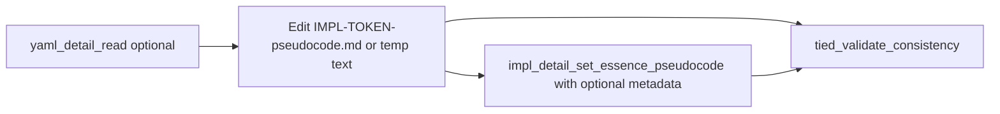

# Editing IMPL `essence_pseudocode` with the tied-yaml MCP (client guide)

**Audience**: Developers and agents in a **TIED client** project.

**Purpose**: How to work with the logical `essence_pseudocode` for an implementation decision. The on-disk **primary artifact** for the pseudo-code *body* is Markdown at **`tied/implementation-decisions/IMPL-{TOKEN}-pseudocode.md`**; tools merge it into the detail record. MCP/CLI and direct file edits are all first-class. For **what** to put in the body and how to validate in layers, see [pseudocode-writing-and-validation.md](pseudocode-writing-and-validation.md) and the methodology under `tied/docs/implementation-decisions.md`.

**Why this matters (YAML vs Markdown)**: Patching or hand-editing **detail YAML** (indices, `IMPL-*.yaml` for non-essence fields) without the **tied-yaml** stack risks broken quoting, indentation, or colons. That fragility does **not** apply to the **sidecar** file: it is plain UTF-8 text (Markdown in name; language-agnostic pseudo-code in content). You may use **any** preferred read/write path—editor, scripts, or **`impl_detail_set_essence_pseudocode`**. The MCP/CLI path remains valuable for very large bodies (JSON-from-file), and when you want one call to set the full body and optionally update **`metadata.last_updated`** on the detail record without touching other fields.

---

## 1. Concepts

### 1.1 Source of truth (on-disk order)

1. **`IMPL-TOKEN-pseudocode.md`** — the **primary artifact** for the pseudo-code body (logical `essence_pseudocode` string). Sidecar **wins** if both it and a legacy in-YAML field exist.
2. **`IMPL-TOKEN.yaml`** — other IMPL detail fields (name, traceability, `metadata`, and so on); **not** the place to embed a large new `essence_pseudocode` block in normal workflows.
3. **MCP/CLI** — presents **merged** `essence_pseudocode` on `yaml_detail_read` after reading YAML plus sidecar. Writes through **`impl_detail_set_essence_pseudocode`** or **`yaml_detail_update`** persist the body to the sidecar and keep YAML well-formed.

### 1.2 More concepts

- **Index vs detail**: Rows in `tied/implementation-decisions.yaml` do **not** include full `essence_pseudocode`. To read the body, use **`yaml_detail_read`** (or `yaml_detail_read_many`), not only `yaml_index_read`.
- **When to prefer MCP+CLI** for the body: **`impl_detail_set_essence_pseudocode`** (IMPL only) sets the **full** string (or loads it from a file path), optionally merges **`metadata.last_updated`**, and does not clobber other detail fields—prefer it over a massive **`yaml_detail_update`** for the same field, especially in automation. **Direct** `.md` edit is equivalent for bytes on disk; run **`tied_validate_consistency`** after either.
- **Same tool everywhere (optional path)**: The **Cursor MCP** server and the **CLI** (below) call the same `mcp-server` binary. For structure of the pseudo-code, see the [template in the shared doc](pseudocode-writing-and-validation.md#canonical-structure-for-essence_pseudocode).

### 1.3 Markdown sources (order of convenience)

1. **Direct** edit of **`tied/implementation-decisions/IMPL-TOKEN-pseudocode.md`** in the IDE—often the fastest; no `jq` or huge JSON. Run **`tied_validate_consistency`** when done.
2. **MCP** **`impl_detail_set_essence_pseudocode`** with **`essence_pseudocode_path`**: a path **under** `TIED_BASE_PATH` to a UTF-8 file whose contents replace the full sidecar body (avoids an enormous inline `essence_pseudocode` string in the tool arguments).
3. **Same tool** with an inline **`essence_pseudocode`** string for small bodies.
4. **`tied-cli.sh`**: set **`TIED_CLI_IMPL_ESSENCE_FILE`** to a markdown/text file, or **`TIED_CLI_IMPL_ESSENCE_STDIN=1`** and pipe or heredoc the body; the stdio client injects `essence_pseudocode` so the JSON file only needs `token` and optional **`metadata_last_updated`**. See the **`tied-cli.sh` header** (`.cursor/skills/tied-yaml/scripts/tied-cli.sh` or the bundled copy in the TIED source tree).
5. **`jq`** and a **JSON** payload with **`@rawfile`** (or a full inline string)—optional for automation, **not** the default recommendation when a direct `.md` edit or **path** parameter is available.

---

## 2. Prerequisites (client repository)

- **Node.js >= 18** on `PATH`.
- A **built** TIED `mcp-server` — build it in a clone of the TIED source tree:

  `npm install && npm run build --prefix mcp-server`

- **`TIED_MCP_BIN`**: absolute path to **`mcp-server/dist/index.js`** in that TIED build. Most client checkouts do **not** place `mcp-server/` at the project root; point to your TIED clone.
- **`TIED_BASE_PATH`**: absolute path to **this** project’s **`tied/`** directory (if unset, the CLI default is `<repo_root>/tied`).
- **CLI path**: In a client checkout, use the skill script:

  **`.cursor/skills/tied-yaml/scripts/tied-cli.sh`**

  (The path `tools/bundled-tied-yaml-skill/` exists in the TIED **source** repo, not in most client trees; see [AGENTS.md](../../AGENTS.md) §1.)

- **MCP in Cursor (optional)**: If **Settings → MCP** lists the `tied-yaml` server, you can call the same tool names in-editor. If not, the CLI still works with `TIED_MCP_BIN` and `TIED_BASE_PATH` set; see the [tied-yaml skill](../../.cursor/skills/tied-yaml/SKILL.md).

---

## 3. Efficient workflow

**Primary path** (any editor or tool): open **`tied/implementation-decisions/IMPL-TOKEN-pseudocode.md`**, edit, save, then run **`tied_validate_consistency`** (Layer A in [pseudocode-writing-and-validation.md](pseudocode-writing-and-validation.md#validation-layers), then the application checklist as your process requires).

**Optional path** (MCP+CLI, especially large payloads or metadata in one call):



1. **Confirm the active tree** (if unsure which `tied/` the tools use): call MCP **`tied_config_get_base_path`**, or ensure **`TIED_BASE_PATH`** is correct for the CLI. Wrong base path is a common footgun; see [yaml-update-mcp-runbook.md](yaml-update-mcp-runbook.md) §4.
2. **Read the current merged detail** (useful before a large replace, or to compare):

   `tied-cli.sh yaml_detail_read '{"token":"IMPL-…"}'`

3. **Edit the pseudo-code body** using either:
   - **Direct** edit of **`tied/implementation-decisions/IMPL-FOO-pseudocode.md`**, or a scratch file you then copy in; or
   - **`impl_detail_set_essence_pseudocode`**, which **replaces the full `essence_pseudocode` value** in one call (rewrites the sidecar), and can merge **`metadata.last_updated`**.

4. If you **only** edited the sidecar on disk, skip to step **6** (validate). If using **MCP+CLI** to write the body, prefer: **`essence_pseudocode_path`** in the tool args (path to a file under your `tied/`), or **`TIED_CLI_IMPL_ESSENCE_FILE`** on **`tied-cli.sh`** (JSON args without the body string), or **`TIED_CLI_IMPL_ESSENCE_STDIN=1`** with a pipe. Only if you need a single self-contained JSON file, you may use **`jq`** to embed the body, for example:

   ```bash
   jq -n --arg token "IMPL-YOUR-TOKEN" --rawfile code /path/to/essence.txt \
     '{token: $token, essence_pseudocode: $code, metadata_last_updated: {date: "2026-04-23", reason: "Refine pseudocode"}}' \
     > /tmp/impl-essence-payload.json
   ```
5. **Call the tool with args-from-file** — the second argument starts with `@` and points to your JSON (when not using the env based body):

   ```bash
   TIED_MCP_BIN=/path/to/tied/mcp-server/dist/index.js \
   TIED_BASE_PATH=/path/to/your-client/tied \
   .cursor/skills/tied-yaml/scripts/tied-cli.sh \
     impl_detail_set_essence_pseudocode @/tmp/impl-essence-payload.json
   ```

   The `tied-cli` wrapper copies non-`{}` args into a temp file internally as well, so you are not limited by `execve` environment size. Loading arguments from a **`@payload.json`** file also avoids shell escaping and keeps the model’s “tool argument” out of a single impossibly long chat line.
6. **Validate** when the change is done (or after a batch of related edits):

   `.cursor/skills/tied-yaml/scripts/tied-cli.sh tied_validate_consistency '{}'`

   Optional flags for scope (detail files, pseudocode checks) are listed in the TIED **mcp-server** README; see the **`impl_detail_set_essence_pseudocode`** section in [reference.md](../../.cursor/skills/tied-yaml/reference.md) and [yaml-update-mcp-runbook.md](yaml-update-mcp-runbook.md) §3.

---

## 4. In-editor (MCP) vs terminal vs direct file edit

- **Direct** edit of **`IMPL-*-pseudocode.md`** and **`tied_validate_consistency`** is a complete workflow. No MCP/CLI is required to change the pseudo-code body.
- **MCP in Cursor** (and **`tied-cli`**) expose **`impl_detail_set_essence_pseudocode`** with the same parameters (`token`, `essence_pseudocode`, optional `metadata_last_updated`).
- For **very large** `essence_pseudocode` strings, **JSON-from-file and `tied-cli.sh` … @payload.json`** (or the same from MCP) is often more reliable for automation than inlining the whole body in a single `tools/call` line.
- If you have **several** ordered index/detail updates in one **Node** process, the server also provides **`yaml_updates_apply`** (with `dry_run: true` to preview). For a change that is **only** a large IMPL pseudo-code body, use **`impl_detail_set_essence_pseudocode`** (or a direct sidecar write) rather than embedding that blob inside a generic `yaml_detail_update` step. See [yaml-update-mcp-runbook.md](yaml-update-mcp-runbook.md) §2–2.2.

---

## 5. Policy (do not short-circuit)

- **(a) Pseudo-code body (sidecar)** — **`IMPL-*-pseudocode.md`** may be created or updated with **any** read/write process. Afterward, run **`tied_validate_consistency`** (and project lint) so TIED can **qualify** the change against index/detail rules and the pseudo-code report. The sidecar is plain text; the usual YAML-escaping problems do not apply to this file.
- **(b) Other TIED YAML (indices, `IMPL-*.yaml` for fields other than editing the body via a supported path)** — follow the [tied-yaml skill](../../.cursor/skills/tied-yaml/SKILL.md) and [AGENTS.md](../../AGENTS.md): prefer **`tied-cli` / MCP** so emitted YAML stays valid. **`impl_detail_set_essence_pseudocode`** is a supported way to set the body and optional **`metadata.last_updated`**. Do not hand-edit YAML detail files in ways that the stack cannot reproduce without validation.
- If a tool is missing, document the one-line exception, do the minimal direct edit, then run **`tied_validate_consistency`** and lint. See [yaml-update-mcp-runbook.md](yaml-update-mcp-runbook.md) §1.
- If you cannot run Node or a built server, use the official fallback in [using-tied-without-mcp.md](using-tied-without-mcp.md); do not replace **consistency** checking with ad-hoc YAML parsers.

---

## 6. See also

- [pseudocode-writing-and-validation.md](pseudocode-writing-and-validation.md) — sidecar as source of the body, Layer A (TIED) vs Layer B (application checklist), and content rules for `essence_pseudocode`.
- [yaml-update-mcp-runbook.md](yaml-update-mcp-runbook.md) — routing, small payloads, timeouts, goal → tool table.
- [tied-yaml-agent-index.md](tied-yaml-agent-index.md) — central index to other TIED YAML / MCP docs.
- [tied-yaml skill](../../.cursor/skills/tied-yaml/SKILL.md) and [reference.md](../../.cursor/skills/tied-yaml/reference.md) — full CLI and MCP tool catalog, including `impl_detail_set_essence_pseudocode` parameters.
- [detail-files-schema.md](detail-files-schema.md) — field shapes for detail files.

---

*This file is part of the TIED documentation tree under `tied/docs/`; client projects that sync TIED can share or vendor the same path.*
