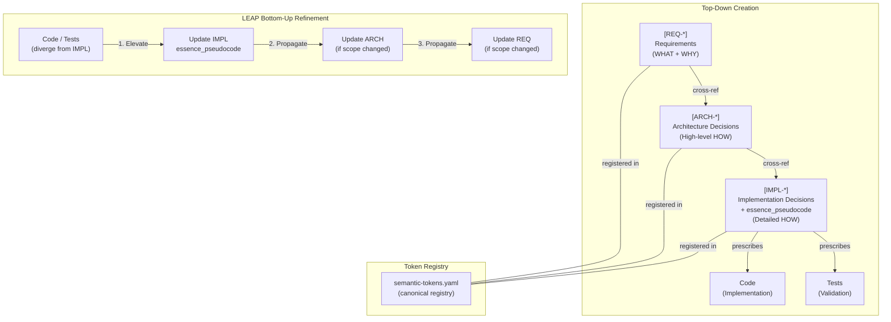
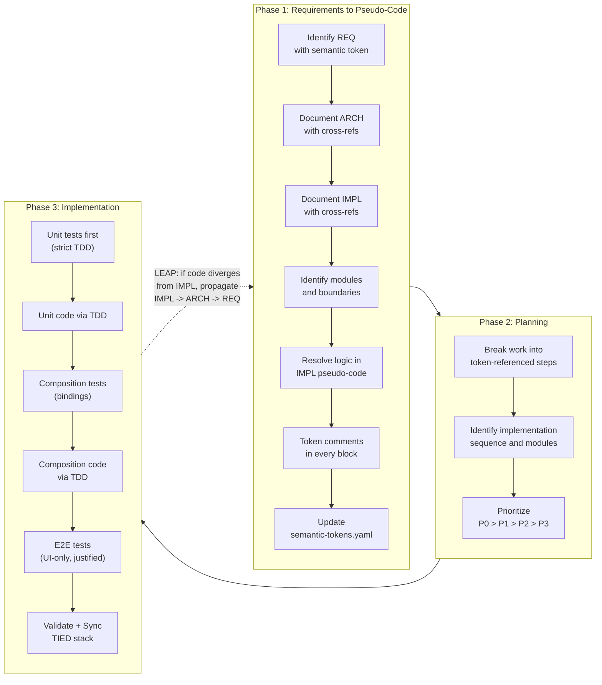
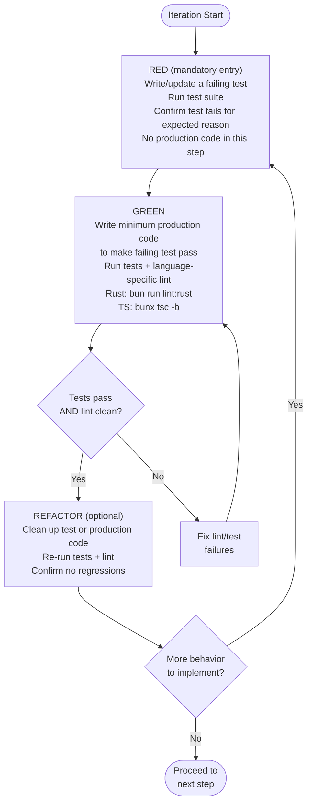
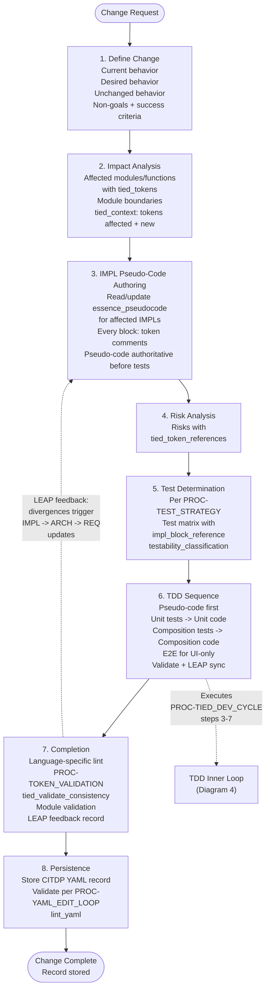
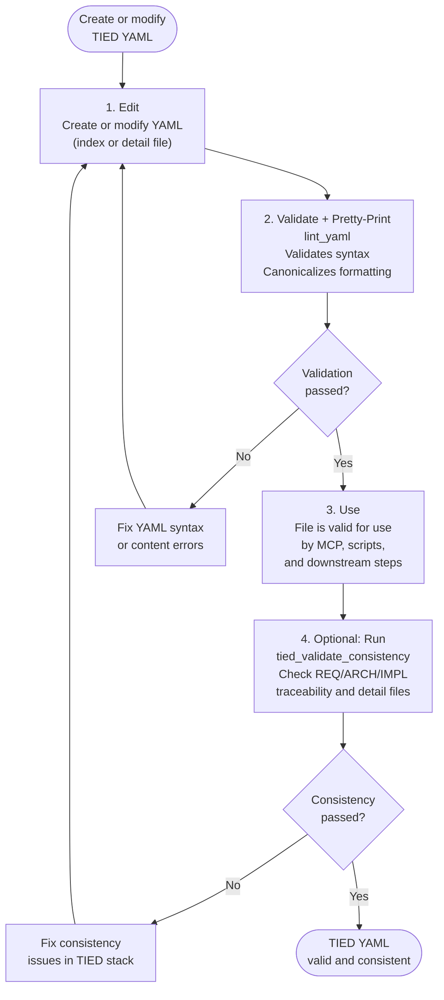
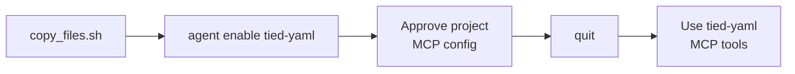

# LEAP+TIED+CITDP Methodology Diagrams

**TIED Methodology Version**: 2.2.0

Six diagrams capture the core methodology: the traceability stack, the three development phases, the LEAP bidirectional loop, the full dev-cycle session workflow, the TDD inner loop, and the CITDP change-analysis procedure. A short **New client setup — Cursor** section at the end shows bootstrap and `agent enable tied-yaml` for MCP.

**Related documents**: [LEAP.md](LEAP.md), [implementation-order.md](implementation-order.md), [processes.md](processes.md), [ai-principles.md](./ai-principles.md)

---

## Diagram 1 — TIED Traceability Stack with LEAP Propagation

The core DAG (REQ → ARCH → IMPL → Tests/Code) and the LEAP bidirectional arrows. This is the foundational mental model: top-down creation flows requirements into architecture, then implementation pseudo-code, then tests and code. When TDD or E2E reveal divergence, LEAP propagates changes bottom-up through the same stack.



---

## Diagram 2 — Three Development Phases

The high-level flow from requirements through planning to implementation, with LEAP feeding back. Phase 1 produces the documentation and pseudo-code. Phase 2 breaks work into prioritized, token-referenced steps. Phase 3 implements via strict TDD with composition and E2E layers. LEAP closes the loop when code diverges from IMPL.



---

## Diagram 3 — PROC-TIED_DEV_CYCLE (Full Session Workflow)

All 11 steps of a development session. Steps 1–2 are documentation-first (plan and author TIED docs with pseudo-code). Steps 3–7 form the code-generation inner loop governed by TDD (see Diagram 4 for the per-iteration cycle). Steps 8–11 validate, sync, and commit. The LEAP arrow from step 9 back to step 2 fires when code diverged from IMPL during TDD.

```mermaid
flowchart TD
    Start(["Session Start"]) --> S1

    S1["1. Plan from TIED\nRead REQ/ARCH/IMPL\nResolve logic in pseudo-code"]
    S2["2. Author TIED docs\nUpdate REQ/ARCH/IMPL\nComplete essence_pseudocode\nToken comments in every block"]

    S1 --> S2

    S2 --> S3

    subgraph innerLoop ["Code-Generation Inner Loop (steps 3-7)"]
        S3["3. Unit tests first\nConform to IMPL pseudo-code\nStrict TDD: tests before code"]
        S4["4. Unit code via TDD\nCode satisfies tests\nLogic in testable modules"]
        S5["5. Composition tests first\nFor every binding between units\nFailing test before composition code"]
        S6["6. Composition code via TDD\nWiring/binding satisfies tests\nNo composition code without failing test"]
        S7["7. E2E tests\nOnly for UI-invocation behavior\nJustify why not composition-level"]

        S3 --> S4 --> S5 --> S6 --> S7
    end

    S7 --> S8
    S8["8. Validate + close test gaps\nRun full test suite\nRun PROC-TOKEN_VALIDATION"]
    S9["9. Sync TIED to code/tests\nUpdate REQ/ARCH/IMPL to match\nSync semantic-tokens.yaml"]
    composition-integration["10. Update README + CHANGELOG"]
    end-to-end-ui["11. Write commit message\nper PROC-COMMIT_MESSAGES"]

    S8 --> S9 --> composition-integration --> end-to-end-ui

    end-to-end-ui --> Done(["Session Complete"])

    S9 -.->|"LEAP: if code diverged\nfrom IMPL during TDD\nupdate IMPL -> ARCH -> REQ"| S2
```

---

## Diagram 4 — TDD Inner Loop (RED-GREEN-REFACTOR per Iteration)

Each iteration within steps 3–7 of the dev cycle follows this mandatory cycle. RED is the only entry point: every iteration starts with a failing test. GREEN writes minimum production code. A lint gate (language-specific: Rust via `bun run lint:rust`, TypeScript via `bunx tsc -b`) blocks progress until tests pass and lint is clean. REFACTOR is optional. The loop repeats until all behavior for the current step is covered.



---

## Diagram 5 — CITDP Change Impact and Test Design Procedure

The 8-step `[PROC-CITDP]` procedure for analyzing and planning behavior changes. Steps 1–5 produce the analysis record (change definition, impact, pseudo-code authoring, risk, test determination). Step 6 executes the TDD sequence via PROC-TIED_DEV_CYCLE. Step 7 runs completion gates (lint, token validation, consistency, module validation) and records LEAP feedback when divergences occurred. Step 8 persists the CITDP YAML record through the YAML edit loop.



---

## Diagram 6 — YAML Edit Loop and Token Validation

The `[PROC-YAML_EDIT_LOOP]` that governs all TIED YAML changes. No TIED record (index or detail) is valid for use until it passes this loop. Step 1 edits the file. Step 2 validates syntax and canonicalizes formatting with **`lint_yaml`** (see `processes.md` for definition; each path processed independently—never raw multi-argument `yq` pretty-print). On failure, fix and repeat. Step 3 marks the file as valid for use by MCP, scripts, and downstream steps. Step 4 optionally runs `tied_validate_consistency` to check cross-file traceability; failures feed back to step 1.



---

## New client setup — Cursor

Sequence for configuring a **new TIED client** when using **Cursor**: bootstrap writes `.cursor/mcp.json`; the **Cursor Agent CLI** step enables the MCP server in the workspace.



Run `agent enable tied-yaml` from the **client project** directory after `copy_files.sh`. Approve the update when Cursor prompts you. Type **`quit`** to exit the `agent` UI. See [README.md](../README.md) (Getting Started with a New Project) and [adding-tied-mcp-and-invoking-passes.md](adding-tied-mcp-and-invoking-passes.md).
