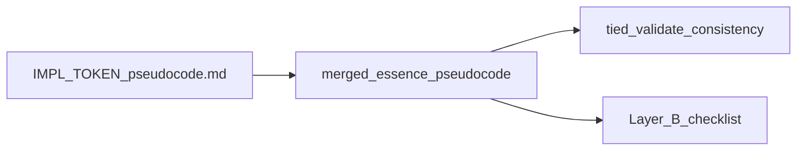

# TIED pseudocode format and practices (cross-project standardization)

**In a TIED project tree:** the detailed how-to and validation order live in [pseudocode-writing-and-validation.md](pseudocode-writing-and-validation.md) ([PROC-PSEUDOCODE_VALIDATION]). The **language-agnostic** rule for **literal copy of block lead comments** from IMPL into tests and code is in [pseudocode-writing-and-validation.md § Block lead and literal copy](pseudocode-writing-and-validation.md#block-lead-and-literal-copy-in-tests-and-code). The **canonical copy-paste** Markdown for new sidecar bodies is [templates/impl-essence-pseudocode-template.md](../../templates/impl-essence-pseudocode-template.md).

---

## 1. Canonical storage

- The logical field is **`essence_pseudocode`** on each **IMPL** detail record in TIED.
- The **on-disk source of truth** for the body (recommended default) is a **sidecar** file:  
  `tied/implementation-decisions/IMPL-{TOKEN}-pseudocode.md`  
  (UTF-8, Markdown in structure; language-agnostic pseudo-code in content). Tooling merges this into the detail record for APIs and validation.
- **Strong preference:** as soon as a project or IMPL becomes **non-trivial** (multiple blocks, cross-IMPL flow, long bodies, or frequent review), the sidecar should be the only place the large body lives; **do not** scale up inline `essence_pseudocode` in `IMPL-*.yaml`.
- **Do not** embed large `essence_pseudocode` inline in `IMPL-*.yaml` in normal workflows—YAML quoting breaks easily; the sidecar is **diffable** in review.
- Before any automated write to TIED via MCP, confirm the effective base path is **this** project’s `tied/` (misconfigured `TIED_BASE_PATH` can write another repo’s tree silently).

---

## 2. Purpose and quality bar for `essence_pseudocode`

- It is the **authoritative and primary source of implementation logic**. Resolve logical and **flow** issues in pseudo-code **before** writing tests or production code; tests and code are derived from it and must stay aligned.
- **No code chunks are allowed** in `essence_pseudocode`: do not include language-specific source snippets, compilable fragments, or pasted production/test code blocks.
- It supports **collision detection**: when IMPLs are composed or share code paths, compare blocks to see overlapping steps, shared **DATA**, ordering, and conflicting assumptions.
- **Algol-style** readability: explicit control flow (IF/ELSE, loops, ON/WHEN), explicit **INPUT** / **OUTPUT** / **DATA** (and **CONTROL** when relevant), procedure names often in **UPPER_SNAKE**.
- **One action per step** (or one small coherent block). Avoid long lines that mix many actions; that weakens review and differencing.
- **Traceability to tests:** key branches and procedures should map to test names or structure (e.g. one procedure or branch to one test section), so drift is detectable. Optionally mark test level at a block (e.g. `unit-testable: …`, `E2E-only: …` with a short reason) when policy requires.

---

## 3. Block token rules `[PROC-IMPL_PSEUDOCODE_TOKENS]`

TIED uses bracket tokens in plain text. **Every block** in `essence_pseudocode` (including the merged Markdown) must be traceable:

- **Top-level (file or outer block):** One comment (or first list item) that **names** the relevant `[IMPL-*]`, `[ARCH-*]`, and `[REQ-*]` and gives a **one-line summary** of what the block implements.
- **Sub-blocks** that implement the **same** REQ/ARCH/IMPL set: state only the **how** (repeat the full token list is optional).
- **Sub-blocks** that implement a **different** set (e.g. another IMPL, extra REQ): open with a line listing that set and **how** that sub-block implements it.
- In **Markdown** sidecars, the “comment” is usually the first **bullet** line in a section or a line starting with tokens in brackets. Tied validation can require bracketed `[REQ-*]`, `[ARCH-*]`, `[IMPL-*]` to appear on lines in the merged string—place them where your project’s gate expects them (commonly the first substantive line of each H2 block).

---

## 3a. Block lead comments in source and tests (literal copy)

- **IMPL grammar** in `essence_pseudocode` is defined by the TIED vocabulary in §2 and §4—not by any product programming language.
- For **each** logical block, the **block lead** line(s) that satisfy `[PROC-IMPL_PSEUDOCODE_TOKENS]` (REQ/ARCH/IMPL naming + *how* / one-line summary per block rules) **must be copied literally** into:
  - the test locus for that block, and
  - the managed production (or equivalent) locus for that block,
  using **only** that language’s **comment** delimiters (e.g. `//`, `#`, `/* */`); the **string content** of the lead must match the pseudocode block (no paraphrase).
- **Not required:** pasting the full procedure body, `INPUT`/`OUTPUT` **lines as code**, or entire H2 sections into every file. Algorithm lives in TIED; executable logic lives in source. See the full spec: [pseudocode-writing-and-validation.md § Block lead and literal copy](pseudocode-writing-and-validation.md#block-lead-and-literal-copy-in-tests-and-code).

**Minimal shape (illustrative):** If the first substantive line in the H2 is `- [REQ-X] [ARCH-Y] [IMPL-Z] How: ...`, the same line (after any project-normalized leading marker) appears as a comment at the top of the matching test and the matching implementation unit.

---

## 4. Preferred vocabulary (comparable across IMPLs)

Use these keywords consistently so different IMPLs and tooling stay comparable.

| Category | Keywords / forms |
|----------|------------------|
| Contract | **INPUT**, **OUTPUT**, **DATA**, **CONTROL** (use CONTROL for flags, environment, or policy not pure data) |
| Events / conditions | **ON**, **WHEN** |
| Effects | **SEND**, **BROADCAST**, **RETURN** |
| Branches | **IF**, **ELSE** |
| Procedures | **UPPER_SNAKE** (e.g. `NORMALIZE_INPUT`); **camelCase** is acceptable when mirroring real API names |
| Loops | `FOR item IN collection`, or `FOR each (k, v) IN map` |
| Errors | **ON error** / **ON failure**; **RETURN error**; **EXIT failure**; **CATCH e RETURN …** — pick **one** style per IMPL and stick to it |
| Async | **AWAIT**; name **Promise** in OUTPUT when the result is async; **SEND** for message-style async |
| Shapes (optional) | **(list)**, **(map)**, `{ key, key? }` — stay language-agnostic |

**Sequence:** Use numbered steps `1.`, `2.`, … for fixed order; indent under a procedure or **ON** / **WHEN** for the body. Start substantive blocks with a **Contract** line and/or **INPUT:** / **OUTPUT:** / **DATA:** / **CONTROL:** so two IMPLs can be compared by contract.

**Placeholders:** For IMPLs still in draft/Template state, a stub is acceptable: a line `Template: placeholder for …` plus minimal INPUT/OUTPUT (e.g. “(to be defined)”). For **Active** status, the pseudo-code should be **complete** (no Template stub line).

---

## 5. Recommended template (copy into `IMPL-{TOKEN}-pseudocode.md`)

The **single** maintained copy of the hand-authored template body is the file **[`templates/impl-essence-pseudocode-template.md`](../../templates/impl-essence-pseudocode-template.md)** in a TIED methodology repository. Copy from below the `---` line in that file into `tied/implementation-decisions/IMPL-{TOKEN}-pseudocode.md`, then fill `{…}` placeholders, remove unneeded sections, and keep **one H1** with **H2** for every logical block.

**H2 titling (project chooses one convention and documents it):**

- Per **automated test** (e.g. `` `foo::bar_test` ``) if tests drive the catalog.
- Per **domain** (e.g. “Auth”, “mdtest harness”) for integration-style IMPLs.
- Per **symbol or module** (e.g. `` `crate::module::function` ``) for production-oriented specs.

**Optional test-harness fields** (when blocks describe tests): `FILE:`, `GATE:`, `TEST:`, `HARNESS:` in list form, consistent with the rest of the file.

**Cross-IMPL blocks** should always spell out **COMPOSITION_ORDER**, **which IMPL owns DATA vs output**, and **no duplicate logic** for the same concern.

---

## 6. Two validation layers

**Layer A — TIED (mandatory for changed essence):** Run **`tied_validate_consistency`** with default options so **`include_pseudocode`** runs. This checks the **merged** `essence_pseudocode` (sidecar + YAML) against indexes, token references, and TIED’s pseudo-code rules. Do this after any edit to the sidecar or after setting essence via API/CLI.

**Layer B — Application (optional depth, project-scaled):** A checklist covering parsing, schema/shape, contracts, dependency/coverage, traceability to tests, and optional lint/simulation. If the project has **no** custom grammar parser, treat each **H2 section** (or the project’s defined “block”) as one unit for **manual** Layer B review. A minimal Layer B should still require: **TIED-POE-001** (do not use Layer B alone; Layer A must pass for the same text).

**Recommended order for a full application pass (when you run Layer B as a process):** tied data → parsing → schema → symbol resolution → contract validation → dependency graph → behavioral coverage → traceability → optional lint / semantic simulation / generation readiness → reporting. **Tailor** which categories are gating (e.g. pre-code vs after tests) per project policy.

**Severity:** **error** = fix or waive with documentation; **warning** = should address; **info** = no gate.

---

## 7. Editing and automation workflow

- **Preferred:** Open `IMPL-{TOKEN}-pseudocode.md` in the editor, save, run Layer A.
- **Large bodies / CI:** Set essence via the TIED tool that accepts a **file path** to the sidecar (or a temp file), or a CLI that pipes stdin—avoid multi-megabyte **inline JSON** strings in shell.
- If both an inline field and a sidecar exist, **the sidecar wins** in typical merges—do not let stale YAML inline duplicate the body.

**Machine vs hand (declare per IMPL or repo):**

| Mode | Rule |
|------|------|
| **Hand-authored** | The sidecar is the editable artifact. No script overwrites it, or the script is off by default. |
| **Machine-owned (full or partial)** | Authoritative change happens in **generator inputs** (e.g. NORM comments in test sources). Re-run the project script. **Do not** hand-edit generated regions. If the repo uses a **marker** (e.g. a line that begins a generated tail), do not hand-edit **below** that line. |

**Optional extra anchors (does not replace literal block leads):** In **Rust** only, a well-formed `/* */` block **above** a function can provide narrative or **mirror** a sidecar H2 for human orientation; `///` remains for public rustdoc, sidecar for full traceability. In **any** language, a file-header pointer to `tied/.../IMPL-{TOKEN}-pseudocode.md` and an H2 or block name is optional. These patterns **do not** replace the mandatory **§3a** rule: the **block lead** text for each block must still appear **verbatim** (in comments) at the implementing test and code sites, per [pseudocode-writing-and-validation.md § Block lead and literal copy](pseudocode-writing-and-validation.md#block-lead-and-literal-copy-in-tests-and-code).

---

## 8. Recommendations for all TIED-based projects (checklist)

1. **Adopt the sidecar** as default for `essence_pseudocode` (UTF-8 Markdown path above).
2. **Use the template in §5** (or a strict superset) so H1/H2, contracts, and token lines stay uniform across IMPLs.
3. **Apply §3a** (literal **block lead** in tests and code) for every in-scope block.
4. **Embed preferred vocabulary (§4)** in team conventions.
5. **Enforce [PROC-IMPL_PSEUDOCODE_TOKENS] (§3)** in review and in Layer A.
6. **Run Layer A** after every pseudocode/sidecar change; add **Layer B** in proportion to reliance on pseudo-code as the spec of record.
7. **Document** whether each IMPL’s sidecar is hand-authored or script-owned; document block boundaries for any generator.
8. **Treat test/code logic drift as LEAP input**: when tests or code contain logic missing from pseudocode, translate it into pseudocode first, then assess ARCH/REQ propagation.
9. **For cross-IMPL work**, use explicit composition and ownership (see template and §2 collision detection).
10. **Process token:** Reference **`[PROC-PSEUDOCODE_VALIDATION]`** in project process docs for “when to validate.”

---

## 9. What to leave project-specific (do not globalize)

- Exact **H2** title pattern (backtick test id vs `module::symbol` vs human title).
- **Source** comment style (e.g. Rust `//` NORM, another language, or no extract pipeline).
- **Strictness and timing of Layer B** (full gate before any code vs after first tests).
- Optional **adapters** (e.g. scripts that regenerate sidecars or YAML tails from tests)—naming, paths, and whether they are required in CI are per repo.

---

## 10. Summary one-liner

**Standardize on:** `IMPL-{TOKEN}-pseudocode.md` as canonical `essence_pseudocode`, the **template file** [`templates/impl-essence-pseudocode-template.md`](../../templates/impl-essence-pseudocode-template.md) (same content as §5) plus **vocabulary in §4**, **token comments on every block (§3)**, **§3a literal block-lead copy** into tests and code, **Layer A after every change**, **Layer B as scaled**, and a clear **hand vs machine** policy for each generated path.

---

## 11. Using this plan elsewhere

To adopt in another repository: copy **§1–§10** into that project’s internal standards or `tied/docs`, and copy **[`templates/impl-essence-pseudocode-template.md`](../../templates/impl-essence-pseudocode-template.md)** (or vendor the same file under your tree); replace `{TOKEN}` examples with the project’s naming; add any project-specific H2 rule or script names in a **short** local preface. Keep methodology **process token** names if the project follows TIED.
