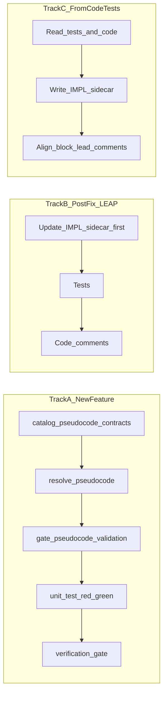
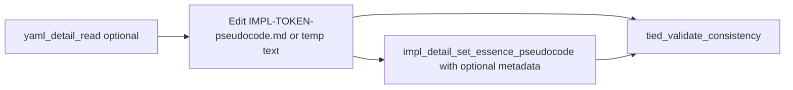
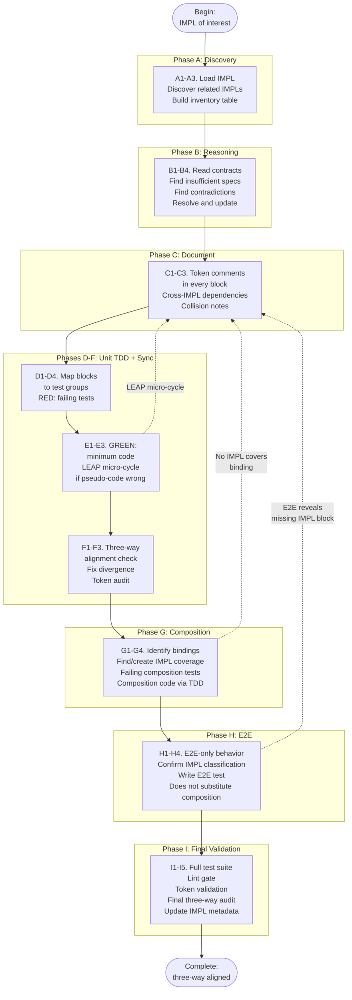

# Writing, Editing, and Validating IMPL Pseudo-Code

**Audience**: Humans and AI agents in TIED client projects—especially (1) **new features / REQ work** coordinated with [agent-req-implementation-checklist.yaml](agent-req-implementation-checklist.yaml) and (2) **post-fix realignment** when code or tests changed before IMPL was updated.

**Process tokens:** `[PROC-PSEUDOCODE_VALIDATION]`, `[PROC-IMPL_PSEUDOCODE_TOKENS]`, `[PROC-IMPL_CODE_TEST_SYNC]`, `[PROC-LEAP]`, `[PROC-AGENT_REQ_CHECKLIST]`.

**Purpose**: Single guide for IMPL **`essence_pseudocode`**: where it lives on disk, how to edit it (editor vs MCP/CLI), **literal linkage** to tests and production code, **three-way alignment** from discovery through TDD to composition/E2E, **LEAP** when logic drifts, and **validation** (Layer A TIED + Layer B application checklist). The machine-readable Layer B definition remains [pseudocode-validation-checklist.yaml](pseudocode-validation-checklist.yaml).

**Related (portable / template):** [pseudocode-format-and-practices.md](pseudocode-format-and-practices.md). Canonical sidecar body template: [templates/impl-essence-pseudocode-template.md](../../templates/impl-essence-pseudocode-template.md). RSpec/Bats in IMPL sidecars: [pseudocode-rspec-bats-policy.md](pseudocode-rspec-bats-policy.md).

---

<a id="definition-of-impl-pseudocode"></a>

## Definition of IMPL pseudocode

IMPL **`essence_pseudocode`** (usually in a [sidecar](#canonical-structure-for-essence_pseudocode)) is:

- **Language-agnostic** — It uses the **TIED IMPL vocabulary** (contracts, procedures, control flow), not a product programming language. It defines the **behavior** of each logical block in terms of that vocabulary and the **[IMPL-*]**, **[ARCH-*]**, and **[REQ-*]** decisions the block implements—never pasted host-language source ([PROC-IMPL_PSEUDOCODE_TOKENS]).
- **Synchronized in block format** — Each logical block (typically one Markdown `##` section) is the unit of traceability. The **block lead** (and optionally the full block per project policy) is **copied literally** into matching test and production sites so IMPL, tests, and code stay aligned ([PROC-IMPL_CODE_TEST_SYNC]; [Block lead](#block-lead-and-literal-copy-in-tests-and-code)).
- **LEAP-gated when scope shifts** — Changes to pseudocode that alter behavior or requirement/architecture scope are validated with **[PROC-LEAP]**: update IMPL first, then propagate to ARCH and REQ so the stack stays consistent ([LEAP micro-cycle](#leap-micro-cycle-and-post-fix-recovery); [processes.md](processes.md) § LEAP).

Machine-readable validation rules: [pseudocode-validation-checklist.yaml](pseudocode-validation-checklist.yaml). Template body: [templates/impl-essence-pseudocode-template.md](../../templates/impl-essence-pseudocode-template.md).

---

## Table of contents

1. [Definition of IMPL pseudocode](#definition-of-impl-pseudocode)
2. [Choose your path](#choose-your-path) — Track A (new feature), Track B (fix already implemented), Track C (code/tests without pseudo-code)
3. [Foundations: how to write IMPL pseudo-code](#foundations-how-to-write-impl-pseudo-code)
4. [Block lead and literal copy in tests and code](#block-lead-and-literal-copy-in-tests-and-code)
5. [Mechanics: editing the sidecar (MCP and CLI)](#mechanics-editing-the-sidecar-mcp-and-cli)
6. [Three-way alignment and phases A through I](#three-way-alignment-and-phases-a-through-i)
7. [LEAP micro-cycle and post-fix recovery](#leap-micro-cycle-and-post-fix-recovery)
8. [Validation layers](#validation-layers)
9. [When to run validation](#when-to-run-validation)
10. [Repository-specific notes](#repository-specific-notes)
11. [References](#references)

<a id="choose-your-path"></a>

## Choose your path

Use this section to jump to the workflow that matches your situation.



<a id="track-a-new-feature-req"></a>

### Track A — New feature / new REQ (`[PROC-AGENT_REQ_CHECKLIST]`)

Executable step-by-step procedure: [agent-req-implementation-checklist.md](agent-req-implementation-checklist.md) and [agent-req-implementation-checklist.yaml](agent-req-implementation-checklist.yaml). **Pseudo-code is authored and validated before RED tests**; tests and code follow IMPL.

| Checklist slug (YAML) | Role for pseudo-code | Where in this document |
|----------------------|----------------------|-------------------------|
| `catalog-pseudocode-contracts` (Phase B) | Read `essence_pseudocode`; extract INPUT/OUTPUT/DATA, PRE/POST/EFFECTS/FAILURE_MODES/DATA_TRANSITION/TERMINATION, procedures, branches | [Three-way alignment § Phase B](#phase-b--reasoning); [Foundations](#foundations-how-to-write-impl-pseudo-code) |
| `flag-insufficient-specs` / `flag-contradictory-specs` | Feed `resolve-pseudocode` | Phase B |
| `resolve-pseudocode` | Edit IMPL sidecar; compatible contracts; every block token-commented | Phase B–C; [Block lead](#block-lead-and-literal-copy-in-tests-and-code) |
| `gate-pseudocode-validation` | Layer A + pre-RED structural Layer B pass | [Validation layers](#validation-layers) (Pre-RED vs post-test) |
| `persist-implementation-records` | IMPL YAML detail + sidecar consistent; `tied_validate_consistency` | [Mechanics](#mechanics-editing-the-sidecar-mcp-and-cli); [detail-files-schema.md](detail-files-schema.md) |
| `unit-test-red` / `unit-test-green` | Literal block leads (or full blocks per policy) in tests then code | [Block lead](#block-lead-and-literal-copy-in-tests-and-code); Phases D–F |
| `composition-integration` | IMPL describes bindings; composition tests + code | Phase G |
| `verification-gate` | `sub-pseudocode-validation-pass` — full Layer B including **minimum_gating_rules** | [Validation layers](#validation-layers) (Pre-RED vs post-test) |
| `traceable-commit` | Suite green; token validation; IMPL metadata | Phase I |

**Mandatory global sequence** (from checklist): token-commented IMPL `essence_pseudocode` → `gate-pseudocode-validation` → `persist-implementation-records` when authoring new IMPL **before** RED tests or production implementation files.

<a id="track-b-fix-implemented-drift"></a>

### Track B — Fix already implemented (pseudo-code likely out of date)

Use this when a **fix landed in code/tests** (or both) without a prior IMPL update. **Do not** leave IMPL as the stale layer.

1. **Identify scope** — Which IMPL tokens and logical blocks describe the changed behavior? Use discovery paths in [Phase A](#phase-a--discovery) if needed.
2. **Update IMPL first** — Edit `tied/implementation-decisions/IMPL-{TOKEN}-pseudocode.md` so contracts and steps match the **intended** fix ([PROC-LEAP]: propagate to ARCH/REQ if scope changed).
3. **Run Layer A** — `tied_validate_consistency` after sidecar changes; `lint_yaml` on touched IMPL detail YAML per [PROC-YAML_EDIT_LOOP].
4. **Update tests** — Align assertions and **literal** block lead (or full-block) comments with the revised sidecar.
5. **Update production code** — Same literal traceability text at implementing loci; product logic matches IMPL.
6. **Layer B** — Run full checklist pass when executable tests exist (verification-gate context); otherwise structural subset only (see [Validation layers](#validation-layers)).
7. **Metadata** — Refresh `traceability.tests`, `code_locations`, `metadata.last_updated` on affected IMPL detail records.

This is the same **IMPL → test → code** order as the [LEAP micro-cycle](#leap-micro-cycle-and-post-fix-recovery), applied as **recovery** after an out-of-order fix.

<a id="track-c-code-and-tests-without-pseudocode"></a>

### Track C — Code and tests exist; pseudo-code does not (brownfield retrofit)

Use when **production code and tests already implement the behavior** but **`IMPL-*-pseudocode.md` is missing, empty, or no longer matches** what tests and code do. You are **reverse-documenting** implemented behavior into language-agnostic pseudo-code, then aligning **literal block leads** in tests and code ([PROC-IMPL_CODE_TEST_SYNC]).

**Evidence order for this track:** read **tests and code** → author or refresh **IMPL sidecar** → sync **comments** (and optional full-block copies per policy). Do **not** rewrite passing tests or product logic except to fix comments/traceability or documented bugs.

**Executable agent prompt (copy-paste):** [impl-pseudocode-from-code-agent-prompt.md](impl-pseudocode-from-code-agent-prompt.md).

If REQ/ARCH/IMPL indexes are thin, seed traceability with [PROC-TIED_BOOTSTRAP_FROM_TESTS] in [processes.md](processes.md) before Track C.

---

<a id="foundations-how-to-write-impl-pseudo-code"></a>

## Foundations: how to write IMPL pseudo-code

The **logical** field is `essence_pseudocode` on the IMPL detail record. For project IMPLs, the **on-disk** source of that string is **`tied/implementation-decisions/IMPL-{TOKEN}-pseudocode.md`**, not an inline YAML block in `IMPL-{TOKEN}.yaml`. Tools merge the sidecar when present. Do not add new inline `essence_pseudocode` in the detail YAML in normal workflows.

The merged field is the **primary and authoritative source of implementation logic**; tests and code are derived from it and must stay aligned ([PROC-IMPL_PSEUDOCODE_TOKENS], [PROC-LEAP]).

### Sidecar preference (growing complexity)

**Strong preference:** use the **sidecar** for any **non-trivial** pseudo-code—multiple H2 blocks, cross-IMPL composition, long or frequently reviewed bodies, or as the team or IMPL set grows. Sidecars are diff-friendly and avoid YAML multiline/quoting problems. **Inline** `essence_pseudocode` in `IMPL-*.yaml` is acceptable only for small, **stable** single-block stubs.

<a id="canonical-structure-for-essence_pseudocode"></a>

### Canonical structure for essence_pseudocode

Hand-authored IMPL bodies usually start from [templates/impl-essence-pseudocode-template.md](../../templates/impl-essence-pseudocode-template.md) (copy the Markdown after the `---` separator into `IMPL-{TOKEN}-pseudocode.md`). For a standalone summary of vocabulary and validation, see [pseudocode-format-and-practices.md](pseudocode-format-and-practices.md).

**markdown_exec project conventions (this repo):** File title uses H1 with bracket tokens in order **IMPL, ARCH, REQ** (stay consistent with [implementation-decisions.md](implementation-decisions.md) top-level naming). Open with `## Summary contract` when the IMPL needs file-level INPUT/OUTPUT/DATA (and PRE/POST/EFFECTS when documenting a shared Active contract) before the first runtime H2. Under `## EMBEDDED_MINITEST: …`, express each block lead as a **list item** (`- [IMPL-…] [ARCH-…] [REQ-…] …`), not a second H1. Prefer **language-agnostic** steps in CONTRACT/CONTROL/EFFECTS.

### Writing rules (summary)

- **Mandatory structure**: Address all logical and flow issues in essence **before** writing tests or code.
- **No code chunks in pseudocode (mandatory)**: `essence_pseudocode` must not contain language-specific snippets or pasted production/test code. Keep logic language-agnostic.
- **Contract block**: Use explicit `INPUT:`, `OUTPUT:`, `DATA:` when needed, plus precision fields for new/changed Active procedure blocks: `PRE:`, `POST:`, `EFFECTS:`, and when applicable `FAILURE_MODES:`, `DATA_TRANSITION:`, `TERMINATION:`; `CONTROL:` when env/flags/ordering matter. Procedure names in UPPER_SNAKE or camelCase.
- **One action per step**: Each logical step expresses one clear action or decision.
- **Token comments in every block** ([PROC-IMPL_PSEUDOCODE_TOKENS]): Every block names the relevant REQ, ARCH, and IMPL tokens and states **how** the block implements them. When listing all three in one line, use bracket order **IMPL, ARCH, REQ** (same as the top-level file heading). Top-level file heading: `# [IMPL-X] [ARCH-Y] [REQ-Z]` (H1). Sub-blocks with the same token set: *how* only. Sub-blocks with a different set: full token list and *how*.
- **Preferred vocabulary**: INPUT, OUTPUT, DATA, CONTROL; PRE, POST, EFFECTS, FAILURE_MODES, DATA_TRANSITION, TERMINATION; ON, WHEN; IF, ELSE; ON error, RETURN error; AWAIT, Promise. Full list and requiredness: [implementation-decisions.md](implementation-decisions.md).
- **Collision detection**: When IMPLs compose or share code paths, document ordering, shared data, EFFECTS rows, and PRE/POST conditions.
- **LEAP drift rule**: If tests or code contain logic not in pseudocode, update IMPL first, then ARCH/REQ if needed.

**Full methodology:** [implementation-decisions.md](implementation-decisions.md) — mandatory essence, vocabulary, sequence, managed code.

---

<a id="block-lead-and-literal-copy-in-tests-and-code"></a>

## Block lead and literal copy in tests and code

This section defines **language-agnostic** rules linking per-block text in IMPL `essence_pseudocode` to **tests** and **managed production code**. File-scoped layout for this repository: [source-file-impl-traceability.md](source-file-impl-traceability.md).

### IMPL grammar vs host languages

- **`essence_pseudocode`** uses the **TIED IMPL vocabulary**, not JavaScript, Go, Ruby, etc.
- **Do not** paste host-language source into `essence_pseudocode`.
- **Authoritative logic** lives in IMPL; tests and code implement and verify it.

### Block lead comment (what is copied)

For each **logical block** in `essence_pseudocode` (often one H2 in Markdown):

The **block lead comment** is the line or contiguous comment lines at the **start** of that block that satisfy `[PROC-IMPL_PSEUDOCODE_TOKENS]`: naming of REQ, ARCH, and IMPL (when all three appear in one line, use **IMPL, ARCH, REQ** bracket order) and **how** the block implements them, plus one-line summary where required—see [implementation-decisions.md](implementation-decisions.md) § Token comments in every block.

**Copy literally:** the **exact** bytes of those lines (after list markers or `#` only if the sidecar uses that shape consistently). The same text must appear at each test and production locus, wrapped only in the host language’s **comment** syntax. **No paraphrase; no re-ordering of tokens** unless the pseudocode block was updated first and LEAP applied.

**Default mode (global TIED minimum):** Only the **block lead** is mirrored in source. Procedure steps and `INPUT`/`OUTPUT`/`DATA` lines stay **sidecar-only**; source expresses the algorithm in the product language.

<a id="full-block-duplication-this-repository"></a>

### Full block duplication (this repository)

**Policy:** For source files and tests covered by [source-file-impl-traceability.md](source-file-impl-traceability.md), each logical block that maps to an implementing or verifying locus carries a host-language block comment with:

1. The **literal block lead** (same as default mode), and  
2. The **full** pseudocode **body** (contracts and procedure steps as in the sidecar), so the specification exists in **`IMPL-*-pseudocode.md`** and at the locus.

**Drift direction:** IMPL sidecar is **authoritative**; changes flow **IMPL first**, then in-file comment, then product code ([PROC-LEAP]). See [source-file-impl-traceability.md](source-file-impl-traceability.md) §5–6.

**If the implementation is too long for one in-file block comment:** Split the **sidecar** into additional H2 blocks first; place one full literal copy per block at the matching region.

**Sidecar block kinds (this repo):** Runtime blocks vs **validation catalog** H2s (e.g. embedded Minitest)—different H2s ⇒ **two** copies in one file when both apply (runtime before implementation; catalog before test suite).

**Index alignment:** Files with file-level IMPL/ARCH/REQ headers must appear under `code_locations` in `IMPL-*.yaml` once sidecar blocks and copies exist.

### Where to place the copy

- **Tests:** Block lead (default) or full block (policy) at the **primary test locus** (`describe`/`it`, test module, etc.).
- **Production:** Same text at the start of the function/module/region that **implements** the block.
- **Embedded production + test in one file:** Runtime H2 comment before implementation; validation-catalog H2 after guards/requires before test classes—see [source-file-impl-traceability.md](source-file-impl-traceability.md).

**Wrapping only:** Use `//`, `#`, `/* */`, `<!-- -->`, etc.; content unchanged.

### Examples (same text, any language)

Sidecar lead might be:

```markdown
- [IMPL-EXAMPLE] [ARCH-EXAMPLE] [REQ-EXAMPLE] How: normalize input and reject empty key.
```

```ts
// - [IMPL-EXAMPLE] [ARCH-EXAMPLE] [REQ-EXAMPLE] How: normalize input and reject empty key.
```

### Optional test-driven extract

Some repos mechanically extract test NORM lines into Markdown. That does **not** replace the rule: when IMPL is canonical, block leads (and full H2s in full-block mode) must still match **verbatim** unless the repo declares extract as single writer. Canonical order here: **IMPL sidecar → in-file copy → product code** ([source-file-impl-traceability.md](source-file-impl-traceability.md) §6).

---

<a id="mechanics-editing-the-sidecar-mcp-and-cli"></a>

## Mechanics: editing the sidecar (MCP and CLI)

**Why YAML vs Markdown:** Hand-editing IMPL **detail YAML** without tied-yaml risks broken quoting or indentation. The **sidecar** `IMPL-*-pseudocode.md` is plain UTF-8 text—any editor path is valid. MCP/CLI helps very large bodies and optional **`metadata.last_updated`** without clobbering other fields.

### Source of truth (on-disk)

1. **`IMPL-{TOKEN}-pseudocode.md`** — primary artifact for the pseudo-code body. Sidecar **wins** over legacy in-YAML essence when both exist.
2. **`IMPL-{TOKEN}.yaml`** — other detail fields; not the default place to embed large new essence.
3. **MCP/CLI** — merged `essence_pseudocode` on `yaml_detail_read`; writes via **`impl_detail_set_essence_pseudocode`** or **`yaml_detail_update`** persist to the sidecar.

**Index vs detail:** `implementation-decisions.yaml` rows do not include full essence—use **`yaml_detail_read`** for the body.

### Markdown sources (order of convenience)

1. **Direct** edit of `tied/implementation-decisions/IMPL-{TOKEN}-pseudocode.md` — often fastest. Run **`tied_validate_consistency`** when done.
2. **MCP** **`impl_detail_set_essence_pseudocode`** with **`essence_pseudocode_path`** (path under `TIED_BASE_PATH`).
3. Same tool with inline **`essence_pseudocode`** for small bodies.
4. **`tied-cli.sh`** with **`TIED_CLI_IMPL_ESSENCE_FILE`** or **`TIED_CLI_IMPL_ESSENCE_STDIN=1`** — see script header (`.cursor/skills/tied-yaml/scripts/tied-cli.sh`).
5. **`jq`** + JSON **`@rawfile`** — optional for automation; not the default when direct edit or path works.

### Prerequisites (client repository)

- **Node.js >= 18** on `PATH`.
- Built TIED **mcp-server**: `npm install && npm run build --prefix mcp-server` in a TIED clone.
- **`TIED_MCP_BIN`**: absolute path to `mcp-server/dist/index.js`.
- **`TIED_BASE_PATH`**: absolute path to **this** project’s **`tied/`** directory.
- **CLI:** `.cursor/skills/tied-yaml/scripts/tied-cli.sh` (see [AGENTS.md](../../AGENTS.md)).

### Efficient workflow

**Primary path:** Open **`IMPL-{TOKEN}-pseudocode.md`**, edit, save, run **`tied_validate_consistency`** ([Validation layers](#validation-layers)).

**Optional path** (MCP+CLI, large payloads):



1. Confirm **`tied_config_get_base_path`** / **`TIED_BASE_PATH`** ([yaml-update-mcp-runbook.md](yaml-update-mcp-runbook.md) §4).
2. **`tied-cli.sh yaml_detail_read '{"token":"IMPL-…"}'`** if replacing wholesale.
3. Edit via direct file or **`impl_detail_set_essence_pseudocode`** (rewrites sidecar; optional metadata).
4. Prefer **`essence_pseudocode_path`**, **`TIED_CLI_IMPL_ESSENCE_FILE`**, or stdin over giant inline JSON. Optional **`jq`** embed + args-from-file:

   ```bash
   jq -n --arg token "IMPL-YOUR-TOKEN" --rawfile code /path/to/essence.txt \
     '{token: $token, essence_pseudocode: $code, metadata_last_updated: {date: "2026-04-23", reason: "Refine pseudocode"}}' \
     > /tmp/impl-essence-payload.json
   ```

   ```bash
   TIED_MCP_BIN=/path/to/tied/mcp-server/dist/index.js \
   TIED_BASE_PATH=/path/to/your-client/tied \
   .cursor/skills/tied-yaml/scripts/tied-cli.sh \
     impl_detail_set_essence_pseudocode @/tmp/impl-essence-payload.json
   ```

5. **`tied-cli.sh tied_validate_consistency '{}'`**

### In-editor vs terminal vs direct

- Direct sidecar edit + **`tied_validate_consistency`** is complete without MCP.
- Large strings: JSON-from-file via **`tied-cli.sh`** … **`@payload.json`** is reliable.
- Only essence changes: prefer **`impl_detail_set_essence_pseudocode`** over embedding huge blobs in **`yaml_detail_update`** ([yaml-update-mcp-runbook.md](yaml-update-mcp-runbook.md) §2–2.2).

### Policy (do not short-circuit)

- **(a)** Sidecar — any write path; then **`tied_validate_consistency`** (and project lint).
- **(b)** Other TIED YAML — [tied-yaml skill](../../.cursor/skills/tied-yaml/SKILL.md), [AGENTS.md](../../AGENTS.md); prefer MCP/tied-cli.
- No Node/server: [using-tied-without-mcp.md](using-tied-without-mcp.md); do not skip consistency checks.

---

<a id="three-way-alignment-and-phases-a-through-i"></a>

## Three-way alignment and phases A through I

Process token: `[PROC-IMPL_CODE_TEST_SYNC]`. Canonical checklist: `tied/docs/processes.md` § `[PROC-IMPL_CODE_TEST_SYNC]` (33-step). This section summarizes **why** and **when**; executable REQ workflow aligns with [agent-req-implementation-checklist.yaml](agent-req-implementation-checklist.yaml).

### The three-way alignment principle

IMPL `essence_pseudocode` is the **source of consistent logic**. Tests validate it; code implements it. All three carry the **same** IMPL, ARCH, and REQ tokens per logical block with corresponding descriptions.

| Artifact | What the comment says | Example |
|---|---|---|
| **Pseudo-code** | Names tokens (IMPL, ARCH, REQ order when all three appear); **what** the block implements | `# [IMPL-SAVE] [ARCH-PERSISTENCE] [REQ-DATA_SAVE] — validates input then persists` |
| **Test** | Same literal line(s); **what** the test validates | `// [IMPL-SAVE] [ARCH-PERSISTENCE] [REQ-DATA_SAVE] … — validates SAVE_WORKFLOW returns { ok } when input is valid` |
| **Code** | Same literal line(s); **how** the code implements | `// [IMPL-SAVE] [ARCH-PERSISTENCE] [REQ-DATA_SAVE] … — SAVE_WORKFLOW: validates input, delegates index update` |

<a id="phase-a--discovery"></a>

### Phase A — Discovery

**Goal:** Know which IMPLs are in scope and where code and tests live.

- **A1.** Load IMPL; record `cross_references`, `related_decisions`, `traceability`.
- **A2.** Related IMPLs: `composed_with` / `depends_on`; shared REQ/ARCH; code overlaps; source grep `[IMPL-*]`.
- **A3.** Inventory: IMPL token, pseudo-code loaded, code files, test files, testability.

**Key decision:** Stop when no new IMPLs share paths or tokens. Large sets may need decomposition.

<a id="phase-b--reasoning"></a>

### Phase B — Reasoning

**Goal:** Resolve gaps/conflicts **before** tests or code.

- **B1.** Catalog INPUT/OUTPUT/DATA, PRE/POST/EFFECTS/FAILURE_MODES/DATA_TRANSITION/TERMINATION (when present or required), and procedure names per IMPL.
- **B2.** Flag insufficient specs, stubs on Active IMPLs, blocks without token comments.
- **B3.** Flag contradictions across IMPLs.
- **B4.** Update pseudo-code; LEAP to ARCH/REQ if scope changed; **`lint_yaml`** on touched YAML.
- **B5.** Run [validation](#validation-layers) per [pseudocode-validation-checklist.yaml](pseudocode-validation-checklist.yaml); fix gating findings before Phase C.

**Key decision:** Irreconcilable contradictions require refactor before proceeding.

### Phase C — Documentation

**Goal:** Every block satisfies `[PROC-IMPL_PSEUDOCODE_TOKENS]`; cross-IMPL dependencies visible; collision notes for `composed_with`.

- **C4.** Re-run validation; confirm required checks pass.

### Phase D — Derive tests

- One pseudo-code block maps to one test group.
- **D3.** RED before production code; REQ token in test naming.
- **D4.** Assertions match pseudo-code OUTPUT, POST, and named FAILURE_MODES; else `e2e_only` + reason.

**Shell pitfall (Bash):** `out=$(cmd)` strips trailing newlines—use temp files/`cmp` for exact byte contracts.

### Phase E — Derive code

- GREEN: minimal code; **[LEAP micro-cycle](#leap-micro-cycle-and-post-fix-recovery)** if pseudo-code was wrong.

### Phase F — Synchronize

- Three-way alignment per block; **[PROC-TOKEN_AUDIT]** / `semantic-tokens.yaml`.

### Phase G — Composition

Bindings (IPC, wiring, listeners) need IMPL coverage; failing composition tests before composition code; three-way alignment.

**Extend vs create:** Natural extension of existing IMPL vs new IMPL for a distinct decision.

### Phase H — E2E

Only for behavior that **requires** UI; `testability: e2e_only` + named constraint; does not replace composition tests.

### Phase I — Final validation

Full suite; lint; **`tied_validate_consistency`**; three-way audit; update **`traceability.tests`**, **`code_locations`**, **`metadata.last_updated`**.

### Worked example (pseudo-code, test, code)

**Pseudo-code:**

```
# [IMPL-SAVE] [ARCH-PERSISTENCE] [REQ-DATA_SAVE]
# Validates input and persists a record via the storage index.

Contract:
  INPUT: record (object), options? (object)
  PRE: record is non-empty
  OUTPUT: { ok: true } | { error: EmptyRecord | PersistFailed }
  POST:
    success => index contains normalized record
    error EmptyRecord => index unchanged
  FAILURE_MODES: EmptyRecord, PersistFailed
  DATA: storage index (map)
  DATA_TRANSITION: on success, index updated with normalized record; else unchanged
  EFFECTS: pure
  TERMINATION: total

SAVE_WORKFLOW(record, options):
  IF record empty: RETURN { error: EmptyRecord }
  normalized = NORMALIZE(record)
  # [IMPL-INDEX] [ARCH-PERSISTENCE] [REQ-DATA_SAVE] — delegates index update to IMPL-INDEX.
  INDEX_UPDATE(normalized)
  IF index update failed: RETURN { error: PersistFailed }
  RETURN { ok: true }
```

**Test:**

```javascript
// [IMPL-SAVE] [ARCH-PERSISTENCE] [REQ-DATA_SAVE] — validates SAVE_WORKFLOW
//   returns { ok: true } when record is valid and INDEX_UPDATE succeeds.
describe("SAVE_WORKFLOW REQ_DATA_SAVE", () => {
  it("returns ok for valid record", () => { /* ... */ });
  it("returns error when record is empty", () => { /* ... */ });
});
```

**Code:**

```javascript
// [IMPL-SAVE] [ARCH-PERSISTENCE] [REQ-DATA_SAVE] — SAVE_WORKFLOW: validates
//   input, normalizes, delegates index update to IMPL-INDEX, returns { ok }.
function saveWorkflow(record, options) {
  if (!record) return { error: "record required" };
  const normalized = normalize(record);
  // [IMPL-INDEX] [ARCH-PERSISTENCE] [REQ-DATA_SAVE] — delegates to INDEX_UPDATE.
  indexUpdate(normalized);
  return { ok: true };
}
```

### Composition and E2E expansion

**Binding question:** *Is there an IMPL block for this binding?* → If no, extend or create IMPL ([PROC-YAML_EDIT_LOOP]), then composition test/TDD.

**E2E decision:** Callable function → unit; event/message → composition; UI-only → E2E with specific platform constraint.

### Process diagram



### Quick reference

| Phase | Primary output | Key rule |
|---|---|---|
| **A. Discovery** | IMPL inventory | Four discovery paths |
| **B. Reasoning** | Resolved pseudo-code | Fix specs before tests/code |
| **C. Documentation** | Token-commented blocks | Every block names IMPL/ARCH/REQ (full line when listing all three) |
| **D. Tests** | Failing tests | One block ~ one test group |
| **E. Code** | Passing code | GREEN; LEAP if IMPL wrong |
| **F. Sync** | Alignment verified | Same token set per block |
| **G. Composition** | Composition tests | Every binding has IMPL + test |
| **H. E2E** | E2E for UI-only | Named platform constraint |
| **I. Validation** | Suite green + TIED | Metadata current |

---

<a id="leap-micro-cycle-and-post-fix-recovery"></a>

## LEAP micro-cycle and post-fix recovery

During GREEN (Phase E), if pseudo-code is incomplete or wrong: **stop** coding; update IMPL sidecar first; then test; then code; verify three-way alignment.

```
1. STOP writing code.
2. Update IMPL essence_pseudocode (sidecar); lint_yaml on IMPL detail YAML if YAML changed.
3. Update or add tests to match corrected pseudo-code (literal block leads).
4. Update production code.
5. Verify alignment for the affected block.
```

**Example:** `NORMALIZE` can throw but pseudo-code omits it — add error path to IMPL, then test, then try/catch in code—same tokens on all three surfaces.

**Post-fix recovery** (Track B): If code merged without IMPL updates, apply the **same order** retroactively: IMPL → tests → code → validation → metadata ([Track B](#track-b-fix-implemented-drift)).

**LEAP and the REQ/ARCH stack:** When a pseudocode or code change alters **scope** (new behavior, new requirement or architecture touchpoints), complete **[PROC-LEAP]** by updating **IMPL** first, then **ARCH** and **REQ** so documented decisions match the implementation. Layer A (`tied_validate_consistency`) plus Layer B checks do not replace that propagation—see [processes.md](processes.md) § LEAP.

---

<a id="validation-layers"></a>

## Validation layers

Validation is **two layers**, complementary: **Layer A (TIED)** = repository/traceability on merged essence; **Layer B (application checklist)** = shape, contracts, coverage, traceability to tests.

**Order:** Run **Layer A** when essence changes, then **Layer B** (full checklist or structural subset per invocation context below).

**Layer A — `tied_validate_consistency`** — After editing the sidecar or merged essence, with default **`include_pseudocode`**. Validates token comments and cross-references. See [mcp-server README](../mcp-server/README.md).

**Layer B — [pseudocode-validation-checklist.yaml](pseudocode-validation-checklist.yaml)** — Parse, schema, symbol resolution, contracts, dependency graph, behavioral coverage, traceability, optional lint/simulation/generation, reporting. Apply to **`IMPL-{TOKEN}-pseudocode.md`** or merged `yaml_detail_read` text.

### Pre-RED vs post-test

The same checklist file applies in two **invocation contexts** (no YAML profiles). See [agent-req-implementation-checklist.yaml](agent-req-implementation-checklist.yaml) for caller slugs.

| Invocation | When | Layer A | Layer B scope | Gating |
|------------|------|---------|---------------|--------|
| `gate-pseudocode-validation` → `sub-pseudocode-validation-pass` | Before RED; no executable tests yet | Required (`TIED-POE-001`) | parsing, schema (including SHAPE-003..006), symbol_resolution, contract_validation, dependency_graph, reporting | Structural rows must pass; **behavioral_coverage** and **traceability** rows that require test artifacts → mark **N/A** with rationale ("no tests yet"), not ad-hoc waivers. Precision-contract rows: N/A only for `status Template`, or unchanged legacy Active blocks with rationale `pre-contract-grammar` |
| `verification-gate` → `sub-pseudocode-validation-pass` | After unit/composition tests exist | Re-run if essence changed | Full checklist including **minimum_gating_rules** | All required rows + minimum gating rules must pass or be documented N/A with rationale. New/changed Active blocks may not use `pre-contract-grammar` |

A pre-RED pass does **not** replace **[PROC-LEAP]** when pseudo-code changes alter REQ or ARCH scope.

**Contract precision N/A policy:** `SHAPE-003`..`SHAPE-006` and related CONTRACT/COVER checks that depend on PRE/POST/EFFECTS/FAILURE_MODES/DATA_TRANSITION/TERMINATION accept N/A for (1) Template/stub IMPLs, (2) applicability skips (e.g. no error OUTPUT → FAILURE_MODES N/A; read-only DATA and EFFECTS without State → DATA_TRANSITION N/A; no recursion/WHILE/open wait → TERMINATION may be N/A or stated `total`), and (3) **unchanged** legacy Active blocks with rationale `pre-contract-grammar` until that block is next edited — then the full Active contract is required.

### Intended use

- Pseudo-code as primary specification; drives tests; IMPL/ARCH/REQ traceability.

### How to apply

1. Normalize blocks (or manual block-at-a-time review).
2. Run categories in **`recommended_validation_order`** in the YAML.
3. Record severity + location.
4. Required checks gate unless waived.

### Result severities

- **error** — Must fix before proceeding.
- **warning** — Should fix; may waive with justification.
- **info** — Informational.

### Recommended validation order

Matches YAML `recommended_validation_order`: **tied_data** → parsing → schema → symbol_resolution → contract_validation → dependency_graph → behavioral_coverage → traceability → (optional) linting, semantic_simulation, generation_readiness → reporting.

### Minimum gating rules

See YAML **`minimum_gating_rules`**. Before executable tests exist, the pre-RED gate evaluates structural checks only; coverage and traceability minimums apply at **verification-gate** when tests exist. Document N/A rows with rationale—do not ad-hoc waive.

### Tailoring

Project-specific block kinds, safety rules, architecture constraints—see YAML **`tailoring.notes`**.

### If no parser

Manual walk of checklist categories in order; document pass/fail/waived per item id.

---

<a id="when-to-run-validation"></a>

## When to run validation

- **Layer A** — After any change to **`IMPL-*-pseudocode.md`** or merged essence; before commits affecting TIED.
- **Layer B** — Pre-RED structural pass at `gate-pseudocode-validation`; full pass at `verification-gate` when tests exist.
- **Agent flow** — After authoring/updating pseudo-code and token comments: Layer A + pre-RED structural Layer B **before** RED tests (`gate-pseudocode-validation`).
- **Post-fix** — Re-run Layer A after IMPL edits; full Layer B at verification-gate when tests exist.

---

<a id="repository-specific-notes"></a>

## Repository-specific notes

### IMPL sidecar as Comrak / extract-generated Markdown

Optional: **[`script/extract_test_pseudocode_to_impl_sidecars.py`](../../script/extract_test_pseudocode_to_impl_sidecars.py)** builds sidecars from Rust test `//` / `///` (test → TIED). Script **overwrites** the sidecar on re-run; durable changes live in Rust NORM comments unless policy says otherwise.

### Optional `/* */` in Rust (Markdown preface)

Narrative preface before `#[test]` spans; prefer bracket tokens on **`//`** for stable Layer A. Caveats: **rustfmt**, nested comments—see script docstring.

### Rust extract (inverse direction)

Mechanical generation from tests does **not** replace verbatim block-lead rules when IMPL is canonical unless the repo declares extract as single writer.

---

<a id="references"></a>

## References

| Document | What it provides |
|----------|------------------|
| [pseudocode-validation-checklist.yaml](pseudocode-validation-checklist.yaml) | Layer B checklist; pre-RED vs post-test contexts in this guide |
| [`script/extract_test_pseudocode_to_impl_sidecars.py`](../../script/extract_test_pseudocode_to_impl_sidecars.py) | Optional Rust test → Markdown sidecar |
| `tied_validate_consistency` (MCP/CLI) | Layer A; default `include_pseudocode` |
| [detail-files-schema.md](detail-files-schema.md) | IMPL detail fields; sidecar merge |
| [`templates/impl-essence-pseudocode-template.md`](../../templates/impl-essence-pseudocode-template.md) | Hand-authored sidecar body template |
| [pseudocode-format-and-practices.md](pseudocode-format-and-practices.md) | Portable format |
| [implementation-decisions.md](implementation-decisions.md) | Mandatory essence, vocabulary, managed code |
| [agent-req-implementation-checklist.md](agent-req-implementation-checklist.md) | Executable REQ checklist (`[PROC-AGENT_REQ_CHECKLIST]`) |
| [impl-pseudocode-from-code-agent-prompt.md](impl-pseudocode-from-code-agent-prompt.md) | Track C: retrofit pseudo-code from existing code and tests |
| [pseudocode-fidelity-audit-agent-prompt.md](pseudocode-fidelity-audit-agent-prompt.md) | Audit whether existing pseudo-code is a reliable + complete transform of tests/code; report then LEAP-fix gaps |
| [processes.md](processes.md) | `[PROC-PSEUDOCODE_VALIDATION]`, `[PROC-IMPL_CODE_TEST_SYNC]`, `[PROC-LEAP]` |
| [yaml-update-mcp-runbook.md](yaml-update-mcp-runbook.md) | MCP routing, `TIED_BASE_PATH` |
| [tied-yaml skill](../../.cursor/skills/tied-yaml/SKILL.md), [reference.md](../../.cursor/skills/tied-yaml/reference.md) | CLI/MCP tools |
| [source-file-impl-traceability.md](source-file-impl-traceability.md) | Full-block file layout (markdown_exec) |

Older split guides under legacy filenames were retired; **this document** is the single narrative source for three-way alignment, MCP/sidecar mechanics, block-lead linkage, phases A–I, LEAP, and validation.
