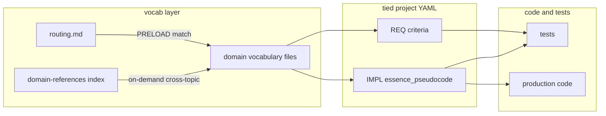

# TIED domain vocabulary research — agent prompt

Copy everything in the **Prompt** section below into a new Cursor (or other TIED-aware) agent session on a **target TIED client repository**. Replace the **Customization** placeholders before running.

**Purpose:** Research existing code, tests, and docs; author one or more **canonical domain vocabulary** files plus an **index** (and a lightweight **routing** index when the full index grows large); wire light TIED cross-links. Vocabulary makes IMPL `essence_pseudocode` **precise, comparable, and traceable**—not a substitute for implementing features.

**Reference implementations:**
- **TIED methodology:** [`../vocab/domain-references.md`](../vocab/domain-references.md) + [`../vocab/routing.md`](../vocab/routing.md)
- **Mature product clients:** large federated corpus under `tied/vocab/` with a routing index for bootstrap when the full index exceeds agent-context comfort

---

## Customization (set before paste)

| Placeholder | Example (TIED / agentstream) | Your target repo |
|-------------|------------------------------|------------------|
| `{PROJECT}` | `stdd` / `acme` | _e.g. `acme`_ |
| `{INDEX_PATH}` | `tied/vocab/domain-references.md` | usually `tied/vocab/domain-references.md` |
| `{ROUTING_PATH}` | `tied/vocab/routing.md` | create when the full index grows large |
| `{VOCAB_DIR}` | `tied/vocab/` | usually `tied/vocab/` |
| `{DOMAIN_SEEDS}` | See **Domain seeds** below | REQ clusters from `tied/requirements.yaml` |

### Domain seeds (TIED methodology — use as a model for `{DOMAIN_SEEDS}`)

Group work by cohesive subsystems that already have REQ/ARCH/IMPL clusters:

1. **TIED methodology layout** — project vs methodology YAML, semantic tokens, module validation ([`../vocab/tied-methodology.md`](../vocab/tied-methodology.md))
2. **TIED YAML MCP / tied-cli** — base path, validation, verify, cycles ([`../vocab/tied-yaml-mcp.md`](../vocab/tied-yaml-mcp.md))
3. **Feedback to TIED** — `feedback.yaml`, export ([`../vocab/feedback-to-tied.md`](../vocab/feedback-to-tied.md))
4. **LEAP proposal queue** — non-canonical proposals, audit ([`../vocab/leap-proposal-queue.md`](../vocab/leap-proposal-queue.md))
5. **agentstream (Go)** — pipeline, turns, checklist render ([`../vocab/agentstream.md`](../vocab/agentstream.md))
6. **agent-stream (Ruby)** — ATDD runner parity ([`../vocab/agent-stream-ruby.md`](../vocab/agent-stream-ruby.md))
7. **Pseudo-code & CITDP** — domain vocab vs IMPL grammar; three-way alignment ([`../vocab/pseudocode-and-citdp.md`](../vocab/pseudocode-and-citdp.md))

For a product client, replace these seeds with *product* subsystems (UI surfaces, config keys, CLI flags, domain models) that already have REQ/ARCH/IMPL clusters.

---

## Prompt

```markdown
# Task: Research the codebase and author canonical domain vocabulary references for TIED

You are working in a **TIED client repository** (methodology under `tied/`, project REQ/ARCH/IMPL in project YAML). Your job is **not** to implement features. Research existing **code**, **tests**, and **docs**, then create **one or more vocabulary (glossary) files** plus a **single index page** that lists them. These files are the **canonical names** for domain concepts—used in README, reviews, REQ/ARCH prose, tests, and especially **IMPL `essence_pseudocode`**.

**Target customization:** index at `{INDEX_PATH}`; vocabulary files under `{VOCAB_DIR}`; prioritize domains: {DOMAIN_SEEDS}. When the full index grows large (tens of KB or many cross-topic paragraphs), also create `{ROUTING_PATH}` — a lightweight keyword→glossary routing table for session bootstrap ([PROC-VOCABULARY_INDEX] PRELOAD).

## Why this matters for TIED IMPL pseudo-code

IMPL `essence_pseudocode` is the **most critical traceability artifact** ([PROC-IMPL_PSEUDOCODE_TOKENS], `tied/docs/pseudocode-writing-and-validation.md`). It must be:

- **Language-agnostic** — TIED procedural vocabulary (Contract, INPUT, OUTPUT, DATA, CONTROL, `procedure UPPER_SNAKE`, IF/ELSE, ON error, AWAIT), **not** pasted host-language source.
- **Block-named with stable identifiers** — logical blocks use **UPPER_SNAKE** names (e.g. `LOAD_QUEUE`, `DATA_FENCE_WRAP`) that should **match** terms defined in your domain vocabulary.
- **Token-commented** — every block has a lead comment naming [IMPL-*], [ARCH-*], [REQ-*] and how the block implements them.
- **Literally linked to tests and code** — block lead comments are copied into test/production code per [PROC-IMPL_CODE_TEST_SYNC].

**Imprecise or synonymous wording in pseudo-code breaks three-way alignment** (IMPL ↔ tests ↔ code) and makes REQ criteria untestable. Domain vocabulary files exist so authors **pick one preferred term** per concept and pseudo-code **reuses that term** in block names, DATA fields, and procedure steps—while synonyms are documented once, not re-invented in every IMPL.

Read before writing vocabulary:

- `AGENTS.md` (session bootstrap)
- `tied/docs/ai-principles.md`
- `tied/docs/implementation-decisions.md` — § **Preferred vocabulary for essence_pseudocode**
- `tied/docs/pseudocode-writing-and-validation.md` — language-agnostic rule, block format, validation
- `tied/docs/vocabulary-index-analysis-and-standards.md` — structure and governance standards
- `templates/impl-essence-pseudocode-template.md` (if present) or an existing `tied/implementation-decisions/*-pseudocode.md` sidecar in this repo

**Reference example (TIED methodology):** Index `tied/vocab/domain-references.md`; routing `tied/vocab/routing.md`; glossaries such as `tied/vocab/agentstream.md`, `tied/vocab/tied-yaml-mcp.md`, `tied/vocab/leap-proposal-queue.md`. REQ criteria should cite glossary paths **and** pseudo-code block names together.

---

## Phase 1 — Discover and triangulate (read-only)

1. **Confirm TIED base path** — `tied_config_get_base_path` (or `tied-cli` equivalent) points at **this** repo’s `tied/`.
2. **Map domains** — List 3–8 **cohesive subsystems** per `{DOMAIN_SEEDS}`. Prefer boundaries that already have REQ/ARCH/IMPL clusters.
3. **For each domain, collect evidence from three sources:**
   - **Code** — public types, enums, CSS class names, `data-*` attributes, config keys, menu labels, log/diagnostic codes, CLI flags.
   - **Tests** — test type/method names (often embed semantic tokens), asserted strings, HTML/CSS selectors, fixture names.
   - **Docs** — README, `docs/`, TIED REQ/ARCH/IMPL detail fields, existing pseudo-code sidecars.
4. **Record collisions** — same idea, different names (e.g. “queue” vs “proposal list”; “base path” vs “tied root”). Note **user-facing**, **config serialized**, and **code symbol** forms separately.
5. **Do not duplicate implementation** — vocabulary explains **terms and relationships**, not step-by-step algorithms (those stay in IMPL pseudo-code).

---

## Phase 2 — Author vocabulary files

### Index (required)

Create **`{INDEX_PATH}`** with:

- One-line purpose: canonical glossaries for consistent terminology in README, TIED, tests, reviews.
- Table: **Priority** | **Document** | **Scope** (one row per vocabulary file).
- Section **Authoring guides (not glossaries)** and **Behavior inventories (not glossaries)** if applicable—separate from vocabulary.
- **Cross-topic notes** for concepts that span multiple glossaries.
- Bootstrap notice pointing agents to `{ROUTING_PATH}` when that file exists.

### Routing index (required when the full index is large)

Create **`{ROUTING_PATH}`** (~70–100 lines) with:

- Purpose: lightweight session bootstrap; do **not** read the full index at start.
- Procedure: read routing → match task keywords → PRELOAD only matched glossaries.
- Table: **Pri** | **File** | **Keywords / When to read**.
- Cross-topic lookup section: search the full index on demand.
- Link to authoring guides and the full index.

### Per-domain vocabulary (one or more files)

Suggested path pattern: **`{VOCAB_DIR}<domain>.md`** (TIED convention: glossaries under `tied/vocab/` **without** a `-vocabulary` suffix; stay consistent within a repo).

Each file should include:

1. **Title** — “(canonical)” in the heading.
2. **Scope paragraph** — what subsystem this covers; what it explicitly excludes.
3. **Traceability** — links to primary [REQ-*], [ARCH-*], [IMPL-*] tokens and pseudo-code sidecar paths (relative links).
4. **Preferred term vs synonyms** — table: Preferred | Synonyms / notes (pick **one** prose term; demote others).
5. **Naming bridge** (when applicable) — table mapping **canonical concept** → UI label → config key → CLI flag → code enum/type.
6. **Named concepts** — bullet definitions for terms pseudo-code and tests will reuse (stable bold terms).
7. **Alphabetical index** — quick lookup at end.
8. **Cross-links** — “See also” to related vocabulary files and `{INDEX_PATH}`.

**Vocabulary file rules:**

- Terms are **nouns/phrases** and **stable procedure-like names** where pseudo-code already uses them—not vague prose.
- Prefer **definitions + naming tables** over narrative tutorials.
- Use **exact** spellings from code/config (backticks for `keys`, `data-*` attributes, enum cases).
- When a concept spans modules, define it **once** and link from other vocab files.
- Point to the owning **IMPL** pseudo-code for algorithms (“vocabulary only”).

### Splitting guidance

- **Split** when a domain has 15+ named concepts or distinct audiences.
- **Merge** when two areas share one dispatch/order story and splitting would duplicate “preferred vs synonym” tables.
- **Add a routing index** when the full index (especially cross-topic paragraphs) becomes too large for session PRELOAD.

### Pseudo-code block names (required section in each vocabulary file)

Add a section **Pseudo-code block names** listing:

| Preferred term / concept | UPPER_SNAKE block (if exists) | Owning IMPL |
|--------------------------|-------------------------------|-------------|

Populate from existing `*-pseudocode.md` sidecars where blocks already use domain terms; leave “(proposed)” for gaps.

---

## Phase 3 — Wire vocabulary into TIED (LEAP-light)

After vocabulary files exist:

1. **Update project REQ/ARCH** (via TIED MCP / `tied-cli`, not ad-hoc broken YAML) so `description` / `acceptance_criteria` / `implementation_approach` **reference** the glossary path instead of re-defining terms inline.
2. **Review existing IMPL pseudo-code** — for tokens in scope, ensure block names and DATA labels use **preferred** terms from the glossary; add a “Vocabulary” bullet in IMPL `decision` or `see_also` pointing to the doc.
3. **Do not rewrite all pseudo-code** in this task—flag gaps in a **Pseudo-code alignment backlog** (IMPL token → block → suggested rename).
4. Update `AGENTS.md` / checklist PRELOAD text to use the routing index when present.
5. Run **`tied_validate_consistency`**; lint changed YAML per [PROC-YAML_EDIT_LOOP].

Markdown vocabulary files may be edited **directly** (they are not TIED index YAML).

---

## Phase 4 — Acceptance criteria

- [ ] Index page lists every vocabulary file with scope.
- [ ] Routing index exists (or an explicit note that the full index is still small enough for bootstrap).
- [ ] Each vocabulary file has: scope, traceability links, preferred-vs-synonym table, named concepts, alphabetical index, **Pseudo-code block names** section.
- [ ] At least one **existing** REQ or criterion cites a vocabulary path (or you added a minimal REQ note in project YAML explaining where terms live).
- [ ] Documented **explicit link** between glossary terms and **UPPER_SNAKE** pseudo-code block names.
- [ ] No implementation algorithms copied into glossaries.
- [ ] README or `docs/` entry points link `{INDEX_PATH}` (and `{ROUTING_PATH}` when present).

---

## Output format for your final message

1. **Summary** — domains covered, files created/updated.
2. **Index link** — path to domain-references index (and routing index if created).
3. **Pseudo-code alignment table** — | Preferred term | Pseudo-code block(s) | IMPL token | Action (ok / rename later) |
4. **LEAP follow-ups** — REQ/ARCH/IMPL tokens that still use non-canonical terms in criteria or pseudo-code.
5. **Research sources** — bullet list of key code/test paths per domain (for reviewers).

## Constraints

- Follow `AGENTS.md`: semantic tokens in comments; MCP for TIED YAML mutations; validate when done.
- Preface responses with `Observing AI principles!` if your session rules require it.
- Do **not** create SESSION_SUMMARY.md or unrelated stand-alone reports.
- Minimize scope: vocabulary + index + light TIED cross-links only—no feature code unless fixing a broken link is trivial.
```

---

## Reference implementation verification (TIED methodology)

This checklist confirms the **pattern** the prompt produces.

| Acceptance item | TIED status |
|-----------------|-------------|
| Index lists all vocabulary files | [`../vocab/domain-references.md`](../vocab/domain-references.md) |
| Routing index for bootstrap | [`../vocab/routing.md`](../vocab/routing.md) |
| Each glossary: scope, synonyms, concepts, index | e.g. [`../vocab/agentstream.md`](../vocab/agentstream.md), [`../vocab/leap-proposal-queue.md`](../vocab/leap-proposal-queue.md) |
| Glossary ↔ UPPER_SNAKE blocks | e.g. `LOAD_QUEUE` in leap-proposal-queue vocab / IMPL |
| Vocabulary thin; IMPL owns behavior | Glossaries point to IMPL pseudo-code sidecars |
| Standards + process | [`vocabulary-index-analysis-and-standards.md`](vocabulary-index-analysis-and-standards.md), `[PROC-VOCABULARY_INDEX]` |

### Sample pseudo-code alignment (TIED)

| Preferred term | Pseudo-code block | IMPL token | Action |
|----------------|-------------------|------------|--------|
| LEAP proposal queue | `LOAD_QUEUE`, `MCP_HANDLER` | IMPL-MCP_LEAP_PROPOSAL_QUEUE | ok |
| TIED base path | (naming bridge in tied-yaml-mcp) | IMPL-TIED_FILES / MCP config | ok |
| agentstream turn | pipeline / turn blocks in agentstream vocab | IMPL-GOAGENT-* | ok |
| Domain vocabulary vs IMPL grammar | (defined in pseudocode-and-citdp) | — | ok |

---

## Relationship diagram


