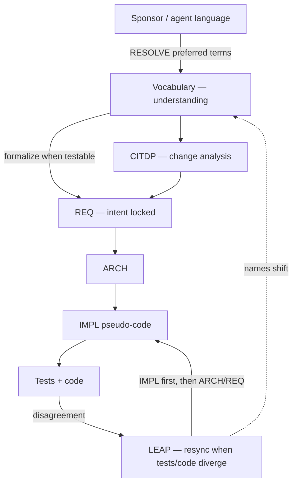

# A vocabulary layer before requirements

Requirements, architecture, and implementation specs are the right place to lock behavior—but they are a heavy place to *start* a conversation. In TIED projects we add a **domain vocabulary layer** under `tied/vocab/`: short glossaries where we agree on names and distinctions first. TIED, CITDP, and LEAP then formalize and keep that language honest as code changes.

---

## TL;DR

- **Vocabulary** translates *understanding* between the sponsor and the system’s structure—one preferred term per concept, synonyms demoted, relations spelled out.
- **TIED** preserves *intent* once those terms are agreed: REQ → ARCH → IMPL pseudo-code → tests → code, linked by tokens.
- **CITDP** analyzes a change (blast radius, risks, test plan) using the same words—often before or alongside new REQ authoring.
- **LEAP** is an *additional* mechanism **after REQs exist**: when tests or code diverge from the stack, sync IMPL first, then ARCH/REQ (and glossaries when names shift)—not silent drift in source only.

---

## Four jobs, not one stack

It helps to separate what each layer is for. They compose; they are not substitutes.

| Layer | Job | Rough question it answers |
|---|---|---|
| **Vocabulary** | Shared *understanding* | “When we say X, do we mean the same thing—and how does that name show up in UI, YAML, CLI, and code?” |
| **TIED (REQ → ARCH → IMPL)** | Frozen *intent* | “What must be true, how we decide structurally, and how we operationalize it so tests can prove it?” |
| **CITDP** | Change *analysis* | “Given this desired shift, what else moves, what risks, what tests?” |
| **LEAP** | Stack *resync* once intent is on record | “Implementation learned something the specs don’t say yet—how do we elevate that truth back through IMPL → ARCH → REQ?” |

**Vocabulary is often the most useful layer in day-to-day talk** even though it is the newest in many TIED clients: humans and agents fail first on misaligned words. TIED without vocabulary drifts into false synonyms; vocabulary without TIED never becomes a testable obligation.

**LEAP does not establish requirements.** It assumes a REQ (and usually ARCH/IMPL) already exists, then repairs or elevates the chain when code/tests outpace or contradict the documented intent. New work still starts with understanding (vocab) and intent (REQ); LEAP keeps that intent honest after the fact.

---

## Not a passive glossary

Most project glossaries describe the system after it exists. Ours is meant to be worked on *before* and *during* design.

| Traditional glossary | Domain vocabulary layer |
|---|---|
| Describes terms after the fact | Names terms before formal specs |
| Often one flat page | Federated glossaries plus one index (and a routing index when large) |
| Rarely tied to builds | Feeds pseudo-code block names, REQ criteria, Help/docs |
| Synonyms left informal | One **preferred term** per concept; others marked avoid/legacy |

Files live at `tied/vocab/<topic>.md`. The index [`../vocab/domain-references.md`](../vocab/domain-references.md) lists every glossary and **cross-topic** notes—short relation graphs for features that span modules. When that full index grows large, agents bootstrap from [`../vocab/routing.md`](../vocab/routing.md) (~70 lines) and PRELOAD only matched glossaries.

Algorithms stay out of the glossaries on purpose. Step-by-step logic belongs in IMPL `essence_pseudocode`; the glossary only holds stable names and relationships so refactors do not rewrite the product dictionary every week.

---

## How vocabulary feeds TIED

TIED is our traceability stack: requirements, architecture decisions, implementation pseudo-code, tests, and production code, linked by semantic tokens (`REQ-*`, `ARCH-*`, `IMPL-*`). Where vocabulary carries *understanding*, TIED freezes *intent*—what must remain true and how we prove it.

| TIED layer | Role | What vocabulary contributes |
|---|---|---|
| REQ | Intent — what and why | Satisfaction criteria cite `tied/vocab/*.md` paths alongside behavior |
| ARCH | Intent — structural how | Module and boundary names match glossary preferred terms |
| IMPL pseudo-code | Intent — operational how | Block names reuse glossary terms (`LOAD_QUEUE`, `PARSE_AND_RESOLVE`, …) |
| Tests + code | Proof of intent | Block lead comments copy the same words from pseudo-code |

If pseudo-code uses three different words for one idea, tests and REQ criteria stop lining up. The vocabulary layer exists so authors pick **one** term and reuse it as the literal block name and in acceptance criteria—a practice we call three-way alignment (pseudo-code, tests, code).

---

## How vocabulary feeds CITDP

**CITDP** (Change Impact and Test Design Procedure) is structured analysis *before* code: current vs desired behavior, non-goals, impact, risks, and test strategy. Records land in `tied/citdp/CITDP-*.yaml`.

Vocabulary helps CITDP in three practical ways:

- **Change definition in plain product language** — Desired behavior can reference canonical terms before any REQ YAML is written.
- **Impact discovery** — When blast radius is named consistently across glossaries and cross-topic notes, it is easier to see which REQ/ARCH/IMPL clusters a change touches without rereading the whole tree.
- **Risk mitigation** — A common risk is “user-facing copy drifts from implementation.” Treating glossaries as the source for Help and docs directly addresses that.

CITDP does not replace TIED; it front-loads thinking so TIED authoring and tests target the right behavior.

---

## How vocabulary feeds LEAP

**LEAP** (Logic Elevation And Propagation) is what we do **once REQs (and usually ARCH/IMPL) are already established** and tests or code disagree with that documented intent: update **IMPL pseudo-code first**, then ARCH and REQ if scope changed—not silent drift in source only.

LEAP is therefore not a fourth way to *start* a feature. It is the repair and elevation path for an existing stack:

| Phase | Mechanism | Vocabulary’s role |
|---|---|---|
| Before REQ | RESOLVE / RECORD in glossaries; optional CITDP | Establish shared understanding |
| Establish intent | Author REQ → ARCH → IMPL; write tests | Lock preferred terms into criteria and block names |
| After divergence | **LEAP** — IMPL → ARCH → REQ | Rename or refine glossary terms only when a *concept* or naming bridge shifts |

Vocabulary fits LEAP because names are intentionally **thin and stable**:

- Behavior changes live in pseudo-code blocks; glossaries change only when we introduce or rename a *concept*.
- When a user-visible label or config key is renamed, we update the glossary (naming-bridge tables: UI label ↔ YAML key ↔ CLI flag ↔ code symbol) in the same LEAP pass as REQ/Help updates.

---

## Four touchpoints (humans and agents)

Whether you are discussing a feature in chat or an agent is executing the implementation checklist, the same four modes apply (`sub-vocabulary-sync` in the agent checklist; `[PROC-VOCABULARY_INDEX]` in [`processes.md`](processes.md)):

| Mode | When | What to do |
|---|---|---|
| **RESOLVE** | Someone describes a feature informally | Map their words to canonical terms; resolve ambiguity before TIED work |
| **PRELOAD** | Before reading YAML, source, or tests | Read `routing.md`, match keywords, then only the matched glossaries |
| **RECORD** | After naming something new or renaming | Update glossaries and cross-topic notes; wire terms into REQ when behavior is testable |
| **VALIDATE** | Before commit | Confirm REQ, docs, tests, and commit message still use preferred terms |

---

## A simple workflow for day-to-day discussion

1. Open [`../vocab/routing.md`](../vocab/routing.md).
2. Match your topic to one or two glossaries; open only those.
3. Agree preferred terms, distinctions, and relations **there**—that is the *understanding* step, not a long REQ draft.
4. When behavior must become testable, formalize in REQ/ARCH/IMPL using those exact terms—that is the *intent* step.
5. Let CITDP capture the change analysis when the blast radius is non-trivial.
6. After implementation, if tests or code teach something the specs omit or contradict, run **LEAP** (IMPL first, then ARCH/REQ) and RECORD glossary updates only when names or bridges change.

You do not need to read every glossary every time. The routing index, full index, and cross-topic notes exist so you can navigate relations without opening every YAML detail file.

---

## FAQ — VOCAB vs ontologies

**VOCAB is ontology-adjacent, not an ontology.** Closest formal cousin is **SKOS** (preferred/alt labels, concept schemes), not **OWL/RDF** with axioms and a reasoner.

| Ontology world | Domain vocabulary (`tied/vocab/`) |
|---|---|
| Shared conceptualization of a domain | Yes — product domain named before specs |
| Classes / individuals / typed properties | No — Markdown terms + tables + prose links |
| `skos:prefLabel` / `altLabel` | Preferred term vs Avoid/synonym tables |
| Concept scheme / modules | Federated `tied/vocab/<topic>.md` + index (+ routing when large) |
| Object properties / graph edges | Cross-topic notes (informal) |
| Multi-surface lexicalization | Naming bridges (UI / YAML / CLI / code) |
| OWL axioms, open-world, reasoner | Intentionally absent |
| Knowledge-base query / inference | Not the goal; align humans+agents for build |

An ontology asks “what exists and what follows?”; VOCAB asks “when we say X, do we mean the same thing across sponsor talk, UI, config, and code—so REQ criteria stay testable?”

---

## Where to read more

- [Vocabulary index analysis and standards](vocabulary-index-analysis-and-standards.md) — corpus structure, governance, agent touchpoints
- [Client development index](client-development-index.md) — one-page map of TIED, CITDP, LEAP, and tooling
- [LEAP overview](LEAP.md) — why IMPL-first stack sync beats hunting source files
- [TIED domain vocabulary research prompt](tied-domain-vocabulary-research-prompt.md) — copy-paste prompt to replicate the pattern in another repo

---

*Context: TIED methodology. Paths above are relative to `tied/docs/`. Product clients inherit the same process via `copy_files.sh` and grow their own `tied/vocab/` corpora.*
