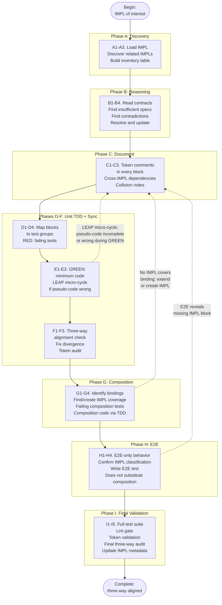

# TIED Processes

**TIED Methodology Version**: 1.4.0

Process documentation is the missing link that keeps tooling, rituals, and expectations traceable back to requirements. This guide defines how to record repeatable processes with semantic tokens so that every operational step you take is measurable, auditable, and associated with the intent that drove it.

## Process Tokens

Introduce `[PROC-*]` tokens whenever you describe how work happens.
Each token declares the process, its scope, and the requirements it serves. Because processes often span multiple artifacts, each entry should refer to:

- **Requirements** (`[REQ-*]`) to show whose intent the process satisfies
- **Architecture** (`[ARCH-*]`) or **Implementation** (`[IMPL-*]`) decisions that depend on the process outcome
- **Tests** (`[TEST-*]`) or other validation steps triggered by the process

Process entries become first-class trace nodes that explain **how** to survey, build, test, deploy, and otherwise steward the requirements themselves.

### Inherited tokens (TIED/LEAP methodology)

All TIED projects inherit a core set of REQ/ARCH/IMPL and PROC tokens via `copy_files.sh` (from `templates/`). These tokens are **mandatory for TIED success** and enforce the methodology; they must not be removed. The inherited set includes REQ-TIED_SETUP, REQ-MODULE_VALIDATION, ARCH-TIED_STRUCTURE, ARCH-MODULE_VALIDATION, IMPL-TIED_FILES, IMPL-MODULE_VALIDATION, and the process tokens defined in this document (e.g. [PROC-LEAP], [PROC-TOKEN_AUDIT], [PROC-TIED_DEV_CYCLE], [PROC-TIED_METHODOLOGY_READONLY]). In the client, methodology YAML lives under `tied/methodology/` and is read-only; project-specific data lives in project YAML under `tied/`. See `semantic-tokens.md` § Inherited tokens and AGENTS.md § Client inheritance of LEAP R+A+I.

## Process Entry Template

Use the structure below for every process you document. Each entry should be kept current, reference the controlling requirements, and mention the deliverables or artifacts it produces.

### `[PROC-PROCESS_NAME]`
- **Purpose** — Describe the problem or requirement this process satisfies, ideally referencing a `[REQ-*]` token.
- **Scope** — Describe the boundaries of the process (teams, code areas, environments, or lifecycle phases).
- **Token references** — List `[REQ-*]`, `[ARCH-*]`, `[IMPL-*]`, or `[TEST-*]` tokens that the process continuously touches.
- **Status** — Active, deprecated, or scheduled for automation.

#### Core Activities
1. **Survey the Project**
   - Identify the existing intent (documentation, tokens, diagrams) tied to the requirement.
   - Capture discovery artifacts (notes, system maps, dependency lists) labeled with `[PROC-PROJECT_SURVEY]` or a more specific process token.
2. **Build Work**
   - Describe how to prepare the build environment, dependencies, and packages.
   - Reference architecture or implementation tokens that the process must observe before running the build.
3. **Test Work**
   - List the mandatory validation suites, acceptance tests, or checkpoints.
   - Include examples of test names that reference the requirement token (e.g., `TestFoo_REQ_BAR`).
4. **Deploy Work**
   - Outline the deployment targets, release artifacts, and approvals required.
   - Mention any CI/CD pipelines or configuration tokens that guarantee traceability.
5. **Requirements Stewardship**
   - State how the process collects feedback, updates requirements, and revalidates tokens.
   - Explain how this process keeps the `[REQ-*]` token fresh (review cadence, stakeholders, reporting).

#### Artifacts & Metrics
- **Artifacts** — Document the files, checklists, or dashboards produced during the process.
- **Success Metrics** — Name how you know the process satisfied the requirement (e.g., updated token table, green builds, automated audits).

### Example: `[PROC-PROJECT_SURVEY_AND_SETUP]`
- **Purpose** — Capture the context for `[REQ-TIED_SETUP]` before any new feature work.
- **Scope** — Applied to every new module or team onboarding cycle.
- **Token references** — `[REQ-TIED_SETUP]`, `[ARCH-TIED_STRUCTURE]`, `[IMPL-TIED_FILES]`.
- **Status** — Active.

#### Core Activities
1. **Survey**
   - Read `TIED.md`, `semantic-tokens.yaml`, `semantic-tokens.md`, and recent requirements to understand intent.
   - Tag findings with `[PROC-PROJECT_SURVEY_AND_SETUP]` and record them in the project knowledge base.
2. **Build**
   - Confirm required toolchains (language runtime, TIED tooling) are installed and share the list on the onboarding checklist.
   - Validate any `[ARCH-*]` constraints (folder layout, manifests) before manipulating files.
3. **Test**
   - Run smoke tests that include `[REQ-MODULE_VALIDATION]` to prove tracing works for a new module.
   - Check that tokens surfaced during survey show up in test names and code comments.
4. **Deploy**
   - Ensure deployment documentation references the same requirement tokens and that automated jobs run at least once to prove the configuration.
5. **Requirements Stewardship**
   - Record missing `[REQ-*]` tokens discovered during the survey and assign owners to author them.
   - Tag conclusions in the knowledge base with the `[PROC-PROJECT_SURVEY_AND_SETUP]` token so future reviews can trace the reasoning.

#### Artifacts & Metrics
- **Artifacts** — Onboarding checklist, environment matrix, token discovery log.
- **Success Metrics** — Every new module has `[REQ-*]` tokens defined, token registry updated, and build/test/deploy pipelines run at least once.

---

## LEAP: `[PROC-LEAP]` Logic Elevation And Propagation

**When it runs:** Every time a change occurs to the TIED db (REQ/ARCH/IMPL YAML indexes or detail files) or to its outputs (code, tests, or documents that reference tokens). This is the primary loop that must be executed to keep the stack consistent and testable.

### Purpose

Logic is **elevated** into IMPL pseudo-code (out of source code); the tasks of coding the solution live in the pseudo-code, not in the source. All changes are **distributed and validated** from top to bottom through the stack so that IMPL pseudo-code is the **logical representation of the solution**, bounded by R/A/I tokens that shape it. Source code is the implementation of that record. Code is valid only when all tests pass and all requirements are met.

### Scope

Applies to all work that touches requirements, architecture, implementation decisions, tests, or code annotated with TIED tokens. Applies in both top-down (REQ → ARCH → IMPL) creation and bottom-up refinement from TDD/E2E results.

### Token references

- All `[REQ-*]`, `[ARCH-*]`, `[IMPL-*]` tokens; `[PROC-TOKEN_AUDIT]`, `[PROC-TOKEN_VALIDATION]`.

### Status

Active. Mandatory on every change to the TIED db or its outputs.

### Rules (core activities)

1. **Logic elevation and propagation (bottom-up)**  
   When code written during **TDD** or **E2E testing** is separate from or differs from the IMPL pseudo-code, that divergence **must** trigger updates in **reverse order** along the stack: **IMPL → ARCH → REQ** in the same work item. Elevate the new logic into IMPL; if the change affects architecture or requirement scope, propagate to ARCH and then REQ so the stack stays consistent and the IMPL remains the logical representation bounded by R/A/I tokens.

2. **Bidirectional stack; distribute and validate**  
   Work **may start at any layer** of the stack (REQ, ARCH, IMPL, or code/tests). For the work to be **complete**, changes **must be distributed and validated both up and down** the stack as needed (e.g. a change that starts in IMPL may require ARCH or REQ updates (up) and code/tests updates (down); a change that starts in code must propagate back to IMPL → ARCH → REQ (up) and ensure tests are updated (down)). **Code is only valid** when **all tests pass** and **all requirements are met**; validity implies the full stack (REQ, ARCH, IMPL, tests, code) is consistent and traceable via tokens.

3. **YAML/MCP and cognitive load**  
   REQ, ARCH, and IMPL detail is maintained in **YAML files** (indexes + detail files per token). The TIED MCP optimizes use of this YAML db by presenting R/A/I via **indexes** and **CRUD+ actions**, including **validation of the entire db**. For a complex task: collect all related R/A/I index and detail records; then **only the pseudo-code for the necessary IMPL** needs to be comprehended to develop an ideal solution. Updating the code to match the new IMPL pseudo-code is a **separate task**. The cognitive load of processing a **handful of IMPL** records should be **smaller** than parsing an arbitrary number of source code files to guess at side effects; when that holds, intent and logic live in the R/A/I YAML and IMPL pseudo-code, and code remains the implementation of that record. See `tied/docs/ai-agent-tied-mcp-usage.md` for MCP workflow and rationale.

### Artifacts & Metrics

- **Artifacts** — Updated IMPL/ARCH/REQ detail files and indexes; code and tests aligned to IMPL; token registry and consistency validation output.
- **Success Metrics** — Stack consistent (REQ ↔ ARCH ↔ IMPL ↔ tests ↔ code); all tests pass; all requirements met; `tied_validate_consistency` (or equivalent) passes.

---

## `[PROC-TEST_STRATEGY]` Test strategy and coverage (minimize untested code)

### Purpose
Minimize the amount of code not covered by tests so that IMPL/ARCH/REQ logic is validated by unit and integration tests; E2E remains expensive and is reserved for critical user journeys.

### Scope
Chrome extension `src/` only (Safari-only code excluded). Applies to unit tests (`tests/unit/**/*.test.js`), integration tests (`**/*.integration.test.js`), and Playwright E2E (`tests/playwright/`).

### Token references
- `[IMPL-TESTING]` — testing implementation decisions
- `[REQ-MODULE_VALIDATION]` — module validation before integration; testability and minimize E2E-only (satisfaction/validation criteria)
- `[ARCH-UI_TESTABILITY]` — thin entry points; logic in testable modules
- All `[REQ-*]` / `[ARCH-*]` / `[IMPL-*]` reflected in code under test

### Status
Active

### Principles
1. **E2E is expensive** — Reserve E2E for critical user journeys. Do not rely on E2E as the primary way to find untested pathways.
2. **Unit + integration tests cover logic** — Unit and integration tests should cover IMPL/ARCH/REQ logic so that untested pathways are found and fixed before or alongside E2E.
3. **Composition tests cover bindings** — Every binding between tested units (event listeners, IPC, entry-point delegation, wiring) must have a composition test (component, integration, or contract) that verifies the connection works without invoking the UI. If a binding exists and no composition test covers it, there is a gap.
4. **IMPL–test alignment** — Every Active IMPL should have at least one test reference in `traceability.tests`, or be explicitly documented as "tested only via E2E" / "no unit tests" with a reason.
5. **Coverage gates** — Jest `coverageThreshold` and the coverage gap report (`scripts/coverage-gap-report.js`) help prevent regressions and surface files/IMPLs with no tests.
6. **E2E-only requires justification** — `e2e_only` classification in an IMPL requires justification that no mock, stub, or programmatic trigger can exercise the boundary below E2E. The justification must name the specific platform constraint (e.g. "native OS menu click cannot be simulated in JSDOM or Playwright"). Bindings between units that communicate via events, messages, or function calls are not E2E-only — they are composition-testable.
7. **Minimize E2E-only code** — Treat E2E and manual verification as the exception. Every IMPL should have unit or integration tests for its logic, or an explicit E2E-only reason in the IMPL detail.

### Activities
- Run `npm run test:coverage` before merging; fix or document any new code that lowers coverage below threshold.
- Run `node scripts/coverage-gap-report.js [threshold]` to list src files below threshold and IMPLs with empty `traceability.tests`; use the report in MRs or docs.
- For IMPLs that are intentionally not unit-tested (e.g. platform-specific glue or debug tooling), record in the IMPL detail that coverage is via E2E or manual testing so the "no tests" is explicit and reviewable.
- When adding or changing IMPLs, classify code as unit-testable, integration-testable, or E2E-only. If E2E-only, set `traceability.tests` to [] and document in the IMPL (e.g. `test_coverage_note` or `e2e_only_reason`) why unit/integration are not used; the justification must name the specific platform constraint. Bindings (event listeners, IPC, wiring) are composition-testable, not E2E-only. Use the coverage gap report to catch IMPLs with empty tests and no justification.

### Artifacts & Metrics
- **Artifacts** — Coverage report (`coverage/`), coverage gap report output, TIED `traceability.tests` in IMPL detail files.
- **Success Metrics** — Coverage at or above threshold; IMPL traceability.tests populated or explicitly documented; E2E used for critical flows only.

---

## `[PROC-TIED_METHODOLOGY_READONLY]` TIED-sourced YAML read-only in client

### Purpose
TIED-sourced YAML in the client is read-only and does not hold client-specific data; methodology can be refreshed from TIED without losing project data. Supports safe evolution of the TIED methodology when process documents and templates are updated.

### Scope
Client projects using TIED. Applies to index YAMLs and detail YAMLs that originate from TIED `templates/` (inherited LEAP R+A+I and related records).

### Token references
- `[REQ-TIED_SETUP]` — TIED methodology setup
- `[ARCH-TIED_STRUCTURE]` — project structure; methodology lives under `tied/methodology/`
- `[PROC-YAML_DB_OPERATIONS]` — read/write rules for project vs methodology YAML

### Status
Active

### Rules
1. **Do not modify** files under `tied/methodology/`. That directory is populated and overwritten by `copy_files.sh` from the TIED repo; it contains only methodology content (index YAMLs and inherited detail files). Client edits there would be lost on the next refresh.
2. **Add new REQ/ARCH/IMPL and all edits** only in **project** YAML: `tied/requirements.yaml`, `tied/architecture-decisions.yaml`, `tied/implementation-decisions.yaml`, `tied/semantic-tokens.yaml`, and the corresponding `tied/requirements/`, `tied/architecture-decisions/`, `tied/implementation-decisions/` detail files at the root of `tied/`. Project files are never overwritten by `copy_files.sh`.
3. **Refresh methodology**: Re-run `copy_files.sh` from the TIED repo to update `tied/methodology/`; it overwrites only methodology files. Project YAML is unchanged.

### Artifacts & Metrics
- **Artifacts** — `tied/methodology/` (read-only in client); project index and detail files under `tied/`.
- **Success Metrics** — Methodology can be refreshed without losing project data; agents and MCP write only to project YAML.

**Migration**: Existing clients with mixed content in a single `tied/*.yaml` should follow the one-time procedure in `tied/docs/migration-methodology-project-yaml.md` (or `docs/migration-methodology-project-yaml.md` in the TIED repo).

---

## `[PROC-YAML_DB_OPERATIONS]` YAML Database Operations

### Purpose
Provides succinct guidance for reading, writing, querying, and validating the YAML index files (`requirements.yaml`, `architecture-decisions.yaml`, `implementation-decisions.yaml`, `semantic-tokens.yaml`).

### Scope
Applies to all TIED YAML index files in the `tied/` directory. Implementation decision **detail** YAMLs (e.g. in `implementation-decisions/*.yaml`) may include `essence_pseudocode` and `related_decisions.composed_with` for composition analysis, combined workflow description, and test design; see `implementation-decisions.md` § Optional fields for composition and workflow.

### Methodology vs project split `[PROC-TIED_METHODOLOGY_READONLY]`

When the client uses the methodology/project layout (e.g. after running `copy_files.sh` from a TIED repo that creates `tied/methodology/`):

- **Methodology** (`tied/methodology/`): Index YAMLs and inherited detail files from TIED `templates/`. **Read-only** in the client; written only by `copy_files.sh`. Tooling (MCP, validation) may **read** from here to build a merged view. **Writes go only to project files**, not to methodology.
- **Project** (`tied/` root): Project index YAMLs (`tied/requirements.yaml`, etc.) and project detail dirs (`tied/requirements/`, `tied/architecture-decisions/`, `tied/implementation-decisions/`) hold **only** client-added tokens. All new records and edits are made here. These files are never overwritten by `copy_files.sh`.
- **Reading**: MCP and validation may merge methodology + project (methodology keys first, then project keys; project overrides if same token) so the full set of REQ/ARCH/IMPL is visible.
- **Writing**: Insert, update, and delete only in project index and project detail files. Do not modify `tied/methodology/`.

If `tied/methodology/` is absent (legacy or single-file layout), tooling may treat the single set of files under `tied/` as the only source; see project docs or MCP server behavior for backward compatibility.

### Token references
- `[REQ-TIED_SETUP]` — YAML indexes are part of TIED methodology setup
- `[ARCH-TIED_STRUCTURE]` — YAML indexes are part of project structure
- `[PROC-TIED_METHODOLOGY_READONLY]` — methodology YAML read-only; project YAML only for writes
- `[PROC-YAML_EDIT_LOOP]` — controlling loop for editing and validating TIED YAML (validate and pretty-print before use)

### Status
Active

### Core Activities

#### 1. Appending a New Record

Append only to **project** index files (e.g. `tied/requirements.yaml`), not to files under `tied/methodology/`. See [PROC-TIED_METHODOLOGY_READONLY].

**Manual Append:**
1. Open the **project** YAML file (e.g., `tied/requirements.yaml`)
2. Scroll to the bottom and find the commented template block
3. Copy the template block
4. Paste it at the end with a blank line before it
5. Replace the token identifier (e.g., `REQ-IDENTIFIER` → `REQ-NEW_FEATURE`)
6. Fill in all fields (name, category, priority, status, rationale, etc.)
7. Update the `detail_file` path
8. Save the file

**Scripted Append:**
```bash
# Append a new requirement (v1.5.0 schema)
cat >> tied/requirements.yaml << 'EOF'

REQ-NEW_FEATURE:
  name: New Feature Name
  category: Functional
  priority: P1
  status: "Planned"
  rationale:
    why: "Primary reason for this requirement"
    problems_solved:
      - "Problem 1"
    benefits:
      - "Benefit 1"
  satisfaction_criteria:
    - criterion: "Criterion description"
      metric: "Measurable target"
  validation_criteria:
    - method: "Unit tests"
      coverage: "All core functions"
  traceability:
    architecture:
      - ARCH-NEW_FEATURE
    implementation:
      - IMPL-NEW_FEATURE
    tests:
      - testNewFeature_REQ_NEW_FEATURE
    code_annotations:
      - REQ-NEW_FEATURE
  related_requirements:
    depends_on: []
    related_to: []
    supersedes: []
  detail_file: requirements/REQ-NEW_FEATURE.yaml
  metadata:
    created:
      date: 2026-02-06
      author: "Your Name"
    last_updated:
      date: 2026-02-06
      author: "Your Name"
      reason: "Initial creation"
    last_validated:
      date: 2026-02-06
      validator: "Your Name"
      result: "pass"
EOF
```

#### 2. Reading and Querying Records

**Read Entire File:**
```bash
cat tied/requirements.yaml
```

**Read Specific Record (with yq):**
```bash
# Install yq if not already: https://github.com/mikefarah/yq
yq '.REQ-TIED_SETUP' tied/requirements.yaml
yq '.["ARCH-TIED_STRUCTURE"]' tied/architecture-decisions.yaml
```

**Read Specific Record (with grep):**
```bash
# Quick lookup for humans
grep -A 30 '^REQ-TIED_SETUP:' tied/requirements.yaml
grep -A 30 '^ARCH-TIED_STRUCTURE:' tied/architecture-decisions.yaml
```

**Filter by Status:**
```bash
# List all active architecture decisions
yq 'to_entries | map(select(.value.status == "Active")) | from_entries' tied/architecture-decisions.yaml

# List all implemented requirements
yq 'to_entries | map(select(.value.status == "Implemented")) | from_entries' tied/requirements.yaml
```

**Query with Python:**
```python
import yaml

# Read YAML file
with open('tied/requirements.yaml', 'r') as f:
    requirements = yaml.safe_load(f)

# Access specific requirement
req = requirements['REQ-TIED_SETUP']
print(f"Name: {req['name']}")
print(f"Status: {req['status']}")
print(f"Priority: {req['priority']}")

# Filter by status
implemented = {k: v for k, v in requirements.items() 
               if v.get('status') == 'Implemented'}
```

**Query with jq (alternative to yq):**
```bash
# Convert YAML to JSON first, then use jq
yq -o=json '.' tied/requirements.yaml | jq '.["REQ-TIED_SETUP"]'
```

#### 3. Updating an Existing Record

**Best Practice:** Edit the YAML file directly in your editor. YAML preserves formatting and comments better than programmatic edits.

**Programmatic Update (Python):**
```python
import yaml

# Read
with open('tied/requirements.yaml', 'r') as f:
    data = yaml.safe_load(f)

# Update
data['REQ-TIED_SETUP']['last_updated'] = '2026-02-06'
data['REQ-TIED_SETUP']['last_validator'] = 'New Validator'

# Write back
with open('tied/requirements.yaml', 'w') as f:
    yaml.dump(data, f, default_flow_style=False, sort_keys=False)
```

**Note:** Programmatic updates may lose formatting and comments. Manual editing is recommended for YAML files.

#### 3.1 YAML edit and validation loop `[PROC-YAML_EDIT_LOOP]`

This is the **controlling loop** for creating or editing any TIED YAML (index or detail). No TIED record is considered valid for use until it has passed this loop.

1. **Edit** — Create or modify the YAML file (index or detail) under `tied/` or other TIED-related paths (e.g. `docs/citdp/*.yaml` as defined by the project).
2. **Validate and pretty-print** — Run `lint_yaml <file> [file ...]` (or project-equivalent). This validates syntax and canonicalizes formatting in place. On failure, the file is invalid; fix and repeat from step 1.
3. **Use** — Only after step 2 succeeds is the file considered **valid for use** under TIED (MCP, `tied_validate_consistency`, and other tooling may rely on it). YAML that does not validate is **invalid** and **must not be used** until fixed.
4. **Optional** — For TIED index and detail files, run **tied_validate_consistency** (and any index/detail checks) as a further gate.

**Valid for use** means the file may be read by MCP, scripts, or downstream steps; invalid YAML is not part of the governed TIED set. **Pretty-print** is one step of the TIED YAML creation/editing flow: all TIED records (index and detail) must be created or updated within this governance so they remain valid for use.

**Safety note (yq)**: Never run raw multi-argument `yq -i -P file1 file2 ...` for linting/pretty-printing. In practice it can merge YAML documents and corrupt files. Use `lint_yaml` which processes each path independently (one `yq` invocation per file). If your system does not have `lint_yaml`, use per-file `yq -i -P <file>` in a loop.

#### 4. Validating YAML Syntax (mandatory before use)

**All** changes to TIED YAML must be validated before the file is considered valid for use. Validate (and canonicalize) with `yq -i -P <file>`. If validation fails, the YAML is **invalid** and **must not be used** until fixed.

**Validate and pretty-print (recommended):**
```bash
scripts/lint_yaml.sh tied/requirements.yaml && echo "✅ Valid YAML" || echo "❌ Invalid YAML"
scripts/lint_yaml.sh tied/architecture-decisions.yaml && echo "✅ Valid YAML" || echo "❌ Invalid YAML"
scripts/lint_yaml.sh tied/implementation-decisions.yaml && echo "✅ Valid YAML" || echo "❌ Invalid YAML"
scripts/lint_yaml.sh tied/semantic-tokens.yaml && echo "✅ Valid YAML" || echo "❌ Invalid YAML"
# Repeat for any changed detail files under tied/requirements/, tied/architecture-decisions/, tied/implementation-decisions/
```

**Validate only (read-only check, no canonicalization):**
```bash
yq '.' tied/requirements.yaml > /dev/null && echo "✅ Valid YAML" || echo "❌ Invalid YAML"
yq '.' tied/architecture-decisions.yaml > /dev/null && echo "✅ Valid YAML" || echo "❌ Invalid YAML"
yq '.' tied/implementation-decisions.yaml > /dev/null && echo "✅ Valid YAML" || echo "❌ Invalid YAML"
```

**Validate with Python:**
```bash
python3 -c "import yaml, sys; yaml.safe_load(open('tied/requirements.yaml'))" && echo "✅ Valid" || echo "❌ Invalid"
```

**Validate with yamllint (if installed):**
```bash
yamllint tied/requirements.yaml
yamllint tied/architecture-decisions.yaml
yamllint tied/implementation-decisions.yaml
```

#### 5. Listing All Tokens

**List all requirement tokens:**
```bash
yq 'keys' tied/requirements.yaml
# or with grep:
grep '^[A-Z].*:$' tied/requirements.yaml | sed 's/:$//'
```

**List all architecture decision tokens:**
```bash
yq 'keys' tied/architecture-decisions.yaml
```

**List all implementation decision tokens:**
```bash
yq 'keys' tied/implementation-decisions.yaml
```

**List all semantic tokens:**
```bash
yq 'keys' tied/semantic-tokens.yaml
```

**Filter semantic tokens by type:**
```bash
# List all REQ tokens
yq 'to_entries | map(select(.value.type == "REQ")) | from_entries' tied/semantic-tokens.yaml

# List all ARCH tokens
yq 'to_entries | map(select(.value.type == "ARCH")) | from_entries' tied/semantic-tokens.yaml

# List all PROC tokens
yq 'to_entries | map(select(.value.type == "PROC")) | from_entries' tied/semantic-tokens.yaml
```

**Check if a token exists:**
```bash
yq '.["REQ-TIED_SETUP"]' tied/semantic-tokens.yaml
```

**Get token metadata:**
```bash
# Get token type and status
yq '.REQ-TIED_SETUP | {type: .type, status: .status}' tied/semantic-tokens.yaml

# Get source index for full details
yq '.REQ-TIED_SETUP.source_index' tied/semantic-tokens.yaml
```

#### 6. Checking Cross-References (v1.5.0 Schema)

**Find all requirements referenced by an architecture decision:**
```bash
yq '.ARCH-TIED_STRUCTURE.cross_references[]' tied/architecture-decisions.yaml
```

**Find all architecture/requirement tokens referenced by an implementation:**
```bash
yq '.IMPL-MODULE_VALIDATION.cross_references[]' tied/implementation-decisions.yaml
```

**Query structured traceability (v1.5.0):**
```bash
# Get architecture dependencies for a requirement
yq '.REQ-TIED_SETUP.traceability.architecture[]' tied/requirements.yaml

# Get tests for a requirement
yq '.REQ-TIED_SETUP.traceability.tests[]' tied/requirements.yaml

# Get implementation dependencies for an architecture decision
yq '.ARCH-TIED_STRUCTURE.traceability.implementation[]' tied/architecture-decisions.yaml

# Get code locations for an implementation
yq '.IMPL-TIED_FILES.code_locations.files[].path' tied/implementation-decisions.yaml
```

**Query structured content (v1.5.0):**
```bash
# Get satisfaction criteria for a requirement
yq '.REQ-TIED_SETUP.satisfaction_criteria[].criterion' tied/requirements.yaml

# Get alternatives considered for an architecture decision
yq '.ARCH-TIED_STRUCTURE.alternatives_considered[].name' tied/architecture-decisions.yaml

# Get implementation approach summary
yq '.IMPL-MODULE_VALIDATION.implementation_approach.summary' tied/implementation-decisions.yaml

# Get metadata
yq '.REQ-TIED_SETUP.metadata.last_validated.result' tied/requirements.yaml
```

### Artifacts & Metrics
- **Artifacts**: YAML index files (requirements.yaml, architecture-decisions.yaml, implementation-decisions.yaml, semantic-tokens.yaml); all created or updated per [PROC-YAML_EDIT_LOOP] so they are valid for use.
- **Success Metrics**: YAML files are valid (validated with `yq -i -P` or equivalent), all records have required fields, cross-references are consistent; invalid YAML is not used until fixed.

---

## `[PROC-TIED_DEV_CYCLE]` TIED development cycle (session workflow)

### Purpose
Run a single development session so that REQ/ARCH/IMPL and pseudo-code stay primary: test-driven development produces testable code and infrastructure; TIED docs are updated to reflect the final code and tests. Supports traceability and `[PROC-TOKEN_AUDIT]` / `[PROC-TOKEN_VALIDATION]`. For the unified step-by-step checklist that sequences this process with CITDP, IMPL_CODE_TEST_SYNC, LEAP, and validation, see `tied/docs/agent-req-implementation-checklist.md` (`[PROC-AGENT_REQ_CHECKLIST]`).

### Scope
Applies to any feature or change that touches managed code, tests, or TIED documentation (requirements, architecture decisions, implementation decisions). Use per session or per feature slice.

### Token references
- `[REQ-TIED_SETUP]` — TIED methodology and doc-first flow
- `[REQ-MODULE_VALIDATION]` — validate modules before integration
- `[PROC-TOKEN_AUDIT]` — code/test token parity
- `[PROC-TOKEN_VALIDATION]` — token registry and traceability checks
- `[PROC-RUST_LINT]` — when changes touch Rust (`src-tauri/`)
- `[PROC-TS_CHECK]` — when changes touch TypeScript (e.g. `src/`)
- `[PROC-SWIFT_BUILD]` — when changes touch Swift (`Sources/`, `Tests/`)
- All REQ/ARCH/IMPL tokens touched by the session

### Status
Active

### Core Activities

1. **Plan from TIED**
   - Read existing REQ, ARCH, and IMPL for the scope of work.
   - Use each IMPL’s `essence_pseudocode` as the full prescription for what to implement; it is the **source of consistent logic**. Resolve all logical and flow issues in IMPL pseudo-code before adding tests or code.
   - Identify required updates (new or changed requirements and decisions) before writing code or tests.

2. **Author TIED docs (pseudo-code + tokens)** `[PROC-IMPL_PSEUDOCODE_TOKENS]`
   - **This is the most critical aspect of implementation:** IMPL pseudo-code is the source of consistent logic, and every block must carry semantic token comments for traceability.
   - Update REQ, ARCH, and IMPL (new and existing) as needed. Write only to **project** index and detail files under `tied/`, not to `tied/methodology/` ([PROC-TIED_METHODOLOGY_READONLY]).
   - Resolve all logical and flow issues in IMPL pseudo-code so that it is complete and authoritative before proceeding to “Add and align tests.”
   - In every IMPL, ensure `essence_pseudocode` is complete. Every **block** in `essence_pseudocode` must have a comment that (1) names all REQ, ARCH, and IMPL reflected in that block and (2) states how that block implements those requirements.
   - Use the project block definition: a block is a contiguous logical unit implementing the same set of REQ/ARCH/IMPL; nested blocks implementing a different set get their own token comment.

**Code-generation inner loop (per TDD iteration)** — Steps 3–7 are governed by a single inner loop. Every iteration must complete RED → GREEN → (optional REFACTOR) before the iteration is considered done. Code that does not pass lint is incomplete and must not proceed.

- **RED (mandatory entry)** — Write or update a **test** that fails for the behavior being implemented. Run the test suite; confirm the new test fails for the expected reason. No production code is written in this step.
- **GREEN** — Write the **minimum production code** to make the failing test pass. Run tests and **language-specific lint** for each language in scope: **Rust** → `bun run lint:rust` [PROC-RUST_LINT]; **TypeScript** → `bunx tsc -b` or `bun run lint:ts` [PROC-TS_CHECK]; **Swift** → `swift build && swift test` [PROC-SWIFT_BUILD]; **YAML** → `yq -i -P <changed files>` [PROC-YAML_EDIT_LOOP] (when TIED YAML is created or updated). If tests still fail, iterate on production code only (do not add new tests in GREEN). If lint fails, fix before proceeding.
- **REFACTOR** (optional) — Clean up test or production code; re-run tests and lint to confirm no regressions.
- **NEXT** — Proceed to the next iteration (new failing test) or next step.

**Gate:** Every iteration enters at RED. Production code created without a preceding failing test is non-compliant and must be corrected: write the missing failing test, verify it fails against the current code (or stub/revert to make it fail), then proceed through GREEN. No iteration is complete until tests pass **and** lint is clean. Implementation is not usable until it passes lint checks; the inner loop enforces this within each step.

**Scope of governance** — The inner loop is mandatory for **managed code**: all source under TIED token governance (files annotated with `[REQ-*]`/`[ARCH-*]`/`[IMPL-*]`, listed in IMPL `code_locations`, or referenced by IMPL `traceability.tests`). **Unmanaged code** (temporary scripts, one-off utilities, exploratory prototypes, build tooling not referenced by TIED tokens) is excluded from the inner loop but must be promoted to managed (with tokens and tests) before integration into production.

3. **Add and align unit tests (tests-first)** *(inner loop governs each iteration)*
   - Unit tests are written to **conform to** the IMPL pseudo-code; they are written **before** production code (strict TDD). No production code beyond the minimum needed to run the first test.
   - Add or update unit tests so they match the IMPL.
   - Every test **block** must carry the same REQ/ARCH/IMPL comments as the corresponding IMPL block (in the appropriate place in the test).
   - If a comment would help tests but is not yet in the IMPL, add it to the IMPL for permanence; treat test code as transient.
   - Ensure testable logic is not implemented in entry points; plan extraction to a module so unit/integration tests can run.

4. **Implement unit code to tests (TDD)** *(inner loop governs each iteration)*
   - The **entire** IMPL pseudo-code is implemented **via TDD**: code is written **only** to satisfy the unit tests. Write test → make it pass → refactor; repeat until every IMPL block is covered and all unit tests pass.
   - Implement logic in testable modules (with dependency injection or pure functions). Entry points should only call into these modules.
   - Every **block** in managed sources must carry the same REQ/ARCH/IMPL comments as in the IMPL. For nested blocks with the **same** set, do not repeat token names; comment only how that sub-block implements the requirements. For a nested block with a **different** set, add a comment at the start naming that set and how the block implements it.

5. **Add composition tests (tests-first)** *(inner loop governs each iteration)*
   - **After unit tests pass**, for every **binding between units** (event listeners, IPC channels, entry-point delegation, menu wiring, platform hooks), write **failing** component, integration, or contract tests **before** writing the composition code.
   - Each composition test verifies that when trigger X fires, the correct unit is called with the correct arguments and produces the correct effect — **without invoking the UI**. Same token-comment rules as unit tests.
   - No composition code is written until a failing composition test exists for that binding.

6. **Implement composition code to tests (TDD)** *(inner loop governs each iteration)*
   - Implement binding, wiring, and entry-point code **only** to satisfy the composition tests. No composition code without a failing test.
   - Keep composition code minimal; extract non-trivial logic to a testable module. Any logic that remains in composition code must be justified in the IMPL (`e2e_only_reason` or `test_coverage_note`).
   - Annotate with the same token/block rules where the code is still "managed" and traceable.

7. **Add E2E tests** *(inner loop governs each iteration)*
   - E2E tests are written **only** for behavior that **requires UI invocation** (native menu clicks, visual rendering, platform behavior that cannot be simulated below E2E). Each E2E test must justify why the verified behavior cannot be tested at composition level.
   - E2E confirms the UI surface; it does not substitute for composition tests of the logic and wiring behind the UI. Add or update E2E tests so critical user journeys that truly require the UI are covered.
   - Document E2E-only behavior in the IMPL so the boundary between "logic in IMPL" and "UI-surface confirmation" is clear.

8. **Validate and close test gaps**
   - Run the full test suite and add any missing tests.
   - Run `[PROC-TOKEN_VALIDATION]` (e.g. `./scripts/validate_tokens.sh`) and fix gaps so coverage and token traceability are complete.

9. **Sync TIED to code and tests**
   - Update REQ/ARCH/IMPL so they match the final code and tests. Ensure IMPLs modified this session reflect the implemented code and tests, including block-level comments with semantic tokens.
   - Sync only **project** index and detail files: `tied/semantic-tokens.yaml`, `tied/requirements.yaml`, `tied/architecture-decisions.yaml`, and `tied/implementation-decisions.yaml` (and `tied/requirements/`, `tied/architecture-decisions/`, `tied/implementation-decisions/` detail files). Do not modify `tied/methodology/`; see [PROC-TIED_METHODOLOGY_READONLY]. TIED docs remain the single source of truth for intent.

10. **Update README and CHANGELOG**
   - Update README.md and CHANGELOG.md for user- and release-facing changes made in this session.

11. **Write commit message**
   - Write the commit message **per [PROC-COMMIT_MESSAGES]**; where useful, reference the main REQ/ARCH/IMPL tokens touched in the body or footer.

**Mandatory implementation order** (steps 3–9): (1) Unit tests first — conform to IMPL pseudo-code; strict TDD. (2) Unit code via TDD — logic in testable modules. (3) Composition tests first — for every binding between units (event listeners, IPC, entry-point wiring, menu wiring, platform hooks), write failing component/integration/contract tests before composition code; each test verifies the connection without invoking the UI. (4) Composition code via TDD — binding/wiring/entry-point code written to satisfy composition tests; no composition code without a failing test. (5) E2E — only for behavior that requires UI invocation; each E2E test must justify why it cannot be tested at composition level. (6) Validate and sync — run token/consistency validation; update TIED data to match implementation.

### Artifacts & Metrics
- **Artifacts**: Updated REQ/ARCH/IMPL (including `essence_pseudocode` and block comments), tests, managed source code, README.md, CHANGELOG.md, commit.
- **Success Metrics**: All tests pass; lint is clean for each language touched (e.g. [PROC-RUST_LINT] for Rust, [PROC-TS_CHECK] for TypeScript, [PROC-SWIFT_BUILD] for Swift, [PROC-YAML_EDIT_LOOP] for YAML); `[PROC-TOKEN_VALIDATION]` passes; TIED docs match final code and tests; `[PROC-TOKEN_AUDIT]` can succeed. Code and YAML that do not pass lint are incomplete.

---

## `[PROC-COMMIT_MESSAGES]` Commit message format and guidelines

### Purpose
Use a consistent format for git commit messages so that history is readable and, if needed, changelogs can be generated from commits. Supports traceability when TIED tokens are referenced in the body or footer.

### Scope
All commits in the repository.

### Token references
- `[PROC-TIED_DEV_CYCLE]` — step 11 invokes this process

### Status
Active

### Commit message format

Each commit message has a **header**, an optional **body**, and an optional **footer**. The header uses a **type**, an optional **scope**, and a **subject**:

```
<type>(<scope>): <subject>
<BLANK LINE>
<body>
<BLANK LINE>
<footer>
```

Keep the **subject** (header line) to 50 characters or fewer so it stays readable in logs and UIs. Keep body and footer lines to 100 characters or fewer.

The footer may contain a closing reference to an issue (e.g. `Closes #123`).

**Examples:**

```
docs(changelog): update changelog to v1.5.0
```

```
fix(ui): correct popup theme when system preference changes

Popup now re-reads prefers-color-scheme on visibility change.
Fixes #42
```

### Revert

To revert a previous commit, start the header with `revert: ` followed by the original commit header. In the body write: `This reverts commit <hash>.` (replace `<hash>` with the SHA of the reverted commit.)

### Type

Use exactly one of:

| Type | Use for |
|------|--------|
| **build** | Build system or external dependencies (e.g. scripts, manifest, tooling) |
| **ci** | CI configuration and scripts (e.g. `.github/workflows/`) |
| **chore** | Repo maintenance, no code/docs change |
| **docs** | Documentation only |
| **feat** | A new feature |
| **fix** | A bug fix |
| **perf** | A change that improves performance |
| **refactor** | A change that neither fixes a bug nor adds a feature |
| **style** | Formatting, whitespace, semicolons; no meaning change |
| **test** | Adding or correcting tests |

### Scope

The scope is the name of the area affected (as someone reading history or a changelog would understand it). It is optional but recommended.

**Supported scopes:**

| Scope | Area |
|-------|------|
| **core** | Service worker, message handling, badge manager (`src/core/`) |
| **ui** | Popup, options, side-panel, bookmarks-table, components, styles (`src/ui/`) |
| **features** | Content scripts, overlay, storage, AI, pinboard, search, tagging (`src/features/`) |
| **shared** | Shared utilities, logger, ErrorHandler, message-schemas (`src/shared/`) |
| **config** | Config manager and config service (`src/config/`) |
| **offscreen** | Offscreen file-bookmark I/O (`src/offscreen/`) |
| **safari** | Safari App Extension (`safari/`) |
| **tied** | TIED methodology: requirements, architecture, implementation, semantic tokens (`tied/`, `semantic-tokens.yaml`) |
| **docs** | Documentation outside `tied/` (`docs/`) |
| **tests** | Test files, harnesses, Playwright E2E |
| **build** | Build scripts, manifest, tooling (`scripts/`, `manifest.json`) |
| **ci** | CI configuration (e.g. `.github/workflows/`) |
| **changelog** | Release notes in `CHANGELOG.md` |

**Exceptions:**

- **packaging**: Use only when a change affects package/output layout across the repo (e.g. manifest or build layout for all outputs). Otherwise use **build**.
- **Empty scope**: Allowed for `style`, `test`, `refactor`, or `docs` when the change spans many areas (e.g. `style: normalize line endings`).

**Recommended for future use** (add as the codebase grows):

- **popup**, **side-panel**, **options** — when UI work is often scoped to a single surface.
- **storage**, **content**, **ai** — when features are split more finely than a single `features` scope.

Projects may subset or extend this list to match their structure.

### Subject

- Keep to **50 characters or fewer** (the full header line: `type(scope): subject`).
- Use imperative, present tense: "change" not "changed" nor "changes".
- Do not capitalize the first letter.
- No period at the end.

### Body

Use imperative, present tense. Include motivation for the change and how it differs from previous behavior when it helps.

### Footer

- **Breaking changes**: Start with `BREAKING CHANGE:` (with a space or two newlines). The rest of the message describes the break.
- **Issues**: Use `Closes #123` or `Fixes #123` to link and close issues.

### TIED and commit messages

When a commit implements or touches a specific requirement or decision, you may reference TIED tokens in the body or footer (e.g. `REQ-SIDE_PANEL_TAGS_TREE`, `ARCH-*`, `IMPL-*`). This is optional but encouraged for traceability. Commit format is defined here; for token discipline in code and docs see [AGENTS.md](AGENTS.md) and `ai-principles.md`.

### Artifacts & Metrics
- **Artifacts**: Commit history; optionally generated changelog.
- **Success Metrics**: Commits follow the format; history is readable; TIED tokens referenced when relevant.

---

## `[PROC-RELEASE]` Release and version numbering

### Purpose
Version numbering and release semantics so releases are predictable and changelogs align with commit types.

### Scope
Release and versioning decisions (e.g. tagging, CHANGELOG, version bumps).

### Token references
- `[PROC-COMMIT_MESSAGES]` — changelog generation from commits

### Status
Active

### Version numbering

- **Major**: Breaking changes
- **Minor**: New features
- **Patch**: Bug fixes
- **Build**: Development builds

Projects may extend this process (e.g. tagging workflow, release checklist) in their own documentation.

### Artifacts & Metrics
- **Artifacts**: Version tags, CHANGELOG entries, release notes.
- **Success Metrics**: Version numbers follow the scheme; releases are predictable.

---

## `[PROC-CITDP]` Change Impact and Test Design Procedure for AI Agents

### Purpose
Govern how an AI agent analyzes, plans, tests, and prepares implementation work for any requested behavior change. Produce a complete change-analysis record (YAML) and test-and-implementation plan before code changes begin. Supports [REQ-TIED_SETUP] and [REQ-MODULE_VALIDATION] by ensuring pseudo-code (with token comments) is authored before tests, and that unit tests and production code carry the same REQ/ARCH/IMPL token comments linking back to the TIED db.

### Scope
Applies to all behavior-changing work on existing projects. When used in a TIED project, integrates with [PROC-IMPL_PSEUDOCODE_TOKENS], [PROC-TIED_DEV_CYCLE], [PROC-LEAP], [PROC-TEST_STRATEGY], [PROC-TOKEN_VALIDATION], [PROC-YAML_DB_OPERATIONS], and [PROC-YAML_EDIT_LOOP]. Procedure document: `tied/docs/agent-req-implementation-checklist.md` (`[PROC-AGENT_REQ_CHECKLIST]`). Analysis records stored under `docs/citdp/` (or project-defined location) as `CITDP-{change_request_id}.yaml`.

### Token references
- [PROC-IMPL_PSEUDOCODE_TOKENS], [PROC-TIED_DEV_CYCLE], [PROC-LEAP], [PROC-TEST_STRATEGY], [PROC-TOKEN_VALIDATION], [PROC-YAML_DB_OPERATIONS], [PROC-YAML_EDIT_LOOP]
- [REQ-MODULE_VALIDATION], [REQ-TIED_SETUP]
- All [REQ-*], [ARCH-*], [IMPL-*] tokens touched by a change (recorded in the analysis record `tied_context`)

### Status
Active

### Core Activities
1. **Define change** — Current behavior, desired behavior, unchanged behavior, non-goals, success criteria.
2. **Impact analysis** — Affected modules/functions (with tied_tokens), module_boundaries, tied_context (tied_tokens_affected, tied_tokens_new).
3. **IMPL pseudo-code authoring** — Read/update `essence_pseudocode` for affected IMPLs; every block has a comment naming REQ/ARCH/IMPL and how the block implements them. Pseudo-code is authoritative before any test design.
4. **Risk analysis** — Risks with tied_token_references where applicable.
5. **Test determination** — Per [PROC-TEST_STRATEGY]; test matrix with impl_block_reference and tied_token_comments; testability_classification.
6. **TDD sequence** — Per [PROC-TIED_DEV_CYCLE]: pseudo-code first, then failing unit tests, then unit code via TDD, then failing composition tests (component/integration/contract) for every binding, then composition code via TDD, then E2E for UI-only behavior, then validate and sync TIED stack per [PROC-LEAP] if divergences.
7. **Completion** — Before returning work to the caller, run applicable **language and data checks**: [PROC-RUST_LINT] for Rust, [PROC-TS_CHECK] for TypeScript, [PROC-SWIFT_BUILD] for Swift, [PROC-YAML_EDIT_LOOP] for YAML (and any other gates defined in `processes.md`). All mandated checks must pass before the implementation is considered complete. Then: [PROC-TOKEN_VALIDATION] / `tied_validate_consistency`; module validation per [REQ-MODULE_VALIDATION]; LEAP feedback (divergences_from_analysis, tied_stack_updates_required, record_status) when applicable.
8. **Persistence** — Record stored as YAML per [PROC-YAML_DB_OPERATIONS]. Validate and pretty-print per [PROC-YAML_EDIT_LOOP] (e.g. `yq -i -P <file>`); the record is not valid for use until validation passes. JSON export optional.

### Artifacts & Metrics
- **Artifacts**: Change-analysis YAML record (record identity, change definition, impact analysis, risk analysis, acceptance criteria, test strategy with test matrix, TDD sequence, implementation guidance, completion criteria, LEAP feedback).
- **Success Metrics**: Record complete before code changes; pseudo-code → tests → code token-comment chain enforced; all required sections present; YAML valid and stored in project location.

---

## `[PROC-TIED_FIRST_IMPLEMENTATION]` TIED-first implementation (TIED prepared, implementation pending)

### Purpose
When REQ/ARCH/IMPL have been updated in TIED but tests and code have not, ensure agents implement from the updated TIED stack via strict TDD and three-way alignment without treating existing code as the source of truth. The updated IMPL pseudo-code is the single source of truth; existing tests and code are updated or replaced to match.

### Scope
Any change where TIED (REQ/ARCH/IMPL) is already authored or updated and the remaining work is to align tests and code with that design.

### Token references
- [PROC-AGENT_REQ_CHECKLIST] — base checklist; this process is a variant entry point
- [PROC-IMPL_CODE_TEST_SYNC] — three-way alignment, unit TDD, composition, E2E
- [PROC-TIED_DEV_CYCLE] — RED/GREEN/REFACTOR, composition then E2E
- [PROC-LEAP] — propagate from IMPL when code/tests diverge
- [PROC-IMPL_PSEUDOCODE_TOKENS] — block token comments in pseudo-code

### Procedure document
`tied/docs/tied-first-implementation-procedure.md`

### Core idea
Execute the agent checklist from S01. S02–S03 define change and impact from the **updated** TIED (desired = new design; current = prior tests/code). S04–S06 are **verify-only**: confirm REQ/ARCH/IMPL completeness and that every IMPL block has token comments; fix any gaps before proceeding to tests/code. S07–S16 run as in the main checklist: risk, test plan from new IMPL, unit TDD (RED then GREEN then SYNC), composition tests, E2E, validation, sync TIED, README/CHANGELOG, CITDP, commit.

### Status
Active

---

## `[PROC-IMPL_CODE_TEST_SYNC]` IMPL-to-Code-and-Tests Linkage

### Purpose
Govern how an agent discovers, analyzes, documents, and synchronizes an IMPL of interest with all related IMPLs, managed code, and tests. This process fills the gap between "IMPL pseudo-code exists" and "code and tests carry identical IMPL-derived token comments and logic." It operationalizes the linkage so that `essence_pseudocode`, tests, and source code remain a three-way aligned representation of the same intent — from initial IMPL discovery through unit TDD, composition testing, and E2E behavior. For the unified step-by-step checklist that sequences this process with CITDP, TIED dev cycle, LEAP, and validation, see `tied/docs/agent-req-implementation-checklist.md` (`[PROC-AGENT_REQ_CHECKLIST]`).

### Scope
Applies whenever an agent reads, creates, or modifies an IMPL detail file, or modifies managed code or tests that reference IMPL tokens. Integrates with and extends [PROC-TIED_DEV_CYCLE] (steps 2–9), [PROC-IMPL_PSEUDOCODE_TOKENS], [PROC-TEST_STRATEGY], and [PROC-LEAP].

### Token references
- [PROC-IMPL_PSEUDOCODE_TOKENS] — block-level token comment rules for pseudo-code
- [PROC-TIED_DEV_CYCLE] — session workflow; steps 3–7 (TDD inner loop) and step 9 (sync)
- [PROC-LEAP] — bidirectional propagation when code/tests diverge from IMPL
- [PROC-TEST_STRATEGY] — testability classification; minimize E2E-only code
- [PROC-CITDP] — change-analysis procedure that may invoke this process
- [PROC-TOKEN_AUDIT], [PROC-TOKEN_VALIDATION] — token coverage and registry checks
- [REQ-MODULE_VALIDATION] — validate modules independently before integration

### Status
Active

### Core Activities

This checklist is organized into nine phases (A–I). Phases A–C are analytical (discovery, reasoning, documentation). Phases D–F are the unit-level TDD cycle with comment synchronization. Phases G–H expand to composition and E2E. Phase I validates the final state. LEAP feedback arrows connect later phases back to earlier ones when divergence is detected.

#### Phase A — Discovery (IMPL neighborhood)

1. **A1. Load the IMPL of interest.** Use MCP `yaml_detail_read` (or file read) for the IMPL detail file. Record its `cross_references`, `related_decisions` (`depends_on`, `composed_with`, `see_also`), and `traceability` fields (architecture, requirements, tests, code_annotations).

2. **A2. Discover related IMPLs.** Build the set of all IMPLs relevant to the work by following four paths:
   - (a) **Composition and dependency links** — follow `composed_with` and `depends_on` in `related_decisions`; load each linked IMPL detail.
   - (b) **Shared REQ/ARCH tokens** — for each REQ or ARCH in the IMPL's `traceability.architecture` and `traceability.requirements`, query MCP `get_decisions_for_requirement` (or grep the implementation-decisions index) to find other IMPLs that share the same REQ/ARCH. These IMPLs may affect the same behavior.
   - (c) **Code-location overlaps** — compare `code_locations.files` and `code_locations.functions` across IMPLs; when two IMPLs list the same file or function, they interact in that code and must be analyzed together.
   - (d) **Source search** — search managed source and tests for `[IMPL-*]` token references (grep/ripgrep) to find code that references the IMPL of interest or its neighbors. This catches references not yet recorded in `code_locations`.

3. **A3. Build an IMPL inventory table.** For every IMPL in the discovered set, load `essence_pseudocode`, `code_locations`, and `traceability.tests`. Organize into a table:

   | IMPL token | Pseudo-code loaded | Code files | Test files | Testability |
   |---|---|---|---|---|
   | IMPL-X | yes | `src/x.ts` | `tests/x.test.ts` | unit |
   | IMPL-Y | yes | `src/y.ts` | `tests/y.test.ts` | integration |
   | IMPL-Z | yes | (none) | (none) | e2e_only |

   This table is the working context for all subsequent phases.

#### Phase B — Reasoning with pseudo-code (resolve spec issues)

4. **B1. Read and catalog contracts.** Read each IMPL's `essence_pseudocode` sequentially. For each, note:
   - INPUT/OUTPUT/DATA declarations (and CONTROL when present)
   - Procedure names (UPPER_SNAKE or camelCase)
   - Key branches (IF/ELSE), loops (FOR ... IN), error paths (ON error, RETURN error)
   - Async boundaries (AWAIT, Promise)

5. **B2. Identify insufficient specifications.** Flag any of these as incomplete and requiring resolution before tests or code:
   - Missing INPUT or OUTPUT declarations
   - Procedures referenced but not defined (called by name but body absent)
   - Branches without error handling (no ON error, no RETURN error on a fallible path)
   - Stub or template pseudo-code (`Template: placeholder for ...`) on an IMPL with `status: Active`
   - Blocks with no token comment (violates [PROC-IMPL_PSEUDOCODE_TOKENS])

6. **B3. Identify contradictory specifications.** Compare across IMPLs in the set:
   - **Shared DATA conflict** — two IMPLs read/write the same DATA key or structure with different assumptions (e.g., one assumes sync storage, another assumes async).
   - **Ordering conflict** — IMPL-A expects to run before IMPL-B (e.g., index must be loaded before lookup), but IMPL-B has no such ordering constraint or assumes the reverse.
   - **Incompatible OUTPUT types** — IMPL-A produces `{ result }` but IMPL-B expects `{ result, metadata }` from the same procedure.
   - **Duplicate logic** — the same step appears in two IMPLs with different parameters or behavior; one must defer to the other or a shared procedure must be extracted.

7. **B4. Resolve and update.** For each issue found in B2–B3:
   - Update the affected IMPL's `essence_pseudocode` so contracts are compatible, ordering is explicit, and every block is complete.
   - When resolution changes the scope of an ARCH or REQ, propagate per [PROC-LEAP] (IMPL → ARCH → REQ).
   - Run `yq -i -P` on every changed detail file per [PROC-YAML_EDIT_LOOP].

#### Phase C — Document pseudo-code (block token comments)

8. **C1. Apply [PROC-IMPL_PSEUDOCODE_TOKENS] to every IMPL in the set.**
   - **Top-level comment**: `# [IMPL-X] [ARCH-Y] [REQ-Z]` followed by a one-line summary of what the pseudo-code implements.
   - **Each logical sub-block** (INPUT/OUTPUT, a procedure, an event handler, a branch):
     - If it implements the **same** REQ/ARCH/IMPL set as the top level → comment only the *how* (no token list repetition).
     - If it implements a **different** set (e.g., introduces another IMPL or REQ dependency) → start that sub-block with `# [IMPL-...] [ARCH-...] [REQ-...]` naming that set and stating how the sub-block implements them.

9. **C2. Cross-IMPL dependency comments.** When a procedure in IMPL-A calls or depends on behavior defined in IMPL-B, the calling block in IMPL-A must name IMPL-B (and its ARCH/REQ) so the dependency is visible in the pseudo-code. Example:

   ```
   # [IMPL-A] [ARCH-A] [REQ-A] — orchestrates the save workflow.
   SAVE_WORKFLOW(input):
     validated = VALIDATE(input)
     # [IMPL-B] [ARCH-B] [REQ-B] — delegates index update to IMPL-B's procedure.
     INDEX_UPDATE(validated)
     RETURN { ok }
   ```

10. **C3. Collision and composition notes.** For each pair of IMPLs in `composed_with` (or that share code paths per Phase A), document in the pseudo-code or in `related_decisions.see_also`:
    - **Ordering**: which IMPL's procedure runs first and why.
    - **Shared data**: which DATA keys or structures are read/written by both, and the expected state at each boundary.
    - **Pre/post conditions**: what each IMPL expects to be true before it runs and what it guarantees after.

#### Phase D — Derive tests from pseudo-code (TDD, unit layer)

11. **D1. Map pseudo-code blocks to test groups.** Each procedure or logical block in `essence_pseudocode` maps to one test case or `describe`/`it` group. One block ≈ one test group. Name the test group after the procedure and include the REQ token (e.g., `describe("SAVE_WORKFLOW REQ_DATA_PERSISTENCE", ...)` or `testSaveWorkflow_REQ_DATA_PERSISTENCE`).

12. **D2. Carry token comments into tests.** Each test (or describe block) carries the **same** REQ/ARCH/IMPL token comment as the pseudo-code block it validates:
    ```
    // [IMPL-A] [ARCH-A] [REQ-A] — validates SAVE_WORKFLOW returns { ok }
    //   when input is valid and INDEX_UPDATE succeeds.
    test("SAVE_WORKFLOW returns ok for valid input REQ_DATA_PERSISTENCE", ...)
    ```
    The comment names the tokens and states *what the test validates* (vs. the code comment which states *how the code implements*).

13. **D3. RED — write failing tests before production code.** Per [PROC-TIED_DEV_CYCLE] inner loop: write the test, run the suite, confirm the test fails for the expected reason. No production code in this step.

14. **D4. Verify assertion matches pseudo-code OUTPUT.** For each test, check that the assertion corresponds to the OUTPUT or effect described in the pseudo-code block. If no programmatic assertion can be written for a block (e.g., platform-only behavior), mark it as `testability: e2e_only` in the IMPL detail and document the `e2e_only_reason` naming the platform constraint. Do not leave blocks silently untested.

#### Phase E — Derive code from pseudo-code (TDD, unit layer)

15. **E1. GREEN — write minimum production code.** Write only enough code to make the failing test pass. Run tests and language-specific lint. Both must pass before proceeding.

16. **E2. Carry token comments into code.** Each code block carries the **same** REQ/ARCH/IMPL token comment as the pseudo-code block it implements:
    ```
    // [IMPL-A] [ARCH-A] [REQ-A] — SAVE_WORKFLOW: validates input, delegates
    //   index update to IMPL-B, returns { ok }.
    function saveWorkflow(input) { ... }
    ```
    Same nesting rules as pseudo-code: nested blocks with the same token set comment only *how*; nested blocks with a different set name that set.

17. **E3. LEAP micro-cycle when code diverges from pseudo-code.** If the GREEN implementation reveals that the pseudo-code is incomplete, incorrect, or requires a new dependency: **do not silently diverge**. Apply LEAP within the TDD iteration:
    1. Update IMPL `essence_pseudocode` first (add the missing block, fix the contract, add the new dependency comment).
    2. Update or add the test to match the corrected pseudo-code.
    3. Update the production code to pass the corrected test.
    4. Run `yq -i -P` on the changed IMPL detail file.

    This keeps pseudo-code authoritative at every point during TDD, not just at the end.

#### Phase F — Synchronize comments across pseudo-code, tests, and code

18. **F1. Three-way alignment check.** After each TDD iteration (or after a batch of iterations), verify that the following three artifacts carry the same token set and logically corresponding descriptions for every block:

    | Artifact | Comment content |
    |---|---|
    | **Pseudo-code block** | `# [IMPL-X] [ARCH-Y] [REQ-Z] — how this block implements ...` |
    | **Test block** | `// [IMPL-X] [ARCH-Y] [REQ-Z] — validates that ...` (same token set; describes what the test validates) |
    | **Code block** | `// [IMPL-X] [ARCH-Y] [REQ-Z] — how this code implements ...` (same token set; describes how the code implements) |

    If any artifact names a token not present in the other two, or omits a token that the others carry, alignment is broken.

19. **F2. Fix divergence via LEAP.** If any of the three diverge (e.g., code introduced a dependency on IMPL-C that is not reflected in pseudo-code or tests):
    1. Update pseudo-code first (add the IMPL-C dependency comment to the relevant block).
    2. Update the test comment to match.
    3. Update the code comment to match.
    4. If the divergence changes ARCH or REQ scope, propagate per [PROC-LEAP].

20. **F3. Token audit.** Every IMPL, ARCH, REQ named in pseudo-code, tests, or code must exist in `semantic-tokens.yaml`. Run [PROC-TOKEN_AUDIT]. Missing tokens block completion.

#### Phase G — Expand to composition testing

21. **G1. Identify bindings.** After all unit tests pass, identify the bindings between validated modules: event listeners, IPC channels, entry-point delegation, function wiring, platform hooks. Each binding connects two or more units that were validated independently in Phases D–F.

22. **G2. Find or create IMPL coverage for each binding.** For each binding, locate the IMPL(s) whose `essence_pseudocode` describes the composition (often in ON/WHEN event handlers or wiring procedures). If no IMPL covers the binding:
    - Extend an existing IMPL's pseudo-code to add a composition block describing the binding, **or**
    - Create a new IMPL if the binding represents a distinct decision. Follow [PROC-YAML_EDIT_LOOP] for the new detail file.

23. **G3. Write failing composition tests.** Per [PROC-TIED_DEV_CYCLE] step 5: write a failing component, integration, or contract test for each binding **before** writing composition code. The test:
    - Carries the token comments of the IMPL block that describes the binding.
    - Verifies: trigger X fires → correct unit called → correct arguments → correct effect.
    - Does **not** invoke the UI. If it would require UI invocation, it belongs in Phase H (E2E), not here.

24. **G4. Write composition code via TDD.** Per [PROC-TIED_DEV_CYCLE] step 6: implement binding/wiring/entry-point code **only** to satisfy the composition tests. Apply the same three-way alignment rules from Phase F (pseudo-code block ↔ test block ↔ code block carry identical token comments).

#### Phase H — Expand to E2E behavior

25. **H1. Identify E2E-only behavior.** Identify behavior that requires UI invocation to test: native OS menus, visual rendering, platform behavior that cannot be simulated below E2E. Everything else should already be covered by unit or composition tests from Phases D–G.

26. **H2. Confirm IMPL classification.** For each E2E-only behavior, verify the IMPL detail file has:
    - `testability: e2e_only`
    - `e2e_only_reason` naming the specific platform constraint (e.g., "native OS menu click cannot be simulated in JSDOM or Playwright").
    - A block in `essence_pseudocode` that documents the E2E-only boundary with a comment (e.g., `# E2E-only: platform onMessage binding`).

27. **H3. Write E2E test.** The test references the REQ token and the IMPL token. A comment in the test justifies why composition-level testing is insufficient (repeating or referencing the `e2e_only_reason` from the IMPL).

28. **H4. E2E does not substitute for composition.** E2E confirms the UI surface; it does not replace the composition tests of the logic and wiring behind the UI. If a binding is discoverable in Phase G, it must have a composition test even if E2E also covers it.

#### Phase I — Final validation

29. **I1. Run full test suite** (unit, composition, E2E). All must pass.

30. **I2. Run lint** for each language in scope per [PROC-TIED_DEV_CYCLE] inner-loop gate.

31. **I3. Run token and consistency validation.** Run [PROC-TOKEN_VALIDATION] (e.g., `./scripts/validate_tokens.sh`) and `tied_validate_consistency` (MCP). Fix any issues before proceeding.

32. **I4. Final three-way alignment audit.** For every IMPL touched during this process, verify the three-way alignment (pseudo-code / tests / code) one last time per Phase F rules. Document any remaining `e2e_only` blocks and confirm each has `e2e_only_reason`.

33. **I5. Update IMPL detail metadata.** For each IMPL detail file changed:
    - Update `traceability.tests` to list all tests that validate this IMPL.
    - Update `code_locations` (files and functions) to reflect the current code.
    - Update `metadata.last_updated` with date, author, and reason.
    - Run `yq -i -P` on the detail file per [PROC-YAML_EDIT_LOOP].

### Process Diagram



### Artifacts & Metrics
- **Artifacts**: Updated IMPL detail files with complete `essence_pseudocode` (block token comments, resolved specs, collision notes); tests with IMPL-matching token comments; code with IMPL-matching token comments; IMPL inventory table (Phase A3).
- **Success Metrics**: Three-way alignment (pseudo-code ↔ tests ↔ code) verified for all IMPLs in scope; all tests pass; lint clean; `tied_validate_consistency` passes; `[PROC-TOKEN_AUDIT]` succeeds; every IMPL `traceability.tests` and `code_locations` reflects the final state.

---

## `[PROC-PSEUDOCODE_VALIDATION]` Application pseudo-code validation

### Purpose
Ensure IMPL pseudo-code is parseable, well-shaped, consistent with contracts and architecture, and covered by tests before any test or code is written. Supports [PROC-IMPL_PSEUDOCODE_TOKENS] and [PROC-IMPL_CODE_TEST_SYNC] by providing a structured checklist that gates progression to RED tests and code.

### Scope
All IMPL `essence_pseudocode` blocks in the project. Applied when pseudo-code is the primary application specification and drives unit-test and integration-test definitions.

### Token references
- [PROC-IMPL_PSEUDOCODE_TOKENS] — block-level token comment rules for pseudo-code
- [PROC-IMPL_CODE_TEST_SYNC] — phases B–C invoke validation before tests/code
- [PROC-AGENT_REQ_CHECKLIST] — S06.5a invokes SUB-PSEUDOCODE-VALIDATE before S06.6

### Status
Active

### Core activities
1. Load the application pseudo-code validation checklist from `tied/docs/pseudocode-validation-checklist.yaml` (or `docs/pseudocode-validation-checklist.yaml` at repo root).
2. Run each validation category in the **recommended_validation_order** (parsing → schema → symbol_resolution → contract_validation → dependency_graph → behavioral_coverage → traceability → linting → semantic_simulation → generation_readiness → reporting).
3. Record findings with **severity** (error, warning, info) and **source location** (block identifier, line/column when available).
4. Treat **required** checks as **gating**: do not proceed to writing tests or code until minimum gating rules are satisfied or explicitly waived and documented.
5. If no parser or tool exists, perform a manual pass over the checklist categories and document results.

### Artifacts & Metrics
- **Artifacts**: Validation report (findings by category, severity, location); optional waiver log for any required check that is waived.
- **Success Metrics**: All required checks pass (or are waived with justification); minimum gating rules satisfied; diagnostics include source locations where available.

### Procedure and checklist documents
- `tied/docs/pseudocode-writing-and-validation.md` — how to write and validate; when to run; minimum gating rules.
- `tied/docs/pseudocode-validation-checklist.yaml` — canonical checklist (categories, required/optional checks, recommended order, minimum_gating_rules, tailoring).

---

## `[PROC-SWIFT_BUILD]` Swift Build and Validation Process

### Purpose
Define how to resolve dependencies, build, test, run, and validate the TextViewer Swift application so that every development iteration in `[PROC-TIED_DEV_CYCLE]` has a clear, repeatable command sequence. Fills the role that `[PROC-RUST_LINT]` and `[PROC-TS_CHECK]` fill for their respective languages: the **lint/type-check gate** that must pass before an iteration is complete.

### Scope
Applies to all Swift source under `Sources/` and `Tests/` managed by `Package.swift`. Covers the `TextViewerCore` library target, `TextViewerApp` executable target, and `TextViewerCoreTests` test target.

### Token references
- `[REQ-APP_FOUNDATION]` — application exists and runs
- `[ARCH-PROJECT_STRUCTURE]` — SPM package layout
- `[IMPL-PROJECT_STRUCTURE]` — concrete target definitions
- `[PROC-TIED_DEV_CYCLE]` — this process is invoked during the inner-loop GREEN step
- `[PROC-YAML_EDIT_LOOP]` — YAML validation before use

### Status
Active

### Prerequisites

| Requirement | Minimum version | Check command |
|---|---|---|
| macOS | 14.0 (Sonoma) | `sw_vers` |
| Swift toolchain | 5.10 | `swift --version` |
| `yq` (YAML validation) | 4.x | `yq --version` |

### Core Activities

#### 1. Resolve Dependencies

```bash
swift package resolve
```

Downloads `swift-collections` (OrderedCollections). Run once after clone or when `Package.swift` changes.

#### 2. Build

**Debug build** (default, used during TDD iterations):
```bash
swift build
```

**Release build** (optimized, for distribution):
```bash
swift build -c release
```

The debug build serves as the **type-check and compilation gate** for `[PROC-TIED_DEV_CYCLE]` step 4 (GREEN). Swift's compiler enforces type safety, so `swift build` succeeds only when all types resolve, protocols conform, and access control is satisfied. No separate SwiftLint step is currently configured; the compiler is the lint gate.

#### 3. Test

```bash
swift test
```

Runs the `TextViewerCoreTests` target (99 unit and composition tests across 10 test files). All tests reference TIED tokens in their names (e.g. `testDocLifecycle_OpenRequested_REQ_DOCUMENT_LIFECYCLE`).

Test files and what they cover:

| Test file | Tier | Tokens exercised |
|---|---|---|
| `TypesTests.swift` | 1 | IMPL-COMMAND_EVENT_CATALOG, IMPL-WINDOW_LIFECYCLE, IMPL-PER_DOCUMENT_CUSTOM_STATE |
| `DocumentTypesTests.swift` | 1 | IMPL-DOCUMENT_LOADER_INTERFACE, ARCH-DOCUMENT_CONTENT_MODEL |
| `ViewStateTests.swift` | 1 | IMPL-PER_DOCUMENT_CUSTOM_STATE, IMPL-STARTING_CONFIGURATION, IMPL-PREFERENCE_PERSISTENCE |
| `AppSessionTests.swift` | 2 | IMPL-APP_FOUNDATION, IMPL-MULTI_DOCUMENT_SUPPORT, IMPL-FOCUS_MODEL |
| `ReducerTests.swift` | 3 | IMPL-EVENT_STATE_TRANSITION_MODEL, IMPL-DOCUMENT_LIFECYCLE, IMPL-VIEW_BINDING |
| `CommandCatalogTests.swift` | 4 | IMPL-INITIAL_COMMAND_CATALOG, REQ-COMMAND_ENABLEMENT |
| `TextFileLoaderTests.swift` | 5 | IMPL-TEXT_FILE_LOADER, ARCH-DOCUMENT_CONTENT_MODEL |
| `CompositionTests.swift` | 6 | IMPL-EFFECT_HANDLING_MODEL, IMPL-DOCUMENT_LIFECYCLE (integration) |
| `SupportWindowTests.swift` | 7 | IMPL-FILE_INFO_SUPPORT_WINDOW, IMPL-SUPPORT_WINDOW_TYPES |
| `PersistenceTests.swift` | 8 | IMPL-STATE_PERSISTENCE, IMPL-STATE_RESTORATION, IMPL-SERIALIZATION_CONTRACTS |

#### 4. Run the Application

```bash
swift run TextViewerApp
```

Or run the built binary directly:
```bash
.build/debug/TextViewerApp
```

The app opens with no documents. Use **File > Open...** (Cmd+O) to select text files. Supported types: plain text, source code, JSON, YAML, XML, log files, CSV.

#### 5. TIED Validation

**YAML syntax validation** (per `[PROC-YAML_EDIT_LOOP]`):
```bash
yq -i -P tied/semantic-tokens.yaml
yq -i -P tied/requirements.yaml
yq -i -P tied/architecture-decisions.yaml
yq -i -P tied/implementation-decisions.yaml
# Repeat for any changed detail files under tied/*/
```

**TIED consistency check** (via MCP tool):
```
tied_validate_consistency (include_detail_files: true, include_pseudocode: true)
```

The report must return `"ok": true` before work is considered complete.

#### 6. Full Validation Sequence

Run these commands in order to confirm everything is green. All must pass before a commit.

```bash
# 1. Build (type-check gate)
swift build

# 2. Test (all 99 tests must pass)
swift test

# 3. YAML validation (for any changed TIED files)
yq -i -P tied/semantic-tokens.yaml
yq -i -P tied/requirements.yaml
yq -i -P tied/architecture-decisions.yaml
yq -i -P tied/implementation-decisions.yaml

# 4. TIED consistency (via MCP — must report "ok": true)
# tied_validate_consistency
```

### Integration with `[PROC-TIED_DEV_CYCLE]`

In the TDD inner loop (steps 3-7 of `[PROC-TIED_DEV_CYCLE]`):

- **RED**: Write a failing test. Run `swift test` to confirm it fails.
- **GREEN**: Write minimum code. Run `swift build` (lint gate) then `swift test` (all tests pass). Both must succeed before proceeding.
- **REFACTOR**: Clean up. Re-run `swift build && swift test` to confirm no regressions.

### Artifacts & Metrics
- **Artifacts**: Build output (`.build/debug/TextViewerApp`), test results (99 tests), TIED validation report.
- **Success Metrics**: `swift build` exits 0; `swift test` reports 0 failures; `yq -i -P` exits 0 for all changed YAML; `tied_validate_consistency` reports `"ok": true`.

---

## `[PROC-TIED_VERIFICATION_GATED]` Verification-gated status (closed-loop)

### Purpose
When verification-gated mode is used, requirement (and optionally IMPL) status is **derived only from the last test run**; status is not edited by hand. This keeps status trustworthy and audit-friendly and fits compliance and agentic workflows where manual status edits are risky. Aligns with RTMX-style "closed-loop" traceability.

### Scope
Applies when a project opts into verification-gated mode (policy or config). Requirement index `status` and optionally implementation index `status` are updated only by the verify step after tests run.

### Token references
- `[REQ-TIED_SETUP]` — traceability and test-linked intent
- `[PROC-TIED_DEV_CYCLE]` — test run precedes verify
- `[PROC-TOKEN_VALIDATION]` — consistency after verify

### Status
Active (optional per project).

### Core Activities
1. **Policy**: Do not edit `status` in `requirements.yaml` (or implementation index) by hand when verification-gated mode is on. Status reflects test outcomes only.
2. **Verify step**: After running the test suite, run the project's verify step (e.g. MCP tool `tied_verify` with `--update`, or a script that parses test results and passes covered tokens to the tool). The verify step updates REQ/IMPL status from the set of tokens that have passing tests (e.g. from test names/comments or requirement markers).
3. **CI**: In CI, run: test suite → verify (update status) → `tied_validate_consistency`. Optionally run a "health" check with defined exit codes (0 = ok, 1 = warnings, 2 = fail).
4. **Pre-commit**: Optionally run `tied_validate_consistency` (and `yq -i -P` on staged TIED YAML) in a pre-commit hook to catch invalid or inconsistent TIED data.

### Artifacts & Metrics
- **Artifacts**: Updated requirement/implementation index status; verify run report.
- **Success Metrics**: Status is derived only from test results; no manual status edits; `tied_validate_consistency` passes after verify.

---

## `[PROC-TIED_DEPENDENCY_GRAPH]` Dependency graph and backlog views

### Purpose
Use the requirement (and optionally IMPL) dependency graph to order work: detect cycles, respect dependencies, and support backlog views (critical path, blockers, quick-wins). Resolve circular dependencies before using dependency order for planning.

### Scope
Applies to `related_requirements.depends_on` in the requirements index and `related_decisions.depends_on` (and `composed_with`) in the implementation index. Process and tooling read these fields; they are not modified by this process.

### Token references
- `[REQ-TIED_SETUP]` — requirements as primary index
- `[PROC-YAML_DB_OPERATIONS]` — index read for depends_on

### Status
Active

### Core Activities
1. **Cycle detection**: Build a directed graph from `related_requirements.depends_on` (and optionally IMPL `depends_on`). Run cycle detection (e.g. MCP tool `tied_cycles` or equivalent). If cycles exist, report them and resolve before using dependency order. Document in this process: "Resolve circular dependencies before ordering is meaningful."
2. **Topological order**: List REQs (or IMPLs) in dependency order (roots first, then dependents). Use for implementation order: implement roots first, then dependents.
3. **Backlog views**: Provide views such as: **blockers** — items whose dependents are not satisfied; **critical** — high priority + dependency chain; **quick-wins** — no dependents or leaf nodes. Use MCP tool `tied_backlog` with a view parameter (e.g. `critical`, `blockers`, `quick-wins`) or a script that reads the requirements index and dependency graph.

### Artifacts & Metrics
- **Artifacts**: Cycle report (empty when clean); topological order list; backlog view output.
- **Success Metrics**: No cycles when using dependency order; backlog views available for planning.

---

## `[PROC-TIED_BOOTSTRAP_FROM_TESTS]` Bootstrap TIED from existing tests

### Purpose
When adopting TIED on an existing codebase that already has tests, discover tests and token-like markers and propose or update the RTM (requirements/IMPL traceability) from test metadata. Reduces manual authoring of the TIED indexes from scratch.

### Scope
Applies when tests already exist and the project wants to retrofit traceability. After bootstrap, the full agent checklist ([PROC-AGENT_REQ_CHECKLIST]) from S04 onward is used to complete REQ/ARCH/IMPL authoring.

### Token references
- `[REQ-TIED_SETUP]` — TIED methodology and traceability
- `[PROC-AGENT_REQ_CHECKLIST]` — full checklist after bootstrap
- `[PROC-IMPL_CODE_TEST_SYNC]` — test–IMPL alignment

### Status
Active (optional; use when retrofitting).

### Core Activities
1. **Analyze**: Scan test files for existing token-like markers or naming patterns (e.g. `[REQ-*]`, `[IMPL-*]` in comments or test names, or project-specific markers such as `@pytest.mark.req("REQ-XX-NNN")`).
2. **Propose RTM**: From the scan, produce a list of suggested REQ/IMPL tokens and traceability (test → requirement). Optionally use MCP or script support to output "suggested" entries. Agent or human then turns these into real REQ/ARCH/IMPL records via S04–S06 of the agent checklist.
3. **Complete via checklist**: Run the agent checklist from S04 (Author/Update REQ) onward. Add missing markers and requirement rows as needed. Bootstrap does not replace TIED authoring rules; it seeds the RTM from tests.

### Artifacts & Metrics
- **Artifacts**: Discovery report (tests, markers, suggested tokens); updated or new REQ/ARCH/IMPL after checklist.
- **Success Metrics**: TIED indexes populated or updated from test metadata; full traceability completed via checklist.

---

## `[PROC-TIED_PHASED_DELIVERY]` Phased delivery with backlog

### Purpose
Use phases (or priority as phase proxy) and backlog views to deliver in stages. Align work with milestones; use quick-wins and critical views to focus effort within a phase.

### Scope
Applies when requirements are assigned to phases (e.g. via optional `phase` or `milestone` field, or by using existing `priority`/`category` to represent phase). Integrates with [PROC-TIED_DEPENDENCY_GRAPH] for ordering within the phase.

### Token references
- `[REQ-TIED_SETUP]` — requirements index
- `[PROC-TIED_DEPENDENCY_GRAPH]` — cycle resolution and backlog views
- `[PROC-TIED_VERIFICATION_GATED]` — verify and status per phase

### Status
Active (optional per project).

### Core Activities
1. **Assign phase**: Assign a phase (or use priority: e.g. phase 1 = P1, phase 2 = P2) to each requirement. If the project adds an optional `phase` or `milestone` field to the requirement schema, use it; otherwise document that priority/category represents phase.
2. **Plan iterations**: Use `tied_backlog` (or equivalent) with phase filter and view (e.g. `--phase N`, `--view quick-wins` or `critical`) to plan iterations. Resolve cycles and respect dependencies within the phase per [PROC-TIED_DEPENDENCY_GRAPH].
3. **Verify and status**: Run `tied_verify` (or equivalent) and `tied_validate_consistency` after each phase or iteration. Use verbose status output if needed to track phase completion.
4. **Baselines**: Optionally use diff between phase baselines (e.g. requirement status snapshot) if tooling exists.

### Artifacts & Metrics
- **Artifacts**: Phase assignment in requirements; backlog view output per phase; verify and consistency reports.
- **Success Metrics**: Work aligned to phases; backlog views focus effort; phase completion trackable.
