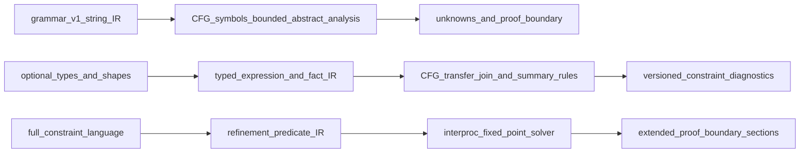

# Design class comparison — bounded typed-flow vs full constraint-language

**Study:** PSEUDOCODE-CONSTRAINT-STUDY  
**Design class A:** Bounded typed-flow (optional primitive/container/nullability/shape annotations; structured expressions in assignments/conditions; CFG transfer/join; local compatibility; explicit unknowns)  
**Design class B:** Full constraint-language (typed signatures, refinements, pre/post predicates, collection/field constraints, interprocedural summaries, alias/mutation policy, fixed-point solver)

---

## Comparison table

| Dimension | Bounded typed-flow (A) | Full constraint-language (B) |
|-----------|--------------------------|--------------------------------|
| **Grammar and migration burden** | Optional annotations on existing contract fields and assignments; v1 parse compatibility preserved via grammar v2 extension or inline optional clauses; legacy sidecars unchanged | New declaration syntax, versioned signatures, refinement predicates; likely grammar v2+ with migration guide; higher author retraining |
| **Parser / IR complexity** | Expression AST for assignments/conditions; lightweight type env (primitives, nullable, record/collection shapes); fact lattice for defined/nullable/shape tags | Full type/refinement AST; predicate normal form; summary objects; alias sets; solver state — substantially larger IR |
| **Analyzer algorithm** | CFG block transfer + join at merges; branch refinement on structured conditions; local CALL arg/return slot matching when signatures declared; loop: widen or unknown | Interprocedural fixed-point; summary-based call/return; refinement entailment; optional alias analysis; mutation tracking |
| **Report / schema versioning** | Increment `pseudocode-analysis-report.v2` or section-scoped `typed_flow` block; new diagnostic codes (e.g. `TYPE_MISMATCH`, `NULL_FLOW`); extended `proof_boundary` text per section | Major schema extension: refinement violations, summary conflicts, solver truncation; richer `unknowns` taxonomy |
| **Authoring burden** | Optional type hints on `INPUT`/`DATA`; structured literals in assignments; training on when to annotate vs accept unknown | Per-block signatures and refinements expected for precision; heavy annotation; steep learning curve |
| **False positive / false negative risk** | Conservative: unknown on opaque strings, external RUN, unmodeled aliasing → lower FP on definite errors, higher unknown rate | Higher precision potential when authored fully; higher FP risk if refinements over-constrain prose migrated from legacy |
| **Unknown-rate policy** | Align with existing **unknown policy**: external/RUN, opaque legacy prose, aliasing → explicit `unknowns[]`; fail closed only on proven violations | Solver timeout/budget → unknown; partial summaries disclosed; risk of silent gaps if solver policy weak |
| **CPU / memory budgets** | Moderate increase: CFG join per procedure within existing `max_cfg_blocks_per_procedure`; expression parse bounded by `max_parse_nodes` | Large increase: fixed-point iterations, path conditions, summary storage — likely new budget knobs beyond `max_fixed_point_iterations: 32` |
| **Test-fixture footprint (future)** | ~12–24 focused fixtures for transfer/join, nullable flow, shape tags, CALL compatibility | 40+ fixtures for refinements, interproc summaries, solver edge cases |
| **Layer B/C compatibility** | Additive: Layer B unchanged unless optional SHAPE rows for type syntax; Layer C new pass or extended `abstract`; `gate_mode` rollout via checklist flag | Layer B may need new contract-shape rules; Layer C gate failures more frequent until corpus matures; phased gate optional |

---

## Architecture flow (reference)

---

## Symmetric rationale

### Where bounded typed-flow wins

- Preserves **grammar v1 backward compatibility** (sponsor hard constraint) via optional extensions
- Builds directly on existing CFG infrastructure (today underutilized by abstract pass)
- Authoring cost scales with precision desired — prose-only sidecars still parse
- Diagnostic precision improves for **structured** assignments/conditions without requiring full refinement language
- Implementation complexity stays in **M** band overall vs **L–XL** for full constraints

### Where full constraint-language wins

- Can express PRE/POST as checkable predicates when authors invest in annotations
- Interprocedural data-flow and return compatibility across CALL chains
- Lower unknown rate **when corpus is fully annotated** (unrealistic for legacy mass)
- Stronger guarantees for safety-critical contracts (mutation, alias, collection bounds)

### Where both share limits

- RUN/external inputs → unknown (by policy)
- Runtime truth, complete path coverage, behavioral proof → **outside proof boundary**
- Unmodeled aliasing without alias policy → unknown
- Opaque string conditions in legacy code → unknown until remediated

---

## Sponsor defaults applied

1. **Grammar v1 backward compatibility:** hard constraint — favors design class A or explicit version boundary; class B requires v2 migration path.
2. **Authoring burden vs diagnostic precision:** both reported without weighting — class A lower burden / moderate precision; class B higher burden / higher ceiling precision.

---

## Study conclusion (comparison only)

Neither class is implementable on today's opaque-string IR. Class A is the smaller incremental step from Layer C baseline; class B is a separate product decision with disproportionate cost relative to current proof boundary and author practices.
