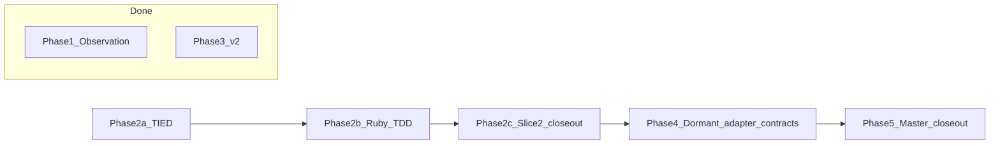

# Deferred stats roadmap — executable remaining-completion plan

**Request:** `REQ-DEFERRED_STATS_ROADMAP`  
**Tracker:** [`working/REQ-DEFERRED_STATS_ROADMAP_20260822.yaml`](../REQ-DEFERRED_STATS_ROADMAP_20260822.yaml) (update in-place)  
**TIED base path:** `/Users/fareed/Documents/dev/chatgpt/stdd/tied`  
**As of:** 2026-08-23  
**Cursor plan copy:** `/Users/fareed/.cursor/plans/deferred_stats_remaining_completion.plan.md`

`REQ-DEFERRED_STATS_ROADMAP` is the working change-request identifier used by
the Tracker and CITDP filenames. It is not a registered requirement or semantic
token and this plan does not create it. Canonical TIED intent remains in
`REQ-MCP_USAGE_METRICS`, `REQ-EVIDENCE_CHAIN_PROFILE`, and
`REQ-EVIDENCE_CHAIN_REPORT` with their existing ARCH/IMPL decisions. Never pass
the working identifier to `tied_verify` or treat its absent detail file as a
consistency defect.

---

## Completion status

| Phase | Scope | Status |
|---|---|---|
| **Slice 1** | Shared project identity (`project-identity.ts`) | Complete |
| **Phase 1** | v1 observation packet + gate III approved | Complete |
| **Phase 3a** | v2 TIED stack + CITDP v2 draft | Complete |
| **Phase 3b** | v2 report + CLI `--report-version v2` + `metrics_opt_in` | Complete (370 tests) |
| **Phase 2** | Ruby bounded signature aggregation | Complete |
| **Phase 4** | Dormant file-inventory + vocabulary-drift adapter contracts | Complete (structural only) |
| **Phase 5** | Master roadmap close-out | Complete; commit gate intentionally not executed |

### CITDP inventory

| File | Status |
|---|---|
| `tied/citdp/CITDP-REQ-DEFERRED_STATS_ROADMAP-identity.yaml` | Final (slice 1) |
| `tied/citdp/CITDP-REQ-DEFERRED_STATS_ROADMAP-v2.yaml` | Complete (Phase 3 v2 close-out) |
| `tied/citdp/CITDP-REQ-DEFERRED_STATS_ROADMAP-aggregation.yaml` | Complete (Phase 2 bounded aggregation) |
| `tied/citdp/CITDP-REQ-DEFERRED_STATS_ROADMAP-adapters.yaml` | Complete (Phase 4 dormant contracts) |

### Explicit exclusions (not in full completion)

- Repo-local project ID file (deferred per gate I)
- File-inventory / vocabulary-drift **orchestrator wiring**, production symbols,
  tests, and profile-field activation (Phase 4 is contract skeletons only)
- Sibling-client pilots beyond 1787461685
- Maturity score / universal rollup (locked non-goal)

These four exclusions remain visible in the final Tracker and CITDP close-out.
They are not silently cleared when the remaining implementation work finishes.

---

## Remaining todos

| ID | Phase | Summary | Status |
|---|---|---|---|
| slice2-tied | 2a | Reopen REQ/IMPL gates; define and validate bounded aggregation | complete |
| slice2-ruby | 2b | Ruby fixtures + honest RED/GREEN + literal token alignment | complete |
| slice2-closeout | 2c | Docs, vocab, final aggregation CITDP, CHANGELOG, Tracker | complete |
| phase4-adapters | 4 | Dormant adapter contracts + IMPL metadata + vocab + short CITDP | complete |
| phase5-closeout | 5 | CITDP finalize, tracker master close-out, validation sweep | complete |

---

## Recommended execution order



Run sequentially in the dirty worktree. Phase 2 and Phase 4 both update the
Tracker and TIED/vocabulary validation state; parallel execution would add
avoidable merge and evidence-order ambiguity. The critical path is Phase 2 →
Phase 4 → Phase 5.

---

## Refined change definition and gates

### Current behavior

- `scripts/analyze_tied_mcp_metrics.rb` hard-codes `.first(50)` for per-file
  and aggregate output but does not expose the bound or its proof boundary.
- Aggregate `schema_errors` is initialized and emitted but never incremented
  from per-file reports.
- Aggregate input consists of already bounded per-file `top_signatures`; a
  true global top-50 cannot be claimed when any file omitted candidates.
- Existing Ruby smoke coverage passes without checking these gaps.
- Integrated evidence-chain profiles intentionally leave `scope.file_counts`
  unknown and `evidence_chain.vocab_resolution` not measured.

### Desired behavior

- Per-file and aggregate reports emit deterministic top-50 signature rows plus
  `signature_coverage`.
- Aggregate reports sum `schema_errors` across all input reports.
- Aggregate coverage distinguishes an exact candidate set from an approximate
  projection after any per-file truncation.
- Phase 4 documents two dormant adapter contracts without activating them.

### Unchanged behavior

- Per-file YAML remains on stdout; `--aggregate` summary remains on stderr.
- Syntax errors and schema errors remain separate.
- Tool/client/failure/duration/adversarial activation behavior remains intact.
- File arguments retain their current multiplicity semantics; the new order
  test uses distinct paths and does not redefine duplicate-path handling.
- Evidence-chain profile runtime output remains unchanged in Phase 4:
  `file_counts` stays unknown and `vocab_resolution` stays `not_measured`.
- v1 remains the default report format; completed v2 behavior is not reopened.

### Falsification questions

- Can a file with 51 distinct signatures report exact coverage? It must not.
- Can an aggregate report exact coverage if one source report was approximate?
  It must not, even when retained candidates collapse below 50.
- Can reversing distinct input-file order change any aggregate
  `top_signatures` row, including `sample_args_summary`? It must not.
- Can two per-file schema errors produce aggregate `schema_errors: 0`? They
  must produce `2`.
- Can Phase 4 make either previously missing profile dimension observed? It
  must not.

### Risk, assurance, and inquiry policy

- Phase 2 is a behavior change. Select `baseline-functional`; keep
  external-input-security, data-integrity-migration, stateful-reliability,
  performance-scale-cost, user-facing-accessibility, regulated-privacy, and
  ai-enabled non-applicable with reasons. This change adds no trust boundary,
  persistence migration, user surface, or performance guarantee.
- Phase 2 adversarial inquiry depth is `minimal`: record the counterexamples
  above and proof boundaries; do not invoke `tied_adversarial_inquiry_run` or
  create the four integrated inquiry artifacts.
- Phase 4 is a TIED design change with proof boundary
  `pseudo_code_structure` only. It makes no executable-behavior claim.
- `tied_validate_consistency` and `pseudocode_validate` prove structure and
  traceability only. Ruby tests provide executable evidence for Phase 2.

---

## Phase 2 — Slice 2: bounded signature aggregation

**Gate II:** Pre-approved (`bounded top-50`, `signature_coverage`, sum `schema_errors` in aggregate).

### Current code gaps

| Gap | Location |
|---|---|
| No `SIGNATURE_BOUND` constant | `scripts/analyze_tied_mcp_metrics.rb` |
| No `signature_coverage` field | per-file report + aggregate summary |
| `schema_errors` never summed in aggregate loop | `build_aggregate` lines 214–259 |
| No aggregate `schema_errors` test | `scripts/analyze_tied_mcp_metrics_test.rb` |
| No fixture tree | `scripts/fixtures/mcp-metrics/` absent |
| No exact block-lead parity for the analyzer | Ruby source/test comments |
| Existing analyzer pseudo-code lacks changed-Active contract precision | `ANALYZE_TIED_MCP_METRICS` block |

### Phase 2a — TIED first

Do not create a pre-RED CITDP draft. The in-document analysis above and the
Tracker are the pre-implementation analysis; persist the final CITDP only
after verification per `citdp-policy.md`.

1. Reconfirm `tied_config_get_base_path` is exactly this repository’s `tied/`.
2. Reopen Tracker `author-requirement` for `REQ-MCP_USAGE_METRICS`:
   - use `yaml_detail_update`, never a direct YAML edit;
   - add positive and negative satisfaction criteria for bounded signature
     coverage and aggregate `schema_errors`;
   - do not edit status by hand and do not create a roadmap REQ.
3. Review `ARCH-MCP_USAGE_METRICS` and record that the existing opt-in,
   fail-open, local-JSONL architecture still owns this analyzer-only change.
   No ARCH update is expected; if execution changes storage, trust boundaries,
   or producer flow, return to `author-architecture` and update it through MCP
   before pseudo-code.
4. Reopen `resolve-pseudocode` for
   `IMPL-MCP_USAGE_METRICS-pseudocode.md`:
   - name the changed block `ANALYZE_TIED_MCP_METRICS`;
   - declare `SIGNATURE_BOUND = 50`;
   - add complete PRE/POST/EFFECTS/FAILURE_MODES/TERMINATION contract fields;
   - specify deterministic tie order as descending count, then tool, then
     `args_signature`;
   - specify deterministic `sample_args_summary` selection for equal
     `(tool, args_signature)` keys using the lexically smallest canonical JSON
     representation, so argv order cannot select a different sample;
   - require aggregate `schema_errors = sum(per-file schema_errors)`.
5. Specify `signature_coverage` exactly:
   - shape: `{ bound, considered, emitted, omitted, status }`;
   - statuses: `exact_within_bound` or `approximate`;
   - per file: `considered` is the number of distinct valid
     `(tool, args_signature)` keys seen in that file; `emitted` is
     `min(considered, bound)`; `omitted = considered - emitted`; exact iff
     omitted is zero;
   - aggregate: `considered` is the distinct candidate-key union visible from
     bounded per-file `top_signatures`; `emitted` and `omitted` apply the
     aggregate bound to that candidate set; status is exact only when every
     per-file status is exact and aggregate omitted is zero;
   - aggregate `considered`/`omitted` do not claim visibility into candidates
     already hidden by a per-file bound; `approximate` is the proof-boundary
     disclosure for that information loss.
6. Update the `IMPL-MCP_USAGE_METRICS` detail through MCP with the full
   implementation-approach and test references; preserve existing metadata
   fields and arrays when updating.
7. RECORD `ANALYZE_TIED_MCP_METRICS` and the coverage semantics in
   `tied/vocab/tied-yaml-mcp.md`, including its block-name bridge and
   alphabetical index.
8. Run the pre-RED gate:
   - `pseudocode_validate` for `IMPL-MCP_USAGE_METRICS` with
     `require_contracts: true` and `require_behavioral_coverage: false`;
   - `yaml_index_validate`;
   - `tied_validate_consistency`;
   - `scripts/yaml_tool.sh --check` on changed TIED YAML.

Any failed structural gate returns to the pseudo-code/REQ step before tests.

### Phase 2b — Ruby TDD

**Fixtures** (`scripts/fixtures/mcp-metrics/`):

| Fixture | Purpose |
|---|---|
| `multi_file_signatures/` | Distinct paths; at least one file has 51 signatures → aggregate `approximate` |
| `within_bound/` | 0, 50, and aggregate-union ≤50 boundaries → `exact_within_bound` |
| `schema_errors_multi/` | 2 files × 1 schema error → aggregate `schema_errors: 2` |
| `signature_ties.jsonl` | Count/tool/signature tie-break ordering |
| `malformed_and_valid.jsonl` | Mixed parse/schema |
| `empty.jsonl` | Zero lines |
| `permutation_order/` | Distinct files with overlapping keys and different samples; reverse argv order |

1. RED first in `scripts/analyze_tied_mcp_metrics_test.rb`:
   - per-file 0, 50, and 51-signature coverage boundaries;
   - aggregate exact only when every input is exact and candidate union ≤50;
   - aggregate approximate when any per-file input is approximate;
   - aggregate approximate when visible aggregate candidates exceed 50;
   - multi-file `schema_errors` sum;
   - stable count/tool/signature ordering;
   - full aggregate `top_signatures` equality under reversed distinct argv
     order, including deterministic sample selection;
   - mixed parse/schema and empty-file behavior unchanged.
2. Run `ruby scripts/analyze_tied_mcp_metrics_test.rb` and record the expected
   target-specific RED reason. A harness or unrelated failure is not valid RED.
3. GREEN in `scripts/analyze_tied_mcp_metrics.rb` only after honest RED:
   - add `SIGNATURE_BOUND`;
   - centralize coverage construction rather than duplicating field math;
   - sum aggregate `schema_errors`;
   - preserve output channels and all existing report sections;
   - make sample selection deterministic.
4. Copy the exact `ANALYZE_TIED_MCP_METRICS` block lead into the primary Ruby
   test and production loci. Keep existing adversarial-inquiry token comments
   on their own logical block; do not replace those obligations.
5. Run the Ruby test after each GREEN/refactor iteration. No composition or
   E2E work is required because this is one offline module with no new binding.

### Phase 2c — Close-out

- Update `docs/conversation-analysis-tools.md` with the exact coverage proof
  boundary; do not imply exact global top-50 after per-file truncation.
- Reconcile `tied/vocab/tied-yaml-mcp.md` after code/tests (RECORD).
- Update `CHANGELOG.md` under the existing unreleased section.
- Run post-test `pseudocode_validate` with coverage references to the Ruby
  test and source, then perform literal block-lead/token parity audit.
- Run `tied_verify` only for `REQ-MCP_USAGE_METRICS` and
  `IMPL-MCP_USAGE_METRICS`, with both demotion flags false.
- Persist `CITDP-REQ-DEFERRED_STATS_ROADMAP-aggregation.yaml` via
  `citdp_record_write` with:
  - `risk_analysis.adversarial_inquiry.depth_tier: minimal`;
  - baseline-functional quality evidence row with exact command/result;
  - explicit non-applicable specialized-profile rows;
  - RED and GREEN evidence, module boundary, proof boundaries, residual risk,
    and `record_status: complete`.
- Update the Tracker with Phase 2 evidence and clear only the Phase 2 pending
  item.

### Phase 2 validation

| Check | Command |
|---|---|
| Ruby tests | `ruby scripts/analyze_tied_mcp_metrics_test.rb` |
| Pseudo-code | `pseudocode_validate` → IMPL-MCP_USAGE_METRICS |
| Index syntax | `yaml_index_validate` |
| YAML | `scripts/yaml_tool.sh --check` on changed TIED, CITDP, and Tracker YAML |
| Consistency | `tied_validate_consistency` |
| Verify | `tied_verify` → `REQ-MCP_USAGE_METRICS`, `IMPL-MCP_USAGE_METRICS`; no demotions |
| Vocab | `ruby scripts/validate_vocab_index.rb` |

---

## Phase 4 — Dormant adapter contract skeletons

**Goal:** Document future adapter surfaces with a
`pseudo_code_structure` proof boundary. **No orchestrator wiring, TypeScript,
tests, profile activation, or `tied_verify` claim.**

### Gaps today

| Profile field | Current state |
|---|---|
| `scope.file_counts` | `{}`; `unknown: ["file_counts"]` |
| `evidence_chain.vocab_resolution` | `not_measured` at integrated depth |

### Deliverables

1. Add contract-only `COLLECT_FILE_INVENTORY` and `COLLECT_VOCAB_DRIFT`
   blocks to `IMPL-EVIDENCE_CHAIN_PROFILE-pseudocode.md`.
2. Each block must:
   - have the exact IMPL/ARCH/REQ block lead;
   - declare INPUT, PRE, OUTPUT, POST, EFFECTS, FAILURE_MODES, and
     TERMINATION;
   - state `CONTROL: dormant contract; no caller or registration in this
     phase`;
   - preserve fail-closed base-path, read-only project intent, ignored-path,
     denominator, and proof-boundary rules;
   - explicitly state that `GENERATE_EVIDENCE_CHAIN_PROFILE`,
     `RESOLVE_EVIDENCE_CHAIN_SCOPE`, adapter types, and runtime output are
     unchanged.
3. Update `IMPL-EVIDENCE_CHAIN_PROFILE` detail via MCP to record the dormant
   contract catalog and its no-runtime-evidence limitation. Do not change its
   status.
4. RECORD **file inventory adapter** and **vocabulary drift adapter**, plus
   `COLLECT_FILE_INVENTORY` and `COLLECT_VOCAB_DRIFT`, in
   `tied/vocab/quality-assurance.md`; update naming bridge, block-name table,
   and alphabetical index.
5. Run structural `pseudocode_validate` with
   `require_behavioral_coverage: false`, `yaml_index_validate`,
   `tied_validate_consistency`, vocabulary validation, and YAML checks.
6. Persist a short
   `CITDP-REQ-DEFERRED_STATS_ROADMAP-adapters.yaml` via
   `citdp_record_write`: `depth_tier: minimal`, no behavior under test,
   proof boundary `pseudo_code_structure`, no runtime verification claim, and
   `record_status: complete`.
7. Update the Tracker to mark only the Phase 4 contract deliverable complete.

Do not copy these dormant block leads into TypeScript/tests because there are
no authorized implementation loci. The CITDP and IMPL metadata must disclose
that deliberate three-way-alignment deferral rather than treating it as passed.

---

## Phase 5 — Master roadmap close-out

### 5a — Finalize CITDP records

- Rewrite `CITDP-REQ-DEFERRED_STATS_ROADMAP-v2.yaml` through
  `citdp_record_write`, preserving its approved scope while replacing stale
  “Pending Phase 3b” fields with observed final evidence.
- Add the missing baseline-functional quality evidence matrix and
  `risk_analysis.adversarial_inquiry.depth_tier: minimal`; keep assurance
  profile, research profile, and gate policy separate.
- Record actual final test counts from command output rather than preserving a
  hard-coded 370 if the suite count changes.
- Confirm aggregation and adapter CITDP records are complete and linted.

### 5b — Acceptance artifacts

```bash
cd mcp-server && npm run build
node dist/cli/evidence-chain-report.js \
  --inputs ../working/evidence-chain/report-inputs-v2-golden.yaml \
  --yaml-out ../working/REQ-DEFERRED_STATS_ROADMAP/v2-acceptance/report.yaml \
  --markdown-out ../working/REQ-DEFERRED_STATS_ROADMAP/v2-acceptance/report.md \
  --report-version v2
```

Verify schema v2, one compatibility cohort, two denominator sub-cohorts, no
forbidden score keys, and no absolute paths unless explicitly enabled.

### 5c — Tracker master close-out

Update `working/REQ-DEFERRED_STATS_ROADMAP_20260822.yaml`:

- Clear Phase 2 and Phase 4 pending work only after their gates pass.
- Retain all four explicit exclusions: repo-local ID file, Phase 4 wiring,
  sibling pilots, and maturity/universal rollup.
- Refresh test counts, CITDP paths, acceptance artifact paths, proof
  boundaries, residual risks, and vocabulary VALIDATE result.
- Reconcile every Tracker step as completed, still pending, or explicitly
  skipped with evidence. Do not leave generic prior-slice statuses implying
  that a reopened Phase 2 REQ/IMPL step was skipped.
- Record `traceable-commit` as not executed by user authorization. Run its
  vocabulary VALIDATE sub-gate, but do not stage, commit, amend, or push.
- Set `master_checklist` to working-tree implementation complete with the four
  exclusions and the intentionally unexecuted commit gate; do not claim a
  commit exists.

### 5d — Full validation sweep

1. `ruby scripts/analyze_tied_mcp_metrics_test.rb`
2. `npm test --prefix mcp-server`
3. `npm run build --prefix mcp-server`
4. `bunx tsc -b` from `mcp-server/`
5. `pseudocode_validate` post-test for `IMPL-MCP_USAGE_METRICS` with Ruby
   coverage references.
6. `pseudocode_validate` structural-only for
   `IMPL-EVIDENCE_CHAIN_PROFILE` dormant contract blocks; document why runtime
   coverage is not claimed.
7. `yaml_index_validate`.
8. `scripts/yaml_tool.sh --check` on every changed TIED/CITDP/Tracker YAML.
9. `tied_validate_consistency`.
10. Run `tied_verify` with no demotions and only observed passing items:
    - Phase 2: `REQ-MCP_USAGE_METRICS` and `IMPL-MCP_USAGE_METRICS`;
    - completed Phase 3 runtime: `REQ-EVIDENCE_CHAIN_REPORT`,
      `IMPL-EVIDENCE_CHAIN_REPORT`, and `REQ-EVIDENCE_CHAIN_PROFILE`;
    - do not pass `IMPL-EVIDENCE_CHAIN_PROFILE` after adding its dormant Phase
      4 contracts. Preserve its existing status and record that the new
      contract blocks have structural evidence only, not executable evidence.
11. `ruby scripts/validate_vocab_index.rb`.
12. `git diff --check`, review staged plus unstaged scope, and confirm no
    excluded feature or unrelated user work was altered.
13. Tidy `CHANGELOG.md` without duplicating the existing Phase 3 entries.

### 5e — Vocab touchpoint 3 (VALIDATE)

Reconcile `tied/vocab/quality-assurance.md` and
`tied/vocab/tied-yaml-mcp.md` against final REQ/IMPL, pseudo-code, Ruby
symbols, tests, docs, and CHANGELOG. Record VALIDATE evidence in the Tracker.
No commit is authorized in this workflow.

---

## Effort estimate

| Phase | Session estimate |
|---|---|
| Phase 2 | 1 focused session |
| Phase 4 | 0.5 sequential session |
| Phase 5 | 0.5 session |

**Total remaining:** ~2 sessions.

---

## First step

Reconfirm the TIED base path, reopen Tracker `author-requirement` for
`REQ-MCP_USAGE_METRICS`, then reopen `resolve-pseudocode` for
`IMPL-MCP_USAGE_METRICS`. Pass the pre-RED pseudo-code/TIED gates before
creating the Ruby RED tests. Do not create the aggregation CITDP until
post-implementation verification.
