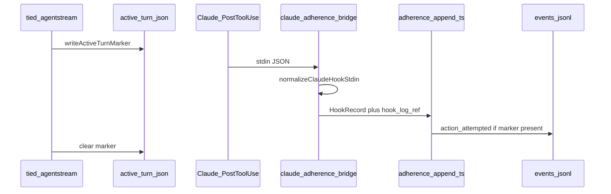

# PLAN — REQ-TIED_CLAUDE_ADHERENCE_HOOKS

**Status:** **Closed** — build-plan + plan-close-out 2026-09-24 ([unified-close-out-receipt](evidence/unified-close-out-receipt-2026-09-24.md))  
**Last refine:** 2026-09-24 (`refine-plan` on Cursor plan `risk-boot-005_claude_hooks_06f06054`)  
**Triggers:** [RISK-BOOT-005](tied/citdp/CITDP-REQ-TIED_CLAUDE_BOOTSTRAP_OPS.yaml) · R8 N/A re-probe · sponsor **`plan-new-feature`** re-open  
**Does not reopen:** Closed satisfaction criteria on [REQ-TIED_CLAUDE_BOOTSTRAP_OPS](tied/requirements/REQ-TIED_CLAUDE_BOOTSTRAP_OPS.yaml) (B4 receipt stays historical)

## Intent

Ship a **Claude Code adherence append-only bridge** so **`tied agentstream`** turns with an **active-turn marker** can append **`action_attempted`** rows to the adherence ledger when Claude fires official hook events—using **`.claude/settings.json`** safe-merge install, without claiming full Interactive Prompt Composer adherence when no marker exists.

## Evidence baseline (repo, 2026-09-24)

| Area | Evidence |
| --- | --- |
| Cursor bridge (reference) | [.cursor/hooks/log.rb](.cursor/hooks/log.rb) → [adherence-append-action-attempted.ts](mcp-server/src/hooks/adherence-append-action-attempted.ts) |
| Marker writer | [live-executor.ts](mcp-server/packages/agentstream/src/live-executor.ts) · [adherence-live.ts](mcp-server/packages/agentstream/src/adherence-live.ts) |
| Claude bootstrap | [bootstrap.mjs](tools/bootstrap/lib/bootstrap.mjs) · MCP safe merge [mcp-config.mjs](tools/bootstrap/lib/mcp-config.mjs) |
| Prior N/A | [adherence-spike-na.md](../REQ-TIED_CLAUDE_BOOTSTRAP_OPS/evidence/adherence-spike-na.md) · [r8-adherence-hook-bridge-na.md](../REQ-TIED_CLAUDE_DOC_REMAINDER/evidence/r8-adherence-hook-bridge-na.md) |
| Upstream contract | Claude Code hooks in **`.claude/settings.json`** (`hooks` key); stdin includes `hook_event_name`, `cwd`, `tool_name`, `tool_input` ([Hooks reference](https://code.claude.com/docs/en/hooks)) |
| CLI pin (maintenance) | Align fixtures with R7 pin **2.1.273** unless A0 probe records drift |

## North-star flow



## Resolved sponsor terms (refine 2026-09-24)

| Sponsor term | Resolution |
| --- | --- |
| RISK-BOOT-005 / R8 watch-only | This REQ **supersedes watch-only** once Implemented; until then docs stay honest (no “shipped” language) |
| “Stable upstream contract” | R8 looked for Cursor-parity **`.claude/hooks.json`**; contract is **`settings.json` + documented events**—A0 probe confirms pin + stdin fields, not another N/A by default |
| Parity scope | **Append-only bridge only** (ledger `action_attempted`); not Cursor **transcript YAML** (`log.rb`) |
| Interactive vs agentstream | Bridge is **marker-gated** for all modes; semi-automated IDE without agentstream remains **out of ledger** (same as Cursor table in [comparison doc](docs/comparisons/claude-code-tied-multi-harness-plan.md)) |
| Bootstrap default | **Install on Claude bootstrap** when MCP dist exists (mirror Cursor `copyHooks` always-on policy); **merge-only** for foreign settings |
| CLI shape | **New** `claude-adherence-bridge` CLI (normalize → existing append); do **not** overload Cursor hook payloads in one entrypoint |
| `hook_log_ref` | Append-only **`{projectRoot}/.claude/adherence-bridge.log`** (line number passed to append CLI); no prompt/tool body in ledger |
| Workspace root | Normalizer sets `workspace_roots: [stdin.cwd]`; bridge passes **`CLAUDE_PROJECT_DIR`** when set; add unit coverage so marker resolution never depends on Cursor-only `relative_path` heuristics in [adherence-append-action-attempted.ts](mcp-server/src/hooks/adherence-append-action-attempted.ts) |

## Non-goals (v1)

- Full hook transcript / YAML conversation logs on Claude
- Automated reconciliation for every Claude IDE session without **active-turn marker**
- Rewriting closed B4 **`SPIKE_CLAUDE_ADHERENCE_HOOKS`** receipt (forward reference + new IMPL only)
- Plugin-only hooks (`hooks/hooks.json`) as the **primary** install path (may document as optional follow-on)

## TIED tokens (to create at build start)

| Layer | Token |
| --- | --- |
| REQ | **REQ-TIED_CLAUDE_ADHERENCE_HOOKS** |
| ARCH | **ARCH-TIED_CLAUDE_ADHERENCE_HOOKS** |
| IMPL | **IMPL-TIED_CLAUDE_ADHERENCE_HOOKS** |

**depends_on:** [REQ-TIED_CHECKLIST_GATE_ENFORCEMENT](tied/requirements/REQ-TIED_CHECKLIST_GATE_ENFORCEMENT.yaml), [REQ-TIED_NEW_CLIENT_ADHERENCE](tied/requirements/REQ-TIED_NEW_CLIENT_ADHERENCE.yaml), [REQ-TIED_CLAUDE_BOOTSTRAP_OPS](tied/requirements/REQ-TIED_CLAUDE_BOOTSTRAP_OPS.yaml)  
**related_to:** [REQ-TIED_UNIFIED_TOOLCHAIN](tied/requirements/REQ-TIED_UNIFIED_TOOLCHAIN.yaml), [REQ-TIED_CLAUDE_HARNESS](tied/requirements/REQ-TIED_CLAUDE_HARNESS.yaml)

**IMPL blocks (pseudo-code):** `PROBE_CLAUDE_HOOK_CONTRACT`, `NORMALIZE_CLAUDE_HOOK_RECORD`, `MERGE_CLAUDE_ADHERENCE_HOOKS`, `INSTALL_CLAUDE_ADHERENCE_BRIDGE`

## Depth policy

| Field | Value |
| --- | --- |
| `depth_tier` | **integrated** (external hook stdin) |
| `gate_policy` | **advisory** unless sponsor tightens at build |
| `profile_depth` | **integrated** |
| Adversarial inquiry | **`sub-adversarial-inquiry-pass`** at pre-RED and verification when MCP available; artifacts under `working/REQ-TIED_CLAUDE_ADHERENCE_HOOKS/adversarial-inquiry/` |

**Gate:** `tied_checklist_gate_validate` **`phase: pre_implementation`** with this Tracker + [citdp-inline.yaml](citdp-inline.yaml) before RED.

## Claude → bridge event mapping (v1)

| Claude hook (settings.json key) | Matcher (v1) | Normalized `hook_event_name` | Evidence ref rule |
| --- | --- | --- | --- |
| `PostToolUse` | `""` (all tools) | `postToolUse` | `tool:{tool_name}` from stdin |
| `PostToolUse` | `Bash` | `afterShellExecution` | `shell:sha256:{digest}` from `tool_input.command` |
| `PostToolUse` | `mcp__.*` (regex matcher) | `afterMCPExecution` | `mcp:{server}.{tool}` parsed from tool name / input |

**Out of v1:** `PreToolUse` (permission-only), `SessionStart`, notification hooks—no ledger rows unless a later REQ extends mapping.

## Build slices (build-plan order)

| Slice | Goal | Primary tests / evidence |
| --- | --- | --- |
| **A0** | Contract probe + frozen stdin fixtures | `mcp-server/fixtures/claude/hooks/` · `evidence/contract-probe-2026-09-24.md` |
| **A1** | `claude-adherence-normalize.ts` + bridge CLI | `claude-adherence-normalize.test.ts` |
| **A2** | Ledger append: `source.kind: claude_hook` + ALLOWLIST | `adherence-append-action-attempted.test.ts` |
| **A3** | `mergeClaudeAdherenceHooks` + bootstrap wire | `claude-adherence-hooks.test.mjs` · extend [claude-harness.test.mjs](tools/bootstrap/lib/claude-harness.test.mjs) assert settings merge |
| **A4** | End-to-end composition (marker + fixture stdin) | Extend [hooks.composition.test.ts](mcp-server/src/request-evidence-envelope/hooks.composition.test.ts) |
| **A5** | TIED YAML, LEAP docs, CITDP persist, close-out | Comparison doc R8 row · [agentstream.md](tied/vocab/agentstream.md) · `tied_validate_consistency` |

## Satisfaction criteria (REQ detail draft)

1. **SC-ADH-PROBE:** A0 documents hook location, CLI pin, stdin sample, and mapping table—or **not_applicable** with residual risk (only if A0 fails).
2. **SC-ADH-ADAPTER:** A1–A2 tests green; ledger rows include `source.kind: claude_hook`.
3. **SC-ADH-BOOTSTRAP:** A3 merge idempotent; foreign hooks preserved; Claude skills + `.mcp.json` regressions green.
4. **SC-ADH-DOC:** R8 / **Unresolved** adherence rows in [comparison doc](docs/comparisons/claude-code-tied-multi-harness-plan.md) updated; bootstrap README; vocab **append-only bridge** Claude bullet.
5. **SC-ADH-VALIDATE:** `tied_validate_consistency` clean; RISK-BOOT-005 **mitigated** in `CITDP-REQ-TIED_CLAUDE_ADHERENCE_HOOKS.yaml` with evidence paths.

## CITDP risks

| Id | Mitigation |
| --- | --- |
| **RISK-BOOT-005** | A0–A4 evidence; forbid “automation shipped” doc language until SC-ADH-DOC |
| **RISK-ADH-CL-001** | Merge-only settings (pattern: `initializeClaudeMcpConfig`) |
| **RISK-ADH-CL-002** | Fixture pin + README maintenance note |
| **RISK-ADH-CL-003** | REQ + docs: marker required; reconcile read-only |

## Test commands (verification slice)

```bash
cd mcp-server && npm run build && node --test dist/hooks/adherence-append-action-attempted.test.js dist/hooks/claude-adherence-normalize.test.js
node --test tools/bootstrap/lib/claude-adherence-hooks.test.mjs tools/bootstrap/lib/claude-harness.test.mjs
```

## Artifacts

| Artifact | Path |
| --- | --- |
| Linked plan | `working/REQ-TIED_CLAUDE_ADHERENCE_HOOKS/PLAN.md` (this file) |
| Inline CITDP | [citdp-inline.yaml](citdp-inline.yaml) |
| Tracker | [checklist-tracker.yaml](checklist-tracker.yaml) |
| Refine notes | [refine-notes-2026-09-24.md](refine-notes-2026-09-24.md) |

## Vocabulary

**PRELOAD:** [tied/vocab/agentstream.md](tied/vocab/agentstream.md), [tied/vocab/prompt-composer.md](tied/vocab/prompt-composer.md)  
**RECORD (build):** **Claude adherence bridge**, **settings.json safe merge**, **contract probe A0**

## Execution entry

```text
/build-plan @working/REQ-TIED_CLAUDE_ADHERENCE_HOOKS/PLAN.md
```

First build steps: MCP create REQ/ARCH/IMPL → IMPL pseudo-code sidecar → `pseudocode_validate` → pre_implementation gate → RED A0/A1 tests.
