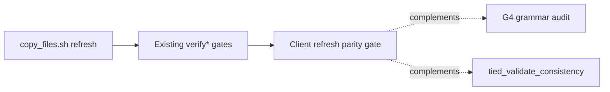

# Client refresh parity gate (+ Ruby compare load fix)

| Field | Value |
| --- | --- |
| **Program REQ** | [REQ-TIED_CLIENT_REFRESH_PARITY](../../tied/requirements/REQ-TIED_CLIENT_REFRESH_PARITY.yaml) |
| **Prerequisite REQ** | [REQ-TIED_YAML_COMPARE_RUBY_LOAD](../../tied/requirements/REQ-TIED_YAML_COMPARE_RUBY_LOAD.yaml) |
| **ARCH** | [ARCH-TIED_CLIENT_REFRESH_PARITY](../../tied/architecture-decisions/ARCH-TIED_CLIENT_REFRESH_PARITY.yaml) |
| **IMPL** | [IMPL-TIED_CLIENT_REFRESH_PARITY](../../tied/implementation-decisions/IMPL-TIED_CLIENT_REFRESH_PARITY.yaml) · [pseudo-code](../../tied/implementation-decisions/IMPL-TIED_CLIENT_REFRESH_PARITY-pseudocode.md) |
| **CITDP** | [CITDP-REQ-TIED_CLIENT_REFRESH_PARITY.yaml](../../tied/citdp/CITDP-REQ-TIED_CLIENT_REFRESH_PARITY.yaml) · [CITDP-REQ-TIED_YAML_COMPARE_RUBY_LOAD.yaml](../../tied/citdp/CITDP-REQ-TIED_YAML_COMPARE_RUBY_LOAD.yaml) |
| **Tracker** | [checklist-tracker.yaml](./checklist-tracker.yaml) |
| **Report schema (draft)** | [client-refresh-parity-report.v1.schema.json](./client-refresh-parity-report.v1.schema.json) → promote to `tools/bootstrap/schemas/` in B2 |
| **Size** | **M** (two slices; not express lane — bootstrap policy + dual parity surfaces + Ruby load ordering) |
| **profile_depth** | `minimal` |
| **gate_policy** | advisory (no integrated adversarial inquiry triggers) |

## Refine gate (resolved)

| Sponsor term | Resolution |
| --- | --- |
| **Parity A** | Compare `TIED_SOURCE/templates/` → `client/tied/methodology/` with template-only allowlist (see **Allowlist source of truth**). Empirical baseline: 4 template-only paths (`.tied-yaml.yaml`, `agent-req-checklist-feat-spawned-phase5.v1.yaml`, `impl-essence-pseudocode-template.md`, `processes.md` under templates tree); client-only `vocab/` under methodology is expected (source lives under `templates/vocab/` mapped into methodology). |
| **Parity B** | For each `manifest.json` `DOCS_TO_COPY` entry, sha256 `TIED_SOURCE/tied/docs/<file>` vs `client/tied/docs/<file>`; classify `matched`, `drifted`, `missing`, `preserved_by_policy`. Empirical: 2/41 drift on test client (`agent-req-implementation-checklist.yaml`, `prompt-type-skills.md`) while bootstrap preserved all 41. |
| **G4 audit** | Remains **distinct** proof boundary (`scripts/run-tied-new-client-audit.mjs` / grammar v2). Parity gate **complements** G4; does not replace `tied_validate_consistency` or inherited detail-file verify. |
| **Doc refresh modes** | Phase 2 / future REQ — see **Deferred (Phase 2)**. |
| **Directory warnings** | Fix false positives in `warnModifiedCopyTarget` when directories get non-midnight mtimes after `rm`/`mkdir` vocab refresh; prefer skip-directory scan (files only) in B3. |

## Resolved decisions (was open → decided)

| Topic | Decision |
| --- | --- |
| **Parity A compare mode (v1 default)** | **sha256** per relative file path. Optional **`--semantic-yaml-compare`**: for paths ending in `.yaml`/`.yml` only, invoke `scripts/compare_yaml_dirs.rb` on the parent directory pair (requires Slice A green). Never replace sha256 for non-YAML assets. |
| **Bootstrap exit on doc drift** | Default: **warn + exit 0** from bootstrap when only Parity B drift. **`--strict-refresh`**: Parity B drift → **exit 1**. Parity A methodology drift → **exit 1** always (unless report-only mode below). Internal parity errors → **exit 2**. |
| **`--skip-parity-gate`** | **Skip entirely**: do not run `RUN_CLIENT_REFRESH_PARITY_GATE`; no JSON report; bootstrap proceeds as today after verify* block. For emergency brownfield refresh only; document in README. |
| **`--parity-gate-report-only`** | **Run gate + write report**; parity sub-step **never changes bootstrap exit code** (always 0 from parity); drift still printed to stderr. Use in CI artifact collection before tightening policy. Mutually exclusive with `--skip-parity-gate`. |
| **Report schema version** | **`client-refresh-parity-report.v1`**; JSON Schema draft at [client-refresh-parity-report.v1.schema.json](./client-refresh-parity-report.v1.schema.json); runtime default report path `{clientRoot}/.tied/client-refresh-parity-report.json` overridable via **`--parity-report=`**. |
| **Allowlist source of truth** | **`tools/bootstrap/lib/methodology-template-only-allowlist.mjs`** exports `METHODOLOGY_TEMPLATE_ONLY_PATHS` (paths relative to `templates/`). **Not** in `manifest.json`. Unit test asserts stable set documented in ARCH + PLAN; DOCS_TO_COPY remains manifest-only for Parity B. |

## CLI flag matrix (copy-files / bootstrap)

Flags propagate `copy-files.mjs` → `bootstrapTied(..., options)` → `WIRE_BOOTSTRAP_TAIL`.

| Flag | Parity invoked? | Report written? | Methodology drift | Doc drift | Notes |
| --- | --- | --- | --- | --- | --- |
| *(default)* | yes | yes (default path) | exit 1 | warn, exit 0 | After verify* tail |
| `--strict-refresh` | yes | yes | exit 1 | exit 1 | Brownfield doc customization fails closed |
| `--skip-parity-gate` | no | no | — | — | Legacy bootstrap behavior for parity |
| `--parity-gate-report-only` | yes | yes | warn only | warn only | CI snapshot; bootstrap exit 0 from parity |
| `--parity-report=<path>` | yes* | yes at path | *unless skipped | | |
| `--semantic-yaml-compare` | yes | yes | uses semantic for `.yaml` | N/A (B stays hash) | Requires REQ-TIED_YAML_COMPARE_RUBY_LOAD |

Standalone CLI: `node tools/bootstrap/verify-client-methodology.mjs <clientRoot>` accepts the same flags (without copy side effects).

## Bootstrap wiring anchor (B3)

In `tools/bootstrap/lib/bootstrap.mjs`, invoke parity **immediately after** `verifyMethodologyPseudocodeTokenRefs(tiedDir)` (line ~241) and **before** `applyMethodologyClientBoundary(...)` (~243). Rationale: parity reads refreshed methodology tree and manifest docs; boundary hook install must not mask drift detection.

```text
verifyFidelityMethodology → … → verifyMethodologyPseudocodeTokenRefs
→ RUN_CLIENT_REFRESH_PARITY_GATE (new)
→ applyMethodologyClientBoundary
→ return
```

Windows: `copy_files.cmd` resolves to the same Node engine; parity runs on all platforms where bootstrap runs verify* (no separate Windows skip).

## Proof boundary diagram



## Phased implementation order

| Phase | REQ | Deliverable | Depends on |
| --- | --- | --- | --- |
| **A** | REQ-TIED_YAML_COMPARE_RUBY_LOAD | Hoist `DEFAULT_RECORD_LIST_KEYS`; extend Ruby smoke test | — |
| **B1** | REQ-TIED_CLIENT_REFRESH_PARITY | `methodology-template-only-allowlist.mjs` + `client-refresh-parity.mjs` + unit tests (Parity A/B) | A |
| **B2** | REQ-TIED_CLIENT_REFRESH_PARITY | `verify-client-methodology.mjs` CLI; promote schema to `tools/bootstrap/schemas/` | B1 |
| **B3** | REQ-TIED_CLIENT_REFRESH_PARITY | Bootstrap tail wiring (anchor above) + `copy-managed.mjs` directory warning fix | B2 |
| **B4** | REQ-TIED_CLIENT_REFRESH_PARITY | Docs: `methodology-migration.md` Phase 1 verify, `tools/bootstrap/README.md` | B3 |
| **B5** (optional) | Future REQ | Methodology version stamp; doc refresh modes | B4 |

## Deferred (Phase 2 / future REQ)

| Item | Acceptance criteria stub |
| --- | --- |
| **Methodology version stamp** | File `tied/methodology/.tied-methodology-version` (or equivalent) written on refresh; parity report includes `methodology_version` field; drift if stamp mismatch after refresh. |
| **`--refresh-docs=checksum\|allowlist`** | Explicit operator opt-in to overwrite selected `tied/docs/` entries from source; default remains preserve-client; parity B `preserved_by_policy` shrinks when refresh mode copies. |
| **Automated doc overwrite** | Documented migration runbook; never default on brownfield bootstrap. |

## build-plan readiness

### Slice A — first RED tests

| Test file | Intent |
| --- | --- |
| `scripts/yaml_semantic_compare_load_test.rb` **(new)** | `require` yaml_semantic_compare; assert `YamlSemanticCompare::DEFAULT_RECORD_LIST_KEYS` defined; instantiate `DifferenceWalker` |
| `scripts/compare_yaml_dirs_test.rb` **(extend)** | Spawn `ruby scripts/compare_yaml_dirs.rb --help` or minimal compare after load path (guards parse-time require) |

**Merge-safe boundary:** touch only `scripts/yaml_semantic_compare.rb` (constant hoist) + tests; no bootstrap or Node files.

### Slice B — first RED tests

| Test file | Intent |
| --- | --- |
| `tools/bootstrap/lib/client-refresh-parity.test.mjs` **(new)** | Temp fixture trees: methodology match/drift; DOCS_TO_COPY matched/drifted/missing; allowlist skips template-only paths |
| `tools/bootstrap/lib/methodology-template-only-allowlist.test.mjs` **(new)** | Allowlist matches ARCH documented paths |
| `tools/bootstrap/lib/copy-managed.test.mjs` **(new or extend)** | Directory-only paths do not trigger `Client-modified managed copy` when files are midnight-normalized |
| `mcp-server/src/e2e/bootstrap-and-load.test.ts` **(extend)** | Disposable client: `./copy_files.sh <tmpdir>` then parity CLI; optional `--skip-parity-gate` until wiring green |

### Production paths (build-plan)

- `scripts/yaml_semantic_compare.rb` — constant hoist only (Slice A)
- `tools/bootstrap/lib/methodology-template-only-allowlist.mjs`
- `tools/bootstrap/lib/client-refresh-parity.mjs`
- `tools/bootstrap/verify-client-methodology.mjs`
- `tools/bootstrap/schemas/client-refresh-parity-report.v1.schema.json` (from working draft)
- `tools/bootstrap/lib/copy-managed.mjs` — directory warning behavior
- `tools/bootstrap/lib/bootstrap.mjs` / `copy-files.mjs` — flags above

### CI recipe (disposable client + parity)

1. `mktemp -d` client path; run `$TIED_SOURCE/copy_files.sh $CLIENT` (or project script equivalent).
2. Run `node tools/bootstrap/verify-client-methodology.mjs "$CLIENT"` — expect exit 0 on fresh copy.
3. Mutate one file under `$CLIENT/tied/methodology/requirements/` — expect exit 1.
4. Restore file; mutate `$CLIENT/tied/docs/ai-principles.md` — expect exit 0 default, exit 1 with `--strict-refresh`.
5. Optional: `ruby scripts/compare_yaml_dirs.rb` smoke after Slice A in same job.

**Rollback:** parity gate is additive; `--skip-parity-gate` restores pre-feature bootstrap exit behavior; remove bootstrap tail call if hotfix required.

## LEAP / token reuse summary

| Area | Decision |
| --- | --- |
| Slice A | **Reuse** [IMPL-TIED_FILES], [ARCH-TIED_STRUCTURE], [REQ-TIED_SETUP], [PROC-YAML_EDIT_LOOP]; **new** [REQ-TIED_YAML_COMPARE_RUBY_LOAD] |
| Slice B | **New** [REQ-TIED_CLIENT_REFRESH_PARITY], [ARCH-TIED_CLIENT_REFRESH_PARITY], [IMPL-TIED_CLIENT_REFRESH_PARITY]; **extend** [IMPL-TIED_FILES] bootstrap tail + copy-managed LEAP |
| Related (no merge) | [REQ-TIED_BOOTSTRAP_DETAIL_INTEGRITY], [REQ-TIED_METHODOLOGY_CLIENT_BOUNDARY], [REQ-TIED_SETUP-METHODOLOGY_MIGRATION] |
| Deferred | Phase 2 REQ for version stamp and `--refresh-docs=*` |

## Vocabulary RECORD (Touchpoint 1)

| Term | Layer | Status |
| --- | --- | --- |
| **client refresh parity gate** | tied-methodology.md | **RECORDED** (rows 62–63) |
| **doc drift report** | tied-methodology.md | **RECORDED** |
| **METHODOLOGY_TEMPLATE_ONLY allowlist** | IMPL pseudo-code + allowlist module | RECORD at build-plan |

VALIDATE at build-plan close-out against `tied/vocab/tied-methodology.md`.

## plan-refine status

**Complete** for pre-implementation gate (2026-09-27): CITDP test strategy and risks updated; trackers aligned through `test-strategy`; `pseudocode_validate` OK for [IMPL-TIED_CLIENT_REFRESH_PARITY]; `tied_checklist_gate_validate` phase `pre_implementation` recorded under `gates/`.
