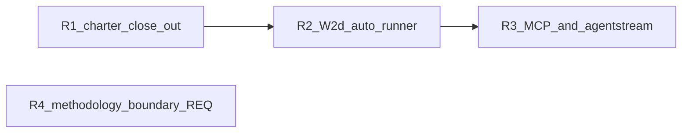

# DAE incorporation — residual plan

| Field | Value |
| --- | --- |
| **Parent program** | [REQ-TIED_DAE_INCORPORATION](../../tied/requirements/REQ-TIED_DAE_INCORPORATION.yaml) (**Implemented**) |
| **Child charter** | [REQ-TIED_DAE_VERIFICATION_CHARTER](../../tied/requirements/REQ-TIED_DAE_VERIFICATION_CHARTER.yaml) (**Implemented**) |
| **Linked plan** | [PLAN.md](./PLAN.md) (Waves 0–5 closed) |
| **Parent close-out** | [evidence/close-out-receipt-2026-09-24.md](./evidence/close-out-receipt-2026-09-24.md) · commit `b4636f8` |
| **Residual CITDP** | [tied/citdp/CITDP-REQ-TIED_DAE_INCORPORATION.yaml](../../tied/citdp/CITDP-REQ-TIED_DAE_INCORPORATION.yaml) (`phase: closed`; **RISK-DAE-009** closed R2; **RISK-DAE-010** closed R3) |
| **Charter CITDP** | [tied/citdp/CITDP-REQ-TIED_DAE_VERIFICATION_CHARTER.yaml](../../tied/citdp/CITDP-REQ-TIED_DAE_VERIFICATION_CHARTER.yaml) (`phase: closed`; gate-facing **minimal/advisory**, `verification_charter: false`, `sub_adversarial_inquiry_pass: not_applicable`) |
| **Recorded** | **2026-09-24** (sponsor residual decisions) |
| **Last updated** | **2026-09-24 — refine-plan pass 1** (reconcile as-built; build-plan readiness R1–R4) |

This document captures **post-close-out** work after the DAE program shipped. It is not a replacement for [PLAN.md](./PLAN.md) wave contracts.

**Entry points:** Executable slices use **`build-plan`** with this file linked and a slice id in the invocation remainder (`R1`, `R2`, …). **R4** alone uses **`plan-new-feature`** (new REQ stack — not DAE `build-plan`).

---

## Sponsor decisions (2026-09-24)

| Residual | Decision |
| --- | --- |
| Child `close_out` gate | **Wave-scoped / slim tracker** → re-run `close_out` until gate allows (full machine close-out on charter REQ) |
| **RISK-DAE-009** (W2d auto runner) | **Implement** wiring after `quality_evidence_collect_manifest` (verification-gate / charter path) |
| **RISK-DAE-010** (optional surfaces) | **Closed R3** — `tied_gate_check` MCP + **agentstream** DAE gate preflight shipped |
| **Methodology client boundary** | **Promote later** via **plan-new-feature** (not docs-only commit of advisory folder now) |
| Envelopes in git | **Keep gitignored**; committed `close-out-gates-*.json` + receipts are sufficient |

---

## Refine gate — as-built dependency snapshot (2026-09-24)

Reconciled against parent [PLAN.md](./PLAN.md), CITDP records, charter evidence, and repo tree. Use this table before **`build-plan`**; do not re-open W0–W5 product code except regression fixes.

| Area | As-built today | Residual gap |
| --- | --- | --- |
| **Parent machine close-out** | `close_out` **allowed** — [evidence/close-out-gates-2026-09-24.json](./evidence/close-out-gates-2026-09-24.json); [evidence/not-applicable-receipt.v1.json](./evidence/not-applicable-receipt.v1.json) | — |
| **Charter machine close-out** | **Done (R1)** — `merged_decision.allowed: true`; [close-out-gates-2026-09-24.json](../REQ-TIED_DAE_VERIFICATION_CHARTER/evidence/close-out-gates-2026-09-24.json); [w4-close tracker](../REQ-TIED_DAE_VERIFICATION_CHARTER/waves/w4-close/checklist-tracker.yaml) | — |
| **W1a `tied gate check`** | `mcp-server/src/dae/gate-check-composition.ts`, `mcp-server/src/cli/gate-check.ts`, `mcp-server/src/dae/gate-check-mcp.ts` (MCP **caller** for CLI only) | **R3a** MCP tool surface |
| **W1a tests** | `mcp-server/packages/cli/src/gate-check.test.ts`, `mcp-server/src/e2e/tied-gate-check-cli.test.ts` | Extend for **R3a** |
| **W1a MCP mirror** | **`tied_gate_check`** in `mcp-server/src/tools/index.ts` (R3a) | **Done** |
| **Agentstream DAE preflight** | **`dae-gate-preflight.ts`** wired from `executor-dry-run.ts` / `live-executor.ts` (R3b) | **Done** |
| **W2d library** | `mcp-server/src/diff-scoped-crap.ts`, `mcp-server/src/diff-scoped-crap-hook.ts`, tests | **Done (R2)** — runner after manifest |
| **W2d checklist prose** | Checklist + [client-development-index.md](../../tied/docs/client-development-index.md) updated for auto hook | **Done (R2)** |
| **W2d hook default** | `diff_scoped_crap: false` in [citdp-record-template.yaml](../../tied/docs/citdp-record-template.yaml) | Unchanged product default |
| **Charter W4 code** | `mutation-cache.ts`, `disjoint-verifier.ts`, `gauntlet-runner.ts`, `charter-policy.ts`, `checklist-validator.ts` extensions | Shipped — [wave-4-close](../REQ-TIED_DAE_VERIFICATION_CHARTER/evidence/wave-4-close-2026-09-24.md) |
| **Charter tests** | `mutation-cache.test.ts`, `gauntlet-runner.test.ts`, `checklist-validator.test.ts` (+ charter gate tests) | Baseline **1031/1031** at W4 close |
| **Charter tracker (program copy)** | `working/REQ-TIED_DAE_VERIFICATION_CHARTER/checklist-tracker.yaml` — full template, `execution_evidence.completed: []` | **Do not** use for `close_out`; use [w4-close tracker](../REQ-TIED_DAE_VERIFICATION_CHARTER/waves/w4-close/checklist-tracker.yaml) |
| **Methodology boundary** | **Done (R4 plan-new-feature)** — [REQ-TIED_METHODOLOGY_CLIENT_BOUNDARY](../../tied/requirements/REQ-TIED_METHODOLOGY_CLIENT_BOUNDARY.yaml) + [executable PLAN](../REQ-TIED_METHODOLOGY_CLIENT_BOUNDARY/PLAN.md) | Phase A/B via **build-plan** on that PLAN |

### Compose-don't-fork (all slices)

| Rule | Applies to |
| --- | --- |
| **CALL** `tied_checklist_gate_validate` unchanged | R1 gates, R3a MCP mirror, R3b agentstream preflight |
| Reuse `runGateCheckComposition` / `createMcpGateValidateFn` | R3a — same as CLI |
| Reuse `buildDiffScopedCrapReport` (module export from `diff-scoped-crap.ts`) | R2 — no second CRAP engine |
| No new REQ tokens for R1–R3 unless LEAP expands scope | R4 only creates **REQ-TIED_METHODOLOGY_CLIENT_BOUNDARY** (or successor name) |

---

## Profile depth and gate policy (residual program)

| Slice | `profile_depth` / `depth_tier` | `gate_policy` | Adversarial inquiry |
| --- | --- | --- | --- |
| **R1** | **minimal** | **advisory** | `sub_adversarial_inquiry_pass: not_applicable` on CITDP + tracker N/A disposition + optional `not-applicable-receipt.v1.json` (mirror parent) |
| **R2** | **minimal** (automation of existing doc hook) | **advisory** | not_applicable unless sponsor raises depth |
| **R3** | **minimal** | **advisory** | not_applicable; opt-in surfaces only |
| **R4** | Select at **plan-new-feature** | per new CITDP | per eligibility table |

**CITDP persistence:** R1 may update charter **working** evidence only; avoid mutating charter **product** defaults (`verification_charter` stays opt-in on client CITDP). R2/R3 close-out should update **RISK-DAE-009/010** mitigation text in [CITDP-REQ-TIED_DAE_INCORPORATION.yaml](../../tied/citdp/CITDP-REQ-TIED_DAE_INCORPORATION.yaml) when slices complete.

---

## Execution order (recommended)



| Order | Id | Theme | Prompt type | Tracker (per-slice copy) |
| --- | --- | --- | --- | --- |
| **1** | **R1** | Charter machine close-out | **build-plan** | `working/REQ-TIED_DAE_VERIFICATION_CHARTER/waves/w4-close/checklist-tracker.yaml` (**create** in R1) |
| **2** | **R2** | W2d automation (**RISK-DAE-009**) | **build-plan** | `working/REQ-TIED_DAE_INCORPORATION/waves/r2-w2d-runner/checklist-tracker.yaml` (**create** in R2) |
| **3** | **R3** | Ergonomics tail (**RISK-DAE-010**) | **build-plan** | `working/REQ-TIED_DAE_INCORPORATION/waves/r3-ergonomics/checklist-tracker.yaml` (**create** in R3) |
| **4** | **R4** | Methodology consumption boundary | **plan-new-feature** | From new REQ folder after promotion |

R4 is independent of R1–R3 and may run in parallel when sponsor capacity allows.

---

## Slice acceptance (wave/slice table)

| Id | Acceptance (done when) | Primary verification |
| --- | --- | --- |
| **R1** | `merged_decision.allowed: true` for `close_out` on charter REQ; updated [charter close-out receipt](../REQ-TIED_DAE_VERIFICATION_CHARTER/evidence/close-out-receipt-2026-09-24.md); committed `close-out-gates-*.json` under charter working folder | `run-close-out-gates.mjs` (below) |
| **R2** | When `diff_scoped_crap: true`, successful `quality_evidence_collect_manifest` triggers report path under `working/{REQ}/evidence/`; default off unchanged; **RISK-DAE-009** closed or waived in CITDP/PLAN | `npm test` + new composition test |
| **R3** | `tied_gate_check` MCP tool registered; agentstream opt-in pre-turn gate; docs for skip flags; **RISK-DAE-010** updated | CLI e2e parity + agentstream test |
| **R4** | New tracked REQ/ARCH/IMPL (+ CITDP if behavior-changing); advisory folder promoted or superseded | `tied_validate_consistency` after YAML promotion |

---

## R1 — Child REQ full machine close-out

### Problem (as-built)

[Charter close-out receipt](../REQ-TIED_DAE_VERIFICATION_CHARTER/evidence/close-out-receipt-2026-09-24.md):

- Envelope **ok** (`blocking_gap_count: 0`).
- `run-close-out-gates.mjs` **`close_out`**: **`merged_decision.allowed: false`** — `missing_required_step:sub-adversarial-inquiry-pass`, plus **disjoint verifier session** diagnostics when the **full** template tracker (`execution_evidence.completed: []`) is used with gate validation.

Product charter defaults remain **off** on the canonical CITDP record (`verification_charter: false`, `disjoint_verifier: skip`).

### Contract

| Field | Target |
| --- | --- |
| **PRE** | Charter REQ/ARCH/IMPL **Implemented/Active**; W4 tests green per [wave-4-close](../REQ-TIED_DAE_VERIFICATION_CHARTER/evidence/wave-4-close-2026-09-24.md); CITDP [CITDP-REQ-TIED_DAE_VERIFICATION_CHARTER.yaml](../../tied/citdp/CITDP-REQ-TIED_DAE_VERIFICATION_CHARTER.yaml) used as gate input (**not** a forked copy with `verification_charter: true`) |
| **INPUT** | **Wave-scoped** tracker for W4 close-out only; disposition log + `execution_evidence.completed` aligned to shipped W4 work; **do not** change client-facing charter defaults in project CITDP templates |
| **OUTPUT** | `merged_decision.allowed: true` for `REQ-TIED_DAE_VERIFICATION_CHARTER`; `working/REQ-TIED_DAE_VERIFICATION_CHARTER/evidence/close-out-gates-{date}.json`; updated charter close-out receipt (**machine close-out: complete**) |
| **POST** | Parent [RESIDUAL-PLAN](./RESIDUAL-PLAN.md) slice R1 row marked done in sponsor notes (optional); no REQ status regression |
| **Verification** | Same flags as parent close-out: `--envelope-blocking --sync-dispositions --reconcile` |
| **Non-goals** | Flip default `verification_charter` for all clients; re-open W0–W5 code without regression fix; integrated adversarial inquiry artifacts |

### Wave-scoped tracker fields (unblocks `close_out` without product default changes)

Create **`working/REQ-TIED_DAE_VERIFICATION_CHARTER/waves/w4-close/checklist-tracker.yaml`** (copy hygiene from [agent-req-implementation-checklist.yaml](../../tied/docs/agent-req-implementation-checklist.yaml) header — **do not** inherit parent DAE tracker evidence).

| Field / area | Required value / action |
| --- | --- |
| `execution_evidence.request` | `REQ-TIED_DAE_VERIFICATION_CHARTER` |
| `execution_evidence.completed` | Include planning + implementation slugs actually executed for W4 (minimum: `change-definition`, `impact-discovery`, `author-requirement`, `author-architecture`, `resolve-pseudocode`, `apply-token-comments`, `gate-pseudocode-validation`, `persist-implementation-records`, `risk-assessment`, `test-strategy`, `unit-test-red`, `unit-test-green`, `composition-integration`, `verification-gate`, `sub-adversarial-inquiry-pass`) — mirror **parent** pattern where N/A slug may still appear in `completed` when step disposition is `not_applicable` |
| Step `sub-adversarial-inquiry-pass` | `disposition: not_applicable`, `policy: minimal-depth-no-inquiry`, rationale citing charter CITDP `profile_depth: minimal` + `sub_adversarial_inquiry_pass: not_applicable` |
| Evidence refs | Point to [wave-4-close-2026-09-24.md](../REQ-TIED_DAE_VERIFICATION_CHARTER/evidence/wave-4-close-2026-09-24.md), charter CITDP path, and test file names (not prose-only) |
| `not-applicable-receipt` | Add `working/REQ-TIED_DAE_VERIFICATION_CHARTER/evidence/not-applicable-receipt.v1.json` (schema `not-applicable-receipt.v1`, `request_token: REQ-TIED_DAE_VERIFICATION_CHARTER`, `depth_tier: minimal`) — mirror [parent receipt](./evidence/not-applicable-receipt.v1.json) |
| Disjoint verifier | Gate CITDP must keep `verification_charter: false` / `disjoint_verifier: skip` for close-out run; **do not** attach [disjoint-verifier-mismatch.json](./fixtures/ledger/disjoint-verifier-mismatch.json) to gate args unless running a **negative** test. For `verification-gate` disposition evidence, use distinct implementer/verifier session ids **or** omit ledger when charter not enabled |
| Envelope | Regenerate locally (gitignored): `working/REQ-TIED_DAE_VERIFICATION_CHARTER/evidence/request-evidence-envelope.v1.json` via runner / MCP backfill |

**Anti-pattern:** Running `close_out` against `working/REQ-TIED_DAE_VERIFICATION_CHARTER/checklist-tracker.yaml` (full template, empty `completed`) — reproduces current block.

### Verification command (R1)

From repo root (adjust `--run-id`):

```bash
node tools/bootstrap/templates/run-close-out-gates.mjs \
  --project-root /Users/fareed/Documents/dev/chatgpt/stdd \
  --request-token REQ-TIED_DAE_VERIFICATION_CHARTER \
  --tracker-path working/REQ-TIED_DAE_VERIFICATION_CHARTER/waves/w4-close/checklist-tracker.yaml \
  --citdp-path tied/citdp/CITDP-REQ-TIED_DAE_VERIFICATION_CHARTER.yaml \
  --phase close_out \
  --run-id charter-close-out-r1 \
  --envelope-blocking \
  --sync-dispositions \
  --reconcile
```

### Traceability

| Token | Role |
| --- | --- |
| [REQ-TIED_DAE_VERIFICATION_CHARTER](../../tied/requirements/REQ-TIED_DAE_VERIFICATION_CHARTER.yaml) | Close-out subject |
| [REQ-TIED_CHECKLIST_GATE_ENFORCEMENT](../../tied/requirements/REQ-TIED_CHECKLIST_GATE_ENFORCEMENT.yaml) | Gate composition |
| [REQ-TIED_DAE_INCORPORATION](../../tied/requirements/REQ-TIED_DAE_INCORPORATION.yaml) | Parent program (context only) |

### build-plan invocation remainder

`/build-plan R1` + link this file + paths above. **No production code** unless gate runner exposes a defect — tracker/evidence-only slice.

---

## R2 — W2d post–quality-manifest runner (RISK-DAE-009)

### Problem (as-built)

[PLAN.md](./PLAN.md) W2d **as-built (pre-R2):** library + checklist documentation only. **R2 shipped:** `runOptionalDiffScopedCrapAfterManifest` in `quality-evidence-collection.ts` / MCP manifest response when `diff_scoped_crap: true`. [RISK-DAE-009](../../tied/citdp/CITDP-REQ-TIED_DAE_INCORPORATION.yaml) **closed**.

### Contract

| Field | Target |
| --- | --- |
| **PRE** | `mcp-server/src/diff-scoped-crap.ts` and `diff-scoped-crap.test.ts` green; checklist text already names post-manifest sub-step ([agent-req-implementation-checklist.yaml](../../tied/docs/agent-req-implementation-checklist.yaml) `verification-gate`) |
| **INPUT** | CITDP `diff_scoped_crap: true`, successful manifest collection result (paths + coverage metadata), threshold from CITDP `crap_threshold` or `.tied-yaml.yaml` `dae.crap_threshold` |
| **Hook** | Checklist slug **`verification-gate`**: optional sub-step **after** successful **`quality_evidence_collect_manifest`** when `diff_scoped_crap: true` |
| **Composition** | **CALL** existing module `mcp-server/src/diff-scoped-crap.ts` (`buildDiffScopedCrapReport` / write path `working/{REQ}/evidence/diff-scoped-crap-{timestamp}.json`); diff paths via git or **`tied_plumb_diff_impact_preview`**; coverage map from manifest / `test_adequacy_validate` metadata — **no duplicate adequacy engine** |
| **Integration locus (build-plan)** | Prefer composition beside manifest completion in `mcp-server/src/quality-evidence-collection.ts` and/or MCP handler path in `mcp-server/src/tools/index.ts` for `quality_evidence_collect_manifest` — **document chosen binding** in wave evidence; align IMPL block **`OPTIONAL_DIFF_SCOPED_CRAP_HOOK`** in [IMPL-TIED_DAE_INCORPORATION-pseudocode.md](../../tied/implementation-decisions/IMPL-TIED_DAE_INCORPORATION-pseudocode.md) |
| **Default** | **off** (`diff_scoped_crap: false`) — unchanged |
| **OUTPUT** | Report JSON + gate diagnostic or checklist sub-step receipt when enabled |
| **POST** | Update **RISK-DAE-009** mitigation to **implemented** (or waived with sponsor note) in CITDP + PLAN residual pointer |
| **Tests** | Extend `mcp-server/src/diff-scoped-crap.test.ts`; add **composition** test: manifest success → report path written (mock diff/coverage inputs); optional fixture under `working/REQ-TIED_DAE_INCORPORATION/fixtures/` |
| **Non-goals** | Mandatory CRAP for all clients; fork `quality_evidence_collect_manifest` semantics; change `crap_block` default |

### Traceability

| Token | Role |
| --- | --- |
| [REQ-TIED_DAE_INCORPORATION](../../tied/requirements/REQ-TIED_DAE_INCORPORATION.yaml) | Parent program |
| [IMPL-TIED_DAE_INCORPORATION](../../tied/implementation-decisions/IMPL-TIED_DAE_INCORPORATION.yaml) | LEAP if hook behavior differs from pseudo-code |
| [REQ-TIED_DAE_VERIFICATION_CHARTER](../../tied/requirements/REQ-TIED_DAE_VERIFICATION_CHARTER.yaml) | Optional consumer when charter + `diff_scoped_crap` both true — **compose**, do not fork charter plugins |

### Verification commands (R2)

```bash
cd mcp-server && npm test -- dist/diff-scoped-crap.test.js
# plus new composition test path from build-plan
```

### build-plan invocation remainder

`/build-plan R2` or `/build-plan RISK-DAE-009` + this file + parent PLAN W2d contract.

---

## R3 — Optional MCP mirror + agentstream preflight (RISK-DAE-010)

### Problem (as-built)

| Parent PLAN deferral | Repo state today |
| --- | --- |
| W1a MCP mirror | **`tied_gate_check`** registered (same composition as CLI) |
| Agentstream DAE pre-turn | **`WIRE_AGENTSTREAM_DAE_GATE_PREFLIGHT`** shipped (`dae-gate-preflight.ts`) |

Sponsor residual: implement **both** (not `tied_closure_join_report` mirror unless scope expands).

### Contract

| Slice | PRE | Deliverable | POST / tests |
| --- | --- | --- | --- |
| **R3a** | `gate-check-composition.ts` + `gate-check-mcp.ts` stable | MCP tool **`tied_gate_check`** — same composition as CLI; return `{ allowed, exit_code, receipt_path, reasons[] }` | Register in `mcp-server/src/tools/index.ts`; unit test alongside `mcp-server/packages/cli/src/gate-check.test.ts`; parity with `mcp-server/src/e2e/tied-gate-check-cli.test.ts` |
| **R3b** | Agentstream preflight OK path exists | Opt-in: after static **`tiedpreflight`**, before first live turn when `AGENTSTREAM_DAE_GATE_CHECK=1` or `.tied-yaml.yaml` `dae.agentstream_gate_check: true`; spawn **`tied gate check --phase pre_implementation`** for batch `request_token`; exit **2** = misconfig (document `-y`, `AGENTSTREAM_SKIP_TIED_MCP_PREFLIGHT`, `--skip-tied-mcp-preflight`) | Touch `mcp-server/packages/agentstream/src/executor-dry-run.ts` (or documented entry); package test under `packages/agentstream/`; README in [agentstream README](../../mcp-server/packages/agentstream/README.md) |

| Cross-cutting | Rule |
| --- | --- |
| **Compose-don't-fork** | **CALL** `tied_checklist_gate_validate` via `createMcpGateValidateFn()` — same as [gate-check.ts](../../mcp-server/src/cli/gate-check.ts) |
| **Risk** | [RISK-DAE-008](../../tied/citdp/CITDP-REQ-TIED_DAE_INCORPORATION.yaml) — opt-in only; CI/batch loops must skip explicitly |
| **Non-goals** | Fork gate algorithm; ship `tied_closure_join_report` MCP mirror in this slice |

### Traceability

| Token | Role |
| --- | --- |
| [REQ-TIED_DAE_INCORPORATION](../../tied/requirements/REQ-TIED_DAE_INCORPORATION.yaml) | Primary |
| [REQ-TIED_UNIFIED_TOOLCHAIN](../../tied/requirements/REQ-TIED_UNIFIED_TOOLCHAIN.yaml) | Agentstream host (related) |
| [IMPL-TIED_DAE_INCORPORATION](../../tied/implementation-decisions/IMPL-TIED_DAE_INCORPORATION.yaml) | Update **`WIRE_AGENTSTREAM_DAE_GATE_PREFLIGHT`** status when R3b ships |

### Verification commands (R3)

```bash
cd mcp-server && npm test -- dist/e2e/tied-gate-check-cli.test.js packages/cli/dist/gate-check.test.js
cd mcp-server/packages/agentstream && npm test
```

### build-plan invocation remainder

`/build-plan R3` or `/build-plan RISK-DAE-010` + this file. May reference [REQ-TIED_UNIFIED_TOOLCHAIN](../REQ-TIED_UNIFIED_TOOLCHAIN/PLAN.md) for agentstream docs cross-links only.

---

## R4 — Methodology client boundary (separate program)

### Problem

Advisory memo lives untracked at [working/REQ-TIED_METHODOLOGY_CLIENT_BOUNDARY/](../REQ-TIED_METHODOLOGY_CLIENT_BOUNDARY/) ([PLAN.md](../REQ-TIED_METHODOLOGY_CLIENT_BOUNDARY/PLAN.md) + optional close-out receipt). **Not** part of DAE token graph.

### Contract

| Field | Target |
| --- | --- |
| **Entry** | **`plan-new-feature`** — **not** `build-plan` on DAE [PLAN.md](./PLAN.md) |
| **INPUT** | [working/REQ-TIED_METHODOLOGY_CLIENT_BOUNDARY/PLAN.md](../REQ-TIED_METHODOLOGY_CLIENT_BOUNDARY/PLAN.md) (near-term **#4** hooks + strategic **#2** spike per memo) |
| **OUTPUT** | New tracked **REQ/ARCH/IMPL** (e.g. **REQ-TIED_METHODOLOGY_CLIENT_BOUNDARY**) + CITDP when behavior-changing; **no** merge into [REQ-TIED_DAE_INCORPORATION](../../tied/requirements/REQ-TIED_DAE_INCORPORATION.yaml) / charter tokens |
| **Anchors** | [PROC-TIED_METHODOLOGY_READONLY], `mcp-server/src/detail-loader.ts`, `mcp-server/src/yaml-loader.ts`, `copy_files.sh` methodology overwrite semantics |
| **Git** | Leave advisory folder untracked until promotion; no ad-hoc commit of scratch-only memo |
| **Non-goals** | DAE wave reopen; conflating methodology boundary with **RISK-DAE-*** residual |

### build-plan invocation remainder

**N/A** — use **`plan-new-feature`** with `@working/REQ-TIED_METHODOLOGY_CLIENT_BOUNDARY/PLAN.md`.

---

## Envelope / git policy (confirmed)

- **Do not** add `!` gitignore exceptions for DAE `request-evidence-envelope.v1.json`.
- Regenerate envelopes locally via `run-close-out-gates.mjs` / MCP backfill when re-running gates.
- Tracked: `evidence/close-out-gates-*.json`, receipts, wave evidence, **RESIDUAL-PLAN.md**, charter `waves/**/checklist-tracker.yaml` once R1 creates it.

---

## Build-plan readiness checklist (per slice)

Use before `/build-plan`; copy Tracker from [agent-req-implementation-checklist.yaml](../../tied/docs/agent-req-implementation-checklist.yaml) into the slice path listed above.

| Check | R1 | R2 | R3 |
| --- | --- | --- | --- |
| Linked plan + slice id in remainder | ✓ | ✓ | ✓ |
| CITDP path identified | charter CITDP | parent CITDP (+ LEAP note) | parent CITDP |
| IMPL pseudo-code blocks identified | N/A (evidence-only) | `OPTIONAL_DIFF_SCOPED_CRAP_HOOK` | `WIRE_AGENTSTREAM_DAE_GATE_PREFLIGHT` + W1a composition |
| RED test paths named | N/A | composition test planned | MCP + agentstream tests named |
| `profile_depth` / inquiry N/A recorded | ✓ | ✓ | ✓ |
| Compose-don't-fork reviewed | ✓ | ✓ | ✓ |
| `tied_config_get_base_path` → `.../stdd/tied` | ✓ | ✓ | ✓ |

**Gate before RED (R2/R3):** `tied_checklist_gate_validate` phase `pre_implementation` on slice Tracker when build-plan mutates code.

---

## Open risks and blocking gaps

| Id | Severity | Gap | Mitigation / owner slice |
| --- | --- | --- | --- |
| ~~**R1-BLOCK**~~ | — | Resolved 2026-09-25 — w4-close tracker + gate `allowed: true` | — |
| ~~**RISK-DAE-009**~~ | — | Closed R2 — see `diff-scoped-crap-hook.ts` + binding evidence | — |
| **RISK-DAE-010** | Low (closed) | R3 shipped MCP + agentstream opt-in preflight | **Closed** |
| **RISK-DAE-008** | Medium | Agentstream gate could block batch CI | Opt-in env/manifest; exit 2 skip docs (**R3b**) |
| ~~**R4-DEFER**~~ | — | Promoted 2026-09-24 — tracked REQ stack + CITDP planning | **build-plan Phase A** on methodology PLAN |

---

## Vocabulary touchpoint ([PROC-VOCABULARY_INDEX])

| Touchpoint | Status |
| --- | --- |
| **PRELOAD** | `tied/vocab/prompt-composer.md`, `tied/vocab/tied-methodology.md`, `tied/vocab/pseudocode-and-citdp.md` (DAE residual terms) |
| **RESOLVE** | **diff-scoped change-risk report** (prose) vs ids `diff_scoped_crap`, `diff-scoped-crap.v1`; **agentstream gate preflight**; **wave-scoped tracker**; **compose-don't-fork** |
| **RECORD** | No new glossary files required pass 1 — terms anchored in parent PLAN vocabulary table |
| **VALIDATE** | At R2/R3 build-plan pre-commit: checklist prose matches stable ids |

---

## Completion criteria (residual program)

| Id | Done when |
| --- | --- |
| **R1** | Charter `close_out` **allowed: true** + receipt updated + committed gate JSON |
| **R2** | Automated or MCP-invoked runner documented + tests green; **RISK-DAE-009** closed or waived in CITDP/PLAN |
| **R3** | **Done** — R3a + R3b shipped; **RISK-DAE-010** updated |
| **R4** | **Done (plan-new-feature)** — tracked REQ/ARCH/IMPL + CITDP; implementation via Phase A/B on methodology PLAN |

---

## Invocation cheat sheet

| Goal | Prompt type | Remainder |
| --- | --- | --- |
| Charter close-out | **build-plan** | `R1` + `@working/REQ-TIED_DAE_INCORPORATION/RESIDUAL-PLAN.md` |
| W2d runner | **build-plan** | `R2` / `RISK-DAE-009` + RESIDUAL-PLAN |
| MCP + agentstream | **build-plan** | `R3` / `RISK-DAE-010` + RESIDUAL-PLAN |
| Methodology boundary | **plan-new-feature** | `@working/REQ-TIED_METHODOLOGY_CLIENT_BOUNDARY/PLAN.md` |

**Recommended next invocation:** **`/build-plan Phase A`** `@working/REQ-TIED_METHODOLOGY_CLIENT_BOUNDARY/PLAN.md` (methodology hooks #4). DAE residual R1–R3: commit when ready. R4 stack promoted — do not fold into DAE tokens.
