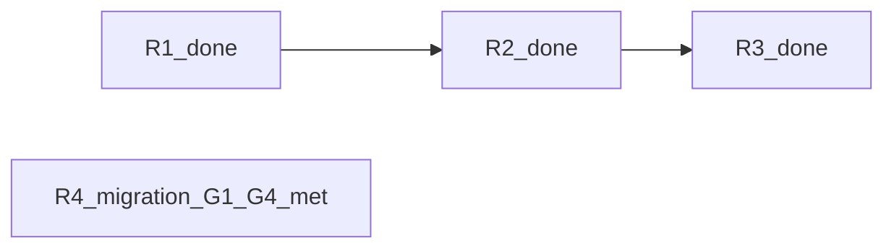

# DAE incorporation — residual plan

| Field | Value |
| --- | --- |
| **Parent program** | [REQ-TIED_DAE_INCORPORATION](../../tied/requirements/REQ-TIED_DAE_INCORPORATION.yaml) (**Implemented**) |
| **Child charter** | [REQ-TIED_DAE_VERIFICATION_CHARTER](../../tied/requirements/REQ-TIED_DAE_VERIFICATION_CHARTER.yaml) (**Implemented**) |
| **Linked plan** | [PLAN.md](./PLAN.md) (Waves 0–5 closed) |
| **Parent close-out** | [evidence/close-out-receipt-2026-09-24.md](./evidence/close-out-receipt-2026-09-24.md) · commit `b4636f8` |
| **Residual CITDP** | [tied/citdp/CITDP-REQ-TIED_DAE_INCORPORATION.yaml](../../tied/citdp/CITDP-REQ-TIED_DAE_INCORPORATION.yaml) (`phase: closed`; **RISK-DAE-009** closed R2; **RISK-DAE-010** closed R3) |
| **Charter CITDP** | [tied/citdp/CITDP-REQ-TIED_DAE_VERIFICATION_CHARTER.yaml](../../tied/citdp/CITDP-REQ-TIED_DAE_VERIFICATION_CHARTER.yaml) (`phase: closed`; gate-facing **minimal/advisory**, `verification_charter: false`, `sub_adversarial_inquiry_pass: not_applicable`) |
| **Recorded** | **2026-09-24** (sponsor residual decisions) |
| **Last updated** | **2026-09-25 — plan-close-out R4** (methodology REQ implemented; CITDP closed) |

This document captures **post-close-out** work after the DAE program shipped. It is not a replacement for [PLAN.md](./PLAN.md) wave contracts.

### Program status (pass 2)

| Slice | Status | Evidence anchor |
| --- | --- | --- |
| **R1** | **Done** (2026-09-25) | [w4-close tracker](../REQ-TIED_DAE_VERIFICATION_CHARTER/waves/w4-close/checklist-tracker.yaml); charter [close-out receipt](../REQ-TIED_DAE_VERIFICATION_CHARTER/evidence/close-out-receipt-2026-09-24.md) `allowed: true` |
| **R2** | **Done** | `runOptionalDiffScopedCrapAfterManifest` — [diff-scoped-crap-hook.ts](../../mcp-server/src/diff-scoped-crap-hook.ts); **RISK-DAE-009** closed in CITDP |
| **R3** | **Done** | **`tied_gate_check`** — [tools/index.ts](../../mcp-server/src/tools/index.ts); **R3b** — `dae-gate-preflight.ts`; **RISK-DAE-010** closed |
| **R4** | **Done (2026-09-25)** | [REQ-TIED_METHODOLOGY_CLIENT_BOUNDARY](../../tied/requirements/REQ-TIED_METHODOLOGY_CLIENT_BOUNDARY.yaml) **Implemented**; CITDP `phase: closed`; [close-out-gates-2026-09-25.json](../REQ-TIED_METHODOLOGY_CLIENT_BOUNDARY/evidence/close-out-gates-2026-09-25.json) `allowed: true` |

**Entry points:** **R1–R3** are closed — use this file for traceability only (no further DAE `build-plan` unless regression). **R4** follow-up is on the **methodology PLAN** (migration gates / pilots), not DAE [PLAN.md](./PLAN.md). **`plan-new-feature`** promoted the R4 stack **2026-09-24**; further work is **`build-plan`** slices on [methodology PLAN](../REQ-TIED_METHODOLOGY_CLIENT_BOUNDARY/PLAN.md) or operator pilot per that PLAN.

---

## Sponsor decisions (2026-09-24)

| Residual | Decision |
| --- | --- |
| Child `close_out` gate | **Wave-scoped / slim tracker** → re-run `close_out` until gate allows (full machine close-out on charter REQ) |
| **RISK-DAE-009** (W2d auto runner) | **Implement** wiring after `quality_evidence_collect_manifest` (verification-gate / charter path) |
| **RISK-DAE-010** (optional surfaces) | **Closed R3** — `tied_gate_check` MCP + **agentstream** DAE gate preflight shipped |
| **Methodology client boundary** | **Promoted 2026-09-24** via **plan-new-feature**; Phases A/B **shipped 2026-09-25** — migration gates G2–G4 remain on methodology PLAN |
| Envelopes in git | **Keep gitignored**; committed `close-out-gates-*.json` + receipts are sufficient |

---

## Refine gate — as-built dependency snapshot (2026-09-25 pass 2)

Reconciled against parent [PLAN.md](./PLAN.md), CITDP records, charter evidence, and repo tree. **R1–R3 closed;** do not re-open W0–W5 or residual product code except regression fixes. **R4** follow-up is migration/pilot on the methodology PLAN.

| Area | As-built today | Residual gap |
| --- | --- | --- |
| **Parent machine close-out** | `close_out` **allowed** — [evidence/close-out-gates-2026-09-24.json](./evidence/close-out-gates-2026-09-24.json); [evidence/not-applicable-receipt.v1.json](./evidence/not-applicable-receipt.v1.json) | — |
| **Charter machine close-out** | **Done (R1)** — `merged_decision.allowed: true`; [close-out-gates-2026-09-24.json](../REQ-TIED_DAE_VERIFICATION_CHARTER/evidence/close-out-gates-2026-09-24.json); [w4-close tracker](../REQ-TIED_DAE_VERIFICATION_CHARTER/waves/w4-close/checklist-tracker.yaml) | — |
| **W1a CLI `tied gate check`** | `gate-check-composition.ts`, `cli/gate-check.ts`, `gate-check-mcp.ts` (MCP caller for CLI) | — |
| **W1a MCP mirror (R3a)** | **`tied_gate_check`** in `mcp-server/src/tools/index.ts`; [tied-gate-check-mcp.test.ts](../../mcp-server/src/tools/tied-gate-check-mcp.test.ts) | — |
| **W1a tests** | CLI + e2e + MCP registration tests green | — |
| **Agentstream DAE preflight (R3b)** | **`dae-gate-preflight.ts`** from `executor-dry-run.ts` / `live-executor.ts` | — |
| **W2d library + hook (R2)** | `diff-scoped-crap.ts`, `diff-scoped-crap-hook.ts`, `quality-evidence-collection.ts` post-manifest hook | — |
| **W2d checklist prose** | Checklist + [client-development-index.md](../../tied/docs/client-development-index.md) | — |
| **W2d hook default** | `diff_scoped_crap: false` in [citdp-record-template.yaml](../../tied/docs/citdp-record-template.yaml) | Unchanged product default |
| **Charter W4 code** | mutation-cache, disjoint-verifier, gauntlet-runner, charter-policy, checklist-validator | Shipped — [wave-4-close](../REQ-TIED_DAE_VERIFICATION_CHARTER/evidence/wave-4-close-2026-09-24.md) |
| **Charter tracker (program copy)** | `working/REQ-TIED_DAE_VERIFICATION_CHARTER/checklist-tracker.yaml` — full template | **Do not** use for `close_out`; use [w4-close tracker](../REQ-TIED_DAE_VERIFICATION_CHARTER/waves/w4-close/checklist-tracker.yaml) |
| **Methodology boundary (R4)** | **Closed** — REQ **Implemented**, CITDP `phase: closed` (2026-09-25) | — |

### Compose-don't-fork (all slices)

| Rule | Applies to |
| --- | --- |
| **CALL** `tied_checklist_gate_validate` unchanged | R1 gates, R3a MCP mirror, R3b agentstream preflight |
| Reuse `runGateCheckComposition` / `createMcpGateValidateFn` | R3a — same as CLI |
| Reuse `buildDiffScopedCrapReport` (module export from `diff-scoped-crap.ts`) | R2 — no second CRAP engine |
| No new REQ tokens for R1–R3 unless LEAP expands scope | R4 only creates **REQ-TIED_METHODOLOGY_CLIENT_BOUNDARY** (or successor name) |

---

## Profile depth and gate policy (residual program)

| Slice | `profile_depth` / `depth_tier` | `gate_policy` | Adversarial inquiry |
| --- | --- | --- | --- |
| **R1** | **minimal** | **advisory** | `sub_adversarial_inquiry_pass: not_applicable` on CITDP + tracker N/A disposition + optional `not-applicable-receipt.v1.json` (mirror parent) |
| **R2** | **minimal** (automation of existing doc hook) | **advisory** | not_applicable unless sponsor raises depth |
| **R3** | **minimal** | **advisory** | not_applicable; opt-in surfaces only |
| **R4** | Select at **plan-new-feature** | per new CITDP | per eligibility table |

**CITDP persistence:** R1–R3 updates **done** in charter working evidence + parent CITDP (**RISK-DAE-009/010** closed). R4 migration waivers or gate completion update [CITDP-REQ-TIED_METHODOLOGY_CLIENT_BOUNDARY.yaml](../../tied/citdp/CITDP-REQ-TIED_METHODOLOGY_CLIENT_BOUNDARY.yaml) only — not DAE parent CITDP.

---

## Execution order (historical + remaining)



| Order | Id | Theme | Status | Tracker / plan |
| --- | --- | --- | --- | --- |
| **1** | **R1** | Charter machine close-out | **Done** | [w4-close/checklist-tracker.yaml](../REQ-TIED_DAE_VERIFICATION_CHARTER/waves/w4-close/checklist-tracker.yaml) |
| **2** | **R2** | W2d automation (**RISK-DAE-009**) | **Done** | [waves/r2-w2d-runner/checklist-tracker.yaml](./waves/r2-w2d-runner/checklist-tracker.yaml) |
| **3** | **R3** | Ergonomics (**RISK-DAE-010**) | **Done** | [waves/r3-ergonomics/checklist-tracker.yaml](./waves/r3-ergonomics/checklist-tracker.yaml) |
| **4** | **R4** | Methodology client boundary | **Phases A/B shipped**; **G1–G4 Met** | [REQ-TIED_METHODOLOGY_CLIENT_BOUNDARY PLAN](../REQ-TIED_METHODOLOGY_CLIENT_BOUNDARY/PLAN.md) + [offline runbook](../../tied/docs/methodology-client-boundary-offline-runbook.md) |

---

## Slice acceptance (wave/slice table)

| Id | Acceptance | Status | Primary verification |
| --- | --- | --- | --- |
| **R1** | `close_out` **allowed: true** on charter REQ; receipt + gate JSON | **Met** | [close-out receipt](../REQ-TIED_DAE_VERIFICATION_CHARTER/evidence/close-out-receipt-2026-09-24.md) |
| **R2** | Post-manifest CRAP hook when `diff_scoped_crap: true`; **RISK-DAE-009** closed | **Met** | `diff-scoped-crap-hook.ts` + tests |
| **R3** | `tied_gate_check` + agentstream preflight; **RISK-DAE-010** closed | **Met** | MCP + agentstream tests |
| **R4** | REQ **Implemented**; CITDP closed; close_out **allowed: true** | **Met** (2026-09-25) | [close-out-gates-2026-09-25.json](../REQ-TIED_METHODOLOGY_CLIENT_BOUNDARY/evidence/close-out-gates-2026-09-25.json) |

---

## R1 — Child REQ full machine close-out

**Status: Done (2026-09-25).** Retained contract for audit; do not re-run unless gate runner regression.

### As-built (complete)

[Charter close-out receipt](../REQ-TIED_DAE_VERIFICATION_CHARTER/evidence/close-out-receipt-2026-09-24.md) (R1 re-run 2026-09-25):

- Envelope **ok** (`blocking_gap_count: 0`).
- `run-close-out-gates.mjs` **`close_out`**: **`merged_decision.allowed: true`** with [w4-close tracker](../REQ-TIED_DAE_VERIFICATION_CHARTER/waves/w4-close/checklist-tracker.yaml) (run-id `charter-close-out-r1`).
- Product charter defaults remain **off** on canonical CITDP (`verification_charter: false`, `disjoint_verifier: skip`).

**Pre-R1 block (resolved):** Using the full template tracker with empty `execution_evidence.completed` reproduced `allowed: false` and disjoint-verifier diagnostics — fixed by wave-scoped tracker + N/A adversarial disposition.

### Contract

| Field | Target |
| --- | --- |
| **PRE** | Charter REQ/ARCH/IMPL **Implemented/Active**; W4 tests green per [wave-4-close](../REQ-TIED_DAE_VERIFICATION_CHARTER/evidence/wave-4-close-2026-09-24.md); CITDP [CITDP-REQ-TIED_DAE_VERIFICATION_CHARTER.yaml](../../tied/citdp/CITDP-REQ-TIED_DAE_VERIFICATION_CHARTER.yaml) used as gate input (**not** a forked copy with `verification_charter: true`) |
| **INPUT** | **Wave-scoped** tracker for W4 close-out only; disposition log + `execution_evidence.completed` aligned to shipped W4 work; **do not** change client-facing charter defaults in project CITDP templates |
| **OUTPUT** | `merged_decision.allowed: true` for `REQ-TIED_DAE_VERIFICATION_CHARTER`; `working/REQ-TIED_DAE_VERIFICATION_CHARTER/evidence/close-out-gates-{date}.json`; updated charter close-out receipt (**machine close-out: complete**) |
| **POST** | Parent [RESIDUAL-PLAN](./RESIDUAL-PLAN.md) slice R1 row marked done in sponsor notes (optional); no REQ status regression |
| **Verification** | Same flags as parent close-out: `--envelope-blocking --sync-dispositions --reconcile` |
| **Non-goals** | Flip default `verification_charter` for all clients; re-open W0–W5 code without regression fix; integrated adversarial inquiry artifacts |

### Wave-scoped tracker fields (unblocks `close_out` without product default changes)

Create **`working/REQ-TIED_DAE_VERIFICATION_CHARTER/waves/w4-close/checklist-tracker.yaml`** (copy hygiene from [agent-req-implementation-checklist.yaml](../../tied/docs/agent-req-implementation-checklist.yaml) header — **do not** inherit parent DAE tracker evidence).

| Field / area | Required value / action |
| --- | --- |
| `execution_evidence.request` | `REQ-TIED_DAE_VERIFICATION_CHARTER` |
| `execution_evidence.completed` | Include planning + implementation slugs actually executed for W4 (minimum: `change-definition`, `impact-discovery`, `author-requirement`, `author-architecture`, `resolve-pseudocode`, `apply-token-comments`, `gate-pseudocode-validation`, `persist-implementation-records`, `risk-assessment`, `test-strategy`, `unit-test-red`, `unit-test-green`, `composition-integration`, `verification-gate`, `sub-adversarial-inquiry-pass`) — mirror **parent** pattern where N/A slug may still appear in `completed` when step disposition is `not_applicable` |
| Step `sub-adversarial-inquiry-pass` | `disposition: not_applicable`, `policy: minimal-depth-no-inquiry`, rationale citing charter CITDP `profile_depth: minimal` + `sub_adversarial_inquiry_pass: not_applicable` |
| Evidence refs | Point to [wave-4-close-2026-09-24.md](../REQ-TIED_DAE_VERIFICATION_CHARTER/evidence/wave-4-close-2026-09-24.md), charter CITDP path, and test file names (not prose-only) |
| `not-applicable-receipt` | Add `working/REQ-TIED_DAE_VERIFICATION_CHARTER/evidence/not-applicable-receipt.v1.json` (schema `not-applicable-receipt.v1`, `request_token: REQ-TIED_DAE_VERIFICATION_CHARTER`, `depth_tier: minimal`) — mirror [parent receipt](./evidence/not-applicable-receipt.v1.json) |
| Disjoint verifier | Gate CITDP must keep `verification_charter: false` / `disjoint_verifier: skip` for close-out run; **do not** attach [disjoint-verifier-mismatch.json](./fixtures/ledger/disjoint-verifier-mismatch.json) to gate args unless running a **negative** test. For `verification-gate` disposition evidence, use distinct implementer/verifier session ids **or** omit ledger when charter not enabled |
| Envelope | Regenerate locally (gitignored): `working/REQ-TIED_DAE_VERIFICATION_CHARTER/evidence/request-evidence-envelope.v1.json` via runner / MCP backfill |

**Anti-pattern:** Running `close_out` against `working/REQ-TIED_DAE_VERIFICATION_CHARTER/checklist-tracker.yaml` (full template, empty `completed`) — reproduces current block.

### Verification command (R1)

From repo root (adjust `--run-id`):

```bash
node tools/bootstrap/templates/run-close-out-gates.mjs \
  --project-root /Users/fareed/Documents/dev/chatgpt/stdd \
  --request-token REQ-TIED_DAE_VERIFICATION_CHARTER \
  --tracker-path working/REQ-TIED_DAE_VERIFICATION_CHARTER/waves/w4-close/checklist-tracker.yaml \
  --citdp-path tied/citdp/CITDP-REQ-TIED_DAE_VERIFICATION_CHARTER.yaml \
  --phase close_out \
  --run-id charter-close-out-r1 \
  --envelope-blocking \
  --sync-dispositions \
  --reconcile
```

### Traceability

| Token | Role |
| --- | --- |
| [REQ-TIED_DAE_VERIFICATION_CHARTER](../../tied/requirements/REQ-TIED_DAE_VERIFICATION_CHARTER.yaml) | Close-out subject |
| [REQ-TIED_CHECKLIST_GATE_ENFORCEMENT](../../tied/requirements/REQ-TIED_CHECKLIST_GATE_ENFORCEMENT.yaml) | Gate composition |
| [REQ-TIED_DAE_INCORPORATION](../../tied/requirements/REQ-TIED_DAE_INCORPORATION.yaml) | Parent program (context only) |

### build-plan invocation remainder

**Closed** — was `/build-plan R1` + this file (tracker/evidence-only).

---

## R2 — W2d post–quality-manifest runner (RISK-DAE-009)

**Status: Done.** [RISK-DAE-009](../../tied/citdp/CITDP-REQ-TIED_DAE_INCORPORATION.yaml) **closed**.

### As-built (complete)

`runOptionalDiffScopedCrapAfterManifest` in [quality-evidence-collection.ts](../../mcp-server/src/quality-evidence-collection.ts) / [diff-scoped-crap-hook.ts](../../mcp-server/src/diff-scoped-crap-hook.ts) when CITDP `diff_scoped_crap: true` (default **off** unchanged).

### Contract

| Field | Target |
| --- | --- |
| **PRE** | `mcp-server/src/diff-scoped-crap.ts` and `diff-scoped-crap.test.ts` green; checklist text already names post-manifest sub-step ([agent-req-implementation-checklist.yaml](../../tied/docs/agent-req-implementation-checklist.yaml) `verification-gate`) |
| **INPUT** | CITDP `diff_scoped_crap: true`, successful manifest collection result (paths + coverage metadata), threshold from CITDP `crap_threshold` or `.tied-yaml.yaml` `dae.crap_threshold` |
| **Hook** | Checklist slug **`verification-gate`**: optional sub-step **after** successful **`quality_evidence_collect_manifest`** when `diff_scoped_crap: true` |
| **Composition** | **CALL** existing module `mcp-server/src/diff-scoped-crap.ts` (`buildDiffScopedCrapReport` / write path `working/{REQ}/evidence/diff-scoped-crap-{timestamp}.json`); diff paths via git or **`tied_plumb_diff_impact_preview`**; coverage map from manifest / `test_adequacy_validate` metadata — **no duplicate adequacy engine** |
| **Integration locus (build-plan)** | Prefer composition beside manifest completion in `mcp-server/src/quality-evidence-collection.ts` and/or MCP handler path in `mcp-server/src/tools/index.ts` for `quality_evidence_collect_manifest` — **document chosen binding** in wave evidence; align IMPL block **`OPTIONAL_DIFF_SCOPED_CRAP_HOOK`** in [IMPL-TIED_DAE_INCORPORATION-pseudocode.md](../../tied/implementation-decisions/IMPL-TIED_DAE_INCORPORATION-pseudocode.md) |
| **Default** | **off** (`diff_scoped_crap: false`) — unchanged |
| **OUTPUT** | Report JSON + gate diagnostic or checklist sub-step receipt when enabled |
| **POST** | Update **RISK-DAE-009** mitigation to **implemented** (or waived with sponsor note) in CITDP + PLAN residual pointer |
| **Tests** | Extend `mcp-server/src/diff-scoped-crap.test.ts`; add **composition** test: manifest success → report path written (mock diff/coverage inputs); optional fixture under `working/REQ-TIED_DAE_INCORPORATION/fixtures/` |
| **Non-goals** | Mandatory CRAP for all clients; fork `quality_evidence_collect_manifest` semantics; change `crap_block` default |

### Traceability

| Token | Role |
| --- | --- |
| [REQ-TIED_DAE_INCORPORATION](../../tied/requirements/REQ-TIED_DAE_INCORPORATION.yaml) | Parent program |
| [IMPL-TIED_DAE_INCORPORATION](../../tied/implementation-decisions/IMPL-TIED_DAE_INCORPORATION.yaml) | LEAP if hook behavior differs from pseudo-code |
| [REQ-TIED_DAE_VERIFICATION_CHARTER](../../tied/requirements/REQ-TIED_DAE_VERIFICATION_CHARTER.yaml) | Optional consumer when charter + `diff_scoped_crap` both true — **compose**, do not fork charter plugins |

### Verification commands (R2)

```bash
cd mcp-server && npm test -- dist/diff-scoped-crap.test.js
# plus new composition test path from build-plan
```

### build-plan invocation remainder

**Closed** — was `/build-plan R2` / `RISK-DAE-009`.

---

## R3 — Optional MCP mirror + agentstream preflight (RISK-DAE-010)

**Status: Done (2026-09-24).** [RISK-DAE-010](../../tied/citdp/CITDP-REQ-TIED_DAE_INCORPORATION.yaml) **closed**.

### As-built (complete)

| Deliverable | Repo state |
| --- | --- |
| **R3a** MCP mirror | **`tied_gate_check`** in `mcp-server/src/tools/index.ts` (same composition as CLI); tests in `tied-gate-check-mcp.test.ts` |
| **R3b** Agentstream pre-turn | **`dae-gate-preflight.ts`**; opt-in via `AGENTSTREAM_DAE_GATE_CHECK` / `dae.agentstream_gate_check` |

Non-goal retained: no `tied_closure_join_report` MCP mirror in this slice unless scope expands.

### Contract

| Slice | PRE | Deliverable | POST / tests |
| --- | --- | --- | --- |
| **R3a** | `gate-check-composition.ts` + `gate-check-mcp.ts` stable | MCP tool **`tied_gate_check`** — same composition as CLI; return `{ allowed, exit_code, receipt_path, reasons[] }` | Register in `mcp-server/src/tools/index.ts`; unit test alongside `mcp-server/packages/cli/src/gate-check.test.ts`; parity with `mcp-server/src/e2e/tied-gate-check-cli.test.ts` |
| **R3b** | Agentstream preflight OK path exists | Opt-in: after static **`tiedpreflight`**, before first live turn when `AGENTSTREAM_DAE_GATE_CHECK=1` or `.tied-yaml.yaml` `dae.agentstream_gate_check: true`; spawn **`tied gate check --phase pre_implementation`** for batch `request_token`; exit **2** = misconfig (document `-y`, `AGENTSTREAM_SKIP_TIED_MCP_PREFLIGHT`, `--skip-tied-mcp-preflight`) | Touch `mcp-server/packages/agentstream/src/executor-dry-run.ts` (or documented entry); package test under `packages/agentstream/`; README in [agentstream README](../../mcp-server/packages/agentstream/README.md) |

| Cross-cutting | Rule |
| --- | --- |
| **Compose-don't-fork** | **CALL** `tied_checklist_gate_validate` via `createMcpGateValidateFn()` — same as [gate-check.ts](../../mcp-server/src/cli/gate-check.ts) |
| **Risk** | [RISK-DAE-008](../../tied/citdp/CITDP-REQ-TIED_DAE_INCORPORATION.yaml) — opt-in only; CI/batch loops must skip explicitly |
| **Non-goals** | Fork gate algorithm; ship `tied_closure_join_report` MCP mirror in this slice |

### Traceability

| Token | Role |
| --- | --- |
| [REQ-TIED_DAE_INCORPORATION](../../tied/requirements/REQ-TIED_DAE_INCORPORATION.yaml) | Primary |
| [REQ-TIED_UNIFIED_TOOLCHAIN](../../tied/requirements/REQ-TIED_UNIFIED_TOOLCHAIN.yaml) | Agentstream host (related) |
| [IMPL-TIED_DAE_INCORPORATION](../../tied/implementation-decisions/IMPL-TIED_DAE_INCORPORATION.yaml) | Update **`WIRE_AGENTSTREAM_DAE_GATE_PREFLIGHT`** status when R3b ships |

### Verification commands (R3)

```bash
cd mcp-server && npm test -- dist/e2e/tied-gate-check-cli.test.js packages/cli/dist/gate-check.test.js
cd mcp-server/packages/agentstream && npm test
```

### build-plan invocation remainder

**Closed** — was `/build-plan R3` / `RISK-DAE-010`.

---

## R4 — Methodology client boundary (separate program)

**Status:** Tracked stack **promoted 2026-09-24**; **Phase A + Phase B shipped 2026-09-25.** **Not** part of the DAE REQ graph. Remaining work is **migration gates G2–G4** on the methodology PLAN (pilot / release / sponsor policy), not DAE residual slices.

### As-built (complete phases)

| Phase | Shipped | Anchors |
| --- | --- | --- |
| **A (#4)** | Bootstrap `--methodology-readonly`, `--install-methodology-hook`, CI doc § methodology-boundary-ci-guard | `tools/bootstrap/`, [client-development-index.md](../../tied/docs/client-development-index.md) |
| **B (#2 spike)** | `TIED_METHODOLOGY_BUNDLE_PATH`, [bundled-methodology-read.ts](../../mcp-server/src/bundled-methodology-read.ts), parity tests | [methodology PLAN](../REQ-TIED_METHODOLOGY_CLIENT_BOUNDARY/PLAN.md) parity table; [methodology-bundle README](../../mcp-server/methodology-bundle/README.md) |

### What remains (migration gates)

See [methodology PLAN — Migration gates](../REQ-TIED_METHODOLOGY_CLIENT_BOUNDARY/PLAN.md#migration-gates-do-not-remove-copy_filessh-tree-until-all-pass): **G1–G4 Met** (2026-09-25); **G5** rollback documented. Offline cohort policy: [offline runbook](../../tied/docs/methodology-client-boundary-offline-runbook.md).

### Contract (retained)

| Field | Target |
| --- | --- |
| **REQ stack** | [REQ-TIED_METHODOLOGY_CLIENT_BOUNDARY](../../tied/requirements/REQ-TIED_METHODOLOGY_CLIENT_BOUNDARY.yaml) (**Planned**); [CITDP](../../tied/citdp/CITDP-REQ-TIED_METHODOLOGY_CLIENT_BOUNDARY.yaml) `phase: planning` |
| **Entry (remaining)** | **`build-plan`** on [methodology PLAN](../REQ-TIED_METHODOLOGY_CLIENT_BOUNDARY/PLAN.md) for gate slices / pilots — **not** DAE [PLAN.md](./PLAN.md) |
| **Compose** | [PROC-TIED_METHODOLOGY_READONLY]; `detail-loader.ts` / `yaml-loader.ts` write rejection unchanged |
| **Non-goals** | DAE wave reopen; merge into DAE/charter tokens; remove `copy_files.sh` tree before gates pass |

### Invocation remainder

- **Promotion (done):** was **`plan-new-feature`** `@working/REQ-TIED_METHODOLOGY_CLIENT_BOUNDARY/PLAN.md`
- **Next:** pilot **G2–G4** per methodology PLAN; optional **`/build-plan`** with remainder naming the gate (e.g. migration pilot) + linked methodology PLAN

---

## Envelope / git policy (confirmed)

- **Do not** add `!` gitignore exceptions for DAE `request-evidence-envelope.v1.json`.
- Regenerate envelopes locally via `run-close-out-gates.mjs` / MCP backfill when re-running gates.
- Tracked: `evidence/close-out-gates-*.json`, receipts, wave evidence, **RESIDUAL-PLAN.md**, charter [w4-close/checklist-tracker.yaml](../REQ-TIED_DAE_VERIFICATION_CHARTER/waves/w4-close/checklist-tracker.yaml).

---

## Build-plan readiness checklist

**R1–R3:** Slices **closed** — checklist retained for audit only.

**R4 (methodology PLAN — migration / pilots):** Before any new **`build-plan`** on [methodology PLAN](../REQ-TIED_METHODOLOGY_CLIENT_BOUNDARY/PLAN.md):

| Check | R4 (remaining) |
| --- | --- |
| Linked [methodology PLAN](../REQ-TIED_METHODOLOGY_CLIENT_BOUNDARY/PLAN.md) + gate id in remainder | ✓ |
| CITDP [CITDP-REQ-TIED_METHODOLOGY_CLIENT_BOUNDARY.yaml](../../tied/citdp/CITDP-REQ-TIED_METHODOLOGY_CLIENT_BOUNDARY.yaml) | ✓ |
| Tracker [checklist-tracker.yaml](../REQ-TIED_METHODOLOGY_CLIENT_BOUNDARY/checklist-tracker.yaml) | ✓ |
| `profile_depth: minimal`, adversarial N/A on CITDP | ✓ |
| Compose with MCP write guards (no methodology YAML writes) | ✓ |
| `tied_config_get_base_path` → `.../stdd/tied` | ✓ |

**Gate before RED:** `tied_checklist_gate_validate` phase `pre_implementation` on methodology Tracker when build-plan mutates code.

---

## Open risks and blocking gaps

| Id | Severity | Gap | Mitigation / owner slice |
| --- | --- | --- | --- |
| ~~**R1-BLOCK**~~ | — | Resolved 2026-09-25 — w4-close tracker + gate `allowed: true` | — |
| ~~**RISK-DAE-009**~~ | — | Closed R2 — see `diff-scoped-crap-hook.ts` + binding evidence | — |
| **RISK-DAE-010** | Low (closed) | R3 shipped MCP + agentstream opt-in preflight | **Closed** |
| **RISK-DAE-008** | Medium | Agentstream gate could block batch CI | Opt-in env/manifest; exit 2 skip docs (**R3b**) |
| **R4-MIGRATION** | Low | **G1–G4 Met** on methodology PLAN (2026-09-25) | REQ **plan-close-out** / envelope sync per methodology PLAN |
| ~~**R4-DEFER**~~ | — | Promoted + Phases A/B shipped | — |

---

## Vocabulary touchpoint ([PROC-VOCABULARY_INDEX])

| Touchpoint | Status |
| --- | --- |
| **PRELOAD** | `tied/vocab/prompt-composer.md`, `tied/vocab/tied-methodology.md`, `tied/vocab/pseudocode-and-citdp.md` (DAE residual terms) |
| **RESOLVE** | **diff-scoped change-risk report** (prose) vs ids `diff_scoped_crap`, `diff-scoped-crap.v1`; **agentstream gate preflight**; **wave-scoped tracker**; **compose-don't-fork** |
| **RECORD** | Pass 2: **methodology bundled read**, **migration gate** — anchored in [methodology PLAN](../REQ-TIED_METHODOLOGY_CLIENT_BOUNDARY/PLAN.md) + parent PLAN vocabulary |
| **VALIDATE** | Residual program complete for R1–R3; validate methodology glossary at R4 migration close-out |

---

## Completion criteria (residual program)

| Id | Status |
| --- | --- |
| **R1** | **Met** — charter `close_out` **allowed: true**; receipt + gate JSON committed |
| **R2** | **Met** — post-manifest hook + **RISK-DAE-009** closed |
| **R3** | **Met** — R3a + R3b shipped; **RISK-DAE-010** closed |
| **R4** | **Met** — methodology REQ close-out 2026-09-25; envelope blocking gaps **0** |

**DAE residual program (R1–R4):** complete. Optional follow-up: client pilots with bundle-only env (operator track on methodology PLAN).

---

## Invocation cheat sheet

| Goal | Status | Prompt type | Remainder |
| --- | --- | --- | --- |
| Charter close-out (R1) | Done | — | — |
| W2d runner (R2) | Done | — | — |
| MCP + agentstream (R3) | Done | — | — |
| Methodology promotion | Done | was **plan-new-feature** | `@working/REQ-TIED_METHODOLOGY_CLIENT_BOUNDARY/PLAN.md` |
| Migration gates G1–G4 | **Met (2026-09-25)** | **plan-close-out** | `@working/REQ-TIED_METHODOLOGY_CLIENT_BOUNDARY/PLAN.md` — envelope + REQ verification |
| Residual doc reconcile | Done (pass 2) | **refine-plan** | `@working/REQ-TIED_DAE_INCORPORATION/RESIDUAL-PLAN.md` |

**Recommended next invocation:** **`/plan-close-out`** (or **`build-plan`** close-out slice) on **`@working/REQ-TIED_METHODOLOGY_CLIENT_BOUNDARY/PLAN.md`** — migration G1–G4 met; run envelope validate + `sub-close-out-evidence-sync`. Do **not** fold methodology tokens into DAE/charter stacks.
