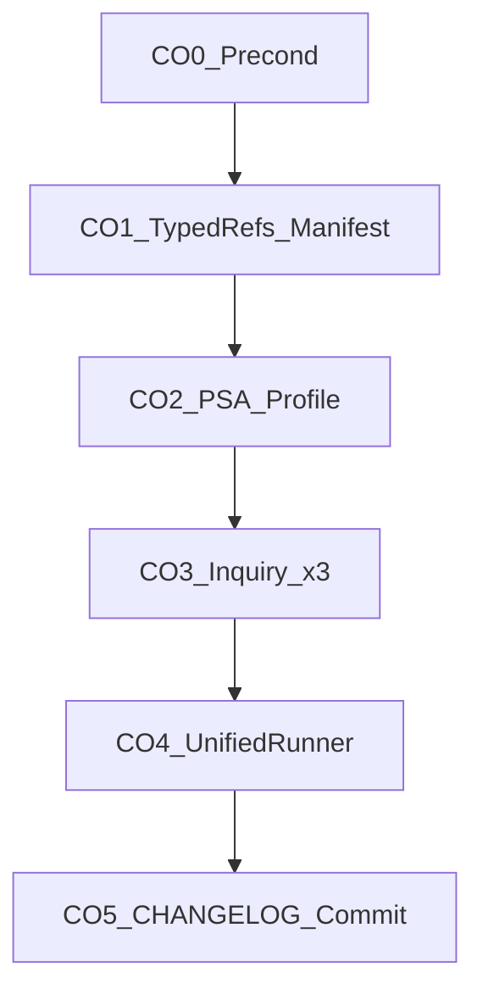

# Plan-close-out: REQ-TIED_JEV_CHECKLIST_EVIDENCE_SUFFICIENCY (evidence + commit)

| Field | Value |
| --- | --- |
| **Feature plan** | [working/REQ-TIED_JEV_CHECKLIST_EVIDENCE_SUFFICIENCY/PLAN.md](working/REQ-TIED_JEV_CHECKLIST_EVIDENCE_SUFFICIENCY/PLAN.md) (Blueprint C W0–W5) |
| **Close-out plan** | This file (refine pass **2**, 2026-09-30) |
| **Request token** | `REQ-TIED_JEV_CHECKLIST_EVIDENCE_SUFFICIENCY` |
| **Depth / policy** | `integrated` / `mixed` (unchanged) |
| **Last refined** | 2026-09-30 — plan-only; no close-out execution in refine pass |

---

## Refine (sponsor terms and defaults)

**Resolved intent:** Finish **machine close-out** for Blueprint C (implementation already shipped W0–W4; W5 verification gate passed). Deliver auditable evidence, zero blocking envelope gaps, then **one git commit** with CHANGELOG.

**Canonical terms:** **evidence sufficiency pre-gate**, **machine close-out**, **sub-close-out-evidence-sync**, **evidence-chain-profile.v1**, **verification-evidence-manifest.v1**, **mixed** gate policy (checklist gate advisory on inquiry warn; envelope A5 still errors on unresolved findings at integrated close-out).

**Sponsor defaults (reversible):**

| Decision | Default | Revisit if |
| --- | --- | --- |
| Inquiry remediation | **Re-run** `tied_adversarial_inquiry_run` for pre_implementation, verification, close_out | Re-run still UNRELIABLE after two scope iterations → stop incomplete, no commit |
| Inquiry API shape | **`mode: project`** (Mode B) with real repo paths, not thin graph + placeholder `prod-path-1` | Tooling requires Mode A graph — then build graph from sidecar + file-backed fidelity |
| PSA location | `working/REQ-TIED_JEV_CHECKLIST_EVIDENCE_SUFFICIENCY/pseudocode-analysis/IMPL-TIED_JEV_CHECKLIST_EVIDENCE_SUFFICIENCY.v1.json` | Runner `loadPseudocodeReports` reads this dir ([run-close-out-gates.mjs](tools/bootstrap/templates/run-close-out-gates.mjs) L158–177) |
| Profile output | `working/.../evidence/evidence-chain-profile.v1.json` | Same path runner `generateSubstanceProfile` writes (L222–228) |
| Commit actor | **Parent agent** after envelope pass | plan-close-out subagent must **not** `git commit` |
| CITDP path in runner | `tied/citdp/CITDP-REQ-TIED_JEV_CHECKLIST_EVIDENCE_SUFFICIENCY.yaml` | Never `working/.../CITDP-*.yaml` (reconcile error in W5) |

**Root cause (W5 inquiry):** Close-out inquiry used a **single-block** scope (`HOOK_CHECKLIST_GATE_VALIDATE#w5close`) with **synthetic** fidelity evidence IDs (`prod-path-1`, `test-path-1`), producing semantic_fidelity findings and `gate-result.json` `verdict: UNRELIABLE` / `status: warn` → six A5 envelope errors across three phases ([w5-close-out-inquiry-run.json](working/REQ-TIED_JEV_CHECKLIST_EVIDENCE_SUFFICIENCY/evidence/w5-close-out-inquiry-run.json)).

**Ambiguity accepted:** Process grade may remain **C** if envelope passes; machine close-out does not require band B.

---

## Current state (W5 failure summary)

| Blocker | Severity | Fix track |
| --- | --- | --- |
| Missing `evidence_chain_profile` | error | CO2 PSA + manifest + profile file |
| Six `finding_unresolved` / `warn_not_success` (A5) | error | CO3 Mode B inquiry re-run with aligned paths |
| Missing per-slug `*-evidence.md` (14 slugs) | reconcile / typed refs | CO1 backfill |
| `verification-evidence-manifest.v1.json` absent on disk | warn (may escalate) | CO1 manifest collect |
| `persist-citdp-record` wrong path | reconcile | CO1 tracker fix |

Authoritative gap list: [request-evidence-envelope.v1.json](working/REQ-TIED_JEV_CHECKLIST_EVIDENCE_SUFFICIENCY/evidence/request-evidence-envelope.v1.json) `gaps[]`.



---

## Plan (CITDP close-out addendum)

| Field | Intent |
| --- | --- |
| Change | Evidence + gates only; no new product behavior unless inquiry forces LEAP |
| Actors | plan-close-out executor; parent for git commit |
| Invariants | Four inquiry artifacts per phase; no gate `allowed: true` from Jev pre-gate |
| Proof | [w5-build-plan-handoff.md](working/REQ-TIED_JEV_CHECKLIST_EVIDENCE_SUFFICIENCY/evidence/w5-build-plan-handoff.md), benchmark v1 JSON |

**Invalidate on CO3:** Replace artifacts under `adversarial-inquiry/phase-{pre_implementation,verification,close_out}/`; update activation receipts and envelope revision.

---

## Implement gate (execution order)

### Execution model

1. **`plan-close-out` Task subagent** — CO0–CO4 + CHANGELOG + **proposed** commit message ([plan-close-out/SKILL.md](tools/bundled-prompt-type-skills/plan-close-out/SKILL.md)).
2. **Parent** — CO5 `git commit` only if CO4 `merged_decision.blocking: false` and `envelope.blocking_gap_count: 0`.

---

### CO0 — Preconditions

- `tied_config_get_base_path` → `/Users/fareed/Documents/dev/chatgpt/stdd/tied`
- `cd mcp-server && bun run build && bun test` (include `checklist-evidence-sufficiency*.test.ts`, `checklist-evidence-sufficiency-mcp.test.ts`, `checklist-gate-mcp.test.ts`, `jev.test.ts`, benchmark tests)
- Copy this plan → `working/REQ-TIED_JEV_CHECKLIST_EVIDENCE_SUFFICIENCY/PLAN-CLOSE-OUT.md`

---

### CO1 — Typed process evidence + verification manifest

**Tracker** ([agent-req-implementation-checklist.yaml](working/REQ-TIED_JEV_CHECKLIST_EVIDENCE_SUFFICIENCY/agent-req-implementation-checklist.yaml)):

1. `persist-citdp-record` evidence → `tied/citdp/CITDP-REQ-TIED_JEV_CHECKLIST_EVIDENCE_SUFFICIENCY.yaml`
2. Align `execution_evidence.completed` / step `evidence_refs` to **existing** paths (w1–w5 `*.json`, benchmark, test file paths)

**Backfill** (one markdown file each under `working/.../evidence/`) — slugs from [w5-close-out-gates.json](working/REQ-TIED_JEV_CHECKLIST_EVIDENCE_SUFFICIENCY/evidence/w5-close-out-gates.json) reconcile:

- `translate-sponsor-intent`, `sync-tied-stack`, `apply-token-comments`, `change-definition`, `catalog-pseudocode-contracts`, `test-strategy`, `flag-contradictory-specs`, `session-bootstrap`, `author-architecture`, `author-requirement`, `flag-insufficient-specs`, `impact-discovery`, `resolve-pseudocode`, `persist-implementation-records`

Each file: 5–15 lines — step outcome + bullet links to real artifacts (PLAN.md, CITDP path, handoffs, gates). Not vacuous “step complete” prose.

**Verification manifest:** After tests green, ensure file exists:

`working/REQ-TIED_JEV_CHECKLIST_EVIDENCE_SUFFICIENCY/evidence/verification-evidence-manifest.v1.json`

(Collect via unified runner manifest step or MCP quality manifest collect — runner expects this path when quality rows exist.)

**Optional CITDP hygiene:** Add `impact_analysis.impl_inventory` entry for `IMPL-TIED_JEV_CHECKLIST_EVIDENCE_SUFFICIENCY` if missing, so `loadPseudocodeReports` binds PSA to inventory (fallback: any `*.v1.json` in `pseudocode-analysis/` still loads).

---

### CO2 — PSA + evidence chain profile (blocking gap #1)

1. **Validate** — MCP/tied-cli `pseudocode_validate` on [IMPL-TIED_JEV_CHECKLIST_EVIDENCE_SUFFICIENCY-pseudocode.md](tied/implementation-decisions/IMPL-TIED_JEV_CHECKLIST_EVIDENCE_SUFFICIENCY-pseudocode.md); persist under `working/.../evidence/` or gate step refs (W0 report may be updated if sidecar unchanged).

2. **Analyze** — `pseudocode_analyze` with:
   - `essence_pseudocode_path` → sidecar above
   - `gate_mode: true`
   - `known_tokens`: `REQ-TIED_JEV_CHECKLIST_EVIDENCE_SUFFICIENCY`, `ARCH-TIED_JEV_CHECKLIST_EVIDENCE_SUFFICIENCY`, `IMPL-TIED_JEV_CHECKLIST_EVIDENCE_SUFFICIENCY`, related REQ parents

3. **Persist PSA** (required for runner profile step):

   `working/REQ-TIED_JEV_CHECKLIST_EVIDENCE_SUFFICIENCY/pseudocode-analysis/IMPL-TIED_JEV_CHECKLIST_EVIDENCE_SUFFICIENCY.v1.json` with `ok: true`

4. **Profile** — Either:
   - Let [run-close-out-gates.mjs](tools/bootstrap/templates/run-close-out-gates.mjs) `generateSubstanceProfile` run after CO1 manifest + CO2 PSA, **or**
   - MCP `evidence_chain_profile_generate` with `profile_depth: integrated`, `output_path` → `working/.../evidence/evidence-chain-profile.v1.json`

5. Tracker / envelope: set `evidence.profile_reference` or cross-link so rebuild sees profile (runner sets `evidence_chain_profile_path` on envelope).

Reference shape: [w6-evidence-chain-profile.v1.json](working/REQ-TIED_JEV_DECISION_COPROCESSOR/evidence/w6-evidence-chain-profile.v1.json).

---

### CO3 — Re-run adversarial inquiry (blocking gaps #2–7)

**Per phase** `pre_implementation`, `verification`, `close_out`:

Use **`tied_adversarial_inquiry_run`** with **`mode: project`** ([tools schema](mcp-server/src/tools/index.ts) L1614+):

| Arg | Value (Blueprint C) |
| --- | --- |
| `request_token` | `REQ-TIED_JEV_CHECKLIST_EVIDENCE_SUFFICIENCY` |
| `project_root` | `/Users/fareed/Documents/dev/chatgpt/stdd` |
| `impl_token` | `IMPL-TIED_JEV_CHECKLIST_EVIDENCE_SUFFICIENCY` |
| `production_path` | `mcp-server/src/jev/checklist-evidence-sufficiency.ts` (and/or `mcp-server/src/tools/checklist-evidence-sufficiency-mcp.ts` for close_out — prefer **one primary** prod path per run; second run or `block_scope` if multi-file required) |
| `test_path` | `mcp-server/src/jev/checklist-evidence-sufficiency.test.ts` (+ composition: `mcp-server/src/tools/checklist-evidence-sufficiency-mcp.test.ts` for verification/close_out via separate run or documented `block_scope`) |
| `phase` | current phase |
| `run_id` | `closeout-inquiry-2026-09-30-{phase}` (new per re-run) |
| `policy` | `advisory` (CITDP **mixed** — gate may allow with diagnostics; envelope still requires **resolved** findings / non-UNRELIABLE gate for A5) |

**close_out scope:** pass `block_scope` listing key procedures (at minimum): `HOOK_CHECKLIST_GATE_VALIDATE`, `RUN_JEV_EVIDENCE_SUFFICIENCY_FANOUT`, `EMIT_PRE_GATE_DISPOSITION` — match sidecar UPPER_SNAKE names with `#closeout` suffix if tool expects it.

**Exit criteria (each phase):**

- Four files under `adversarial-inquiry/phase-{phase}/` overwritten
- `gate-result.json`: prefer `verdict` not `UNRELIABLE` and ledger without `lifecycle: observed` **unresolved** entries that A5 maps to errors — if still failing, expand prod/test paths to cover hook + MCP module + tests, then re-run (**max 2 iterations**)
- Save MCP JSON receipt → `working/.../evidence/closeout-inquiry-{phase}-run.json`

Then **`tied_checklist_activation_collect`** + **`tied_checklist_gate_validate`** `phase: close_out` with activation binding **new** artifact hashes.

---

### CO4 — Unified close-out (`sub-close-out-evidence-sync`)

```bash
node tools/bootstrap/templates/run-close-out-gates.mjs \
  --project-root /Users/fareed/Documents/dev/chatgpt/stdd \
  --request-token REQ-TIED_JEV_CHECKLIST_EVIDENCE_SUFFICIENCY \
  --tracker-path working/REQ-TIED_JEV_CHECKLIST_EVIDENCE_SUFFICIENCY/agent-req-implementation-checklist.yaml \
  --citdp-path tied/citdp/CITDP-REQ-TIED_JEV_CHECKLIST_EVIDENCE_SUFFICIENCY.yaml \
  --phase close_out \
  --run-id closeout-2026-09-30 \
  --envelope-blocking \
  --sync-dispositions \
  --reconcile
```

Persist full JSON → `working/.../evidence/closeout-run-close-out-gates.json`.

**Pass requires:**

- `merged_decision.blocking: false`
- `envelope.blocking_gap_count: 0`
- `gate.allowed: true`
- `evidence_chain_profile.ok: true` (not `skipped: no_psa_reports`)

Then:

- `tied_validate_consistency` → `working/.../evidence/tied-validate-consistency-closeout.json`
- `tied_verify` with update (if verification-gated)
- `traceable-commit` disposition on tracker when allowed
- **`plan-close-out-handoff.md`** with [three completion signals](tools/bundled-prompt-type-skills/prompt-shared/completion-signals-handoff.md)

---

### CO5 — CHANGELOG and git commit

1. [CHANGELOG.md](CHANGELOG.md) — Blueprint C / REQ-TIED_JEV_CHECKLIST_EVIDENCE_SUFFICIENCY summary (opt-in pre-gate, MCP tools, decide trace, benchmark).
2. Gitignore: confirm `working/jev-decide-trace/` not staged.
3. **Parent commit** (only if CO4 pass): stage feature + TIED + working REQ folder + docs + CHANGELOG; exclude unrelated dirty files from initial git status; HEREDOC commit message from plan-close-out.

---

## Delegation

| Step | Agent |
| --- | --- |
| CO0–CO4 + CHANGELOG draft | `plan-close-out` Task subagent with this linked plan |
| CO5 commit | Parent after machine close-out **pass** |

**Stop rule:** If CO3 fails after two Mode B scope iterations, hand off **incomplete** with ledger excerpts — **no commit**.

---

## Success criteria

| Check | Target |
| --- | --- |
| Envelope | 0 blocking **error** gaps |
| Close_out gate | `allowed: true` + activation |
| Profile | `evidence-chain-profile.v1.json` present; envelope cross-link set |
| Inquiry | All three phases gate + ledger pass A5 at envelope rebuild |
| Tests + build | Green |
| `tied_validate_consistency` | `ok: true` |
| Git | One commit when CO4 pass |

---

## Forbidden (close-out)

- Commit while `envelope.blocking_gap_count > 0`
- Placeholder inquiry fidelity IDs (`prod-path-1`) on integrated close-out
- Staging live Jev traces or API keys
- Editing `tied/methodology/`

---

## Refine-plan handoff

| Item | Status |
| --- | --- |
| Linked plan | **Updated** (this file) — pass 2: Refine defaults, CO0–CO5 waves, Mode B inquiry contract, PSA path contract |
| Working mirror | **Deferred** to CO0 executor |
| Execution | **Deferred** — invoke `/plan-close-out` or `plan-close-out` subagent with this plan |
