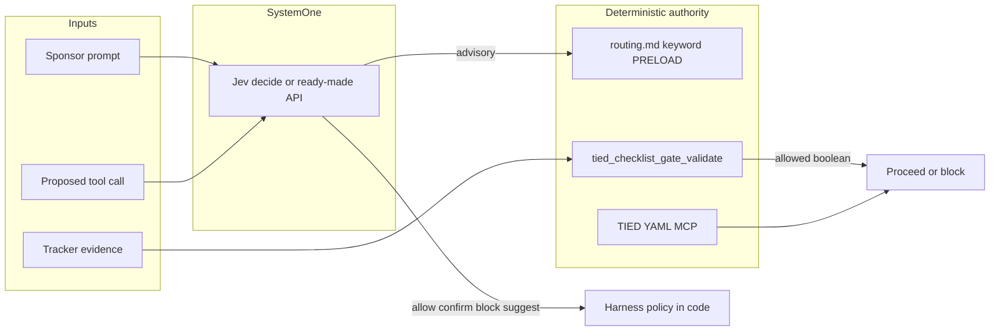

# Jev System One decision coprocessor — linked plan (refined)

| Field                        | Value                                                                                                                                                                                         |
| ---------------------------- | --------------------------------------------------------------------------------------------------------------------------------------------------------------------------------------------- |
| **REQ**                      | [REQ-TIED_JEV_DECISION_COPROCESSOR](../../tied/requirements/REQ-TIED_JEV_DECISION_COPROCESSOR.yaml) (**Implemented**, close-out 2026-09-26) |
| **ARCH**                     | [ARCH-TIED_JEV_DECISION_COPROCESSOR](../../tied/architecture-decisions/ARCH-TIED_JEV_DECISION_COPROCESSOR.yaml) (**Implemented**) |
| **IMPL**                     | [IMPL-TIED_JEV_DECISION_COPROCESSOR](../../tied/implementation-decisions/IMPL-TIED_JEV_DECISION_COPROCESSOR.yaml) (**Implemented**) · [pseudo-code](../../tied/implementation-decisions/IMPL-TIED_JEV_DECISION_COPROCESSOR-pseudocode.md) |
| **CITDP**                    | [CITDP-REQ-TIED_JEV_DECISION_COPROCESSOR](../../tied/citdp/CITDP-REQ-TIED_JEV_DECISION_COPROCESSOR.yaml) — **closed/final**, W0–W5 core |
| **Tracker**                  | [checklist-tracker.yaml](./checklist-tracker.yaml) — gate receipts under `gates/`; close-out run-id `jev-decision-coprocessor-close-out-2026-09-26` |
| **Working folder**           | `working/REQ-TIED_JEV_DECISION_COPROCESSOR/` (PLAN mirrored from this Cursor plan)                                                                                                            |
| **`depth_tier`**             | **`minimal`** for delivered W0–W4 (shadow/advisory). **Before production fail-closed W5:** reassess **`integrated`** when blocking tool classes run on the request path (external API + safety). |
| **`gate_policy`**            | **`mixed`**: checklist/MCP gates unchanged (**advisory** per CITDP today); **W5 harness** may **fail-closed block** high-risk tool classes when enabled (see **blocking policy**).           |
| **`jev_data_tier`**          | **`standard_us`** — primary operator in **US**; US West Coast Jev endpoint is in-scope. No EU residency tier required for this program; still apply **state trim** and no secrets in `state`. |
| **`jev_unavailable_policy`** | For **blocking** tool classes: **deny** (do not run) when Jev is unreachable or key missing; non-risky paths unchanged.                                                                       |
| **`profile_depth`**          | `not_measured` (distinct from `depth_tier`; no evidence-chain profile in W0–W4)                                                                                                               |
| **Last refined**             | 2026-09-26 (`refine-plan`; program closed + live calibration alignment; **Refine only**)                                                                                                      |

---

## Program status (closed)

| Signal | Value |
| --- | --- |
| **Program** | **Closed** — do **not** re-run `plan-close-out` |
| **REQ / CITDP** | **Implemented** / **closed/final** (after gate chain) |
| **W0–W5 core** | **Complete**; W5 **per-turn middleware** = **accepted residual** (optional `w5-runtime-middleware-slice`) |
| **Gates** | `pre_implementation`, `verification`, `close_out` — all **allowed: true** ([`gates/`](./gates/)) |
| **Validation** | `tied_validate_consistency` **ok** at close-out |

**Commits (local, not pushed):** `3682630` (W0–W5 core) · `811f48f` (gates, CITDP closed, REQ Implemented) · _(third commit: W5 middleware + live evidence — parent handoff `landed_commit`)_

**Cross-links:** [Close-out archive plan](file:///Users/fareed/.cursor/plans/jev_plan-close-out_commit_64360b48.plan.md) · [Close-out receipt](./evidence/close-out-receipt-2026-09-26.md) · [Cursor program plan](file:///Users/fareed/.cursor/plans/jev-tied-integration_189b53ac.plan.md) · [Git-hygiene close-out plan](file:///Users/fareed/.cursor/plans/jev_git-hygiene_close-out_d6cbfd59.plan.md)

---

## Hygiene pass (2026-09-26)

| Field | Value |
| --- | --- |
| **Run-id** | `jev-w5-middleware-git-hygiene-2026-09-26` |
| **Manifest base commit** | `811f48f` (pre-third-commit) |
| **Receipt** | [git-hygiene-receipt-2026-09-26.md](./evidence/git-hygiene-receipt-2026-09-26.md) |
| **REQ / CITDP** | Unchanged (Implemented / closed) |

Scoped commit: W5 live tool gate code/tests, live calibration evidence, refreshed gates/manifest/CHANGELOG. Parent owns revert of out-of-scope noise, stage, secret scan, commit (no push).

---

## Live calibration summary

Post-close-out **`--live`** replays (**2026-09-26**): **W2** **70%** keyword vs Jev agreement (`jev_invoked` 10/10); **W3** **7/8** heuristic match; **W4** **~83%** (5/6). Replay scripts exit **1** when agreement &lt; **0.90** — **calibration guardrail**, not REQ/CITDP failure.

**Narrative + artifacts:** [live-jev-evidence-2026-09-26.md](./evidence/live-jev-evidence-2026-09-26.md)

---

## Recommended next (optional)

| Priority | Action |
| --- | --- |
| **(a) Evidence hygiene** | Scoped commit of live calibration under `evidence/` (todo: `live-evidence-commit`) |
| **(b) Runtime residual** | **`build-plan`** slice `w5-runtime-middleware` — per-turn harness in agentstream live loop |
| **(c) Calibration doc** | Threshold / tie-break notes in working evidence or CITDP addendum only (todo: `threshold-tuning-doc`) |

**Default:** **(a)** if preserving the live run in git; otherwise no action required.

---

## Security (mandatory)

- **`JEV_API_KEY` was exposed in chat** during the live session — **rotate** in the Jev operator console; use env-only or a secret store.
- Never commit keys, `.env`, or transcript snippets containing credentials.

---

## Goal

Add **Jev** (TypeSafe **System One** model: state + typed questions → calibrated **choice** / **score** / **noul** answers) as an **optional, server-side judgment coprocessor** inside TIED operator surfaces (MCP, `tied-cli`, `@tied/agentstream`, Prompt Composer). Use it where today we pay frontier LLM latency/cost for narrow classifications—**without** letting probabilistic judgments override **`tied_checklist_gate_validate`**, **`pseudocode_analyze`**, **`tied_validate_consistency`**, or persisted REQ/ARCH/IMPL YAML.

**References:** [LangChain harness post](https://www.langchain.com/blog/building-a-harness-with-jev), [innFactory e/buxplainer](https://innfactory.ai/en/blog/jev-system-one-model-classifier-not-llm/), [Jev API docs (archived)](https://web.archive.org/web/20260925175947/https://jevtypesafeai.com/docs), [Flavio Copes deep dive](https://flaviocopes.com/jev/).

---

## Non-goals

- Replacing frontier LLMs for IMPL pseudo-code, code generation, or adversarial **reasoning** passes.
- Auto-writing or auto-mutating project TIED YAML from Jev outputs (MCP YAML tools remain authoritative for mutations).
- Forking gate semantics: Jev must **compose** existing MCP tools, not duplicate `validateChecklistGate` logic.
- Sending secrets, PII, or full repository contents in Jev **`state`** (trim to decision-relevant excerpts; server-side keys only).
- Requiring Jev for every client: **opt-in** via env/config; deterministic fallbacks when `JEV_API_KEY` absent or HTTP errors.
- Treating vendor latency/cost claims as acceptance criteria (measure on TIED-labeled fixtures locally).

---

## What Jev is (canonical terms)

| Concept                  | Definition                                                                                                                                                                                                |
| ------------------------ | --------------------------------------------------------------------------------------------------------------------------------------------------------------------------------------------------------- |
| **System One model**     | Fast decision primitive: unstructured **state** in, typed probabilistic answers out; no prose generation.                                                                                                 |
| **Decision coprocessor** | Jev’s role in TIED: advise routing, triage, and pre-checks; **code + deterministic gates** commit outcomes.                                                                                               |
| **Core API**             | `POST …/v1/decide` — parallel **`questions`**: `choice` (≤255 options), `score` (2–10 ordered levels), `noul` (calibrated yes/no).                                                                        |
| **Ready-made APIs**      | Optional shortcuts (same billing): e.g. **`/api/v1/agent/risk`**, **`/api/v1/context/filter`**, **`/api/v1/model/route`**, **`/api/v1/rag/relevance`** — use when question sets match; else `/v1/decide`. |
| **Speculative fan-out**  | Ask all independent questions in **one** call; branch in TypeScript/Ruby on answers (matches TIED multi-criteria triage).                                                                                 |
| **Confidence policy**    | High confidence → auto-route; medium → confirm/flag; low → escalate to human or heavier model (thresholds **pinned per model version**).                                                                  |

**Jev limits (design around):** no reliable counting/dates/math; literal reading; wrong **choice** still schema-valid; English-primary; US-hosted service (enterprise ZDR/DPA per vendor docs); 64k token state budget.

---

## Layering rules (compose, do not fork)

1. **Authority stack (unchanged):** Tracker dispositions + `tied_checklist_gate_validate` receipts + envelope v1 + git/process contracts.
2. **Jev outputs:** W0–W4 remain **advisory/shadow** for routing and gates. **W5** may **block** execution of configured high-risk tool classes when Jev (or ready-made **agent/risk**) returns block above threshold; deterministic MCP checklist gates remain separate.
3. **New surfaces** call a thin **`jev_decide`** (or ready-made) client in `mcp-server/`; log `model`, `cost_usd`, question ids, and confidence/noul to optional JSONL (mirror `TIED_MCP_COLLECT_METRICS` pattern).
4. **Prompt-type router** remains explicit skill invocation; Jev may **suggest** `prompt-type:` ordering, never auto-invoke skills.
5. **Adversarial inquiry:** Jev may **pre-sort** candidate findings; only **`tied_adversarial_inquiry_run`** + four bounded artifacts activate integrated depth.

---

## Resolved sponsor terms (Refine)

| Sponsor / source term                | Resolution                                                                                                                                                                                                                                                                   | Status                        |
| ------------------------------------ | ---------------------------------------------------------------------------------------------------------------------------------------------------------------------------------------------------------------------------------------------------------------------------- | ----------------------------- |
| **Jev**                              | TypeSafe **System One** product; integrate via HTTP **`/v1/decide`** or ready-made endpoints; LangChain **`TypeSafeClassifier`** / `@typesafe-ai/sdk` optional for non-Node consumers.                                                                                       | Resolved 2026-09-26           |
| **Replace heuristic keyword search** | **Rejected as stated.** Keep **`tied/vocab/routing.md`** + methodology routing as **source of truth**; Jev runs in **shadow** or **tie-break** when keyword match is ambiguous or multi-glossary.                                                                            | Resolved 2026-09-26           |
| **Touchpoint 3 pre-gate**            | **Partial overlap:** placeholder waivers, parent-child slugs, pairing are already **machine-checked** in `[REQ-TIED_CHECKLIST_GATE_ENFORCEMENT]`. Jev adds **semantic** triage only (e.g. “does this rationale address the slug intent?”) as **warn**, not gate replacement. | Resolved 2026-09-26           |
| **Touchpoint 4 adversarial**         | Jev **cannot** replace obligation graph or fidelity adapters; pilot **fan-out nouls** over **trimmed** criterion snippets vs labeled fixtures; findings still **review-gated**.                                                                                              | Resolved 2026-09-26           |
| **Auto Mode / agent risk**           | Map to ready-made **`POST /api/v1/agent/risk`** or custom **`noul`** questions; align with DAE-style **tool attempt** telemetry, not Cursor’s closed Auto-review.                                                                                                            | Resolved 2026-09-26           |
| **Context filter**                   | Map to **`POST /api/v1/context/filter`** for agentstream context bloat; runs **after** static `tiedpreflight`, **before** turn dispatch when opt-in.                                                                                                                         | Resolved 2026-09-26           |
| **REQ token name**                   | **`REQ-TIED_JEV_DECISION_COPROCESSOR`** (program-level; waves tracked in PLAN + build-plan evidence).                                                                                                                                                                        | **Resolved** (minted 2026-09-26) |
| **Comparison doc**                   | Optional coordinator note: `docs/comparisons/jev-for-tied-improvement.md` (local/private pattern like DAE guide); **not** shipped; **not** a substitute for this PLAN.                                                                                                        | Accepted optional — **open**  |
| **Blocking policy**                  | Sponsor: Jev **may block** (fail-closed) for configured destructive/high-risk tool calls in harness middleware (**W5**); thresholds pinned to model version; **deny if Jev unavailable** for those classes.                                                              | **Resolved 2026-09-26**       |
| **Data residency**                   | Sponsor: **US operator** — use **`jev_data_tier: standard_us`**; GDPR/EU-strict tier **not required** for this repo/program. Future **EU client** projects may opt into `eu_strict` via separate CITDP without changing methodology defaults.                                | **Resolved 2026-09-26**       |
| **W5 scope boundary**                | **Shipped:** `evaluateHarnessToolCall`, context-filter advisory, agentstream **preflight bootstrap/smoke** (default off). **Not shipped:** per-turn Shell/bash interception in live agent loop; Cursor IDE middleware; MCP tool exposing guard to editors.                   | **Resolved 2026-09-26**       |

**Vocabulary RECORD:** **Done** — `tied/vocab/decision-copilot.md` + routing row `5g`; **VALIDATE complete** at close-out.

**Open for sponsor (optional post-close-out):**

- Commit **live** calibration artifacts (see **Recommended next (a)**) or leave untracked.
- **`build-plan`** **`w5-runtime-middleware-slice`** only if per-turn interception is required before production harness default.
- **`integrated` `depth_tier`** + adversarial artifacts before treating fail-closed W5 as production-default (vs opt-in lab).

---

## CITDP / depth alignment (Plan gate)

| Field | PLAN (program) | On-disk CITDP (`CITDP-REQ-TIED_JEV_DECISION_COPROCESSOR`) | Status |
| ----- | -------------- | ----------------------------------------------------------- | ------ |
| `depth_tier` | `minimal` W0–W4; **integrated reassessment** before prod W5 blocking | `minimal` (closed) | Reassess only if production-default per-turn blocking |
| `gate_policy` | `mixed` (harness fail-closed when enabled) | Documented at close-out | Harness = **operator opt-in**; checklist receipts unchanged |
| `profile_depth` | `not_measured` | `minimal` | Unchanged until evidence-chain pilot requested |
| Adversarial inquiry | W4 pilot **observation-only**; not `[REQ-TIED_ADVERSARIAL_INQUIRY]` activation | W2–W5 counterexamples in CITDP | **Aligned** at close-out |

**Gate chain (2026-09-26 close-out):** **`pre_implementation` → `verification` → `close_out`** — all **allowed: true**; receipts under [`gates/`](./gates/).

---

## Dependency snapshot

| Existing anchor                                           | Role                                                                      |
| --------------------------------------------------------- | ------------------------------------------------------------------------- |
| `[REQ-TIED_CHECKLIST_GATE_ENFORCEMENT]`                   | Gates stay authoritative; Jev never substitutes receipts                  |
| `[REQ-TIED_ADVERSARIAL_INQUIRY]`                          | Integrated activation unchanged; Jev pilot is pre-sort only               |
| `[REQ-PROMPT_TYPE_GLOBAL_SKILLS]` / `prompt-type-router`  | Explicit invocation; Jev advisory                                         |
| `[REQ-TIED_DAE_INCORPORATION]`                            | **Compose** pattern: CLI/MCP wrappers, opt-in preflight, exit codes 0/1/2 |
| `@tied/agentstream`                                       | Optional middleware hook after `tiedpreflight`                            |
| `docs/comparisons/dae-mechanisms-for-tied-improvement.md` | Template for “mechanism → TIED status” matrix row **Gap → Partial**       |

---

## Delivery waves

| Wave   | Theme                 | Blocking?             | Primary deliverables                                                                                    | Entry                                                 |
| ------ | --------------------- | --------------------- | ------------------------------------------------------------------------------------------------------- | ----------------------------------------------------- |
| **W0** | Research + vocabulary | No                    | Mechanism matrix row; Jev fit/limitations; RECORD terms; fixture labeling plan                          | **closed** (2026-09-26)                               |
| **W1** | Client + config       | No                    | `mcp-server/src/jev/` HTTP client; `JEV_API_KEY`; pinned model; unit tests with mocked HTTP               | **closed** (2026-09-26 build-plan W1)                 |
| **W2** | Vocab PRELOAD shadow  | No                    | Shadow log vs keyword PRELOAD; offline replay script                                                    | **closed** (2026-09-26 build-plan W2)                 |
| **W3** | Prompt-type advisory  | No                    | Suggest leaf type + TIED applicability boundary; no auto skill load                                     | **closed** (2026-09-26 build-plan W3)                 |
| **W4** | Adversarial pilot     | No                    | Labeled triage fixture + pilot report (CI: Jev skipped without key)                                     | **closed** (2026-09-26 build-plan W4)                 |
| **W5** | Harness opt-in        | **Yes (risky tools)** | Tool guard + context advisory + agentstream preflight; **residual:** per-turn middleware (optional slice) | **closed** (core 2026-09-26); residual **optional** |

### Wave completion truth (repo reconcile 2026-09-26)

| Wave | Verdict | Primary evidence | Notes |
| ---- | ------- | ---------------- | ----- |
| **W0** | **Complete** | `tied/vocab/decision-copilot.md`, REQ/ARCH/IMPL stack, routing `5g` | Optional comparison doc not created |
| **W1** | **Complete** | `mcp-server/src/jev/client.ts`, `jev.test.ts`, `w1-build-plan-2026-09-26.md` | |
| **W2** | **Complete** | `shadow-vocab-preload.ts`, `replay-jev-vocab-shadow.ts`, `w2-build-plan-2026-09-26.md` | Live **70%** (2026-09-26); CI offline; ≥90% script threshold = calibration guardrail |
| **W3** | **Complete** | `prompt-type-advisory.ts`, `prompt-type-advisory.test.ts`, `w3-build-plan-2026-09-26.md` | |
| **W4** | **Complete** | `adversarial-triage-pilot.ts`, fixture/CI report + live **~83%** (2026-09-26) | CI: `jev_invoked: false` without key; live report in `evidence/` |
| **W5** | **Core complete** | `harness-tool-guard.ts`, `context-filter-advisory.ts`, `jev-harness-preflight.ts`, tests, `w5-build-plan-2026-09-26.md` | **Residual:** per-turn tool gate in live loop → optional `w5-runtime-middleware-slice` |

### W0 contract

| Field            | Contract                                                                                                                                                  |
| ---------------- | --------------------------------------------------------------------------------------------------------------------------------------------------------- |
| **INPUT**        | External Jev docs + TIED routing/gate/adversarial vocab                                                                                                   |
| **OUTPUT**       | Coordinator comparison section or standalone memo; proposed REQ/ARCH/IMPL outlines; labeled evaluation set spec (≥30 prompts, ≥20 gate-evidence snippets) |
| **Verification** | Peer review; no product code required                                                                                                                     |
| **Error modes**  | Vendor API unavailable → document manual evaluation path                                                                                                  |

### W1 contract

| Field             | Contract                                                                                         |
| ----------------- | ------------------------------------------------------------------------------------------------ |
| **INPUT**         | `JEV_API_KEY`, pinned model id                                                                   |
| **OUTPUT**        | Typed wrapper: `decide(state, questions)` + ready-made helpers; **PRE/POST** in IMPL pseudo-code |
| **Verification**  | Unit tests (mocked 400/401/402/502); `[PROC-TS_CHECK]`                                           |
| **FAILURE_MODES** | Missing key → `{ skipped: true, reason: 'no_credentials' }`; never throw through MCP gate paths  |

### W2 contract

| Field            | Contract                                                                                |
| ---------------- | --------------------------------------------------------------------------------------- |
| **INPUT**        | Sponsor prompt + static routing table rows                                              |
| **OUTPUT**       | Shadow log: `{ keyword_glossaries[], jev_glossaries[], confidence }`                    |
| **Verification** | Offline replay script; no change to agent PRELOAD behavior                              |
| **Acceptance**   | ≥90% agreement on held-out internal prompt set **or** document systematic disagreements |

### W3 contract

| Field            | Contract                                                                                                                         |
| ---------------- | -------------------------------------------------------------------------------------------------------------------------------- |
| **INPUT**        | Invocation remainder text                                                                                                        |
| **OUTPUT**       | Suggested ordered prompt types + `TIED applicability` (`full` / `client-local` / `minimal`) per `prompt-shared/tied-boundary.md` |
| **Verification** | Contract tests against 13 leaf types; must not invoke skills                                                                     |

### W4 contract

| Field            | Contract                                                                                             |
| ---------------- | ---------------------------------------------------------------------------------------------------- |
| **INPUT**        | Trimmed criterion text + pseudo-code block + optional test log excerpt                               |
| **OUTPUT**       | Parallel **nouls** (e.g. `criterion_met`, `spec_gap`, `test_supports_claim`) — **observations only** |
| **Verification** | Compare to human labels; store under `working/REQ-TIED_JEV_DECISION_COPROCESSOR/evidence/`           |
| **Non-goal**     | Writing to `finding-ledger.jsonl` without inquiry run                                                |

### W5 contract (expanded)

| Field | Contract |
| ----- | -------- |
| **Purpose** | Opt-in **fail-closed** guard for configured high-risk tools in `@tied/agentstream` harness; **context/filter** advisory for bloat; compose **after** DAE + static MCP preflight, **before** first live turn dispatch for bootstrap diagnostics. |
| **INPUT — tool gate** | `{ tool, arguments?, goal?, context? }` for tools in blocking set (default **`bash`**, **`Shell`**); argv scanned for destructive patterns (`rm -rf`, `git push --force`, etc.). |
| **INPUT — context filter** | `{ task_summary, context_item }` trimmed snippets (prompt file head, task argv); ready-made **`/api/v1/context/filter`** or `/v1/decide` equivalent. |
| **OUTPUT — tool gate** | `allow` \| `confirm` \| `block` + `reason`, `risk` (noul-derived), `jev_skipped`, `destructive_pattern`. |
| **OUTPUT — context filter** | `keep` \| `truncate` \| `drop` + `reason` (**advisory** in W5 core; does not mutate context without future middleware). |
| **Enablement** | **`AGENTSTREAM_JEV_HARNESS=1`** or **`true`**, or `.tied-yaml.yaml` **`jev.agentstream_harness: true`**. Requires built **`mcp-server/dist/jev/*`** for live smoke from agentstream. |
| **Credentials** | **`JEV_API_KEY`** server-side; when harness enabled and key missing → blocking tools **deny** (`jev_unavailable_fail_closed`). Non-blocking tools unchanged. |
| **Thresholds (pinned)** | Block noul ≥ **0.72**; confirm ≥ **0.45** (`harness-tool-guard.ts`); re-tune when `JEV_MODEL` pin changes. |
| **Verification (delivered)** | `bun test src/jev/`; `jev-harness-preflight.test.ts`; mock `fetchImpl` only in CI. Evidence: `working/REQ-TIED_JEV_DECISION_COPROCESSOR/evidence/w5-build-plan-2026-09-26.md`. |
| **FAILURE_MODES** | Harness disabled → allow all; dist missing → diagnostic only (exit 0); Jev HTTP errors on blocking tools → **block** when `blockWhenUnavailable`; never bypass `tied_checklist_gate_validate`. |
| **Residual (W5 todo)** | Wire **`evaluateHarnessToolCall`** on **each** agentstream tool invocation (not only preflight smoke); optional Cursor IDE middleware; MCP read-only diagnostic tool; CITDP LEAP + **`integrated` depth** if production-default blocking; Tracker dispositions + gate receipts. |
| **Non-goals (confirmed)** | Replace checklist gates; auto-mutate TIED YAML; adversarial four-artifact activation via Jev alone. |

---

## Integration touchpoints (refined)

### 1. Vocabulary PRELOAD (`tied/vocab/routing.md`)

- **Mechanism:** One `/v1/decide` **choice** over glossary ids (criteria = first column keywords summarized) **plus** per-glossary **nouls** for multi-match.
- **Fallback:** Keyword table wins on conflict in W2; in W3+ optionally “Jev tie-break when keyword match count > 1 and confidence ≥ τ”.
- **State trim:** Sponsor prompt + matched token names only—no full repo tree.
- **Shipped:** W2 shadow + replay (`mcp-server/scripts/replay-jev-vocab-shadow.ts`).

### 2. Prompt Composer (`tools/bundled-prompt-type-skills/prompt-type-router`)

- **Mechanism:** **Choice** among 13 leaf types + **noul** `needs_linked_plan`, `needs_tied_stack`.
- **Output:** Human-readable suggestion in envelope; parent agent confirms.
- **Shipped:** W3 `advisePromptTypes` + replay script.

### 3. Checklist evidence (semantic adjunct)

- **Mechanism:** **Noul** questions on waiver rationale vs slug intent; **score** on evidence ref specificity.
- **Constraint:** Emit **warnings** appended to gate diagnostics JSON extension or separate `jev-advisory.json`—do not set `allowed: true` when deterministic gate says false.
- **Status:** **Not implemented** (future wave / optional).

### 4. Adversarial inquiry (pilot)

- **Mechanism:** Fan-out **nouls** per criterion id in one call; map to triage labels only.
- **Constraint:** `[REQ-TIED_ADVERSARIAL_INQUIRY]` activation artifacts unchanged.
- **Shipped:** W4 pilot module + labeled fixture; live Jev optional.

### 5. Agentstream / harness

- **Mechanism:** Ready-made **context/filter** and **agent/risk** (via `/v1/decide` nouls in guard); compose with `[REQ-TIED_DAE_INCORPORATION]` preflight timing (after MCP preflight, before first live turn).
- **Policy:** For tools in the **blocking set**, Jev **may block** before execution (fail-closed). Cursor/user approval flows still apply for allowed paths; Jev block is an additional gate, not a bypass.
- **Shipped paths:** `mcp-server/src/jev/harness-config.ts`, `harness-tool-guard.ts`, `context-filter-advisory.ts`, `packages/agentstream/src/jev-harness-preflight.ts` wired from `live-executor.ts` / `executor-dry-run.ts`.
- **Gap:** Preflight runs bootstrap + optional **sample** eval when key present; **does not** intercept every Shell/bash call during the agent loop.

---

## Test strategy (outline)

| Layer           | W1+                                                                  |
| --------------- | -------------------------------------------------------------------- |
| **Unit**        | HTTP client: auth, validation errors, retry on 502, skip when no key |
| **Contract**    | JSON shapes for advisory payloads; no schema drift on gate receipts  |
| **Composition** | Shadow router invoked from MCP tool **read-only** path               |
| **E2E**         | None for W0–W3; W5 agentstream preflight smoke with mock server      |
| **Evaluation**  | W2/W4 labeled corpora; report precision/recall @ confidence tiers    |

**Security mitigations:** Server-side key only; redact paths containing `.env`, credentials, `jv_live_`; max state size budget enforced client-side before HTTP.

---

## Verification and pilot protocol

1. **Fixtures:** `mcp-server/test/fixtures/adversarial-inquiry-*`, controlled client **`1787603099`**, plus **`working/REQ-TIED_JEV_DECISION_COPROCESSOR/fixtures/`** prompt/evidence snippets.
2. **Metrics:** p50/p95 latency, `cost_usd` per call, agreement rate vs keyword/heuristic baselines.
3. **Fallback:** If Jev unavailable, all code paths behave as today (no PRELOAD change until opt-in flag).
4. **Model pin:** Production uses pinned version (e.g. `jev-1.13.0`); re-tune thresholds when pin changes.

---

## Implement gate (this pass)

**Refine only** — no code, no git commit, no MCP YAML writes.

**`plan-close-out`:** **Executed** 2026-09-26 (commits `3682630`, `811f48f` local). See [close-out archive plan](file:///Users/fareed/.cursor/plans/jev_plan-close-out_commit_64360b48.plan.md).

---

## Refine-plan handoff (2026-09-26)

| Item                | Status                                                                                                                            |
| ------------------- | --------------------------------------------------------------------------------------------------------------------------------- |
| Linked plan         | **Updated** — Cursor integration plan aligned to closed program + live calibration                                                |
| Mirror              | **`working/REQ-TIED_JEV_DECISION_COPROCESSOR/PLAN.md`** — synced for new closed-program sections                                 |
| Tracker             | **`checklist-tracker.yaml`** — backfilled; receipts under **`gates/`**                                                            |
| CITDP               | **closed/final** — W0–W5 core on disk                                                                                             |
| TIED YAML mutations | **None** this pass                                                                                                                |
| Vocabulary          | RECORD **complete**; VALIDATE **complete** at close-out                                                                           |
| Gates               | **Close-out chain executed** — not re-run this pass                                                                               |
| Remaining risk      | W5 per-turn runtime (optional slice); live W2/W4 below script 0.90 threshold → tuning doc; **rotate JEV_API_KEY** after chat exposure |

