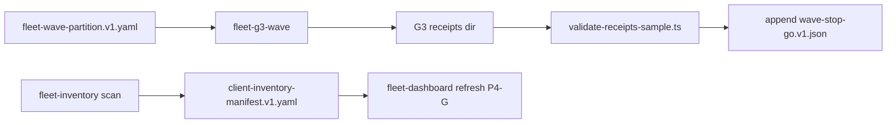

# P4-D G3 fleet harness design

**Work package:** P4-D (refine implement gate — schemas + design; script bodies in P4-E `/build-plan`)  
**Methodology pin:** `48d1fbb+`  
**Gate stage:** G3 per [`gate-promotion-stages.v1.yaml`](gate-promotion-stages.v1.yaml) (`constraint_flow: true`, `typed_flow: true`)

## Harness targets (`run-harness.sh`)

| Target | Script | Purpose |
|--------|--------|---------|
| `fleet-inventory` | `run-fleet-inventory-scan.ts` | Scan all `client_id` rows in [`client-inventory-manifest.v1.yaml`](client-inventory-manifest.v1.yaml); merge counts; optional `--apply` to refresh manifest |
| `fleet-g3-wave` | `run-fleet-g3-wave.ts` | Run one wave from [`fleet-wave-partition.v1.yaml`](fleet-wave-partition.v1.yaml) by `--wave-id`; load `sidecar_list_path`; emit receipts under wave `receipts_dir` |
| `fleet-p4` | (composition) | `fleet-inventory` → `fleet-g3-wave` (selected wave) → `run-fleet-g3-receipts.ts` batch validation |

Add cases to [`run-harness.sh`](../PSEUDOCODE-CONSTRAINT-STUDY/qualification/scripts/run-harness.sh) mirroring `pilot-inventory` / `pilot-g2` / `pilot-p3` (implementation deferred to P4-E build).

### CLI contracts (draft)

**`run-fleet-inventory-scan.ts`**

- `--manifest` (default: `working/fleet-constraint-v2/client-inventory-manifest.v1.yaml`)
- `--partition` (default: `working/fleet-constraint-v2/fleet-wave-partition.v1.yaml`)
- `--apply` — write updated `sidecar_counts_by_state` and `updated_at` per client
- Exit non-zero if enrolled client has falsifying aggregate state vs counts

**`run-fleet-g3-wave.ts`**

- `--wave-id` (required) — must match partition entry
- `--partition` (default: fleet-wave-partition path)
- `--dry-run` — analyze only, no receipt writes
- Loads sidecar list via generalized [`pilot-wave.ts`](../PSEUDOCODE-CONSTRAINT-STUDY/qualification/scripts/lib/pilot-wave.ts) reader (extend: `readWaveSidecarList(path)`)

**`run-fleet-g3-receipts.ts`**

- `--wave-id` — receipt batch for one wave
- `--receipts-dir` — override partition `receipts_dir`
- Uses G3 analyzer profile (see below) and writes per-sidecar JSON + `summary.json`

## Library reuse

| Module | Phase 4 use |
|--------|-------------|
| [`pilot-wave.ts`](../PSEUDOCODE-CONSTRAINT-STUDY/qualification/scripts/lib/pilot-wave.ts) | Parse `waves/**/wave-*-sidecars.yaml`; generalize beyond `readStddWave1` |
| [`constraint-migration-receipt.ts`](../PSEUDOCODE-CONSTRAINT-STUDY/qualification/scripts/lib/constraint-migration-receipt.ts) | Add `DEFAULT_G3_FLEET_OPTIONS` and set `gate_stage: "G3"` on build context |
| [`validate-receipts-sample.ts`](../PSEUDOCODE-CONSTRAINT-STUDY/qualification/scripts/validate-receipts-sample.ts) | Post-batch schema check against [`constraint-migration-receipt.v1.schema.json`](constraint-migration-receipt.v1.schema.json) |

### `DEFAULT_G3_FLEET_OPTIONS` (to add in P4-E)

```typescript
export const DEFAULT_G3_FLEET_OPTIONS: ReceiptAnalyzeProfile = {
  gate_mode: true,
  typed_flow: true,
  constraint_flow: true,
  constraint_gate_errors: false, // program advisory; client REQ verification blocking per OD-P4-8
  include_structural_compat: true,
};
```

Receipt projection: `gate_stage: "G3"`, `program_gate_policy: "advisory"` on orchestrator runs; layer_c must reflect G3 stage intent (`constraint_flow: true`, `typed_flow: true`).

## Stop/go and waivers

- Append-only [`wave-stop-go.v1.json`](wave-stop-go.v1.json) (OD-P4-6 resolved: **single file**, JSON array).
- Harness helper (P4-G): append record on wave close-out; validate against [`wave-stop-go.v1.schema.json`](wave-stop-go.v1.schema.json).
- [`migration-waiver-registry.v1.yaml`](migration-waiver-registry.v1.yaml) — G3 close-out checks active waivers before `disposition: go`.

## Stub file list (implement in P4-E `/build-plan`)

| File | Status |
|------|--------|
| `qualification/scripts/run-fleet-inventory-scan.ts` | **Stub** — not created in P4-D |
| `qualification/scripts/run-fleet-g3-wave.ts` | **Stub** |
| `qualification/scripts/run-fleet-g3-receipts.ts` | **Stub** |
| `qualification/scripts/lib/fleet-wave-partition.ts` | **Stub** — load/validate partition YAML |
| `qualification/scripts/lib/fleet-inventory-merge.ts` | **Stub** — merge scan into full manifest |

## Validation commands (documented; run after P4-E implementation)

```bash
# YAML canonicalization (project tied tree)
scripts/lint_yaml.sh working/fleet-constraint-v2/fleet-wave-partition.v1.yaml \
  working/fleet-constraint-v2/client-inventory-manifest.v1.yaml \
  working/fleet-constraint-v2/migration-waiver-registry.v1.yaml \
  working/fleet-constraint-v2/fleet-dashboard.v1.yaml

# JSON Schema sanity (Node 22+, if ajv-cli available in harness devDeps — else manual review in P4-E)
# node --experimental-strip-types qualification/scripts/validate-fleet-artifacts.ts  # future

# Receipt batch (after G3 run)
working/PSEUDOCODE-CONSTRAINT-STUDY/qualification/scripts/run-harness.sh fleet-p4
```

## Composition flow



## Implement gate boundaries (P4-D)

| In P4-D (this refine pass) | Deferred to P4-C / P4-E |
|----------------------------|-------------------------|
| Partition, inventory, waiver registry, stop/go, dashboard schemas + instances | TIED REQ/ARCH/IMPL LEAP (`SC-FLEET-P4-001..006`) |
| G3 harness design + stub list | `run-fleet-*.ts` implementation + `run-harness.sh` targets |
| `waves/stdd/wave-2-sidecars.yaml` skeleton | W-stdd-2..10 populated lists + G3 receipt files |
| OD-P4-6: single append-only `wave-stop-go.v1.json` | Stop/go append helper + F11/FP regression hook |
