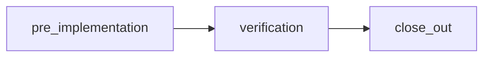

# P5-G — FEAT-spawned REQ integrated envelope policy (v1)

**Effective:** FEAT-spawned REQs created in **stdd** on or after **2026-09-13** (Phase 5 work package **P5-G**).  
**Satisfies:** EX-P5-05, OD-P5-4 (integrated profile mandatory; client copy pattern).  
**Tokens:** [REQ-PSEUDOCODE_CONSTRAINT_V2_FLEET_MIGRATION](../../tied/requirements/REQ-PSEUDOCODE_CONSTRAINT_V2_FLEET_MIGRATION.yaml) · [ARCH-PSEUDOCODE_FLEET_MIGRATION_GOVERNANCE](../../tied/architecture-decisions/ARCH-PSEUDOCODE_FLEET_MIGRATION_GOVERNANCE.yaml) · [REQ-REQUEST_EVIDENCE_ENVELOPE](../../tied/requirements/REQ-REQUEST_EVIDENCE_ENVELOPE.yaml)

---

## When this policy applies

| Applies | Does not apply |
|---------|----------------|
| New **FEAT-spawned** product REQs in stdd after P5-G (via `/plan-new-feature`, `feature_create`, or manual REQ + checklist copy) | Closed orchestrator REQ **REQ-PSEUDOCODE_CONSTRAINT_V2_FLEET_MIGRATION** (seq 8) — no re-open of verification/close_out |
| Client repos that **copy** the Phase 5 checklist template and evidence layout | Fleet **migration receipts**, G3/G4 CI dimensions, or **fleet-migrated-client** proof |
| Behavior-changing work at **integrated** depth per checklist gate contract | Legacy REQs closed before 2026-09-13 unless sponsor explicitly migrates checklist |

**CITDP anchor:** `phase_5_module.feat_envelope_policy` on [CITDP-REQ-PSEUDOCODE_CONSTRAINT_V2_FLEET_MIGRATION](../../tied/citdp/CITDP-REQ-PSEUDOCODE_CONSTRAINT_V2_FLEET_MIGRATION.yaml).

---

## Required checklist fields

Copy from [`templates/agent-req-checklist-feat-spawned-phase5.v1.yaml`](../../templates/agent-req-checklist-feat-spawned-phase5.v1.yaml) into `working/{REQ-TOKEN}/agent-req-implementation-checklist.yaml` (merge with full catalog from `tied/docs/agent-req-implementation-checklist.yaml` as needed).

| Field | Requirement |
|-------|-------------|
| `execution_evidence.request` | Spawned REQ token (e.g. `REQ-FEAT-…`) |
| `execution_evidence.envelope_path` | `working/{REQ-TOKEN}/evidence/request-evidence-envelope.v1.json` |
| `execution_evidence.operator_evidence.depth_tier` | **`integrated`** (mandatory) |
| `execution_evidence.operator_evidence.gate_policy` | **`advisory`** default (fleet orchestrator aligned); sponsor may tighten to blocking |
| `execution_evidence.operator_evidence.integrated_pilot_template` | Documents collect + gate + envelope validate sequence |
| `gate_contract.phases` | **`pre_implementation`**, **`verification`**, **`close_out`** |
| `gate_contract.required_artifacts` | Four adversarial-inquiry artifacts per phase (see below) |

**Automated check:** `node scripts/validate-feat-spawned-envelope-policy.mjs --checklist working/{REQ}/agent-req-implementation-checklist.yaml`

---

## Adversarial inquiry — four artifacts per phase

For each gated phase, persist under:

`working/{REQ-TOKEN}/adversarial-inquiry/phase-{phase}/`

| Artifact | Filename |
|----------|----------|
| Obligation report | `obligation-report.json` |
| Finding ledger | `finding-ledger.jsonl` |
| Gate result | `gate-result.json` |
| Evidence provenance | `evidence-provenance.json` |

Phases: `pre_implementation`, `verification`, `close_out`.

---

## Gate sequence



1. **Select** `depth_tier: integrated` and `gate_policy` at `risk-assessment` before depth-dependent inquiry.
2. **`tied_checklist_activation_collect`** — when phase artifact directories exist; bind `request_token`, `phase`, `run_id`, `project_root`.
3. **`tied_checklist_gate_validate`** — pass activation payload (gate receipt + four artifacts) for each phase:
   - `phase: pre_implementation` before implementation
   - `phase: verification` before `tied_verify` / status promotion
   - `phase: close_out` before machine close-out claim
4. **`request_evidence_envelope_build`** — rebuild envelope after material evidence changes.
5. **`request_evidence_envelope_validate`** — at **verification** and **close_out** with **`fail_on_error_gaps: true`** (zero blocking error gaps unless documented waiver registry entry).

Gate receipts: `working/{REQ-TOKEN}/gates/{phase}-{timestamp}.json`.

---

## Client copy pattern (evidence layout)

Mirror the **stdd orchestrator** seq 8 fleet migration layout (per-REQ isolation):

```
working/{REQ-TOKEN}/
  agent-req-implementation-checklist.yaml
  evidence/
    request-evidence-envelope.v1.json
    verification-evidence-manifest.v1.json   # when used
  gates/
    pre_implementation-*.json
    verification-*.json
    close_out-*.json
  adversarial-inquiry/
    phase-pre_implementation/
    phase-verification/
    phase-close_out/
```

**Client repos:** after `copy_files.sh`, copy the Phase 5 template and create the same tree under `working/{REQ-TOKEN}/`; do **not** inherit another REQ’s envelope or gate receipts (`copy_hygiene` in template header).

---

## Envelope contract

- **Schema:** `request-evidence-envelope.v1`
- **Identity:** `identity.depth_tier: integrated`, `identity.request_token` = spawned REQ
- **Build:** MCP `request_evidence_envelope_build` (or CLI equivalent)
- **Validate:** MCP `request_evidence_envelope_validate` with `fail_on_error_gaps: true` at verification and close_out
- **Reference sample (non-live):** [`examples/feat-spawned-req-envelope.sample.v1.json`](examples/feat-spawned-req-envelope.sample.v1.json)

---

## Explicit falsification (proof boundaries)

| Claim | Establishes | Does **not** establish |
|-------|-------------|-------------------------|
| FEAT envelope validate green at close_out | Spawned REQ close-out integrity for that REQ | Fleet-wide migration complete |
| Integrated checklist on FEAT REQ | Process adherence for feature delivery | **fleet-migrated-client** on inventory rows |
| G4 CI green (P5-E/F) | Continuous stdd governance | FEAT REQ envelope unless that REQ’s checklist is wired |

**Must fail:** Using a FEAT envelope pass as evidence that a client repo reached **fleet-migrated-client** without constraint migration receipt and inventory state.

---

## Feature orchestration hook

`feature_create` responses in stdd include **`checklist_spawn_recommendation`** (Phase 5 defaults: template path, policy path, `depth_tier: integrated`, default `gate_policy: advisory`). Operators still copy the checklist into `working/{REQ-TOKEN}/` when the spawned REQ token is allocated.

---

## Related artifacts

| Artifact | Path |
|----------|------|
| Checklist template | `templates/agent-req-checklist-feat-spawned-phase5.v1.yaml` |
| Policy validator | `scripts/lib/validate-feat-spawned-envelope-policy.mjs` |
| ARCH governance pointer | `tied/architecture-decisions/ARCH-PSEUDOCODE_FLEET_MIGRATION_GOVERNANCE.yaml` → `governance_artifacts.phase_5_feat_envelope_policy` |
| Build report | `working/fleet-constraint-v2/p5-g-feat-envelope-build-report.v1.json` |
